# Customizing a Window

## Foreground Settings

This section will walk you through the foreground settings of the Dock tabs, caption area and AutoHidden tabs.

### Dock Tab and Label Settings

The DockingManager provides tab and label settings for the docked windows. These settings allows you to control the appearance of the dock tabs.

#### Foreground Settings for the Dock Tabs

The font style and the height of the tab controls in a tabbed docking group can be controlled by using the following properties respectively.

<table>
<tr>
<th>
DockingManager Property</th><th>
Description</th></tr>
<tr>
<td>
DockTabFont </td><td>
Gets or sets the font for the tab control used in the  tabbed docking group.</td></tr>
<tr>
<td>
DockTabHeight</td><td>
Gets or sets the height for the tab control used in the tabbed docking group.</td></tr>
<tr>
<td>
DockTabForeColor</td><td>
Gets or sets the fore color of the Docked tab control. This property is not applicable when the visual style is set to Metro.</td></tr>
</table>





this.dockingManager1.DockTabFont = new System.Drawing.Font("Arial", 9F, ((System.Drawing.FontStyle)((System.Drawing.FontStyle.Bold | System.Drawing.FontStyle.Underline))), System.Drawing.GraphicsUnit.Point, ((System.Byte)(0)));

this.dockingManager1.DockTabHeight = 30;





Me.DockingManager1.DockTabFont = New System.Drawing.Font("Arial", 9.0!, CType((System.Drawing.FontStyle.Bold Or System.Drawing.FontStyle.Underline), System.Drawing.FontStyle), System.Drawing.GraphicsUnit.Point, CType(0, Byte))

Me.DockingManager1.DockTabHeight = 30





 

N> ResetDockTabFont and ResetDockTabHeight methods lets you reset the above settings.





//Specifies the forecolor of the Docked tab Control.

this.dockingManager1.DockTabForeColor = System.Drawing.Color.Red;





'Specifies the forecolor of the Docked tab Control.

Me.dockingManager1.DockTabForeColor = System.Drawing.Color.Red





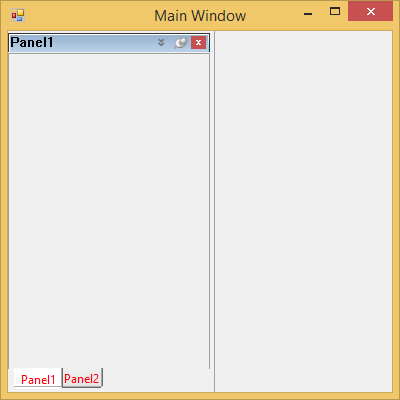 
 

N> ResetDockTabFont, ResetDockTabHeight and ResetDockTabForeColor methods allows you to reset the above settings.





//Restoring to default settings

this.dockingManager1.ResetDockTabFont();

this.dockingManager1.ResetDockTabHeight();

this.dockingManager1.ResetDockTabForeColor();





'Restoring to default settings

Me.dockingManager1.ResetDockTabFont()

Me.dockingManager1.ResetDockTabHeight()

Me.dockingManager1.ResetDockTabForeColor()





### AutoHidden Tabs

The font style for the auto hidden tabs can be specified in `AutoHideTabFont` property.

<table>
<tr>
<th>
DockingManager Property</th><th>
Description</th></tr>
<tr>
<td>
AutoHideTabFont</td><td>
Gets or sets the tab for the auto hide tab control.</td></tr>
</table>

N> This setting will effect only with DockingManager.VisualStyle property set as Default.





//Setting Auto hide tab Font style

this.dockingManager1.AutoHideTabFont = new System.Drawing.Font("Arial", 9.75F, ((System.Drawing.FontStyle)(((System.Drawing.FontStyle.Bold | System.Drawing.FontStyle.Italic) 

| System.Drawing.FontStyle.Underline))), System.Drawing.GraphicsUnit.Point, ((System.Byte)(0)));





'Setting Auto hide tab Font style

Me.DockingManager1.AutoHideTabFont = New System.Drawing.Font("Arial", 9.75!, CType(((System.Drawing.FontStyle.Bold Or System.Drawing.FontStyle.Italic) _

Or System.Drawing.FontStyle.Underline), System.Drawing.FontStyle), System.Drawing.GraphicsUnit.Point, CType(0, Byte))





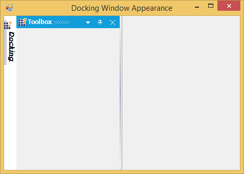  

The height for the auto hidden tabs can be specified in `AutoHideTabHeight` property.

<table>
<tr>
<th>
DockingManager Property</th><th>
Description</th></tr>
<tr>
<td>
AutoHideTabHeight</td><td>
Gets or sets the height of the auto hide tab control.</td></tr>
</table>

N> This setting will effect only with DockingManager.VisualStyle property set as Default.





//Setting Auto hide tab height

this.dockingManager1.AutoHideTabHeight = 35;





'Setting Auto hide tab height

Me.DockingManager1.AutoHideTabHeight = 35





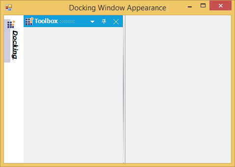 

### Active and Inactive Caption

#### Active Caption Settings

Caption FontStyle and foreground settings for an active docked control, can be controlled by `ActiveCaptionFont` and `ActiveCaptionForeGround` properties.

<table>
<tr>
<th>
DockingManager Property</th><th>
Description</th></tr>
<tr>
<td>
ActiveCaptionFont</td><td>
Gets or sets the font for the active caption.</td></tr>
<tr>
<td>
ActiveCaptionForeGround</td><td>
Indicates the color of the caption text in the active state.</td></tr>
</table>

N> These settings will effect only with DockingManager.VisualStyle property set as Default.





this.dockingManager1.ActiveCaptionFont = new System.Drawing.Font("Trebuchet MS", 9.75F, System.Drawing.FontStyle.Bold, System.Drawing.GraphicsUnit.Point, ((System.Byte)(0)));

this.dockingManager1.ActiveCaptionForeGround = System.Drawing.Color.Red;





Me.dockingManager1.ActiveCaptionFont = New System.Drawing.Font("Trebuchet MS", 9.75!, System.Drawing.FontStyle.Bold, System.Drawing.GraphicsUnit.Point, CType(0, Byte))

Me.DockingManager1.ActiveCaptionForeGround = System.Drawing.Color.Red





#### Inactive Caption settings

By setting the `InactiveCaptionFont` and `InactiveCaptionForeGround` properties, the caption foreground appearance of the inactive controls among the docked controls can be customized.

<table>
<tr>
<th>
DockingManager Property</th><th>
Description</th></tr>
<tr>
<td>
InactiveCaptionFont</td><td>
Gets or sets the font of the inactive caption.</td></tr>
<tr>
<td>
InactiveCaptionForeGround</td><td>
Indicates the color of the caption text in inactive state.</td></tr>
</table>

N> These settings will effect only with DockingManager.VisualStyle property set as Default.





this.dockingManager1.InActiveCaptionFont = new System.Drawing.Font("Arial", 11.25F, System.Drawing.FontStyle.Bold, System.Drawing.GraphicsUnit.Point, ((System.Byte)(0)));

this.dockingManager1.InActiveCaptionForeGround = System.Drawing.Color.Blue;





Me.DockingManager1.InActiveCaptionFont = New System.Drawing.Font("Arial", 11.25!, System.Drawing.FontStyle.Bold, System.Drawing.GraphicsUnit.Point, CType(0, Byte))

Me.DockingManager1.InActiveCaptionForeGround = System.Drawing.Color.MediumSlateBlue





#### Custom styling with Metro VisualStyle

In the DockingManager, the Metro visual style has a default caption color and button color. The menu color and button color can be customized by using the properties `MetroCaptionColor` and `MetroButtonColor`, which are present in the caption bar of the DockingManager.

<table>
<tr>
<th>
Property</th><th>
Description</th></tr>
<tr>
<td>
MetroCaptionColor</td><td>
Gets or sets the color value of a caption in metro style DockingManager.</td></tr>
<tr>
<td>
MetroButtonColor</td><td>
Gets or sets the color value of a metro button in metro style DockingManager.</td></tr>
</table>





//Gets or sets the color value of caption in metro style DockingManager.

this.dockingMgr.MetroCaptionColor = Color.Red;

//Gets or sets the color value of button in metro style DockingManager.

this.dockingMgr.MetroButtonColor = Color.Red;





'Gets or sets the color value of caption in metro style DockingManager.

Me.dockingMgr.MetroCaptionColor = Color.Red

'Gets or sets the color value of button in metro style DockingManager.

Me.dockingMgr.MetroButtonColor = Color.Red





 


 
[Visual Styles](/windowsforms/dockingmanager/styling)



## Background Settings

This section will discuss the background settings for the caption area of the docked controls.

### Active and Inactive Caption

#### Active Caption Settings

Caption background appearance for the active docked control can be controlled through `ActiveCaptionBackground` property.

<table>
<tr>
<th>
DockingManager Property</th><th>
Description</th></tr>
<tr>
<td>
ActiveCaptionBackground</td><td>
Sets background for the caption area using BrushInfo object.</td></tr>
</table>

N> This setting will effect only with DockingManager.VisualStyle property set as Default.





this.dockingManager1.ActiveCaptionBackground = new Syncfusion.Drawing.BrushInfo(Syncfusion.Drawing.PatternStyle.Percent20, System.Drawing.SystemColors.InactiveCaptionText, System.Drawing.Color.FromArgb(((System.Byte)(255)), ((System.Byte)(224)), ((System.Byte)(192))));





Me.DockingManager1.ActiveCaptionBackground = New Syncfusion.Drawing.BrushInfo(Syncfusion.Drawing.PatternStyle.Percent20, System.Drawing.SystemColors.InactiveCaptionText, System.Drawing.Color.FromArgb(CType(255, Byte), CType(224, Byte), CType(192, Byte)))





### InactiveCaption settings

By setting the `InactiveCaptionBackground` properties, the caption appearance of the inactive control in the docked controls can be customized.

<table>
<tr>
<th>
DockingManager Property</th><th>
Description</th></tr>
<tr>
<td>
InactiveCaptionBackground</td><td>
Sets caption background of the inactive docked control using BrushInfo object.</td></tr>
</table>

N> This setting will effect only with DockingManager.VisualStyle property set as Default. 





this.dockingManager1.InActiveCaptionBackground = new Syncfusion.Drawing.BrushInfo(Syncfusion.Drawing.GradientStyle.Horizontal, System.Drawing.Color.Ivory, System.Drawing.SystemColors.Control);





Me.DockingManager1.InActiveCaptionBackground = New Syncfusion.Drawing.BrushInfo(Syncfusion.Drawing.GradientStyle.Horizontal, System.Drawing.Color.Ivory, System.Drawing.SystemColors.Control)





### Border for the Docked Control

Border color of the docked controls can be specified in the `BorderColor` property. 

N> `PaintBorders` property must be enabled to effect this setting.

<table>
<tr>
<th>
DockingManager Property</th><th>
Description</th></tr>
<tr>
<td>
BorderColor</td><td>
Used to set the border color for the docked control.</td></tr>
<tr>
<td>
Paint Borders</td><td>
Determines whether to paint the docked control's borders.</td></tr>
</table>





//Setting Border color

this.dockingManager1.BorderColor = System.Drawing.Color.Blue;

this.DockingManager1.PaintBorders = true;





'Setting border color

Me.DockingManager1.BorderColor = System.Drawing.Color.Blue

Me.DockingManager1.PaintBorders = True





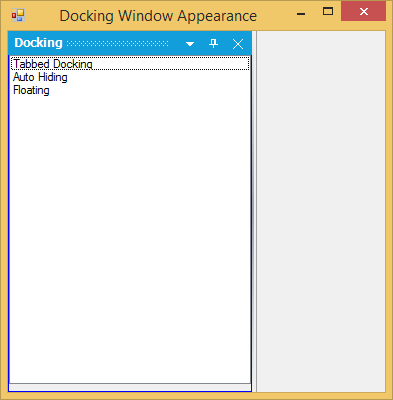 

### HostFormClientBorder

<table>
<tr>
<th>
DockingManager Property</th><th>
Description</th></tr>
<tr>
<td>
HostFormClientBorder</td><td>
Gets or sets a value indicating whether a border is drawn around the host form's client rectangle.</td></tr>
</table>





this.DockingManager1.HostFormClientBorder = false;





Me.DockingManager1.HostFormClientBorder = False





 

# Caption Bar

 Caption for the docked controls can be enabled using `ShowCaption` property. By default this property is true. 

 

## Label and Image for CaptionBar

### Caption Label

DockingManager allows you to set the caption label by using the `DockLabel` property of that particular control through designer and programmatically by using the `SetDockLabel` method. Alignment of these labels can be specified by using the `DockLabelAlignment` property. Caption font of the docked controls can be specified by using the `DockedCaptionFont` property in the DockingManager.

<table>
<tr>
<th>
DockingManager Property</th><th>
Description</th></tr>
<tr>
<td>
DockLabelAlignment</td><td>
Sets the dock label alignment. The different alignments options are, * Left* Right* Center</td></tr>
<tr>
<td>
 DockedCaptionFont</td><td>
Gets or sets the Caption font of the docked controls.</td></tr>
</table>





this.dockingManager.SetDockLabel(this.listBox1, "Syncfusion ASP.NET products");

this.dockingManager1.DockLabelAlignment = Syncfusion.Windows.Forms.Tools.DockLabelAlignmentStyle.Left;

//Specifies the caption font of the docked controls.

this.dockingManager1.DockedCaptionFont = new System.Drawing.Font("Segoe WP Light", 9, System.Drawing.FontStyle.Italic);





Me.dockingManager.SetDockLabel(Me.listBox1, "Syncfusion ASP.NET products")

Me.dockingManager1.DockLabelAlignment = Syncfusion.Windows.Forms.Tools.DockLabelAlignmentStyle.Left

'Specifies the caption font of the docked controls.

Me.dockingManager1.DockedCaptionFont = New System.Drawing.Font("Segoe WP Light", 9, System.Drawing.FontStyle.Italic)





 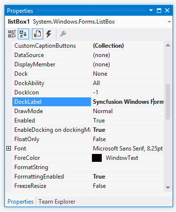 
 
 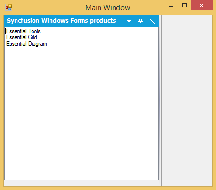 
 
  
 
  

### Images for the Caption

The captions can also hold images which can be enabled using `ShowCaptionImages` property.





this.dockingManager1.ShowCaptionImages = true;





Me.dockingManager1.ShowCaptionImages = True





The caption icons / the images can be set using this `DockIcon` property of the docked control.To achieve this through designer, follow the below steps.

* Create a docked window. 
* Add ImageList and add the images to it.
* Select the image list through the ImageList property of the DockingManager. 
* Now go to the property of the docked control to which you have to set the dock icon. 
* Give the image index value to the DockIcon property.
* Run the application. 
* The corresponding control will be displayed with the icon which is set. 
* To disable displaying the icon, set the value as -1.

<table>
<tr>
<th>
DockedControl Property</th><th>
Description</th></tr>
<tr>
<td>
DockIcon</td><td>
Index of the image associated with this docking window.</td></tr>
</table>





this.dockingManager1.SetDockIcon(this.listBox1, 2);





Me.DockingManager1.SetDockIcon(Me.ListBox1, 2)





  

### Caption Label with DockIcon

Methods for setting Caption icons and labels are as follows.

<table>
<tr>
<th>
Methods</th><th>
Description</th></tr>
<tr>
<td>
SetDockIcon</td><td>
Sets the Icon or the image for the docking window by passing the image icon as a parameter for this method.Ctrl - Represents the dock enabled control.image - Icon representing the docking window.</td></tr>
<tr>
<td>
SetDockIcon(Overloaded)</td><td>
This overloaded method returns the index of the image associated with the docking window.Ctrl - Indicates the docking window.int - A zero-based index into the ImageList property value.</td></tr>
<tr>
<td>
SetDockLabel</td><td>
Sets the text to be displayed in the docking window caption.Ctrl - Indicates the docking window.strText - A string value representing the text caption.</td></tr>
</table>

## Caption Buttons

The buttons available for the docked control and the properties which controls the visibility of the button are discussed in this section.

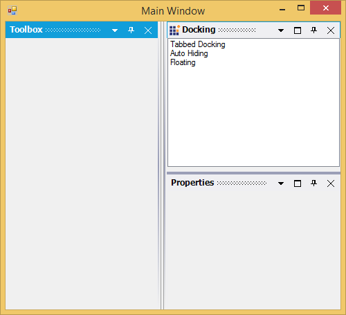 

### Menu Button

The menu button in a docked control can be made visible or hidden by setting the `MenuButtonEnabled` property to true. Clicking this button will display the context menu items.

### Maximize Button

Maximize button can be enabled by using the `MaximizeButtonEnabled` property. This maximize button allows users to maximize / restore a docking window, so that a clear view of the contents can be made visible.

N> The Maximize button will be visible only if any other control is docked to the bottom of the former control.

### Close Button

The visibility of the Close button can be controlled using the `CloseEnabled` property.

### AutoHide Button

Setting `AutoHideEnabled` property shows or hides the auto hide button in the docked control. Clicking this button will auto hide the docked controls.

N> DockingManager let you customize the above default buttons and also add custom caption buttons. 

## Custom Caption Buttons

The Custom Caption Collection Editor can be accessed by using the DockingManager. `CaptionButtons` property allows you to customize the default buttons and also to add new custom caption buttons. 

 

### Add and Customize the Caption Buttons

In the Caption Button Collection Editor, click "Add" button to add a new caption button. To customize the caption button, modify the properties of the members in the editor.

 

This can be done programmatically by using the following code examples.





Syncfusion.Windows.Forms.Tools.CaptionButton captionButton = new Syncfusion.Windows.Forms.Tools.CaptionButton();

toolTipInfo = new Syncfusion.Windows.Forms.Tools.ToolTipInfo();

captionButton.ImageIndex = 4;

captionButton.Name = "Custom Button";

captionButton.Type = Syncfusion.Windows.Forms.Tools.CaptionButtonType.Custom;

captionButton.SuperToolTipInfo = toolTipInfo

captionButton.TransparentImageColor = System.Drawing.Color.Transparent;

this.dockingManager1.CaptionButtons.Add(captionButton);





Dim captionButton5 As Syncfusion.Windows.Forms.Tools.CaptionButton = New Syncfusion.Windows.Forms.Tools.CaptionButton()

toolTipInfo = new Syncfusion.Windows.Forms.Tools.ToolTipInfo()

captionButton.ImageIndex = 4 

captionButton.Name = "Custom Button" 

captionButton.Type = Syncfusion.Windows.Forms.Tools.CaptionButtonType.Custom;

captionButton.SuperToolTipInfo = toolTipInfo

captionButton.TransparentImageColor = System.Drawing.Color.Transparent 

Me.dockingManager1.CaptionButtons.Add(captionButton)





Refer to the following sample link that demonstrates how to add the Custom Caption Buttons.

C:\Users\&lt;User&gt;\AppData\Local\Syncfusion\EssentialStudio\Version Number\Windows\Tools.Windows\Samples\Docking Manager\Custom Captions\CS

### Custom Button for Caption Bar in Floating State

This feature enables you to add custom buttons to the caption bar when an item is in its floating state. It is not required to dock the item to use the custom buttons. 

<table>
<tr>
<th>
Property </th><th>
Description </th><th>
Type </th><th>
Data Type </th><th>
Reference links </th></tr>
<tr>
<td>
ShowCustomButtonsInFloating</td><td>
Specifies whether the caption button is enabled while floating.  </td><td>
-</td><td>
Boolean </td><td>
NA </td></tr>
</table>

### Enable Custom Button for Caption Bar While Floating

To enable custom button for caption bar while floating, set the `ShowCustomButtonsInFloating` property to true. This is set to false, by default. 





this.dockingManager1.ShowCustomButtonsInFloating = true;





me.dockingManager1.ShowCustomButtonsInFloating = True





 

N> This feature is not applicable for VS2005 (default) visual style.

# Occupy Whole Window

The `DockToFill` property allows users to implement a very unique docking layout where a non-MDIContainer form or ContainerControl's entire client region is occupied by the dockable controls.

<table>
<tr>
<th>
DockingManager Property</th><th>
Description</th></tr>
<tr>
<td>
DockToFill</td><td>
Sets the boolean value indicating whether the docked control occupies the form's full client region.</td></tr>
</table>





this.dockingManager1.DockToFill = true;





Me.dockingManager1.DockToFill = True;





  

 
# Dock Arrow Settings

While dragging and dropping a docked control, DockingManager guides you through the process, using `DragProviderStyle` property.

On setting this property, you will be able to see arrows on four sides of the form, when a control is dragged. These arrows will guide you where to dock the window. Keeping the mouse point on a particular arrow will display a shadow like appearance based on the side of docking.

There are six docking provider Styles. They are, 

* Standard (Default value - no arrows appears for this option), 
* VS2005
* VS2008
* VS2010 
* VS2012
* Whidbey 
 





this.dockingManager1.DragProviderStyle = Syncfusion.Windows.Forms.Tools.DragProviderStyle.VS2008;





Me.dockingManager1.DragProviderStyle = Syncfusion.Windows.Forms.Tools.DragProviderStyle.VS2008





* VS2005 

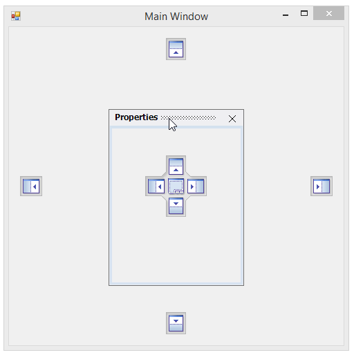 

* VS2008

 

* VS2010

 

* VS2012

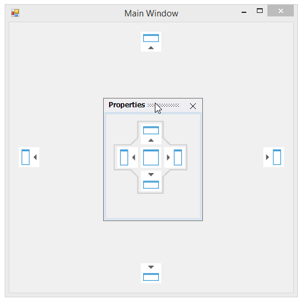 

* Whidbey

 

## Visibility of the Arrows

The docking arrows visibility, while dropping a control inside the form or into another docked control, can be set using the below properties.

<table>
<tr>
<th>
DockedControl Property</th><th>
Description</th></tr>
<tr>
<td>
DockAbility</td><td>
Indicates where the user can dock in this control using drag providers.</td></tr>
<tr>
<td>
OuterDockAbility</td><td>
Indicates where the user can dock the controls in a form using the drag providers.</td></tr>
</table>

  
 
  
 
 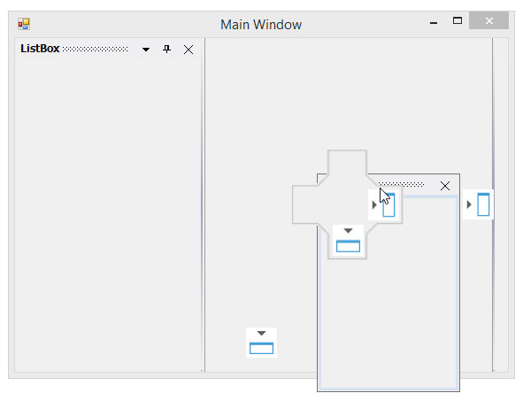 

# Freeze Resizing

The FreezeResizing property has been implemented for each control by which, the end users can freeze any particular control. Also, the property value can be persisted. A global `FreezeResizing` property is also available using which all the controls can be frozen.

The controls can also be frozen by calling the `SetFreezeResizing` method which freezes the specified control and the user will no more be able to resize the controls.

<table>
<tr>
<th>
Parameter</th><th>
Description</th></tr>
<tr>
<td>
SetFreezeResizing</td><td>
Freezes the specified control. The parameters are,Ctrl - The control for which docking is enabled.freeze - Represents a boolean value which decides whether to freeze the specified control.</td></tr>
</table>





this.dockingManager1.FreezeResizing = true;

this.dockingManager1.SetFreezeResize(this.panel1, true);





Me.dockingManager1.FreezeResizing = True

Me.dockingManager1.SetFreezeResize(Me.panel1, True)





# Configuring window sizing

DockingManager allows to set the desired width for the dock windows. 

## Desire Width

The desired width can be set for the Dock windows through the `DockControl` method as in the below code snippets.





this.dockingManager1.DockControl(this.panel1, this, Syncfusion.Windows.Forms.Tools.DockingStyle.Right, 100);





Me.dockingManager1.DockControl(Me.panel1, Me, Syncfusion.Windows.Forms.Tools.DockingStyle.Right, 100)





## Customizing the Splitter appearance

The Splitter of the dock window can be customized using the `SplitterWidth` and `MetroSplitterBackColor` properties depends upon its values respectively.





 this.dockingManager1.SplitterWidth = 10;
 
 this.dockingManager1.MetroSplitterBackColor = Color.Maroon;





 Me.dockingManager1.SplitterWidth = 10
 
 Me.dockingManager1.MetroSplitterBackColor = Color.Maroon





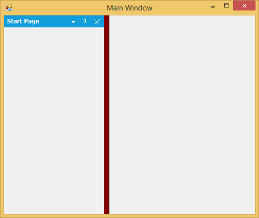 

# Applying Context Menu  

A context menu will be displayed whenever the user right clicks the caption bar or clicks the menu button in the caption bar. `EnableContextMenu` property should be true for displaying the context menu. By default it is true.

When the docked control is in auto hide mode and when the auto hide tab is right-clicked, an unique context menu will be displayed, similar to Visual Studio. `EnableAutoHideTabContextMenu` property should be true for this. By default this value is true.





this.dockingManager1.EnableContextMenu = true;

this.dockingManager1.EnableAutoHideTabContextMenu = true;





Me.dockingManager1.EnableContextMenu = True

Me.dockingManager1.EnableAutoHideTabContextMenu = True





The below images illustrates context menu features.

 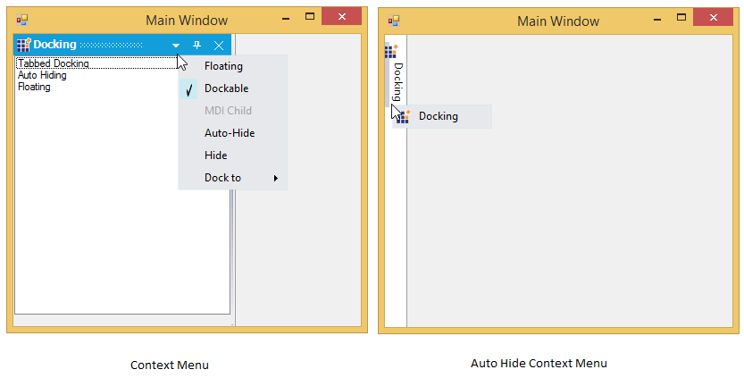 

N> If MDIContainer property of the form is set to true, then the context menu will include MDI child option. 

 

### Context Menu for TabbedControls

Context menu for the tabbed controls is similar to the default context menu like the above image. When TabbedMDIManager component is used, context menu will include TabbedDocument instead of MDI child.

  

# Browsing Key

DockingManager lets you specify the keyboard key combinations, to tab through the docked controls. The property `BrowsingKey` of the docking manager, provides modifiers like CTRL, SHIFT, ALT Keys and keys like A, B, C, 0, 1 etc., User can also provide a combination of modifiers and the keys. Example "CTRL + 2", as shown in the image below.

  

N> Before we set this property for DockingManager, we have to set `TabStop` property to true and `TabIndex` property with the appropriate value. Otherwise its BrowsingKey property will not work.

<table>
<tr>
<th>
DockingManager Property</th><th>
Description</th></tr>
<tr>
<td>
Browsing Key</td><td>
Determines the value of the key which can be used to tab through the docked controls.</td></tr>
</table>

<table>
<tr>
<th>
DockedControl Property</th><th>
Description</th></tr>
<tr>
<td>
TabStop</td><td>
Indicates whether TAB key can be used to focus the control.</td></tr>
<tr>
<td>
TabIndex</td><td>
Determines the index in the tab order that this control will occupy.</td></tr>
</table>

These properties can be set through code by using the below code.





this.dockingManager1.BrowsingKey = ((System.Windows.Forms.Keys)((System.Windows.Forms.Keys.Control | System.Windows.Forms.Keys.D0)));

this.treeViewAdv1.TabStop = true;

this.treeViewAdv1.TabIndex = 0;





Me.DockingManager1.BrowsingKey = CType((System.Windows.Forms.Keys.Control Or System.Windows.Forms.Keys.D0), System.Windows.Forms.Keys)

Me.TreeViewAdv1.TabStop = True

Me.TreeViewAdv1.TabIndex = 0





# Setting ToolTip

By default, ToolTip will be displayed for the caption buttons in a docked control when the mouse is moved over it.

  

N> `EnableSuperTooltip` property which is discussed below, should be set to false to effect the above default ToolTip.

# Setting SuperToolTip

Docking manager can display a SuperToolTip by enabling the DockingManager.EnableSuperTooltip property. For this a SuperTooltip control should be dragged and dropped on to the form and it should be selected in the DockingManager.SuperTooltip property.

<table>
<tr>
<th>
DockingManager Property</th><th>
Description</th></tr>
<tr>
<td>
EnableSuperTooltip</td><td>
Gets/Sets whether to enable SuperToolTip using the dock caption buttons.</td></tr>
<tr>
<td>
SuperToolTip</td><td>
Indicates the SuperToolTip associated with the docking manager.</td></tr>
</table>

A SuperToolTip can be added to the DockingManager programmatically using the below code snippet.





this.dockingManager1.EnableSuperToolTip = true;

this.dockingManager1.SuperToolTip = this.superToolTip1;





Me.dockingManager1.EnableSuperToolTip = True

Me.dockingManager1.SuperToolTip = Me.superToolTip1





 

Text for the SuperToolTip and other customizing options can be specified for a particular button by using the CaptionButton Collection Editor.

  

