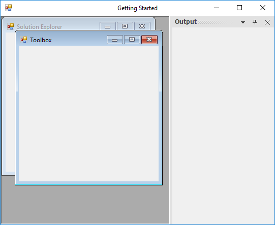
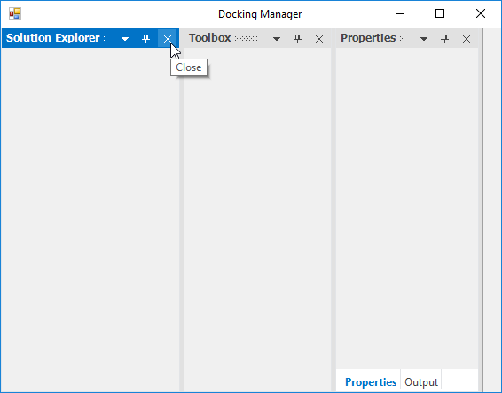
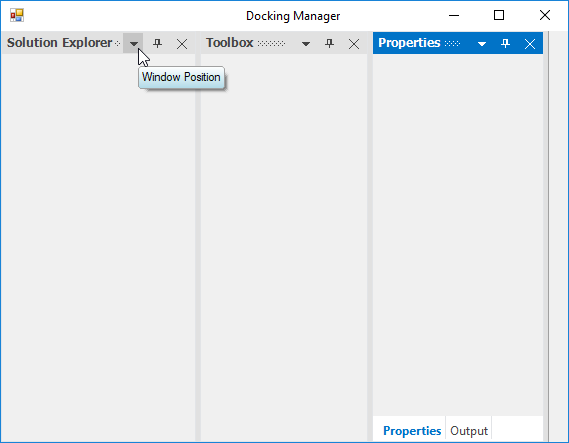
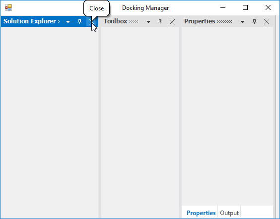
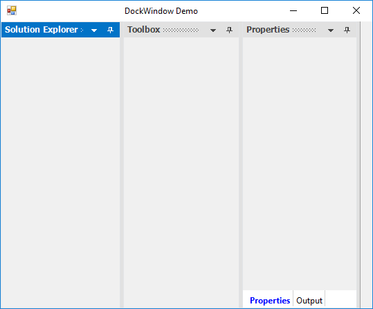

## Docked children

DockingManager lets you dock the control on any of the four sides of the container control. DockingManager provides docking hints while dragging the panel over the DockingManager. This preview will provide information about how the layout will look once drop the panel to dock.

### Get order of the docked child

Arrangement of child elements in the `DockingManager` will be based on the order in which the child has been added.  We can get the order of the controls which is added as a child of the DockingManager using `DockAreaControllers` property of DockingManager. For instance, we have iterated the child elements from the collection of DockAreaControllers and displayed the DockLabel of child element in output window. 





 for (int i = 0; i < dockingManager1.DockAreaControllers.Count; i++)
 {
      if (dockingManager1.DockAreaControllers[i] is DockHostController)
      {
           Console.WriteLine((dockingManager1.DockAreaControllers[i] as DockHostController).DockLabel);
      }
 }





For i As Integer = 0 To dockingManager1.DockAreaControllers.Count - 1
       If TypeOf dockingManager1.DockAreaControllers(i) Is DockHostController Then
	    Console.WriteLine((TryCast(dockingManager1.DockAreaControllers(i), DockHostController)).DockLabel)
       End If
Next i





## Activate window
 
[ActivateControl](https://help.syncfusion.com/cr/cref_files/windowsforms/tools/Syncfusion.Tools.Windows~Syncfusion.Windows.Forms.Tools.DockingManager~ActivateControl.html) function of DockingManager helps to activate particular docked control.





// In any event handler (eg:Button_Click)

this.dockingManager1.ActivateControl(this.panel1); 





'In any event handler (eg:Button_Click)

Me.DockingManager1.ActivateControl(Me.panel1) 
 




## Identify whether the window is docking or not

The DockingManager [IsFloating](https://help.syncfusion.com/cr/cref_files/windowsforms/tools/Syncfusion.Tools.Windows~Syncfusion.Windows.Forms.Tools.DockingManager~IsFloating.html) function which returns `false` if the control is in docked state and `true` if the control is in floating state.





MessageBox.Show(this.dockingManager1.IsFloating(this.panel1).ToString());





MessageBox.Show(Me.dockingManager1.IsFloating(Me.panel1).ToString());





## Set size for docking children

In DockingManager, we can set the size for particular docked controls. 

### Desire Width

The desired width can be set for the Dock windows through the [DockControl](https://help.syncfusion.com/cr/cref_files/windowsforms/tools/Syncfusion.Tools.Windows~Syncfusion.Windows.Forms.Tools.DockingManager~DockControl.html) function as in the below code snippets.





this.dockingManager1.DockControl(this.panel1, this, Syncfusion.Windows.Forms.Tools.DockingStyle.Right, 250);





Me.dockingManager1.DockControl(Me.panel1, Me, Syncfusion.Windows.Forms.Tools.DockingStyle.Right, 250)





## Size constraint for dock children

DockingManager provides option to restrict user to resize the dock panel to specified minimum size. [SetControlMinimumSize](https://help.syncfusion.com/cr/cref_files/windowsforms/tools/Syncfusion.Tools.Windows~Syncfusion.Windows.Forms.Tools.DockingManager~SetControlMinimumSize.html) function of DockingManager helps to sets the minimum size of docked control.





//Set the minimum size of docked control using the SetControlMinimumSize method

this.dockingManager1.SetControlMinimumSize(panel1,new Size(200, 400));





'Set the minimum size of docked control using the SetControlMinimumSize method

Me.dockingManager1.SetControlMinimumSize(panel1,new Size(200, 400))



 

## Restrict to dock on specific sides

User can restrict the specific [DockAbility](https://help.syncfusion.com/cr/cref_files/windowsforms/tools/Syncfusion.Tools.Windows~Syncfusion.Windows.Forms.Tools.DockAbility.html) of child window when it moved to the client area in DockingManager.

### Inner dock ability

[SetDockAbility](https://help.syncfusion.com/cr/cref_files/windowsforms/tools/Syncfusion.Tools.Windows~Syncfusion.Windows.Forms.Tools.DockingManager~SetDockAbility.html) function of DockingManager helps to gets or sets the DockAbility of docked control. [GetDockAbility](https://help.syncfusion.com/cr/cref_files/windowsforms/tools/Syncfusion.Tools.Windows~Syncfusion.Windows.Forms.Tools.DockingManager~GetDockAbility.html) of DockingManager provides the Dockability information of docked panel.





//Getting the Dock Ability

this.dockingManager1.GetDockAbility(this.panel1);

//Setting the Dock Ability

this.dockingManager1.SetDockAbility(this.panel1, "Top");





//Getting the Dock Ability

Me.dockingManager1.GetDockAbility(Me.panel1)

//Setting the Dock Ability

Me.dockingManager1.SetDockAbility(Me.panel1, "Top")



  

### Outer dock ability
 
It can be achieved by [SetOuterDockAbility](https://help.syncfusion.com/cr/cref_files/windowsforms/tools/Syncfusion.Tools.Windows~Syncfusion.Windows.Forms.Tools.DockingManager~SetOuterDockAbility.html) function. Here we have restricted the right, left, tabbed and fill dock ability.  





this.dockingManager1.SetOuterDockAbility(child, Syncfusion.Windows.Forms.Tools.DockAbility.Top | Syncfusion.Windows.Forms.Tools.DockAbility.Bottom);





Me.dockingManager1.SetOuterDockAbility(panel1, Syncfusion.Windows.Forms.Tools.DockAbility.Top Or Syncfusion.Windows.Forms.Tools.DockAbility.Bottom)





## Notify MDI child creation

In DockingManager, we can set the docked control as an MDI Child in an easy method, by using the `MDI Child` option in the context menu. To enable MDI functionalities in DockingManager, `IsMdIContainer` property of its parent form should be `true`.

### Activate window programmatically

[SetAsMDIChild](https://help.syncfusion.com/cr/cref_files/windowsforms/tools/Syncfusion.Tools.Windows~Syncfusion.Windows.Forms.Tools.DockingManager~SetAsMDIChild.html) function helps to set the docking window to the MDIChild window in DockingManager.





//To set as MDI Child window

this.dockingManager1.SetAsMDIChild(panel1, true);

this.dockingManager1.SetAsMDIChild(panel2, true);





'To set as MDI Child window

Me.dockingManager1.SetAsMDIChild(panel1, True)

Me.dockingManager1.SetAsMDIChild(panel2, True)





 

## Tooltip for caption buttons

By default, ToolTip will be displayed for the caption buttons in a docked control when the mouse is moved over it. 

### Change tooltip

DockingManager has following functions for retrieve and manipulation of the ToolTip displayed in Caption buttons.

 * [SetCloseButtonToolTip](https://help.syncfusion.com/cr/cref_files/windowsforms/tools/Syncfusion.Tools.Windows~Syncfusion.Windows.Forms.Tools.DockingManager~SetCloseButtonToolTip.html): Used to set tooltip for close button in the caption bar of the Docked window.

 * [GetCloseButtonToolTip](https://help.syncfusion.com/cr/cref_files/windowsforms/tools/Syncfusion.Tools.Windows~Syncfusion.Windows.Forms.Tools.DockingManager~GetCloseButtonToolTip.html): Get the tooltip for close button in the caption bar of the Docked window.

 * [SetAutoHideButtonToolTip](https://help.syncfusion.com/cr/cref_files/windowsforms/tools/Syncfusion.Tools.Windows~Syncfusion.Windows.Forms.Tools.DockingManager~SetAutoHideButtonToolTip.html): Used to set tooltip for AutoHide button in the caption bar of the Docked window.

 * [GetAutoHideButtonToolTip](https://help.syncfusion.com/cr/cref_files/windowsforms/tools/Syncfusion.Tools.Windows~Syncfusion.Windows.Forms.Tools.DockingManager~GetAutoHideButtonToolTip.html): Get the tooltip for AutoHide button in the caption bar of the Docked window.

 * [SetMenuButtonToolTip](https://help.syncfusion.com/cr/cref_files/windowsforms/tools/Syncfusion.Tools.Windows~Syncfusion.Windows.Forms.Tools.DockingManager~SetMenuButtonToolTip.html): Used to set tooltip for menu button in the caption bar of the Docked window.

 * [GetMenuButtonToolTip](https://help.syncfusion.com/cr/cref_files/windowsforms/tools/Syncfusion.Tools.Windows~Syncfusion.Windows.Forms.Tools.DockingManager~GetMenuButtonToolTip.html): Get the tooltip for AutoHide button in the caption bar of the Docked window.

The following code demonstrate the usage of these functions:





this.dockingManager1.SetCloseButtonToolTip("Close"); 

this.dockingManager1.GetCloseButtonToolTip(); 





Me.dockingManager1.SetCloseButtonToolTip("Close")

Me.dockingManager1.GetCloseButtonToolTip()





### Super tooltip

Docking manager can display a SuperToolTip for dock caption buttons by enabling the [EnableSuperTooltip](https://help.syncfusion.com/cr/cref_files/windowsforms/tools/Syncfusion.Tools.Windows~Syncfusion.Windows.Forms.Tools.DockingManager~EnableSuperToolTip.html) property of DockingManager. For this a SuperTooltip control should be dragged and dropped on to the form and it should be selected in the [DockingManager.SuperTooltip](https://help.syncfusion.com/cr/cref_files/windowsforms/tools/Syncfusion.Tools.Windows~Syncfusion.Windows.Forms.Tools.DockingManager~SuperToolTip.html) property.

A SuperToolTip can be added to the DockingManager programmatically using the below code snippet.





private Syncfusion.Windows.Forms.Tools.SuperToolTip superToolTip1 = new Syncfusion.Windows.Forms.Tools.SuperToolTip(this);

this.dockingManager1.ShowToolTips = true;

this.dockingManager1.EnableSuperToolTip = true;

this.dockingManager1.SuperToolTip = this.superToolTip1;





Private superToolTip1 As Syncfusion.Windows.Forms.Tools.SuperToolTip

Me.superToolTip1 = New Syncfusion.Windows.Forms.Tools.SuperToolTip(Me)

Me.dockingManager1.ShowToolTips = True

Me.dockingManager1.EnableSuperToolTip = True

Me.dockingManager1.SuperToolTip = Me.superToolTip1





 

Text for the SuperToolTip and other customizing options can be specified for a particular button by using the CaptionButton Collection Editor.

 

### Change Tooltip interval

[ToolTipInterval](https://help.syncfusion.com/cr/cref_files/windowsforms/tools/Syncfusion.Tools.Windows~Syncfusion.Windows.Forms.Tools.DockingManager~ToolTipInterval.html) property of DockingManager is used to get or set the interval of showing the ToolTip in Docked, Tabbed and AutoHide windows. Its default value is `5000`.





this.dockingManager1.ToolTipInterval = 1000;





Me.dockingManager1.ToolTipInterval = 1000



 

### Balloon style tooltip

[UseBalloonStyleToolTip](https://help.syncfusion.com/cr/cref_files/windowsforms/tools/Syncfusion.Tools.Windows~Syncfusion.Windows.Forms.Tools.DockingManager~UseBalloonStyleToolTip.html) property of DockingManager helps to set the BalloonStyleToolTip for Docked, Tabbed and AutoHide windows.





this.dockingManager1.UseBalloonStyleToolTip = true;





Me.dockingManager1.UseBalloonStyleToolTip = True





 

### Show/ hide tooltip

We can enable or disable showing the ToolTip in Docked, Tabbed and AutoHide windows. by using [ShowToolTips](https://help.syncfusion.com/cr/cref_files/windowsforms/tools/Syncfusion.Tools.Windows~Syncfusion.Windows.Forms.Tools.DockingManager~ShowToolTips.html) property of DockingManager. Its default value is `true`, to disable showing the tooltip turn on its value to `false`.

N> [EnableSuperTooltip](https://help.syncfusion.com/cr/cref_files/windowsforms/tools/Syncfusion.Tools.Windows~Syncfusion.Windows.Forms.Tools.DockingManager~EnableSuperToolTip.html) property which is discussed above, should be set to `false` to effect the above default ToolTip.

## Remove particular caption button

In DockingManager, you can remove the particular caption button by using [CaptionButton](https://help.syncfusion.com/cr/cref_files/windowsforms/tools/Syncfusion.Tools.Windows~Syncfusion.Windows.Forms.Tools.DockingManager~CaptionButtons.html) collection. The following code example illustrates how to remove close button in DockingManager.





//Hide the CloseButton for all the Controls that are DockEnabled.

for (int i = 0; i < this.dockingManager1.CaptionButtons.Count; i++)
{
   if (this.dockingManager1.CaptionButtons[i].Name == "CloseButton")
   {
      this.dockingManager1.CaptionButtons.RemoveAt(i);
   }
}





Dim i As Integer = 0

Do While i < Me.dockingManager1.CaptionButtons.Count

If Me.dockingManager1.CaptionButtons(i).Name = "CloseButton" Then

Me.dockingManager1.CaptionButtons.RemoveAt(i)

End If

i += 1

Loop

End Sub





 

## Remove context menu for particular control

The Context Menu can be disabled for docked and auto hidden controls by disabling the properties [EnableContextMenu](https://help.syncfusion.com/cr/cref_files/windowsforms/tools/Syncfusion.Tools.Windows~Syncfusion.Windows.Forms.Tools.DockingManager~EnableContextMenu.html) and [EnableAutoHideTabContextMenu](https://help.syncfusion.com/cr/cref_files/windowsforms/tools/Syncfusion.Tools.Windows~Syncfusion.Windows.Forms.Tools.DockingManager~EnableAutoHideTabContextMenu.html) in DockingManager.





//To disable the context menu

this.dockingManager1.EnableContextMenu = false;

//To hide the menu button on docking manager

this.dockingManager1.MenuButtonEnabled = false;

//To disable the context menu on auto hide tab

this.dockingManager1.EnableAutoHideTabContextMenu = false;





'To disable the context menu

Me.dockingManager1.EnableContextMenu = False

'To hide the menu button on docking manager

Me.dockingManager1.MenuButtonEnabled = False

'To disable the context menu on auto hide tab

Me.dockingManager1.EnableAutoHideTabContextMenu = False





## Remove particular menu item from context menu

Context menu items in dock window caption can be customized using [DockContextMenu](https://help.syncfusion.com/cr/cref_files/windowsforms/tools/Syncfusion.Tools.Windows~Syncfusion.Windows.Forms.Tools.DockingManager~DockContextMenu_EV.html) event of DockingManager. The [DockContextMenuEventArgs](https://help.syncfusion.com/cr/cref_files/windowsforms/tools/Syncfusion.Tools.Windows~Syncfusion.Windows.Forms.Tools.DockContextMenuEventArgs.html) allows to remove the menu items using its ContextMenu option.  So, we can add / remove the ContextMenuItem by passing the corresponding BarItem add / remove function.

The following code example demonstrates removing the default menu items “Hide” and “Dock to”.  





// Remove ContextMenuItem

this.dockingManager1.DockContextMenu += DockingManager1_DockContextMenu;
  
private void DockingManager1_DockContextMenu(object sender, DockContextMenuEventArgs arg)
{

BarItem item = arg.ContextMenu.ParentBarItem.Items[4] as BarItem;

BarItem item1 = arg.ContextMenu.ParentBarItem.Items[5] as BarItem;

if (item != null && item.Text == "&Hide")
{
    arg.ContextMenu.ParentBarItem.Items.Remove(item);
}

if (item1 != null && item1.Text == "Dock to")
{
    arg.ContextMenu.ParentBarItem.Items.Remove(item1);
}

}





AddHandler Me.dockingManager1.DockContextMenu, AddressOf DockingManager1_DockContextMenu
  
'Remove ContextMenuItem

Dim item As BarItem = TryCast(arg.ContextMenu.ParentBarItem.Items(4), BarItem)

Dim item1 As BarItem = TryCast(arg.ContextMenu.ParentBarItem.Items(5), BarItem)

If item IsNot Nothing AndAlso item.Text = "&Hide" Then

arg.ContextMenu.ParentBarItem.Items.Remove(item)

End If

If item1 IsNot Nothing AndAlso item1.Text = "Dock to" Then

arg.ContextMenu.ParentBarItem.Items.Remove(item1)

End If





 