# Docking Window

DockingManager lets you dock the control on any of the four sides of the container control. DockingManager provides docking hints while dragging the panel over the DockingManager. This preview will provide information about how the layout will look once drop the panel to dock.

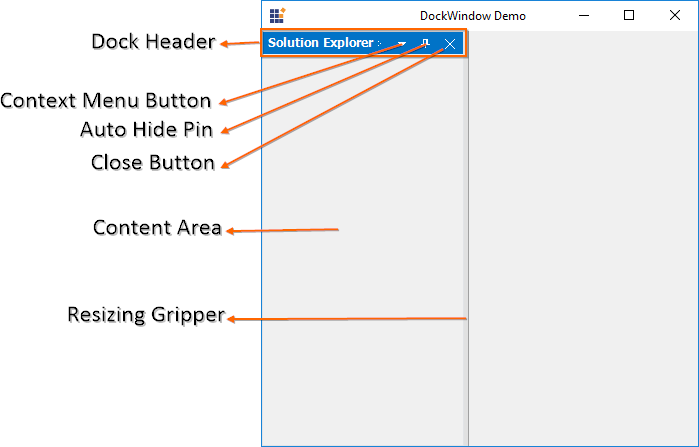

## Enable / disable dock functionality

Docking functionality can be enabled or disabled by setting the boolean value as `true` or `false` in the [SetEnableDocking](https://help.syncfusion.com/cr/cref_files/windowsforms/tools/Syncfusion.Tools.Windows~Syncfusion.Windows.Forms.Tools.DockingManager~SetEnableDocking.html) function.





//To enable the docking functionality.

this.dockingManager1.SetEnableDocking(this.panel1, true);

this.dockingManager1.SetEnableDocking(this.panel2, true);

this.dockingManager1.SetEnableDocking(this.panel3, true);

this.dockingManager1.SetEnableDocking(this.panel4, true);





'To enable the docking functionality.

Me.dockingManager1.SetEnableDocking(Me.panel1, True)

Me.dockingManager1.SetEnableDocking(Me.panel2, True)

Me.dockingManager1.SetEnableDocking(Me.panel3, True)

Me.dockingManager1.SetEnableDocking(Me.panel4, True)
 




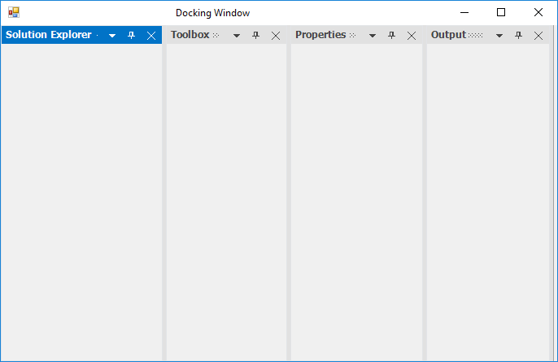

## Change dock side of children

DockingManager lets you specify the type of docking and the bounds of the docked control using the [DockControl](https://help.syncfusion.com/cr/cref_files/windowsforms/tools/Syncfusion.Tools.Windows~Syncfusion.Windows.Forms.Tools.DockingManager~DockControl.html) function.

The five sides that can be docked are

* Left
* Right
* Top
* Bottom
* Tabbed
* Fill





this.dockingManager1.DockControl(this.panel1, this, Syncfusion.Windows.Forms.Tools.DockingStyle.Bottom, 100);

this.dockingManager1.DockControl(this.panel2, this, Syncfusion.Windows.Forms.Tools.DockingStyle.Right, 100);
            
this.dockingManager1.DockControl(this.panel3, this.panel2, Syncfusion.Windows.Forms.Tools.DockingStyle.Tabbed, 100);
            
this.dockingManager1.DockControl(this.panel4, this, Syncfusion.Windows.Forms.Tools.DockingStyle.Left, 100);





Me.dockingManager1.DockControl(Me.panel1, Me, Syncfusion.Windows.Forms.Tools.DockingStyle.Bottom, 100)

Me.dockingManager1.DockControl(Me.panel2, Me, Syncfusion.Windows.Forms.Tools.DockingStyle.Right, 100)
            
Me.dockingManager1.DockControl(Me.panel3, Me.panel2, Syncfusion.Windows.Forms.Tools.DockingStyle.Tabbed, 100)
            
Me.dockingManager1.DockControl(Me.panel4, Me, Syncfusion.Windows.Forms.Tools.DockingStyle.Left, 100)





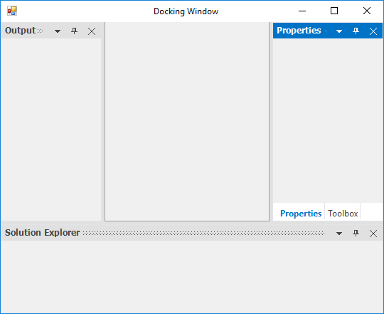

## Dock window to another window

Provides support to dock a window inside another window with the help of drag providers. This can also be done programmatically by using [DockControl](https://help.syncfusion.com/cr/cref_files/windowsforms/tools/Syncfusion.Tools.Windows~Syncfusion.Windows.Forms.Tools.DockingManager~DockControl.html) function.




            
this.dockingManager1.DockControl(this.panel4, this.panel1, Syncfusion.Windows.Forms.Tools.DockingStyle.Tabbed, 100);




            
Me.dockingManager1.DockControl(Me.panel4, Me.panel1, Syncfusion.Windows.Forms.Tools.DockingStyle.Tabbed, 100)





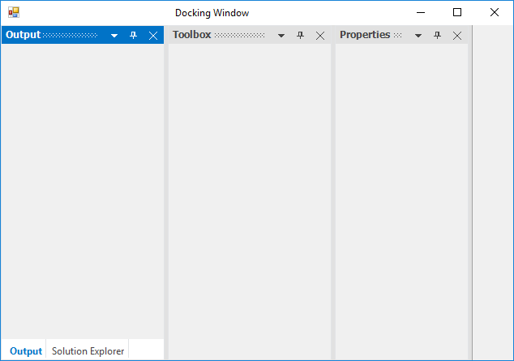

## Detect dock style

Docking style which is assigned to the control can be detect at run time using [GetDockStyle](https://help.syncfusion.com/cr/cref_files/windowsforms/tools/Syncfusion.Tools.Windows~Syncfusion.Windows.Forms.Tools.DockingManager~GetDockStyle.html) function of DockingManager.





MessageBox.Show("Dock style :" + this.dockingManager1.GetDockStyle(this.panel1));





MessageBox.Show("Dock style :" + Me.dockingManager1.GetDockStyle(Me.panel1))



  

## Change dock window header

DockingManger provides with an attached function [SetDockLabel](https://help.syncfusion.com/cr/cref_files/windowsforms/tools/Syncfusion.Tools.Windows~Syncfusion.Windows.Forms.Tools.DockingManager~SetDockLabel.html) which helps to set the label for a child window. 





// To set the label for the docked controls

this.dockingManager1.SetDockLabel(panel1, "New");





' To set the label for the docked controls

Me.dockingManager1.SetDockLabel(panel1, "New");





## Change dock window size

Dock panel size can be changed at run time by resize using splitters between dock panel. DockingManager also provides way to change the size of dock panels by programmatically. [SetControlSize](https://help.syncfusion.com/cr/cref_files/windowsforms/tools/Syncfusion.Tools.Windows~Syncfusion.Windows.Forms.Tools.DockingManager~SetControlSize.html) function of DockingManager helps to sets the size of docked control. [GetControlSize](https://help.syncfusion.com/cr/cref_files/windowsforms/tools/Syncfusion.Tools.Windows~Syncfusion.Windows.Forms.Tools.DockingManager~GetControlSize.html) function of DockingManager helps to get the size of dock panel. 





//Get the size of docked or Floating control using the GetControlSize function.

this.dockingManager1.GetControlSize(this.panel2);

Console.Write("Size" + this.dockingManager1.GetControlSize(this.panel2));

//Set the size of docked or Floating control using the GetControlSize function.

this.dockingManager1.SetControlSize(this.panel1, new Size(200, 200));





'Get the size of docked or Floating control using the GetControlSize function.

Me.dockingManager1.GetControlSize(this.panel2)

Console.Write("Size" + Me.dockingManager1.GetControlSize(Me.panel2))

'Set the size of docked or Floating control using the GetControlSize function.

Me.dockingManager1.SetControlSize(this.panel1, new Size(200, 200))



  

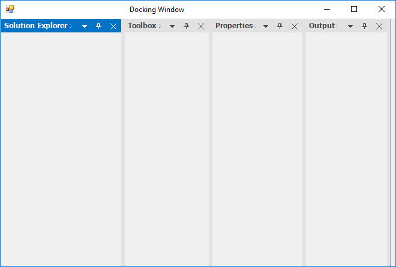

## Add icon in header of dock window

The caption icons / the images can also be set by using [SetDockIcon](https://help.syncfusion.com/cr/cref_files/windowsforms/tools/Syncfusion.Tools.Windows~Syncfusion.Windows.Forms.Tools.DockingManager~SetDockIcon.html) function of the docked control. This behavior can be enabled or disabled by using [ShowCaptionImages](https://help.syncfusion.com/cr/cref_files/windowsforms/tools/Syncfusion.Tools.Windows~Syncfusion.Windows.Forms.Tools.DockingManager~ShowCaptionImages.html) property. Its default value is `true`, to hide the caption image turn on its value to `false`. 

<table>
<tr>
<th>
Functions</th><th>
Description</th></tr>
<tr>
<td>
SetDockIcon</td><td>
Sets the Icon or the image for the docking window by passing the image icon as a parameter for this function. Ctrl - Represents the dock enabled control. image - Icon representing the docking window</td></tr>
<tr>
<td>
SetDockIcon(Overloaded)</td><td>
This overloaded function returns the index of the image associated with the docking window. Ctrl - Indicates the docking window. int - A zero-based index into the ImageList property value</td></tr>
</table>





System.Drawing.Icon icon = new System.Drawing.Icon(GetIconFile(GetIconFile(@"..\\..\\\$this.Icon.ico")));

private string GetIconFile(string bitmapName)
{
   for (int n = 0; n < 10; n++)
   {
       if (System.IO.File.Exists(bitmapName))
          return bitmapName;

       bitmapName = @"..\" + bitmapName;
   }

   return bitmapName;
}

this.dockingManager1.ShowCaptionImages = true;

this.dockingManager1.SetDockIcon(this.panel1, icon);





Dim icon As System.Drawing.Icon = New System.Drawing.Icon(GetIconFile(GetIconFile("..\\..\\\$this.Icon.ico")))

Private Function GetIconFile(ByVal bitmapName As String) As String
	 
   For n As Integer = 0 To 9
				
      If System.IO.File.Exists(bitmapName) Then

					Return bitmapName

			End If

			bitmapName = "..\" & bitmapName
			
   Next n

	 Return bitmapName

End Function

Me.dockingManager1.ShowCaptionImages = True

Me.DockingManager1.SetDockIcon(Me.panel1, icon)





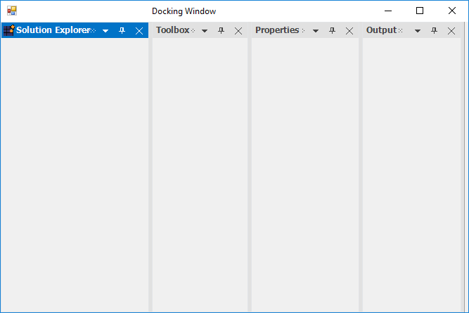

## Change caption alignment

By default, DockingManager provides options to dock panel between each other at any sides such as Left, Right, Top, Bottom. DockingManager also provides option to restrict user to dock panel at specific side. [SetDockAbility](https://help.syncfusion.com/cr/cref_files/windowsforms/tools/Syncfusion.Tools.Windows~Syncfusion.Windows.Forms.Tools.DockingManager~SetDockAbility.html) function of DockingManager helps to get or sets the DockAbility of docked control. [GetDockAbility](https://help.syncfusion.com/cr/cref_files/windowsforms/tools/Syncfusion.Tools.Windows~Syncfusion.Windows.Forms.Tools.DockingManager~GetDockAbility.html) of DockingManager provides the Dockability information of docked panel.





//Getting the Dock Ability

this.dockingManager1.GetDockAbility(this.panel1);

//Setting the Dock Ability

this.dockingManager1.SetDockAbility(this.panel1, "Top");





//Getting the Dock Ability

Me.dockingManager1.GetDockAbility(Me.panel1)

//Setting the Dock Ability

Me.dockingManager1.SetDockAbility(Me.panel1, "Top")



  

## Change visibility of caption buttons

DockingManager has following functions for retrieve and manipulation of the buttons visibility displayed in CaptionBar.

  * [SetCloseButtonVisibility](https://help.syncfusion.com/cr/cref_files/windowsforms/tools/Syncfusion.Tools.Windows~Syncfusion.Windows.Forms.Tools.DockingManager~SetCloseButtonVisibility.html): Used to show / hide the close button in the caption bar of the particular window.

  * [GetCloseButtonVisibility](https://help.syncfusion.com/cr/cref_files/windowsforms/tools/Syncfusion.Tools.Windows~Syncfusion.Windows.Forms.Tools.DockingManager~GetCloseButtonVisibility.html): Returns a bool value according to the visibility of close button.

  * [SetAutoHideButtonVisibility](https://help.syncfusion.com/cr/cref_files/windowsforms/tools/Syncfusion.Tools.Windows~Syncfusion.Windows.Forms.Tools.DockingManager~SetAutoHideButtonVisibility.html): Used to show / hide the AutoHide button in the caption bar of the particular window.

  * [GetAutoHideButtonVisibility](https://help.syncfusion.com/cr/cref_files/windowsforms/tools/Syncfusion.Tools.Windows~Syncfusion.Windows.Forms.Tools.DockingManager~GetAutoHideButtonVisibility.html): Returns a bool value according to the visibility of AutoHide button.

  * [SetMenuButtonVisibility](https://help.syncfusion.com/cr/cref_files/windowsforms/tools/Syncfusion.Tools.Windows~Syncfusion.Windows.Forms.Tools.DockingManager~SetMenuButtonVisibility.html): Used to show / hide the menu button in the caption bar of the particular window.

  * [GetMenuButtonVisibility](https://help.syncfusion.com/cr/cref_files/windowsforms/tools/Syncfusion.Tools.Windows~Syncfusion.Windows.Forms.Tools.DockingManager~GetMenuButtonVisibility.html): Returns a bool value according to the visibility of menu button.

The following code demonstrate the usage of these functions:





this.dockingManager1.SetCloseButtonVisibility(this.panel1, false); //true to show again

this.dockingManager1.GetCloseButtonVisibility(this.panel1); //true when button is visible, false otherwise.





Me.dockingManager1.SetCloseButtonVisibility(this.panel1, False); 'true to show again

Me.dockingManager1.GetCloseButtonVisibility(this.panel1); 'true when button is visible, false otherwise.





## Show / hide dock windows

[SetDockVisibility](https://help.syncfusion.com/cr/cref_files/windowsforms/tools/Syncfusion.Tools.Windows~Syncfusion.Windows.Forms.Tools.DockingManager~SetDockVisibility.html) function of DockingManager helps to sets the visibility of docked control. [GetDockVisibility](https://help.syncfusion.com/cr/cref_files/windowsforms/tools/Syncfusion.Tools.Windows~Syncfusion.Windows.Forms.Tools.DockingManager~GetDockVisibility.html) of DockingManger helps to identify the visibility of docked control. 





this.dockingManager1.SetDockVisibility(this.panel1, false);

Console.Write("DockWindow Visibility" + this.dockingManager1.GetDockVisibility(this.panel1));





Me.dockingManager1.SetDockVisibility(Me.panel1, False)

Console.Write("DockWindow Visibility" + Me.dockingManager1.GetDockVisibility(Me.panel1))



  

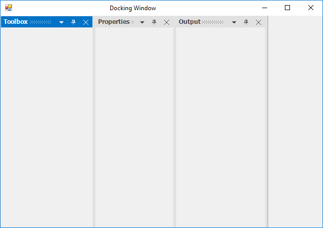

## Add custom buttons in caption

The Custom Caption Collection Editor can be accessed by using the DockingManager. [CaptionButtons](https://help.syncfusion.com/cr/cref_files/windowsforms/tools/Syncfusion.Tools.Windows~Syncfusion.Windows.Forms.Tools.DockingManager~CaptionButtons.html) property allows you to customize the default buttons and to add new custom caption buttons. 

 

In the `CaptionButtons` Collection Editor, we can add the new caption button by clicking "Add" button. 

This can also be done programmatically by using the following code examples.





Syncfusion.Windows.Forms.Tools.CaptionButton captionButton = new Syncfusion.Windows.Forms.Tools.CaptionButton();

toolTipInfo = new Syncfusion.Windows.Forms.Tools.ToolTipInfo();

captionButton.ImageIndex = 4;

captionButton.Name = "Custom Button";

captionButton.Type = Syncfusion.Windows.Forms.Tools.CaptionButtonType.Custom;

captionButton.SuperToolTipInfo = toolTipInfo

captionButton.TransparentImageColor = System.Drawing.Color.Transparent;

this.dockingManager1.CaptionButtons.Add(captionButton);





Dim captionButton5 As Syncfusion.Windows.Forms.Tools.CaptionButton = New Syncfusion.Windows.Forms.Tools.CaptionButton()

toolTipInfo = new Syncfusion.Windows.Forms.Tools.ToolTipInfo()

captionButton.ImageIndex = 4 

captionButton.Name = "Custom Button" 

captionButton.Type = Syncfusion.Windows.Forms.Tools.CaptionButtonType.Custom;

captionButton.SuperToolTipInfo = toolTipInfo

captionButton.TransparentImageColor = System.Drawing.Color.Transparent 

Me.dockingManager1.CaptionButtons.Add(captionButton)





N> Refer to the following sample link that demonstrates how to add the Custom Caption Buttons:
C:\Users\&lt;User&gt;\AppData\Local\Syncfusion\EssentialStudio\Version Number\Windows\Tools.Windows\Samples\Docking Manager\Custom Captions\CS

### Customize caption buttons

The DockingManager allows to customize the above default buttons. Active and Inactive window caption button `ForeColor` can be customized by using the [ActiveCaptionButtonForeColor](https://help.syncfusion.com/cr/cref_files/windowsforms/tools/Syncfusion.Tools.Windows~Syncfusion.Windows.Forms.Tools.DockingManager~ActiveCaptionButtonForeColor.html) and [InActiveCaptionButtonForeColor](https://help.syncfusion.com/cr/cref_files/windowsforms/tools/Syncfusion.Tools.Windows~Syncfusion.Windows.Forms.Tools.DockingManager~InActiveCaptionButtonForeColor.html) properties of DockingManager.





this.dockingManager1.ActiveCaptionButtonForeColor = System.Drawing.Color.Red;

this.dockingManager1.InActiveCaptionButtonForeColor = System.Drawing.Color.Green;





Me.dockingManager1.ActiveCaptionButtonForeColor = System.Drawing.Color.Red

Me.dockingManager1.InActiveCaptionButtonForeColor = System.Drawing.Color.Green





## Change header visibility of dock window

DockingManager allows to change the Visibility of Caption for Dock panels. [ShowCaption](https://help.syncfusion.com/cr/cref_files/windowsforms/tools/Syncfusion.Tools.Windows~Syncfusion.Windows.Forms.Tools.DockingManager~ShowCaption.html) is an attached property which is used to show or hide the caption of the DockPanel. Its default value is `true`, to hide the caption turn its value to `false`.





//To disable the caption of the dock window.

 this.dockingManager1.ShowCaption = false;





'To disable the caption of the dock window.

Me.dockingManager1.ShowCaption = False
 




## Occupy whole window

The [DockToFill](https://help.syncfusion.com/cr/cref_files/windowsforms/tools/Syncfusion.Tools.Windows~Syncfusion.Windows.Forms.Tools.DockingManager~DockToFill.html) property allows users to implement a unique docking layout where a non-MDIContainer form or ContainerControl's entire client region is occupied by the dockable controls.





this.dockingManager1.DockToFill = true;





Me.dockingManager1.DockToFill = True;





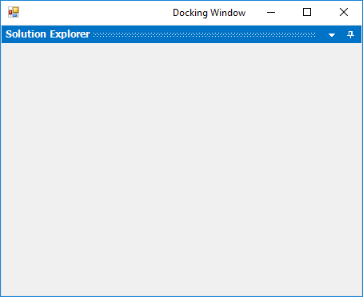

## Enable / disable the context menu 

A context menu will be displayed whenever the user right clicks the caption bar or clicks the menu button in the caption bar. We can enable or disable showing the context menu of docked window by using [EnableContextMenu](https://help.syncfusion.com/cr/cref_files/windowsforms/tools/Syncfusion.Tools.Windows~Syncfusion.Windows.Forms.Tools.DockingManager~EnableContextMenu.html) property of DockingManager. Its default is `true`, to hide the context menu in docked windows turn on its value to `false`.





this.dockingManager1.EnableContextMenu = true;





Me.dockingManager1.EnableContextMenu = True





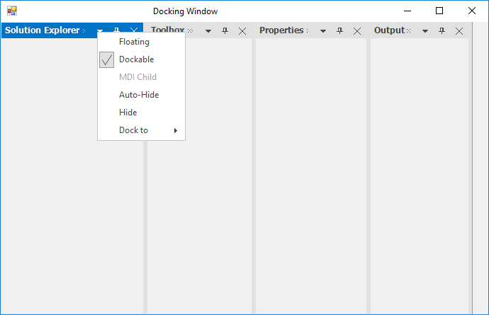 

N> If `MDIContainer` property of the form is set to `true`, then the context menu will include MDI child option. 

 

## Remove specific default menu item from context menu

Context menu items in dock window caption can be customized using [DockContextMenu](https://help.syncfusion.com/cr/cref_files/windowsforms/tools/Syncfusion.Tools.Windows~Syncfusion.Windows.Forms.Tools.DockingManager~DockContextMenu_EV.html) event of DockingManager. The [DockContextMenuEventArgs](https://help.syncfusion.com/cr/cref_files/windowsforms/tools/Syncfusion.Tools.Windows~Syncfusion.Windows.Forms.Tools.DockContextMenuEventArgs.html) allows to remove the menu items using its ContextMenu option.  So, we can add / remove the ContextMenuItem by passing the corresponding BarItem to add / remove function.

The following code example demonstrates removing the default menu items “Hide” and “Dock to”.  





// Remove ContextMenuItem

this.dockingManager1.DockContextMenu += DockingManager1_DockContextMenu;
  
private void DockingManager1_DockContextMenu(object sender, DockContextMenuEventArgs arg)
{

BarItem item = arg.ContextMenu.ParentBarItem.Items[4] as BarItem;

BarItem item1 = arg.ContextMenu.ParentBarItem.Items[5] as BarItem;

if (item != null && item.Text == "&Hide")
{
    arg.ContextMenu.ParentBarItem.Items.Remove(item);
}

if (item1 != null && item1.Text == "Dock to")
{
    arg.ContextMenu.ParentBarItem.Items.Remove(item1);
}

}





AddHandler Me.dockingManager1.DockContextMenu, AddressOf DockingManager1_DockContextMenu
  
'Remove ContextMenuItem

Dim item As BarItem = TryCast(arg.ContextMenu.ParentBarItem.Items(4), BarItem)

Dim item1 As BarItem = TryCast(arg.ContextMenu.ParentBarItem.Items(5), BarItem)

If item IsNot Nothing AndAlso item.Text = "&Hide" Then

arg.ContextMenu.ParentBarItem.Items.Remove(item)

End If

If item1 IsNot Nothing AndAlso item1.Text = "Dock to" Then

arg.ContextMenu.ParentBarItem.Items.Remove(item1)

End If





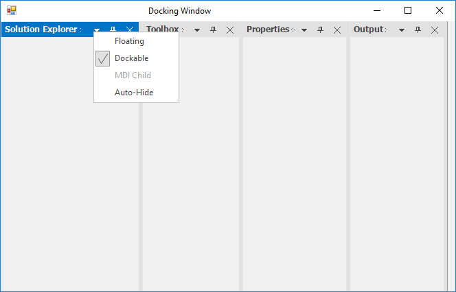 

## Restrict resize

DockingManager provides option to restrict user to resize the dock panel to specified minimum size. [SetControlMinimumSize](https://help.syncfusion.com/cr/cref_files/windowsforms/tools/Syncfusion.Tools.Windows~Syncfusion.Windows.Forms.Tools.DockingManager~SetControlMinimumSize.html) function of DockingManager helps to sets the minimum size of docked control.





//Set the minimum size of docked control using the SetControlMinimumSize method

this.dockingManager1.SetControlMinimumSize(panel1,new Size(200, 400));





'Set the minimum size of docked control using the SetControlMinimumSize method

Me.dockingManager1.SetControlMinimumSize(panel1,new Size(200, 400))



 

### Restrict to resize specific window

The desired width can be set for the Dock windows through the [DockControl](https://help.syncfusion.com/cr/cref_files/windowsforms/tools/Syncfusion.Tools.Windows~Syncfusion.Windows.Forms.Tools.DockingManager~DockControl.html) function as in the below code snippets.





this.dockingManager1.DockControl(this.panel1, this, Syncfusion.Windows.Forms.Tools.DockingStyle.Right, 100);





Me.dockingManager1.DockControl(Me.panel1, Me, Syncfusion.Windows.Forms.Tools.DockingStyle.Right, 100)





## Customize resize splitter

The Splitter of the dock window can be customized using the [SplitterWidth](https://help.syncfusion.com/cr/cref_files/windowsforms/tools/Syncfusion.Tools.Windows~Syncfusion.Windows.Forms.Tools.DockingManager~SplitterWidth.html) and [MetroSplitterBackColor](https://help.syncfusion.com/cr/cref_files/windowsforms/tools/Syncfusion.Tools.Windows~Syncfusion.Windows.Forms.Tools.DockingManager~MetroSplitterBackColor.html) properties depends upon its values respectively.





 this.dockingManager1.SplitterWidth = 10;
 
 this.dockingManager1.MetroSplitterBackColor = Color.Red;





 Me.dockingManager1.SplitterWidth = 10
 
 Me.dockingManager1.MetroSplitterBackColor = Color.Red





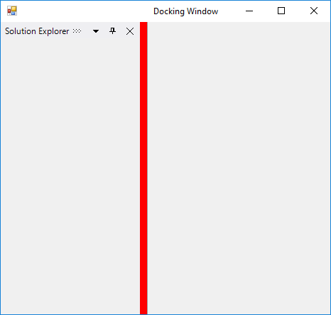 
