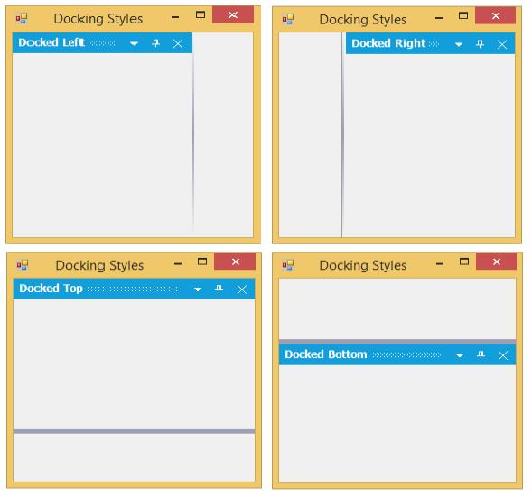

# Docking Window

DockingManager lets you dock the control on any of the four sides of the container control.

## Configuring Window in Different Sides

DockingManager lets you specify the type of docking and the bounds of the docked control using the `DockControl` method.

The five sides that can be docked are

* Left
* Right
* Top
* Bottom
* Tabbed
* Fill





//To dock the panel1 on left side of the form.

 this.dockingManager1.DockControl(this.panel1, this, Syncfusion.Windows.Forms.Tools.DockingStyle.Left, 100);





'To dock the panel1 on left side of the form.

Me.dockingManager1.DockControl(Me.panel1, Me, Syncfusion.Windows.Forms.Tools.DockingStyle.Left, 100)





## Enabling or Disabling the Dock Functionality

Docking functionality can be enabled or disabled by setting the Boolean value as true or false in the **SetEnableDocking** method.





//To enable the docking functionality.

 this.dockingManager1.SetEnableDocking(this.panel1, true);





'To enable the docking functionality.

 Me.dockingManager1.SetEnableDocking(Me.panel1, true)
 




## Enabling or Disabling the Caption Visibility

**ShowCaption** is an attached property, which is used to hide the Caption of the DockWindow. Default value of **ShowCaption** is true, to hide the Caption turn its value to false.





//To disable the caption of the dock window.

 this.dockingManager1.ShowCaption = false;





'To disable the caption of the dock window.

Me.dockingManager1.ShowCaption = false
 




