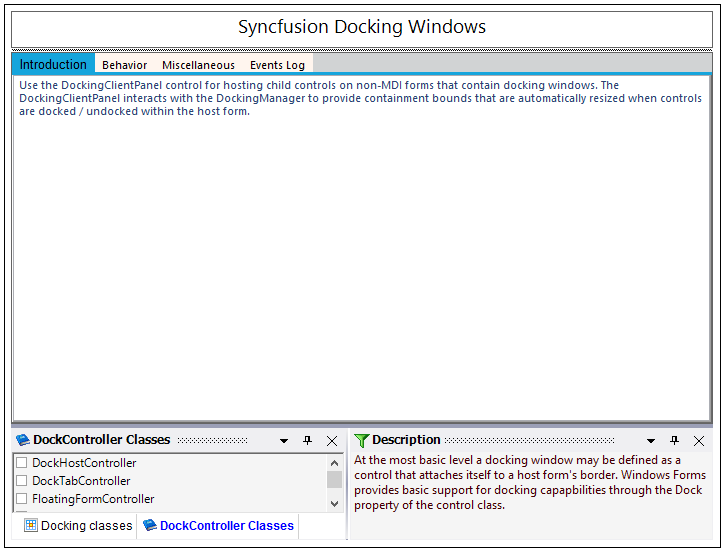

# DockingClientPanel

A premise of any docking windows implementation is the existence of a client window the bounds of which vary at run-time as windows get docked or undone. This paradigm is extremely well suited for MDI type forms where the MDIClient window gets resized / relocated in synchronization with changes in the docking windows layout. 

Child controls located within the MDIClient window are thus always assured of a static spatial relationship with the parent container. 

Non-MDI forms, however, do not have any such client window and all non-dockable statically positioned controls risk being clipped by windows that are docked in their proximity. 

The Essential Tools DockingClientPanel control helps overcome this limitation by providing an auto-resized client surface on which a form's non-dockable controls may be located.

N> The DockingClientPanel control is intended only for use with forms that do not have the MDIContainer style set.

## Using the DockingClientPanel Control

The following sequence lists the steps involved in setting up a docking layout on a non-MDIContainer form using the DockingClientPanel. The DockingClientPanel is used here because in addition to the docking windows, the host form also contains several non-dockable controls that require a container with static relative bounds for implementing positioning and layout management. 

1. Add the DockingManager to the form and apply the `EnableDocking on dockingManager` property for those controls that need to be set as docking windows.
2. Select the DockingClientPanel control from the designer tool box and drop it onto the form hosting the DockingManager. Size the control so that its bounds are sufficient to accommodate any non-dockable child controls that may already be present on the form.
3. If any non-dockable controls are present on the form, then drag-and-drop these controls onto the DockingClientPanel instance.
4. Set the DockingClientPanel.SizeToFit property to be true. Turning on the SizeToFit property will force the DockingClientPanel to start interacting with the Essential Tools docking architecture and the control will automatically be resized / repositioned to occupy the form's client bounds, left unoccupied by the docking windows. 
5. Set the `BorderStyle` property to get the 3D or fixed single effect to the docking client panel control.
6. The DockingClientPanel will now function as a proxy for the form's client surface and all controls originally intended to be placed on the form should henceforth be located on the DockingClientPanel; any anchoring / layout features for the child controls should be set relative to the DockingClientPanel. 
7. To add controls directly to the form, the `SizeToFit` property can temporarily be turned off within the designer and the form resized to expose its surface. At run-time, the `SizeToFit` property is always enabled. 

<table>
<tr>
<th>
DockingClientPanel Property</th><th>
Description</th></tr>
<tr>
<td>
SizeToFit</td><td>
Gets or sets a value indicating whether the control is sized to fill the form's area.</td></tr>
<tr>
<td>
BorderStyle</td><td>
Indicates the border Style of the Control.</td></tr>
</table>

8.DockingClientPanel control can be added to the Non-MDI forms using the below code snippet for example.

   





//Declaration and initialization

private Syncfusion.Windows.Forms.Tools.DockingClientPanel dockingClientPanel1;

this.dockingClientPanel1 = new Syncfusion.Windows.Forms.Tools.DockingClientPanel();

this.dockingClientPanel1.SuspendLayout();

//Add a control to dockingclientpanel

this.dockingClientPanel1.Controls.Add(this.tabControlAdv1);

//set the properties

this.dockingClientPanel1.Location = new System.Drawing.Point(0, 133);

this.dockingClientPanel1.Name = "dockingClientPanel1";

this.dockingClientPanel1.Size = new System.Drawing.Size(600, 369);

this.dockingClientPanel1.SizeToFit = true;

this.dockingClientPanel1.TabIndex = 0;

this.dockingClientPanel1.Paint += new System.Windows.Forms.PaintEventHandler(this.dockingClientPanel1_Paint);

this.DockingClientPanel1.BorderStyle = System.Windows.Forms.BorderStyle.Fixed3D

//Add the control to the form

this.Controls.Add(this.dockingClientPanel1);

this.dockingClientPanel1.ResumeLayout(false);

  

 

 

' Declaration and initialization

Private dockingClientPanel1 As Syncfusion.Windows.Forms.Tools.DockingClientPanel

Me.dockingClientPanel1 = New Syncfusion.Windows.Forms.Tools.DockingClientPanel()

Me.dockingClientPanel1.SuspendLayout()

' Add a control to dockingclientpanel 

Me.dockingClientPanel1.Controls.AddRange(New System.Windows.Forms.Control() {Me.tabControlAdv1})

'set the properties

Me.dockingClientPanel1.AutoScroll = True

Me.dockingClientPanel1.Location = New System.Drawing.Point(106, 0)

Me.dockingClientPanel1.Name = "dockingClientPanel1"

Me.dockingClientPanel1.Size = New System.Drawing.Size(452, 417)

Me.dockingClientPanel1.SizeToFit = True

Me.DockingClientPanel1.BorderStyle = System.Windows.Forms.BorderStyle.Fixed3D

' Add the control to the form

Me.Controls.AddRange(New System.Windows.Forms.Control() {Me.dockingClientPanel1})

Me.dockingClientPanel1.ResumeLayout(False)
		




  

## Properties

The DockingClientPanel can be given an attractive look and feel using the appearance and size properties. These properties are discussed in detail below. This section also gives an idea about the scrolling feature available for the DockingClientPanel.

### Background and Foreground Settings

Background color of the control can be set using the `BackColor` property. Background image for the control can be specified using `BackgroundImage` property and image layout is set through `BackgroundImageLayout` property. Below are the code snippets to set these properties programmatically.

<table>
<tr>
<th>
DockingClientPanel Property</th><th>
Description</th></tr>
<tr>
<td>
BackColor</td><td>
Indicates the background color of the component.</td></tr>
<tr>
<td>
BackgroundImage</td><td>
Indicates the background image used for the control.</td></tr>
<tr>
<td>
BackgroundImageLayout</td><td>
Indicates the background image layout used for the control.</td></tr>
</table>





this.dockingClientPanel1.BackColor = System.Drawing.Color.AliceBlue;

this.dockingClientPanel1.BackgroundImage = CType((Resources.GetObject("dockingClientPanel1.BackgroundImage")), System.Drawing.Image);

this.dockingClientPanel1.BackgroundImageLayout = System.Windows.Forms.ImageLayout.Stretch;





Me.dockingClientPanel1.BackColor = System.Drawing.Color.AliceBlue

Me.dockingClientPanel1.BackgroundImage = CType((Resources.GetObject("dockingClientPanel1.BackgroundImage")), System.Drawing.Image)

Me.dockingClientPanel1.BackgroundImageLayout = System.Windows.Forms.ImageLayout.Stretch





The font used to display the text in the control is set through Font property and the fore color through ForeColor property. Below are the code snippets to set these two properties programmatically.

<table>
<tr>
<th>
DockingClientPanel Property</th><th>
Description</th></tr>
<tr>
<td>
Font</td><td>
The font used to display text in the control.</td></tr>
<tr>
<td>
ForeColor</td><td>
The foreground color of this component, which is used to display the text.</td></tr>
</table>





this.dockingClientPanel1.Font = new System.Drawing.Font("Arial", 9F, System.Drawing.FontStyle.Bold, System.Drawing.GraphicsUnit.Point, ((byte)(0)));

this.dockingClientPanel1.ForeColor = System.Drawing.Color.RoyalBlue;





Me.dockingClientPanel1.Font = New System.Drawing.Font("Arial", 9.0F, System.Drawing.FontStyle.Bold, System.Drawing.GraphicsUnit.Point, CType((0), Byte))

Me.dockingClientPanel1.ForeColor = System.Drawing.Color.RoyalBlue





Below image illustrates a DockingClientPanel with the foreground and background properties set.

  

## Scroll properties

When the control contents are larger than its visible area, the scroll bars will automatically appear, by enabling `AutoScroll` property. The margin for the control during autoscroll is specified using `AutoScrollMargin` property and the minimum size for auto scroll area can be specified using the `AutoScrollMinSize` property.

<table>
<tr>
<th>
DockingClientPanel Property</th><th>
Description</th></tr>
<tr>
<td>
AutoScroll</td><td>
Indicates whether scroll bars automatically appear when the control contents are larger than its visible area.</td></tr>
<tr>
<td>
AutoScrollMargin</td><td>
Indicates the margin around controls during auto scroll.</td></tr>
<tr>
<td>
AutoScrollMinSize</td><td>
Indicates the minimum logical size for auto scroll region.</td></tr>
</table>





this.dockingClientPanel1.AutoScroll = true;

this.dockingClientPanel1.AutoScrollMargin = new System.Drawing.Size(1, 1);

this.dockingClientPanel1.AutoScrollMinSize = new System.Drawing.Size(1, 1);





Me.dockingClientPanel1.AutoScroll = True

Me.dockingClientPanel1.AutoScrollMargin = New System.Drawing.Size(1, 1)

Me.dockingClientPanel1.AutoScrollMinSize = New System.Drawing.Size(1, 1)     





  

## Sizing Properties

AutoSize property will allow the control to automatically size itself to fit its contents. The resize mode can be specified using `AutoSizeMode` property.

<table>
<tr>
<th>
DockingClientPanel Property</th><th>
Description</th></tr>
<tr>
<td>
AutoSize</td><td>
Specifies whether a control will automatically size itself to fit its contents.</td></tr>
<tr>
<td>
AutoSizeMode</td><td>
Specifies the mode by which the user interface element automatically resizes itself.</td></tr>
</table>





this.dockingClientPanel1.AutoSize = true;

this.dockingClientPanel1.AutoSizeMode = System.Windows.Forms.AutoSizeMode.GrowAndShrink;





Me.dockingClientPanel1.AutoSize = True

Me.dockingClientPanel1.AutoSizeMode = System.Windows.Forms.AutoSizeMode.GrowAndShrink





