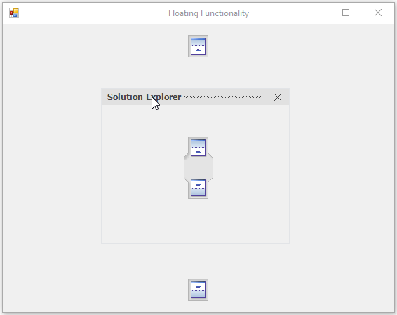
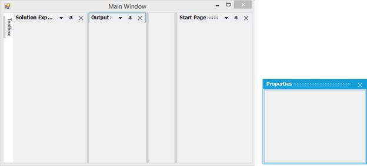

# Floating Window

DockPanels can be floated by click the panel header and drag it away by mouse interaction. Floating window can be dragged over any place in the screen. Docking hints will be displayed while drag the floating window over the DockingManager or any other dock panels. 

## Enabling / disabling the float functionality

By default, all the dock panels can be floated in DockingManager. `DockingManager` provide option for restrict user to create float windows. The [DisallowFloating](https://help.syncfusion.com/cr/cref_files/windowsforms/tools/Syncfusion.Tools.Windows~Syncfusion.Windows.Forms.Tools.DockingManager~DisallowFloating.html) property helps to enable or disable the floating functionality. By default, its value is `false`, to restrict the creation of float window, turn its value to `true`. DockPanel will be re-dock at existing position while dragging dock panel and drop at somewhere it to create float window while `DisallowFloating`.





//To restrict floating window creation

this.dockingManager1.DisallowFloating = true;





'To restrict floating window creation

Me.dockingManager1.DisallowFloating = true





## Disable float for specific child

[SetAllowFloating](https://help.syncfusion.com/cr/cref_files/windowsforms/tools/Syncfusion.Tools.Windows~Syncfusion.Windows.Forms.Tools.DockingManager~SetAllowFloating.html) function helps to disable floating functionality for specific child.





//To restrict floating window creation for specific child.

this.dockingManager1.SetAllowFloating(panel1, false);





'To restrict floating window creation for specific child.

Me.dockingManager1.SetAllowFloating(panel1, False)





## Change state to float by programmatically

DockingManager provides option to float the particular control programmatically by using [FloatControl](https://help.syncfusion.com/cr/cref_files/windowsforms/tools/Syncfusion.Tools.Windows~Syncfusion.Windows.Forms.Tools.DockingManager~FloatControl.html) function of DockingManager. Using this function, we can float a single control even if it is tabbed with many controls.





//To set ListBox state as floating at the desired location.

Rectangle rectangle = this.Bounds;

this.dockingManager1.FloatControl(this.panel3, new Rectangle(rectangle.Right - 300, rectangle.Bottom - 300, 200, 200));





'To set ListBox state as floating at the desired location.

Dim rectangle As Rectangle = Me.Bounds 

Me.dockingManager1.FloatControl(Me.panel3, New Rectangle(rectangle.Right - 300, rectangle.Bottom - 300, 200, 200))





## Float by user interaction

Docked window can be moved to float state by drag and drop the window. And also by double clicking the caption of dock panels in DockingManager.

### Drag float window

Docked window can be moved to `Float` state by clicking its caption and dragging using mouse interaction. 

### Double click on caption

Dock panels state can be changed from Dock to Float and vice-versa on double click the caption in DockingManager by default. DockingManager provides option to disable this functionality by set [EnableDoubleClickOnCaption](https://help.syncfusion.com/cr/cref_files/windowsforms/tools/Syncfusion.Tools.Windows~Syncfusion.Windows.Forms.Tools.DockingManager~EnableDoubleClickOnCaption.html) property as `false`.





//To disable the Re-docking the floating window on caption double click.
 
this.dockingManager1.EnableDoubleClickOnCaption = false;





'To disable the Re-docking the floating window on caption double click.
 
Me.dockingManager1.EnableDoubleClickOnCaption = False





## Maximize float window

In DockingManager, we can maximize the float window by double clicking its caption bar.

### Maximize the float window on double click caption

By using [OnCaptionDoubleClick](https://help.syncfusion.com/cr/cref_files/windowsforms/tools/Syncfusion.Tools.Windows~Syncfusion.Windows.Forms.Tools.DockingManager~OnCaptionDoubleClick_EV.html) event of DockingManager we can maximize the FloatWindow while double clicking on Caption Bar. Use [EnableDoubleClickOnCaption](https://help.syncfusion.com/cr/cref_files/windowsforms/tools/Syncfusion.Tools.Windows~Syncfusion.Windows.Forms.Tools.DockingManager~EnableDoubleClickOnCaption.html) property of DockingManager to enable or disable the state transition when double click on CaptionBar.





this.dockingManager1.EnableDoubleClickOnCaption = true;
this.dockingManager1.DockControlDeactivated += new DockActivationChangedEventHandler(dockingManager1_DockControlDeactivated);
this.dockingManager1.DockControlActivated += new DockActivationChangedEventHandler(dockingManager1_DockControlActivated);
this.dockingManager1.DockStateChanged += new DockStateChangeEventHandler(dockingManager1_DockStateChanged);
this.dockingManager1.OnCaptionDoubleClick += new Syncfusion.Windows.Forms.Tools.DockMouseSelectionEventHandler(dockingManager1_OnCaptionDoubleClick);

//Triggers when control lost its focus.
  void dockingManager1_DockControlDeactivated(object sender, DockActivationChangedEventArgs arg)
  {
    if (dockingManager1.IsFloating(arg.Control))
      dockingManager1.EnableDoubleClickOnCaption = false;
  }
  
  //Triggers when the control got the Focus.
  void dockingManager1_DockControlActivated(object sender, DockActivationChangedEventArgs arg)
  {
    if (!(dockingManager1.IsFloating(arg.Control)))
      dockingManager1.EnableDoubleClickOnCaption = true;
    else
      dockingManager1.EnableDoubleClickOnCaption = false;
  
  }
  
  //Triggers when the dock state changed(Dock state or Floating state or tabbed docking)
  void dockingManager1_DockStateChanged(object sender, DockStateChangeEventArgs arg)
  {
    if (dockingManager1.IsFloating(arg.Controls[0]))
      dockingManager1.EnableDoubleClickOnCaption = false;
    else
      dockingManager1.EnableDoubleClickOnCaption = true;
  }
  
  //Event triggers on double click on the caption bar.
  void dockingManager1_OnCaptionDoubleClick(object sender, Syncfusion.Windows.Forms.Tools.DockControlMouseSelection arg)
  {
    if (this.dockingManager1.IsFloating(arg.Control))
    {
      Control ctrl = arg.Control;
      if ((arg.Control.TopLevelControl as FloatingForm).WindowState != FormWindowState.Maximized)
        (arg.Control.TopLevelControl as FloatingForm).WindowState = FormWindowState.Maximized;
      else
        (arg.Control.TopLevelControl as FloatingForm).WindowState = FormWindowState.Normal;
    }
  }





Me.dockingManager1.EnableDoubleClickOnCaption = True
AddHandler dockingManager1.DockControlDeactivated, AddressOf dockingManager1_DockControlDeactivated
AddHandler dockingManager1.DockControlActivated, AddressOf dockingManager1_DockControlActivated
AddHandler dockingManager1.DockStateChanged, AddressOf dockingManager1_DockStateChanged
AddHandler dockingManager1.OnCaptionDoubleClick, AddressOf dockingManager1_OnCaptionDoubleClick

  Private Sub dockingManager1_DockControlDeactivated(ByVal sender As Object, ByVal arg As DockActivationChangedEventArgs)
      If dockingManager1.IsFloating(arg.Control) Then
        dockingManager1.EnableDoubleClickOnCaption = False
      End If
   End Sub
  
   'Triggers when the control got the Focus.
   Private Sub dockingManager1_DockControlActivated(ByVal sender As Object, ByVal arg As DockActivationChangedEventArgs)
      If Not(dockingManager1.IsFloating(arg.Control)) Then
        dockingManager1.EnableDoubleClickOnCaption = True
      Else
        dockingManager1.EnableDoubleClickOnCaption = False
      End If
   End Sub
  
   'Triggers when the dock state changed(Dock state or Floating state or tabbed docking)
   Private Sub dockingManager1_DockStateChanged(ByVal sender As Object, ByVal arg As DockStateChangeEventArgs)
      If dockingManager1.IsFloating(arg.Controls(0)) Then
                   dockingManager1.EnableDoubleClickOnCaption = False
      Else
        dockingManager1.EnableDoubleClickOnCaption = True
      End If
   End Sub
  
   'Event triggers on double click on the caption bar.
   Private Sub dockingManager1_OnCaptionDoubleClick(ByVal sender As Object, ByVal arg As Syncfusion.Windows.Forms.Tools.DockControlMouseSelection)
      If Me.dockingManager1.IsFloating(arg.Control) Then
        Dim ctrl As Control = arg.Control
        If (TryCast(arg.Control.TopLevelControl, FloatingForm)).WindowState <> FormWindowState.Maximized Then
          TryCast(arg.Control.TopLevelControl, FloatingForm).WindowState = FormWindowState.Maximized
                   Else
          TryCast(arg.Control.TopLevelControl, FloatingForm).WindowState = FormWindowState.Normal
                   End If
      End If
   End Sub





## Restrict to dock on specific sides

User can restrict the specific [DockAbility](https://help.syncfusion.com/cr/cref_files/windowsforms/tools/Syncfusion.Tools.Windows~Syncfusion.Windows.Forms.Tools.DockAbility.html) of child window when it moved to the client area in DockingManager. It can be achieved by [SetOuterDockAbility](https://help.syncfusion.com/cr/cref_files/windowsforms/tools/Syncfusion.Tools.Windows~Syncfusion.Windows.Forms.Tools.DockingManager~SetOuterDockAbility.html) function. Here we have restricted the right, left, tabbed and fill dock ability.  





this.dockingManager1.SetOuterDockAbility(panel1, Syncfusion.Windows.Forms.Tools.DockAbility.Top | Syncfusion.Windows.Forms.Tools.DockAbility.Bottom);





Me.dockingManager1.SetOuterDockAbility(panel1, Syncfusion.Windows.Forms.Tools.DockAbility.Top Or Syncfusion.Windows.Forms.Tools.DockAbility.Bottom)





## Show custom buttons in float window

The DockingManager provides the support to add custom buttons to the caption bar when an item is in floating state. To enable custom button for caption bar while floating, set the [ShowCustomButtonsInFloating](https://help.syncfusion.com/cr/cref_files/windowsforms/tools/Syncfusion.Tools.Windows~Syncfusion.Windows.Forms.Tools.DockingManager~ShowCustomButtonsInFloating.html) property to `true`.





this.dockingManager1.ShowCustomButtonsInFloating = true;





me.dockingManager1.ShowCustomButtonsInFloating = True





 

N> This feature is not applicable for VS2005 (default) visual style.

## Change border size of float window

Border thickness of the Float window can be changed through [MetroBorderWidth](https://help.syncfusion.com/cr/cref_files/windowsforms/tools/Syncfusion.Tools.Windows~Syncfusion.Windows.Forms.Tools.DockingManager~MetroBorderWidth.html) property of DockingManager. Default value of this property is `one`. This property is applicable only if the VisualStyle of the DockingManager is `Metro`. 





this.dockingManager1.MetroBorderWidth = 4;





Me.dockingManager1.MetroBorderWidth = 4





## Change float window location

FloatWindow location can be changed by drag and drop by mouse interaction. 

### Change location programmatically

DockingManager provides option to change the FloatWindow location by programmatically. To position the FloatWindow at the desired location with the required rectangle Bounds, call [FloatControl](https://help.syncfusion.com/cr/cref_files/windowsforms/tools/Syncfusion.Tools.Windows~Syncfusion.Windows.Forms.Tools.DockingManager~FloatControl.html) function of the DockingManager.





//To set properties window state as floating at the desired location.

Rectangle rectangle = this.Bounds;

this.dockingManager1.FloatControl(this.panel3, new Rectangle(rectangle.Right - 300, rectangle.Bottom - 300, 200, 200));





'To set properties window state as floating at the desired location.

Dim rectangle As Rectangle = Me.Bounds 

Me.dockingManager1.FloatControl(Me.panel3, New Rectangle(rectangle.Right - 300, rectangle.Bottom - 300, 200, 200))





## Listen to keyboard events

The DockingManager [ForwardMenuShortcuts](https://help.syncfusion.com/cr/cref_files/windowsforms/tools/Syncfusion.Tools.Windows~Syncfusion.Windows.Forms.Tools.DockingManager~ForwardMenuShortcuts.html) property helps to get or set a value indicating whether the HostForm can listen the Keyboard Event, when the docked control is in `floating` state.





// True, Enable the HostForm to Listen the keyboard event, when the docked window in Floating State.

this.dockingManager1.ForwardMenuShortcuts=true;





'True, Enable the HostForm to Listen the keyboard event, when the docked window in Floating State.

Me.DockingManager1.ForwardMenuShortcuts=True





## Restricting re-dock float window

By default, dockingManager allows panel to change it's state to any state. To restrict some panel only in Float state always, DockingManager provides a way with the help of `SetFloatOnly` function. It helps to set the specified window should always in Float state and not able to dock again.

The DockingManager [GetFloatOnly](https://help.syncfusion.com/cr/cref_files/windowsforms/tools/Syncfusion.Tools.Windows~Syncfusion.Windows.Forms.Tools.DockingManager~GetFloatOnly.html) function helps to get the information whether the specified window is always in Float state or not.





this.dockingManager1.SetFloatOnly(this.panel1, true);

Console.Write("IsAlways in FloatState:" + this.dockingManager1.SetFloatOnly(this.panel1, true));





Me.dockingManager1.SetFloatOnly(this.panel1, True)

Console.Write("IsAlways in FloatState:" + Me.dockingManager1.SetFloatOnly(Me.panel1, True))




