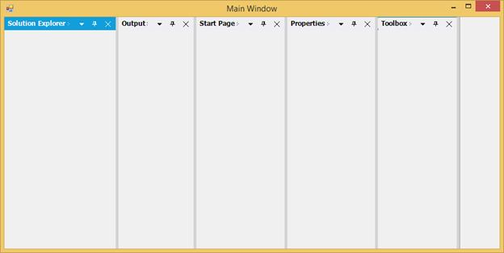

# Getting Started

This section explains how to implement a similar UI as Visual Studio using the DockingManager control in a Windows Forms application.

## Assembly deployment

The following list of assemblies should be added as reference to use the DockingManager in any application:

<table>
<tr>
<td>
{{'**Required assemblies**'| markdownify }}
</td>
<td>
{{'**Description**'| markdownify }}
</td>
</tr>
<tr>
<td>
Syncfusion.Grid.Base.dll
</td>
<td>
Syncfusion.Grid.Base contains classes that contains fundamentals and base classes of GridControl.
</td>
</tr>
<tr>
<td>
Syncfusion.Grid.Windows.dll
</td>
<td>
Syncfusion.Grid.Windows contains classes that handles all UI operations, fundamentals and base classes of GridControl which are used in the DockingManager control.
</td>
</tr>
<tr>
<td>
Syncfusion.Shared.Base.dll
</td>
<td>
Syncfusion.Shared.Base contains style related properties of DockingManager and various editor controls.
</td>
</tr>
<tr>
<td>
Syncfusion.Shared.Windows.dll
</td>
<td>
Syncfusion.Shared.Windows contains style related properties of DockingManager and various editor controls.
</td>
</tr>
<tr>
<td>
Syncfusion.Tools.Base.dll
</td>
<td>
Syncfusion.Tools.Base contains base class which used for DockingManager control.
</td>
</tr>
<tr>
<td>
Syncfusion.Tools.Windows.dll
</td>
<td>
Syncfusion.Tools.Windows contains the class that handles all UI operations and contains helper class of DockingManager control.
</td>
</tr>
</table>

## Creating simple application with DockingManager

You can create the Windows Forms application with DockingManager control as follows:

1. [Creating the project](#creating-the-project )
2. [Adding control via Designer](#adding-control-via-designer)
3. [Adding control manually in code](#adding-control-manually-in-code)
4. [Add Dock child window ](#add-dock-child-window )
5. [Add Label for Dock child window](#add-label-for-dock-child-window)
6. [Apply DockStates for Dock child window](#apply-dockstates-for-dock-child-window)
7. [Apply Docking style for Dock child window](#apply-docking-style-for-dock-child-window )
8. [Apply serialization for Dock child window ](#apply-serialization-for-dock-child-window )

### Creating simple project 

Create a new Windows Forms project in the Visual Studio to dock panels as like Visual Studio using DockingManager.

### Adding control via designer

The DockingManager control can be added to the application by dragging it from the toolbox and dropping it in a designer view. The following required assembly references will be added automatically:

   * Syncfusion.Grid.Base.dll
   * Syncfusion.Grid.Windows.dll
   * Syncfusion.Shared.Base.dll
   * Syncfusion.Shared.Windows.dll
   * Syncfusion.Tools.Base.dll
   * Syncfusion.Tools.Windows.dll

   

### Adding control manually in code

To add control manually in C#, follow the given steps:

1. Add the following required assembly references to the project:
   * Syncfusion.Grid.Base.dll
   * Syncfusion.Grid.Windows.dll
   * Syncfusion.Shared.Base.dll
   * Syncfusion.Shared.Windows.dll
   * Syncfusion.Tools.Base.dll
   * Syncfusion.Tools.Windows.dll

2. Create `DockingManager` control instance and add it to the component list.





// Create the DockingManager instance and add it the component list. 

private Syncfusion.Windows.Forms.Tools.DockingManager dockingManager; 

this.components = new System.ComponentModel.Container();

this.dockingManager = new Syncfusion.Windows.Forms.Tools.DockingManager(this.components); 

this.dockingManager.HostControl = this;





'Create the DockingManager instance and add it the component list. 

Private dockingManager As Syncfusion.Windows.Forms.Tools.DockingManager

Me.components = New System.ComponentModel.Container()

Me.dockingManager = New Syncfusion.Windows.Forms.Tools.DockingManager(Me.components) 

Me.dockingManager.HostControl = Me





### Add Dock child window 

Docking can be enabled to any controls by invoke `EnableDocking` with corresponding DockingManager. Here five Panels are added to the form and transformed into a docking window.





private System.Windows.Forms.Panel panel1;
		
private System.Windows.Forms.Panel panel2;

private System.Windows.Forms.Panel panel3;
		
private System.Windows.Forms.Panel panel4;
		
private System.Windows.Forms.Panel panel5;
		
this.panel1 = new System.Windows.Forms.Panel();
		
this.panel2 = new System.Windows.Forms.Panel();
		
this.panel3 = new System.Windows.Forms.Panel();
		
this.panel4 = new System.Windows.Forms.Panel();
		
this.panel5 = new System.Windows.Forms.Panel();

//Enables the docking for the panels

this.dockingManager.SetEnableDocking(panel1, true);

this.dockingManager.SetEnableDocking(panel2, true);

this.dockingManager.SetEnableDocking(panel3, true);

this.dockingManager.SetEnableDocking(panel4, true);

this.dockingManager.SetEnableDocking(panel5, true);





Private panel1 As System.Windows.Forms.Panel

Private panel2 As System.Windows.Forms.Panel

Private panel3 As System.Windows.Forms.Panel

Private panel4 As System.Windows.Forms.Panel

Private panel5 As System.Windows.Forms.Panel

Me.panel1 = New System.Windows.Forms.Panel()

Me.panel2 = New System.Windows.Forms.Panel()

Me.panel3 = New System.Windows.Forms.Panel()

Me.panel4 = New System.Windows.Forms.Panel()

Me.panel5 = New System.Windows.Forms.Panel()

'Enables the docking for the panels

Me.dockingManager.SetEnableDocking(panel1, True)

Me.dockingManager.SetEnableDocking(panel2, True)

Me.dockingManager.SetEnableDocking(panel3, True)

Me.dockingManager.SetEnableDocking(panel4, True)

Me.dockingManager.SetEnableDocking(panel5, True)





**Identify whether the panel is docking or not**

DockingManger provides with an attached method `GetEnableDocking` which helps to determine whether the child window is docking or not. 





Console.Write("DockWindow Header:" + this.dockingManager.GetEnableDocking(panel1));





Console.Write("DockWindow Header:" + Me.dockingManager.GetEnableDocking(panel1))





### Add Label for Dock child window  

DockingManger provides with an attached method `SetDockLabel` which helps to set the label for a child window. 





// To set the label for the docked controls

this.dockingManager.SetDockLabel(panel1, "Solution Explorer");

this.dockingManager.SetDockLabel(panel2, "Toolbox");

this.dockingManager.SetDockLabel(panel3, "Properties");

this.dockingManager.SetDockLabel(panel4, "Output");

this.dockingManager.SetDockLabel(panel5, "Start Page");





' To set the label for the docked controls

Me.dockingManager.SetDockLabel(panel1, "Solution Explorer");

Me.dockingManager.SetDockLabel(panel2, "Toolbox");

Me.dockingManager.SetDockLabel(panel3, "Properties");

Me.dockingManager.SetDockLabel(panel4, "Output");

Me.dockingManager.SetDockLabel(panel5, "Start Page");





**Get Label of the dock panel**

 DockingManger provides with an attached method `GetDockLabel` which helps to get the label for a child window. 





// Get the label for the docked control

Console.Write("DockWindow Header:" + this.dockingManager.GetDockLabel(panel1));





'Get the label for the docked control

Console.Write("DockWindow Header:" + Me.dockingManager.GetDockLabel(panel1))





### Apply DockStates for Dock child window

DockingManager provides an option to dock or float the controls.

To dock the child window use below code snippet.





//To dock the panel1 on left side of the form.

 this.dockingManager.DockControl(this.panel1, this, Syncfusion.Windows.Forms.Tools.DockingStyle.Left, 100);





'To dock the panel1 on left side of the form.

Me.dockingManager.DockControl(Me.panel1, Me, Syncfusion.Windows.Forms.Tools.DockingStyle.Left, 100)





To Float the control use below code snippet.





//To set properties window state as floating at the desired location.

Rectangle rectangle = this.Bounds;

this.dockingManager.FloatControl(this.panel3, new Rectangle(rectangle.Right+25,rectangle.Bottom-150,175,200));





'To set properties window state as floating at the desired location.

Dim rectangle As Rectangle = Me.Bounds 

Me.dockingManager.FloatControl(Me.listBox1, New Rectangle(rectangle.Right+25,rectangle.Bottom-150,175,200))





### Apply Docking style for Dock child window 

DockingManager provides an attached method `DockControl` that helps to dock a panel at the required side using `DockingStyle` argument.

Set the DockingStyle value as Right for “Solution Explorer” panel to dock it on the right side.

The DockingStyle’s Tabbed option is used to tab a panel with another panel. The tabbing windows need to be aware of the parent control’s name. Set “Output” window’s parent as “SolutionExplorer” to tab it on the “SolutionExplorer” window.





// To set the DockingStyle for the docked controls

this.dockingManager.DockControl(this.panel1, this, Syncfusion.Windows.Forms.Tools.DockingStyle.Right, 100);

this.dockingManager.DockControl(this.panel2, this, Syncfusion.Windows.Forms.Tools.DockingStyle.Left, 100);

this.dockingManager.FloatControl(this.panel3, new Rectangle(rectangle.Right+25,rectangle.Bottom-150,175,200));

this.dockingManager.DockControl(this.panel4, panel1, Syncfusion.Windows.Forms.Tools.DockingStyle.Tabbed, 100);

this.dockingManager.DockControl(this.panel5, this, Syncfusion.Windows.Forms.Tools.DockingStyle.Left, 100);





'To set the DockingStyle for the docked controls

Me.dockingManager.DockControl(Me.panel1, Me, Syncfusion.Windows.Forms.Tools.DockingStyle.Right, 100);

Me.dockingManager.DockControl(Me.panel2, Me, Syncfusion.Windows.Forms.Tools.DockingStyle.Left, 100);

Me.dockingManager.DockControl(Me.panel3, Me, Syncfusion.Windows.Forms.Tools.DockingStyle.Right, 100);

Me.dockingManager.DockControl(Me.panel4, panel1, Syncfusion.Windows.Forms.Tools.DockingStyle.Tabbed, 100);

Me.dockingManager.DockControl(Me.panel5, Me, Syncfusion.Windows.Forms.Tools.DockingStyle.Left, 100);





### Apply serialization for Dock child window 

The PersistState feature of the DockingManager helps to save the current layout of the DockingManager automatically to isolated storage while closing the form. The dock state can also be saved by calling the `SaveDockState` method.





//Saves the current dock state to Isolated Storage.

this.dockingManager.SaveDockState();

//Saves the current dock state information to the specified AppStateSerializer.

this.dockingManager.SaveDockState(serializer);

//Saves the dock state information for the specified dockable control.

this.dockingManager.SaveDockState(serializer, this.listBox1);





'Saves the current dock state to Isolated Storage.

Me.dockingManager.SaveDockState()

'Saves the current dock state information to the specified AppStateSerializer.

Me.dockingManager.SaveDockState(serializer)

'Saves the dock state information for the specified dockable control.

Me.dockingManager.SaveDockState(serializer, this.listBox1)





The saved state can be reload by calling the `LoadDockState` method, whenever it is required to load the states.





//Reads the persisted dock state from the Isolated Storage.

this.dockingManager.LoadDockState();

//Reads a previously serialized dock state using the AppStateSerializer object. 

this.dockingManager.LoadDockState(serializer);

//Reads a previously serialized dock state for the specified dockable control and applies the new state.

this.dockingManager.LoadDockState(serializer, this.listBox1);





'Reads the persisted dock state from the Isolated Storage.

Me.dockingManager.LoadDockState(serializer)

'Reads a previously serialized dock state using the AppStateSerializer object. 

Me.dockingManager.LoadDockState();

'Reads a previously serialized dock state for the specified dockable control and applies the new state.

Me.dockingManager.LoadDockState(serializer, this.listBox1)




