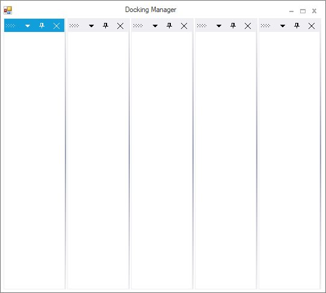
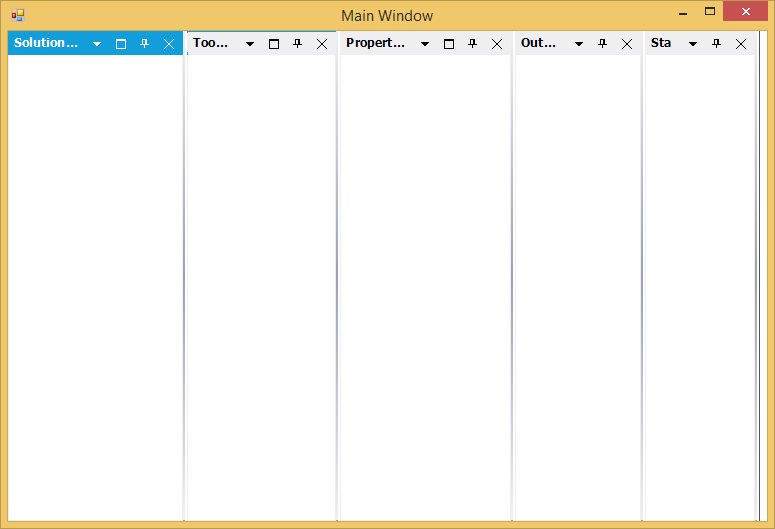
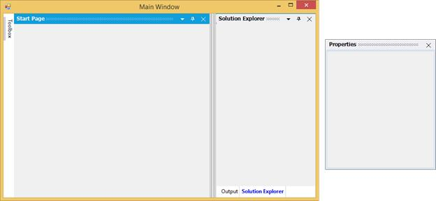

# Getting Started

This section explains how to implement a similar UI as Visual Studio by using the DockingManager.

## Add Docking Manager

There are several ways to add Syncfusion control in to the Visual Studio Windows Forms project. The following steps help to add a DockingManager control through Code.

1) Create a Windows Forms project in Visual Studio and refer to the following assemblies.

   * Syncfusion.Grid.Windows.dll
   * Syncfusion.Grid.Base.dll
   * Syncfusion.Shared.Base.dll
   * Syncfusion.Shared.Windows.dll
   * Syncfusion.Tools.Base.dll
   * Syncfusion.Tools.Windows.dll

2) Now add the DockingManager control with a required optimal name by using the included namespace.





// Create the DockingManager instance and add it the component list. 

private Syncfusion.Windows.Forms.Tools.DockingManager dockingManager; 

this.dockingManager = new Syncfusion.Windows.Forms.Tools.DockingManager(this.components); 

this.Controls.Add(this.dockingManager);





'Create the DockingManager instance and add it the component list. 

Private dockingManager As Syncfusion.Windows.Forms.Tools.DockingManager

Me.dockingManager = New Syncfusion.Windows.Forms.Tools.DockingManager(Me.components) 

Me.Controls.Add(Me.dockingManager)





## Add Controls to the Form

Docking can be enabled to any controls by using the property named `EnableDocking on dockingManager`. Here five Panels are added to the form and transformed into a docking window.





private System.Windows.Forms.Panel panel1;
		
private System.Windows.Forms.Panel panel2;

private System.Windows.Forms.Panel panel3;
		
private System.Windows.Forms.Panel panel4;
		
private System.Windows.Forms.Panel panel5;
		
this.panel1 = new System.Windows.Forms.Panel();
		
this.panel2 = new System.Windows.Forms.Panel();
		
this.panel3 = new System.Windows.Forms.Panel();
		
this.panel4 = new System.Windows.Forms.Panel();
		
this.panel5 = new System.Windows.Forms.Panel();





Private panel1 As System.Windows.Forms.Panel

Private panel2 As System.Windows.Forms.Panel

Private panel3 As System.Windows.Forms.Panel

Private panel4 As System.Windows.Forms.Panel

Private panel5 As System.Windows.Forms.Panel

Me.panel1 = New System.Windows.Forms.Panel()

Me.panel2 = New System.Windows.Forms.Panel()

Me.panel3 = New System.Windows.Forms.Panel()

Me.panel4 = New System.Windows.Forms.Panel()

Me.panel5 = New System.Windows.Forms.Panel()





## Set Label for Each Child Window

DockingManger provides with an attached method `SetDockLabel` which helps to set the label for a child window. 





// To set the label for the docked controls

this.dockingManager1.SetDockLabel(panel1, "Solution Explorer");

this.dockingManager1.SetDockLabel(panel2, "Toolbox");

this.dockingManager1.SetDockLabel(panel3, "Properties");

this.dockingManager1.SetDockLabel(panel4, "Output");

this.dockingManager1.SetDockLabel(panel5, "Start Page");





' To set the label for the docked controls

Me.dockingManager1.SetDockLabel(panel1, "Solution Explorer");

Me.dockingManager1.SetDockLabel(panel2, "Toolbox");

Me.dockingManager1.SetDockLabel(panel3, "Properties");

Me.dockingManager1.SetDockLabel(panel4, "Output");

Me.dockingManager1.SetDockLabel(panel5, "Start Page");





## Set States for Each Child Window

DockingManager provides an option to dock or float the controls.

To dock the child window use below code snippet.





//To dock the panel1 on left side of the form.

 this.dockingManager1.DockControl(this.panel1, this, Syncfusion.Windows.Forms.Tools.DockingStyle.Left, 100);





'To dock the panel1 on left side of the form.

Me.dockingManager1.DockControl(Me.panel1, Me, Syncfusion.Windows.Forms.Tools.DockingStyle.Left, 100)





To Float the control use below code snippet.





//To set properties window state as floating at the desired location.

Rectangle rcfrm = this.Bounds;

this.dockingManager.FloatControl(this.panel3, new Rectangle(rcfrm.Right+25,rcfrm.Bottom-150,175,200));





'To set properties window state as floating at the desired location.

Dim rcfrm As Rectangle = Me.Bounds 

Me.dockingManager.FloatControl(Me.listBox1, New Rectangle(rcfrm.Right+25,rcfrm.Bottom-150,175,200))





## Set DockingStyle for Children

DockingManager provides an attached method `DockControl` that helps to dock a window at the required side using `DockingStyle` argument.

Set the DockingStyle value as Right for “Solution Explorer” window to dock it on the right side.

The DockingStyle’s Tabbed option is used to tab a window on another window. The tabbing windows need to be aware of the parent control’s name. Set “Output” window’s parent as “SolutionExplorer” to tab it on the “SolutionExplorer” window.





// To set the DockingStyle for the docked controls

this.dockingManager1.DockControl(this.panel1, this, Syncfusion.Windows.Forms.Tools.DockingStyle.Right, 100);

this.dockingManager1.DockControl(this.panel2, this, Syncfusion.Windows.Forms.Tools.DockingStyle.Left, 100);

this.dockingManager.FloatControl(this.panel3, new Rectangle(rcfrm.Right+25,rcfrm.Bottom-150,175,200));

this.dockingManager1.DockControl(this.panel4, panel1, Syncfusion.Windows.Forms.Tools.DockingStyle.Tabbed, 100);

this.dockingManager1.DockControl(this.panel5, this, Syncfusion.Windows.Forms.Tools.DockingStyle.Left, 100);





'To set the DockingStyle for the docked controls

Me.dockingManager1.DockControl(Me.panel1, Me, Syncfusion.Windows.Forms.Tools.DockingStyle.Right, 100);

Me.dockingManager1.DockControl(Me.panel2, Me, Syncfusion.Windows.Forms.Tools.DockingStyle.Left, 100);

Me.dockingManager1.DockControl(Me.panel3, Me, Syncfusion.Windows.Forms.Tools.DockingStyle.Right, 100);

Me.dockingManager1.DockControl(Me.panel4, panel1, Syncfusion.Windows.Forms.Tools.DockingStyle.Tabbed, 100);

Me.dockingManager1.DockControl(Me.panel5, Me, Syncfusion.Windows.Forms.Tools.DockingStyle.Left, 100);





## Save / Load

The PersistState feature of the DockingManager helps to save the current layout of the DockingManager automatically, while closing the window. The dock state can also be saved by calling the `SaveDockState` method.





//Saves the current dock state to Isolated Storage.

this.dockingManager1.SaveDockState();

//Saves the current dock state information to the specified AppStateSerializer.

this.dockingManager1.SaveDockState(serializer);

//Saves the dock state information for the specified dockable control.

this.dockingManager1.SaveDockState(serializer, this.listBox1);





'Saves the current dock state to Isolated Storage.

Me.dockingManager1.SaveDockState()

'Saves the current dock state information to the specified AppStateSerializer.

Me.dockingManager1.SaveDockState(serializer)

'Saves the dock state information for the specified dockable control.

Me.dockingManager1.SaveDockState(serializer, this.listBox1)





The saved state can be reload by calling the `LoadDockState` method, whenever it is required to load the states.





//Reads the persisted dock state from the Isolated Storage.

this.dockingManager1.LoadDockState();

//Reads a previously serialized dock state using the AppStateSerializer object. 

this.dockingManager1.LoadDockState(serializer);

//Reads a previously serialized dock state for the specified dockable control and applies the new state.

this.dockingManager1.LoadDockState(serializer, this.listBox1);





'Reads the persisted dock state from the Isolated Storage.

Me.dockingManager1.LoadDockState(serializer)

'Reads a previously serialized dock state using the AppStateSerializer object. 

Me.dockingManager1.LoadDockState();

'Reads a previously serialized dock state for the specified dockable control and applies the new state.

Me.dockingManager1.LoadDockState(serializer, this.listBox1)




