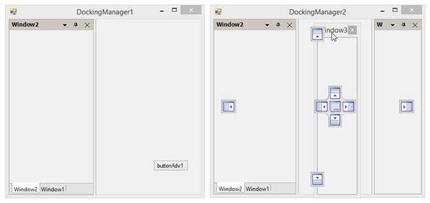
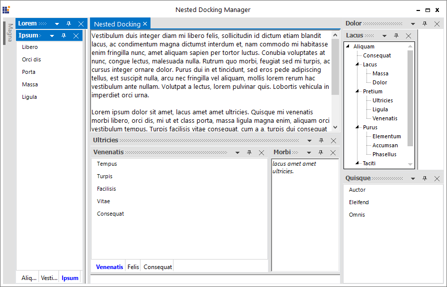

# Linked DockingManager

The dock panels from one DockingManager cannot be dragged and dropped to another DockingManager by default. But Linked Manager support allows to drag and drop the windows from one DockingManager to another by setting `TargetDockingManager` list.

## Enable linked manager

To add TargetManager list in the DockingManager, call [AddToTargetManagersList](https://help.syncfusion.com/cr/cref_files/windowsforms/Syncfusion.Tools.Windows~Syncfusion.Windows.Forms.Tools.DockingManager~AddToTargetManagersList.html) function of the DockingManager with the valid DockingManager instance as argument. When only one DockingManager has TargetManagerList, the window drop to TargetManager cannot drag back to Owner DockingManger. 

For example: `DockingManager1` and `DockingManager2` are the DockingManager instance and the DockingManager2 is added to TargetManagerList of DockingManager1, but the DockingManager2 is not aware of its TargetManager.

Here, the windows from DockingManager1 are only allowed to be dragged and dropped in DockingManager2,





Form2 ChildWindow = new Form2();

ChildWindow.Show();

//To add ChildForm's DockingManager to the MainForm's TargetManagerList. 

this.dockingManager1.AddToTargetManagersList(ChildWindow.dockingManager2);





'To set the docked controls, that transformed to child controls.

Dim childWindow As New Form2()

ChildWindow.Show()

'To add ChildForm's DockingManager to the MainForm's TargetManagerList. 

Me.dockingManager1.AddToTargetManagersList(ChildWindow.dockingManager1)





## Remove linked manager

To remove DockingManager from the TargetManagerList, call [RemoveFromTargetManagersList](https://help.syncfusion.com/cr/cref_files/windowsforms/Syncfusion.Tools.Windows~Syncfusion.Windows.Forms.Tools.DockingManager~RemoveFromTargetManagersList.html) of DockingManager with the valid DockingManager instance argument. For example, to remove the DockingManager1 from the TargetManagersList of DockingManager2, follow the below code snippets:





//To remove ChildForm's DockingManager to the MainForm's TargetManagerList. 

this.dockingManager1.RemoveFromTargetManagersList(ChildWindow.dockingManager2);





'To remove ChildForm's DockingManager to the MainForm's TargetManagerList. 

Me.dockingManager1.RemoveFromTargetManagersList(ChildWindow.dockingManager2);





## Dock child control between two DockingManager

Docking Manager supports to dock its child control into another Docking Manager. It can be achieved by using [AddToTargetManagersList](https://help.syncfusion.com/cr/cref_files/windowsforms/Syncfusion.Tools.Windows~Syncfusion.Windows.Forms.Tools.DockingManager~AddToTargetManagersList.html) and [RemoveFromTargetManagersList](https://help.syncfusion.com/cr/cref_files/windowsforms/Syncfusion.Tools.Windows~Syncfusion.Windows.Forms.Tools.DockingManager~RemoveFromTargetManagersList.html) functions.

**AddToTargetManagerList**

This function helps to interconnect two Docking Manager, so that its child controls can be docked between two Docking Manager.

**RemoveFromTargetManagersList**

This function helps to remove interconnection between two Docking Manager.





//To set the docked controls that transformed to child controls.

Form2 ChildWindow = new Form2();

ChildWindow.Show();

this.dockingManager1.AddToTargetManagersList(ChildWindow.dockingManager1);

ChildWindow.dockingManager1.AddToTargetManagersList(this.dockingManager1);
  
//To remove DockingManager from MainForm's TargetManagerList. 

ChildWindow.dockingManager1.RemoveFromTargetManagersList(this.dockingManager1);

this.dockingManager1.RemoveFromTargetManagersList(ChildWindow.dockingManager1);





'To set the docked controls, that transformed to child controls.

Dim childWindow As New Form2()

ChildWindow.Show()

Me.dockingManager1.AddToTargetManagersList(ChildWindow.dockingManager1)

ChildWindow.dockingManager1.AddToTargetManagersList(Me.dockingManager1)
  
'To remove DockingManager from MainForm's TargetManagerList. 

ChildWindow.dockingManager1.RemoveFromTargetManagersList(Me.dockingManager1)

Me.dockingManager1.RemoveFromTargetManagersList(ChildWindow.dockingManager1)





N> A sample that demonstrates LinkedManager behavior is available in the following sample installation path:
C:\Users\&lt;User&gt;\AppData\Local\Syncfusion\EssentialStudio\Version Number\Windows\Tools.Windows\Samples\Docking Manager\LinkedManager

## Nested DockingManager

DockingManager provides the NestedDockingManager support, which allows to add DockingManager as a child window to another DockingManager.

In Nested DockingManager, the whole DockingManager can be dragged and dropped inside the Parent DockingManager and DockWindows inside the DockingManager cannot be dragged and dropped on the owner DockingManager.

N> A sample that demonstrates Nested Docking behavior is available in the following sample installation path:
C:\Users\&lt;User&gt;\AppData\Local\Syncfusion\EssentialStudio\Version Number\Windows\Tools.Windows\Samples\Docking Manager\NestedDocking