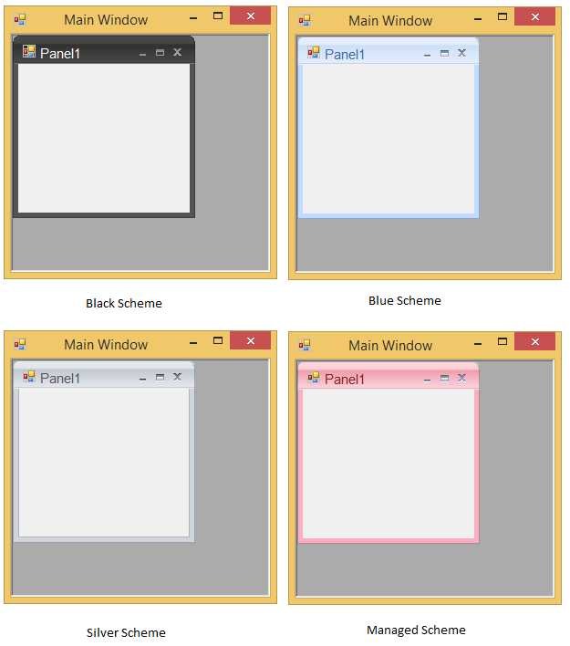

# MDI functionality

Docked control can be converted to an MDI child form and vice versa by referring the following steps and code example.

1. Add the required Syncfusion assembly references.
2. Declare and initialize the DockingManager and other controls.
3. Set the properties required and add the controls to the form. Set the IsMdIContainer property of the form to `true`.
4. Call the `SetAsMDIChild` method. This method sets the specified docked control as an MDI child.

   <table>
   <tr>
   <td>
   Methods</td><td>
   Description</td></tr>
   <tr>
   <td>
   SetAsMDIChild </td><td>
   Sets the control specified in Ctrl parameter as MDI child when bsetMDI is set to `true`. The parameter are, Ctrl - Indicates the docked control.bsetMDI - Represents a Boolean value indicating `true` or `false`.</td></tr>
   <tr>
   <td>
   SetAsMDIChild(Overloaded)</td><td>
   Sets the specified docked control as MDI child with the new size provided by using the Layout parameter.Ctrl - Indicates the docked control.bsetMDI - Represents a Boolean value indicating `true` or `false`. Layout - Stores a set of four integers that represents the location and size of a rectangle.</td></tr>
   </table>





private void button1_Click(object sender, System.EventArgs e)

{

      //Sets the panel1 as child form for the MDI form

      this.dockingManager1.SetAsMDIChild(this.panel1,true);

}

private void button2_Click(object sender, System.EventArgs e)

{

       //Sets the MDI child form to the normal Docking window.

	    this.dockingManager1.SetAsMDIChild(this.panel1,false);

}

//Overloaded

private void button1_Click(object sender, System.EventArgs e)

{

	    //Sets the panel1 as child form for the MDI form

	    this.dockingManager1.SetAsMDIChild(listBox1,true, new Rectangle(200,400,500,300));

}

private void button2_Click(object sender, System.EventArgs e)

{

       //Sets the MDI child form to the normal Docking window.

        this.dockingManager1.SetAsMDIChild(listBox1,true, new Rectangle(200,400,500,300));

}





Private Sub button1_Click(ByVal sender As Object, ByVal e As System.EventArgs) Handles button1.Click

'Sets the panel1 as child form for the MDI form

Me.dockingManager1.SetAsMDIChild(Me.panel1,True)

End Sub

Private Sub button2_Click(ByVal sender As Object, ByVal e As System.EventArgs) Handles button2.Click

'Sets the MDI child form to the normal Docking window.

Me.dockingManager1.SetAsMDIChild(Me.panel1,False)

End Sub

''Overloaded

Private Sub button1_Click(ByVal sender As Object, ByVal e As System.EventArgs) Handles button1.Click

'Sets the panel1 as child form for the MDI form

Me.dockingManager1.SetAsMDIChild(listBox1,True, New Rectangle(200,400,500,300))

End Sub

Private Sub button2_Click(ByVal sender As Object, ByVal e As System.EventArgs) Handles button2.Click

'Sets the MDI child form to the normal Docking window.

Me.dockingManager1.SetAsMDIChild(listBox1,True, New Rectangle(200,400,500,300))

End Sub



	 

5. Run the application, click the buttons and see the respective transitions.

  

N> You can set the docked control as an MDI Child in an easy method, by using the "MDI Child" option in the context menu.

N> A sample that demonstrates MDI child transition is available in the following sample installation path.
C:\Users\&lt;User&gt;\AppData\Local\Syncfusion\EssentialStudio\Version Number\Windows\Tools.Windows\Samples\Docking Manager\MDI\CS

### Office 2007 style for MDI child form

The MDI child forms can have Office2007 look and feel. It can be enabled through `Office2007MdiChildForm` property. Color schemes are also supported that can be specified by using `Office2007MdiColorScheme` property.





this.dockingManager1.Office2007MdiChildForm = true;

//Sets the Blue Color scheme.

this.dockingManager1.Office2007MdiColorScheme = Office2007Theme.Blue;





Me.dockingManager1.Office2007MdiChildForm = True

'Sets the Blue Color scheme.

Me.dockingManager1.Office2007MdiColorScheme = Office2007Theme.Blue





  

