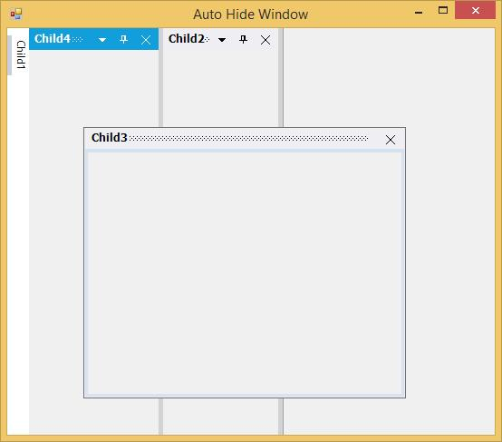
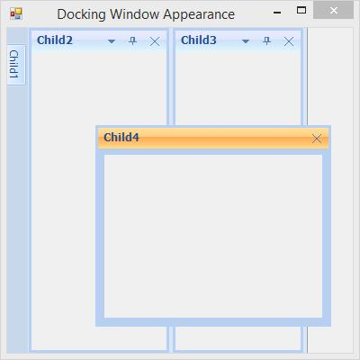
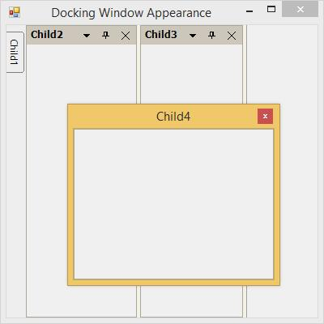
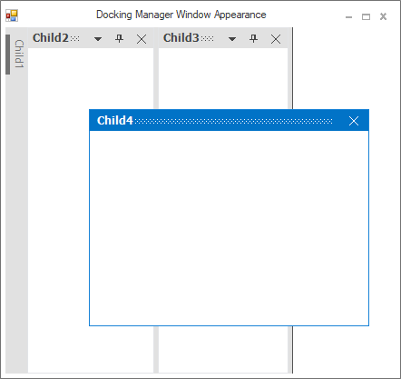

# Styling

The UI for Dock, Float, and AutoHide windows of DockingManager can be changed using different Style.

## Visual styles

VisualStyles provides rich and professional look and feel UI for the Dock windows. Some of the available VisualStyles are as follows:

* Default
* Metro
* Office2003
* Office2007
* Office2007Outlook
* Office2010
* OfficeXP
* VS2003
* VS2005
* Office2016Colorful
* Office2016White
* Office2016DarkGray
* Office2016Black

The visual style can be applied for the DockingManager using `VisualStyle` property.





//Set the visual Style of the docked controls

this.dockingManager.VisualStyle = Syncfusion.Windows.Forms.VisualStyle.Office2003;





'Set the visual Style of the docked controls

Me.dockingManager.VisualStyle = Syncfusion.Windows.Forms.VisualStyle.Office2003;
 




* Metro 

* Default 

* Office2003

* Office2007

* Office2007Outlook

* Office2010

* OfficeXP

* VS2005

* VS2010

**Office2016Colorful**

This option helps to set the Office2016Colorful style.





// Office2016Colorful

this.dockingManager.VisualStyle = Syncfusion.Windows.Forms.VisualStyle.Office2016Colorful;





'Office2016Colorful

Me.dockingManager.VisualStyle = Syncfusion.Windows.Forms.VisualStyle.Office2016Colorful





 

**Office2016White**

This option helps to set the Office2016White style.





// Office2016White

this.dockingManager.VisualStyle = Syncfusion.Windows.Forms.VisualStyle.Office2016White;





'Office2016White

Me.dockingManager.VisualStyle = Syncfusion.Windows.Forms.VisualStyle.Office2016White





 

**Office2016DarkGray**

This option helps to set the Office2016DarkGray style.





// Office2016DarkGray

this.dockingManager.VisualStyle = Syncfusion.Windows.Forms.VisualStyle.Office2016DarkGray;





'Office2016DarkGray

Me.dockingManager.VisualStyle = Syncfusion.Windows.Forms.VisualStyle.Office2016DarkGray





 

**Office2016Black**

This option helps to set the Office2016Black style.





// Office2016Black

this.dockingManager.VisualStyle = Syncfusion.Windows.Forms.VisualStyle.Office2016Black;





'Office2016Black

Me.dockingManager.VisualStyle = Syncfusion.Windows.Forms.VisualStyle.Office2016Black





 

## Office2007 color schemes

DockingManager supports all the three color schemes in Office2007 visual style. This can be controlled using `Office2007Theme` property.





this.dockingManager.Office2007Theme = Syncfusion.Windows.Forms.Office2007Theme.Silver;





Me.dockingManager.Office2007Theme = Syncfusion.Windows.Forms.Office2007Theme.Silver





 

## Custom color schemes

Custom colors can also be applied for Office2007 style, using the below code snippet.





dockingManager.Office2007Theme = Office2007Theme.Managed;

Office2007Colors.ApplyManagedColors(this, Color.Red);





dockingManager.Office2007Theme = Office2007Theme.Managed;

Office2007Colors.ApplyManagedColors(Me, Color.Red);





 
