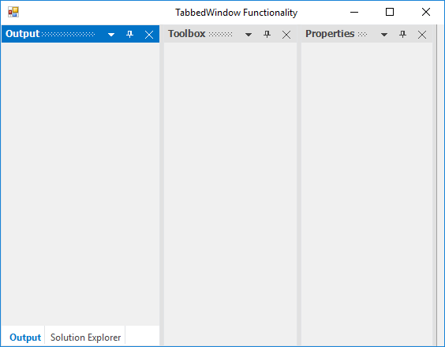
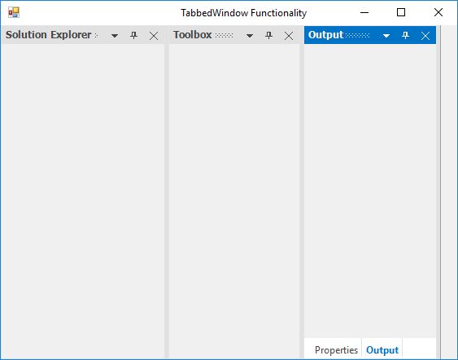
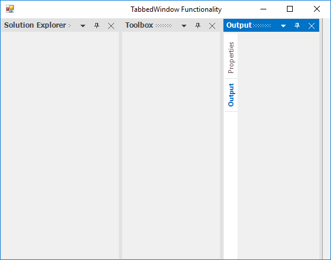
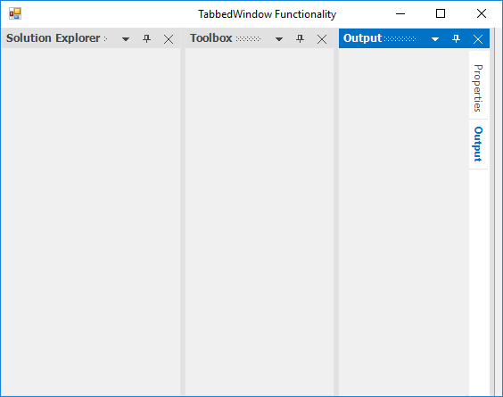
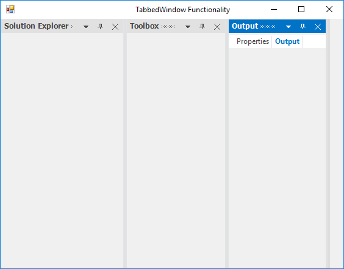
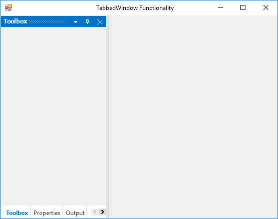

## Tabbed to another window programmatically

DockingManager provides an function [DockControl](https://help.syncfusion.com/cr/cref_files/windowsforms/tools/Syncfusion.Tools.Windows~Syncfusion.Windows.Forms.Tools.DockingManager~DockControl.html) that helps to dock a panel at the required side using [DockingStyle](https://help.syncfusion.com/cr/cref_files/windowsforms/tools/Syncfusion.Tools.Windows~Syncfusion.Windows.Forms.Tools.DockingStyle.html) argument.

DockingStyle’s Tabbed option is used to tab a panel with another panel. The tabbing windows need to be aware of the parent control’s name. Set `Output` window parent as `SolutionExplorer` to tab it on the `SolutionExplorer` window.





// To set the DockingStyle for the docked controls
            
this.dockingManager1.DockControl(this.panel4, panel1, Syncfusion.Windows.Forms.Tools.DockingStyle.Tabbed, 200);

this.dockingManager1.DockControl(this.panel3, panel1, Syncfusion.Windows.Forms.Tools.DockingStyle.Tabbed, 200);

this.dockingManager1.DockControl(this.panel2, panel1, Syncfusion.Windows.Forms.Tools.DockingStyle.Tabbed, 200);





'To set the DockingStyle for the docked controls

Me.dockingManager1.DockControl(Me.panel4, panel1, Syncfusion.Windows.Forms.Tools.DockingStyle.Tabbed, 200)

Me.dockingManager1.DockControl(Me.panel3, panel1, Syncfusion.Windows.Forms.Tools.DockingStyle.Tabbed, 200)

Me.dockingManager1.DockControl(Me.panel2, panel1, Syncfusion.Windows.Forms.Tools.DockingStyle.Tabbed, 200)





## Tabbed to another window by user interaction

Child window can be arranged as Tabbed windows by using either of the following ways.

* At Design Time
* At Run Time

### Tabbed at run time

DockingManager helps you in dragging and dropping the docked controls at run time, using different DragProviderStyle. This style displays a prediction Bands, which lets you decide whether you can drop the control in that location.

### Tabbed at design time

The docked controls can be tabbed in the designer, by just dragging and dropping into one another. DockingManager helps you in doing this using different `DragProviderStyle`.

## Tab alignments

The tabs of the Docked window are placed at the bottom, by default. To place the tabs of the docked window at different sides set the property [DockTabAlignment](https://help.syncfusion.com/cr/cref_files/windowsforms/tools/Syncfusion.Tools.Windows~Syncfusion.Windows.Forms.Tools.DockingManager~DockTabAlignment.html) with desired values such as Top, Bottom, Left and Right.





//To set the Tab alignment as Right.

this.dockingManager1.DockTabAlignment = Syncfusion.Windows.Forms.Tools.DockTabAlignmentStyle.Right;





'To set the Tab alignment as Right.

Me.dockingManager1.DockTabAlignment = Syncfusion.Windows.Forms.Tools.DockTabAlignmentStyle.Right;
 




* Setting DockTabAlignment as Bottom.

* Setting DockTabAlignment as Left.

* Setting DockTabAlignment as Right.

* Setting DockTabAlignment as Top.

## Prevent tabbing

User can restrict the specific [DockAbility](https://help.syncfusion.com/cr/cref_files/windowsforms/tools/Syncfusion.Tools.Windows~Syncfusion.Windows.Forms.Tools.DockAbility.html) of child window when it moved to the client area in DockingManager. It can be achieved by [SetDockAbility](https://help.syncfusion.com/cr/cref_files/windowsforms/tools/Syncfusion.Tools.Windows~Syncfusion.Windows.Forms.Tools.DockingManager~SetDockAbility.html) function. Here we have restricted the tabbed, left, right, bottom ability.  





this.dockingManager1.SetDockAbility(panel1, "Top");





this.dockingManager1.SetDockAbility(panel1, "Top");





## Tab reordering

DockingManager allows to reorder the tab by select and drag to the desired index in `DockTabControl`. Tabs re-ordering behavior can be enabled or disabled by [AllowTabsMoving](https://help.syncfusion.com/cr/cref_files/windowsforms/tools/Syncfusion.Tools.Windows~Syncfusion.Windows.Forms.Tools.DockingManager~AllowTabsMoving.html) property of DockingManager. 





// Prevent the tabbed controls from moving

this.dockingManager1.AllowTabsMoving = true;





'Prevent the tabbed controls from moving

Me.dockingManager1.AllowTabsMoving = True





### Restrict reorder tabs

To prevent the tab re-order within the tab group, set [AllowTabsMoving](https://help.syncfusion.com/cr/cref_files/windowsforms/tools/Syncfusion.Tools.Windows~Syncfusion.Windows.Forms.Tools.DockingManager~AllowTabsMoving.html) value as `false`. 

## Show / hide scroll buttons in tab panel

When the Dock Tabs overflow onto the tab panel, ScrollButton is added to the tab panel. This scroll button can be enabled or disabled by using the [ShowDockTabScrollButton](https://help.syncfusion.com/cr/cref_files/windowsforms/tools/Syncfusion.Tools.Windows~Syncfusion.Windows.Forms.Tools.DockingManager~ShowDockTabScrollButton.html) property.





//Enable scroll button on dock tab panel.

this.dockingManager1.ShowDockTabScrollButton = true;





'Enable scroll button on dock tab panel.

Me.dockingManager1.ShowDockTabScrollButton = true





## Change tab index by programmatically

By using [SetTabPosition](https://help.syncfusion.com/cr/cref_files/windowsforms/tools/Syncfusion.Tools.Windows~Syncfusion.Windows.Forms.Tools.DockingManager~SetTabPosition.html) function of DockingManager, we can set tab position for a control which is passed as its argument.





//Set the tab position for particular control.

this.dockingManager1.SetTabPosition(panel1, 2);





'Set the tab position for particular control.

Me.dockingManager1.SetTabPosition(Panel1, 2)





### Tab index

By using [GetTabPosition](https://help.syncfusion.com/cr/cref_files/windowsforms/tools/Syncfusion.Tools.Windows~Syncfusion.Windows.Forms.Tools.DockingManager~GetTabPosition.html) function of DockingManager, we can get tab position for a control which is passed as its argument.





/Getting the tab position

this.dockingManager1.GetTabPosition(panel1);





'Getting the tab position

Me.dockingManager1.GetTabPosition(panel1)





## Identify the tabbed state for control

The DockingManager [IsTabbed](https://help.syncfusion.com/cr/cref_files/windowsforms/tools/Syncfusion.Tools.Windows~Syncfusion.Windows.Forms.Tools.DockingManager~IsTabbed.html) function which returns `true` if the control is in tabbed state and `false` if the control is in other states.





this.dockingManager1.IsTabbed(this.panel1);





Me.DockingManager1.IsTabbed(this.panel1)





## Check two controls in same tab group

The DockingManager [IsSameTabbedGroup](https://help.syncfusion.com/cr/cref_files/windowsforms/tools/Syncfusion.Tools.Windows~Syncfusion.Windows.Forms.Tools.DockingManager~IsSameTabbedGroup.html) function which is used to determine whether two tabbed controls are belongs to the same tab group or not.





this.dockingManager1.IsSameTabbedGroup(this.panel1, this.panel2);





Me.DockingManager1.IsSameTabbedGroup(this.panel1, this.panel2)




