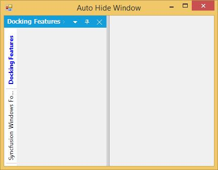

# Tabbed window

Child window can be arranged as Tabbed windows by using either of the following ways.

* At Design Time.
* At Run Time.

## At design time

The docked controls can be tabbed in the designer, by just dragging and dropping into one another. DockingManager helps you in doing this using different `DragProviderStyle`.

## At run time

DockingManager helps you in dragging and dropping the docked controls at run time, using different DragProviderStyle. This styles display a prediction Bands, which lets you decide whether you can drop the control in that location.

## Tab alignments

The tabs of the Docked window are placed at the bottom, by default. To place the tabs of the docked window at different sides set the property `DockTabAlignment` with desired values such as Top, Bottom, Left, and Right.





//To set the Tab alignment as Right.

this.dockingManager.DockTabAlignment = Syncfusion.Windows.Forms.Tools.DockTabAlignmentStyle.Right;





'To set the Tab alignment as Right.

Me.dockingManager.DockTabAlignment = Syncfusion.Windows.Forms.Tools.DockTabAlignmentStyle.Right;
 




* Setting DockTabAlignment as Bottom.

* Setting DockTabAlignment as Left.

* Setting DockTabAlignment as Right.

* Setting DockTabAlignment as Top.

