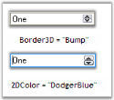

# Appearance Settings in WinForms DomainUpDownExt

This section discusses the border styles and back color that can be applied to the WinForms DomainUpDownExt control.

The following table lists the appearance properties of the WinForms DomainUpDownExt control.

* [BorderStyle](https://help.syncfusion.com/cr/windowsforms/Syncfusion.Windows.Forms.Tools.DomainUpDownExt.html#Syncfusion_Windows_Forms_Tools_DomainUpDownExt_BorderStyle)
* [Border3DStyle](https://help.syncfusion.com/cr/windowsforms/Syncfusion.Windows.Forms.Tools.DomainUpDownExt.html#Syncfusion_Windows_Forms_Tools_DomainUpDownExt_Border3DStyle)
* [BorderSides](https://help.syncfusion.com/cr/windowsforms/Syncfusion.Windows.Forms.Tools.DomainUpDownExt.html#Syncfusion_Windows_Forms_Tools_DomainUpDownExt_BorderSides)
* [BorderColor](https://help.syncfusion.com/cr/windowsforms/Syncfusion.Windows.Forms.Tools.DomainUpDownExt.html#Syncfusion_Windows_Forms_Tools_DomainUpDownExt_BorderColor)
* [ThemedBorder](https://help.syncfusion.com/cr/windowsforms/Syncfusion.Windows.Forms.Tools.DomainUpDownExt.html#Syncfusion_Windows_Forms_Tools_DomainUpDownExt_ThemesEnabled)
* [BackColor](https://help.syncfusion.com/cr/windowsforms/Syncfusion.Windows.Forms.Tools.DomainUpDownExt.html#Syncfusion_Windows_Forms_Tools_DomainUpDownExt_BackColor)




this.domainUpDownExt1.BorderStyle = System.Windows.Forms.BorderStyle.FixedSingle;
this.domainUpDownExt1.Border3DStyle = System.Windows.Forms.Border3DStyle.Bump;
this.domainUpDownExt1.BorderSides = System.Windows.Forms.Border3DSide.Right;
this.domainUpDownExt1.BorderColor = System.Drawing.Color.DodgerBlue;
this.domainUpDownExt1.BackColor = System.Drawing.Color.AntiqueWhite;





Me.domainUpDownExt1.BorderStyle = System.Windows.Forms.BorderStyle.FixedSingle
Me.domainUpDownExt1.Border3DStyle = System.Windows.Forms.Border3DStyle.Bump
Me.domainUpDownExt1.BorderSides = System.Windows.Forms.Border3DSide.Right
Me.domainUpDownExt1.BorderColor = System.Drawing.Color.DodgerBlue
Me.domainUpDownExt1.BackColor = System.Drawing.Color.AntiqueWhite




 
