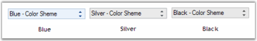
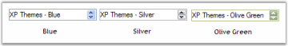
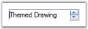
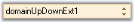

# Visual Styles in WinForms DomainUpDownExt

WinForms DomainUpDownExt supports the Office2007 visual style with all three color schemes.




//sets the Office2007 Visual Style.
this.domainUpDownExt1.VisualStyle = Syncfusion.Windows.Forms.VisualStyle.Office2007;

//To set Blue Color scheme.
this.domainUpDownExt1.ColorScheme = Syncfusion.Windows.Forms.Office2007Theme.Blue;

//To set Silver Color scheme.
this.domainUpDownExt1.ColorScheme = Syncfusion.Windows.Forms.Office2007Theme.Silver;

//To set Black Color scheme.
this.domainUpDownExt1.ColorScheme = Syncfusion.Windows.Forms.Office2007Theme.Black;





'Sets the Office2007 Visual Style.
Me.domainUpDownExt1.VisualStyle = Syncfusion.Windows.Forms.VisualStyle.Office2007

'To set Blue Color scheme.
Me.domainUpDownExt1.ColorScheme = Syncfusion.Windows.Forms.Office2007Theme.Blue

'To set Silver Color scheme.
Me.domainUpDownExt1.ColorScheme = Syncfusion.Windows.Forms.Office2007Theme.Silver

'To set Black Color scheme.
Me.domainUpDownExt1.ColorScheme = Syncfusion.Windows.Forms.Office2007Theme.Black




It also provides support for the XP themes look and feel.




// Enable themes.
this.domainUpDownExt1.ThemesEnabled = true;





' Enable themes.
Me.domainUpDownExt1.ThemesEnabled = True




## Office2016 Themes

WinForms DomainUpDownExt supports Office2016 visual styles such as Office2016Colorful, Office2016White, Office2016Black, and Office2016DarkGray.

// Sample code for setting the "Office2016 Colorful" visual style for the WinForms DomainUpDownExt




this.domainUpDownExt1.VisualStyle = Syncfusion.Windows.Forms.VisualStyle.Office2016Colorful;





Me.domainUpDownExt1.VisualStyle = Syncfusion.Windows.Forms.VisualStyle.Office2016Colorful




## Custom Colors

You can also apply custom colors to the WinForms DomainUpDownExt control by setting `ColorScheme` to "Managed" and specifying the custom color through the [ApplyManagedColors](https://help.syncfusion.com/cr/windowsforms/Syncfusion.Windows.Forms.Office2007Colors.html#Syncfusion_Windows_Forms_Office2007Colors_ApplyManagedColors_System_Windows_Forms_Form_System_Drawing_Color_) method as follows.




this.domainUpDownExt1.ColorScheme = Syncfusion.Windows.Forms.Office2007Theme.Managed;
Office2007Colors.ApplyManagedColors(this, Color.Orange);





Me.domainUpDownExt1.ColorScheme = Syncfusion.Windows.Forms.Office2007Theme.Managed
Office2007Colors.ApplyManagedColors(Me, Color.Orange)




