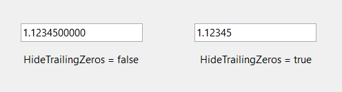

# Number Settings in Windows Forms Double TextBox

The below table lists the properties which illustrates the number settings for the DoubleTextBox.

* [DoubleValue](https://help.syncfusion.com/cr/windowsforms/Syncfusion.Windows.Forms.Tools.DoubleTextBox.html#Syncfusion_Windows_Forms_Tools_DoubleTextBox_DoubleValue)
* [NumberDecimalDigits](https://help.syncfusion.com/cr/windowsforms/Syncfusion.Windows.Forms.Tools.NumericTextBox.html#Syncfusion_Windows_Forms_Tools_NumericTextBox_NumberDecimalDigits)
* [NumberDecimalSeparator](https://help.syncfusion.com/cr/windowsforms/Syncfusion.Windows.Forms.Tools.NumericTextBox.html#Syncfusion_Windows_Forms_Tools_NumericTextBox_NumberDecimalSeparator)
* [NumberGroupSeparator](https://help.syncfusion.com/cr/windowsforms/Syncfusion.Windows.Forms.Tools.NumericTextBox.html#Syncfusion_Windows_Forms_Tools_NumericTextBox_NumberGroupSeparator)
* [NumberGroupSizes](https://help.syncfusion.com/cr/windowsforms/Syncfusion.Windows.Forms.Tools.NumericTextBox.html#Syncfusion_Windows_Forms_Tools_NumericTextBox_NumberGroupSizes)
* [NumberNegativePattern](https://help.syncfusion.com/cr/windowsforms/Syncfusion.Windows.Forms.Tools.NumericTextBox.html#Syncfusion_Windows_Forms_Tools_NumericTextBox_NumberNegativePattern)


  
this.doubleTextBox1.NumberDecimalDigits = 3;
this.doubleTextBox1.NumberDecimalSeparator = "-";
this.doubleTextBox1.NumberGroupSeparator = ";";
this.doubleTextBox1.NumberGroupSizes = new int[] {4};
this.doubleTextBox1.NumberNegativePattern = 2;

 
Me.doubleTextBox1.AllowNull = True
Me.doubleTextBox1.NullString = ""
Me.doubleTextBox1.Text = ""
Me.doubleTextBox1.NumberDecimalDigits = 3
Me.doubleTextBox1.NumberDecimalSeparator = "-"
Me.doubleTextBox1.NumberGroupSeparator = ";"
Me.doubleTextBox1.CurrencyGroupSizes = New Integer() {3}
Me.doubleTextBox1.NumberNegativePattern = 2
 


## DoubleTextBox Value

The maximum and minimum value of the editable field in DoubleTextBox control can be specified using the below properties.

* [MaxValue](https://help.syncfusion.com/cr/windowsforms/Syncfusion.Windows.Forms.Tools.DoubleTextBox.html#Syncfusion_Windows_Forms_Tools_DoubleTextBox_MaxValue)
* [MinValue](https://help.syncfusion.com/cr/windowsforms/Syncfusion.Windows.Forms.Tools.DoubleTextBox.html#Syncfusion_Windows_Forms_Tools_DoubleTextBox_MinValue)


  
this.doubleTextBox1.MaxValue = 25;
this.doubleTextBox1.MinValue = 4;

 
Me.doubleTextBox1.MaxValue = 25
Me.doubleTextBox1.MinValue = 4



## Banner Text Support

We can set banner text for the DoubleTextBox control. Refer [BannerTextProvider Component](/windowsforms/integertextbox/bannertextsupport) topic for more details.

We need to do the below settings to make Banner text feature available for the control.


  
this.doubleTextBox1.AllowNull = true;
this.doubleTextBox1.NullString = "";
this.doubleTextBox1.Text = "";

 
Me.doubleTextBox1.AllowNull = True
Me.doubleTextBox1.NullString = ""
Me.doubleTextBox1.Text = ""



## Culture Setting

Users can set the culture of the double text box control using the [Culture](https://help.syncfusion.com/cr/windowsforms/Syncfusion.Windows.Forms.Tools.NumberTextBoxBase.html#Syncfusion_Windows_Forms_Tools_NumberTextBoxBase_Culture), [CurrentCultureRefresh](https://help.syncfusion.com/cr/windowsforms/Syncfusion.Windows.Forms.Tools.NumberTextBoxBase.html#Syncfusion_Windows_Forms_Tools_NumberTextBoxBase_CurrentCultureRefresh), [SpecialCultureValue](https://help.syncfusion.com/cr/windowsforms/Syncfusion.Windows.Forms.Tools.NumberTextBoxBase.html#Syncfusion_Windows_Forms_Tools_NumberTextBoxBase_SpecialCultureValue), and [UseUserOverride](https://help.syncfusion.com/cr/windowsforms/Syncfusion.Windows.Forms.Tools.NumberTextBoxBase.html#Syncfusion_Windows_Forms_Tools_NumberTextBoxBase_UseUserOverride) properties.


  
this.doubleTextBox1.Culture = new System.Globalization.CultureInfo("ar-SA");
this.doubleTextBox1.CurrentCultureRefresh = true;
this. doubleTextBox1.SpecialCultureValue = Syncfusion.Windows.Forms.Tools.SpecialCultureValues.None;
this.doubleTextBox1.UseUserOverride = true;

 
Me.doubleTextBox1.Culture = New System.Globalization.CultureInfo("ar-SA")
Me.doubleTextBox1.CurrentCultureRefresh = True
Me.doubleTextBox1.SpecialCultureValue = Syncfusion.Windows.Forms.Tools.SpecialCultureValues.None
Me.doubleTextBox1.UseUserOverride = True



## Hiding the trail zeros

The HideTrailingZeros property allows control over the display of trailing zeros in decimal values. When set to true, the DoubleTextBox displays only the significant digits of the value, hiding any trailing zeros.


  
// Hides the trailing zeros.
this.doubleTextBox1.HideTrailingZeros = true;

 
' Hides the trailing zeros.
Me.doubleTextBox1.HideTrailingZeros = True



