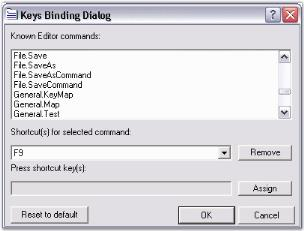
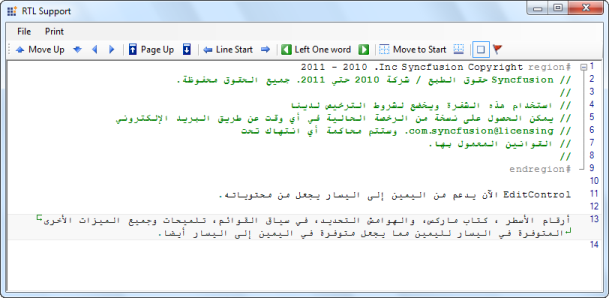

# Editing Features

Essential Edit comes with advanced editing features. Some of the important features discussed in this section are given below.

## Undo / Redo Actions

Action Grouping allows you to specify a set of actions as groups for Undo / Redo purposes. When an action group is created, and a set of actions is added to it, the entire set is considered as one entity. This implies that the set of actions can be performed or undone using the Redo or Undo method call. You can use the UndoGroupOpen, UndoGroupClose and UndoGroupCancel methods to programmatically manipulate the undo / redo action grouping.

Grouping Actions

To undo/redo an action group, do the following steps:

1. Invoke the UndoGroupOpen method to begin a new action group.

2. Perform any desired set of actions, and invoke the UndoGroupClose method to close the action group. All the actions performed between the UndoGroupOpen() and UndoGroupClose() method calls get grouped as one entity.

3. Now, when the Undo / Redo methods are invoked, the newly created group (or set of actions) gets undone / redone appropriately.

4. To cancel an already open action group, you have to invoke the UndoGroupCancel method.

5. The CanUndo property gets a flag that determines whether the undo operation can be performed in the Edit Control.

6. The CanRedo property gets a flag that determines whether the redo operation can be performed in the Edit Control.

Unlimited Undo and Redo

Essential Edit supports multiple levels of undo / redo, whereas the default Edit Control in Windows Forms supports just one level of undo / redo. This makes Essential Edit a better choice for all your editing needs. The ability to undo and redo changes in Essential Edit improves the usability of any application that has any form of text editing.

Essential Edit allows the following methods to be invoked any number of times.

<table>
<tr>
<td>
Edit Control Method</td><td>
Description</td></tr>
<tr>
<td>
Undo</td><td>
Performs an undo operation. (CTRL+Z)</td></tr>
<tr>
<td>
Redo</td><td>
Performs a redo operation. (CTRL+Y)</td></tr>
<tr>
<td>
CanUndo</td><td>
Indicates whether it is possible to undo the actions in the Edit Control.</td></tr>
<tr>
<td>
CanRedo</td><td>
Indicates whether it is possible to redo the actions in the Edit Control.</td></tr>
<tr>
<td>
ResetUndoInfo</td><td>
Clear the undo buffer. Hence undo operation is not allowed on contents/actions previously added/performed up to that point.</td></tr>
</table>

> {  | markdownify }
{:.image }
_Note: The undo/redo buffer is cleared after the 'Save' operation._

Enabling Grouping

Grouping is enabled using the below given property.

<table>
<tr>
<td>
Edit Control Property</td><td>
Description</td></tr>
<tr>
<td>
GroupUndo</td><td>
Specifies whether grouping should be enabled for undo/redo actions.</td></tr>
</table>

[C#]

// Accomplish Undo operation.

this.editControl1.Undo();

// Accomplish Redo operation. 

this.editControl1.Redo();

// Indicates whether it is possible to Undo in the Edit Control. 

bool canUndo = this.editControl1.CanUndo;

// Indicates whether it is possible to Redo in the Edit Control. 

bool canRedo = this.editControl1.CanRedo;

// Clears the Undo buffer. 

this.editControl1.ResetUndoInfo();

// Enable grouping for Undo / Redo actions.

this.editControl1.GroupUndo = true;

[VB.NET]

' Accomplish Undo operation.

Me.editControl1.Undo()

' Accomplish Redo operation.

Me.editControl1.Redo()

' Indicates whether it is possible to Undo in the Edit Control.

Dim canUndo as bool = Me.editControl1.CanUndo

' Indicates whether it is possible to Redo in the Edit Control.

Dim canRedo as bool = Me.editControl1.CanRedo

' Clears the Undo buffer.

Me.editControl1.ResetUndoInfo()

' Enable grouping for Undo / Redo actions.

Me.editControl1.GroupUndo = True

The following screenshot shows action grouping in Edit Control. 

{  | markdownify }
{:.image }

_Figure_ _9__: Grouping Actions in Edit Control_

A sample which demonstrates Action Grouping is available in the following sample installation location.

_..\ My Documents\Syncfusion\EssentialStudio\Version Number\Windows\Edit.Windows\Samples\Advanced Editor Functions\ActionGroupingDemo_

## New Line Styles

Edit Control allows you to specify a new line style, or get the currently used new line style in the text.

SetNewLineStyle method sets the current new line style in the Edit Control. SetNewLineStyle method accepts values from the NewLineStyle enumerator which has values like Windows, Mac, Unix and Control, which correspond to new line styles "\r\n", "\r", "\n\r" and "\n\r" respectively.

Similarly, the GetNewLineStyle method returns a NewLineStyle enumerator value which indicates the currently used new line stye in the Edit Control.

> {  | markdownify }
{:.image }
_Note: The default new line style value is set to 'Control'. This value can be changed according to the needs of the user using the DefaultNewLineStyle property._

[C#]

// Change the current new line style in the Edit Control.

this.editControl1.SetNewLineStyle(Syncfusion.IO.NewLineStyle.Control);

this.editControl1.GetNewLineStyle();

// Specify the default new line style.

this.editControl1.DefaultNewLineStyle = Syncfusion.IO.NewLineStyle.Windows;

[VB.NET]

' Change the current new line style in the Edit Control.

Me.editControl1.SetNewLineStyle(Syncfusion.IO.NewLineStyle.Control)

Me.editControl1.GetNewLineStyle()

' Specify the default new line style.

Me.editControl1.DefaultNewLineStyle = Syncfusion.IO.NewLineStyle.Windows

## Clipboard Operations

Edit Control uses the clipboard to cut, copy or paste the text data. It stores the data in the clipboard for cut and copy operations and retrieves data from the clipboard for paste operations. The following APIs in the Edit Control facilitates these clipboard operations.

<table>
<tr>
<td>
Edit Control Method</td><td>
Description</td></tr>
<tr>
<td>
Copy</td><td>
Copies the selected text contents into the clipboard.</td></tr>
<tr>
<td>
Cut</td><td>
Cuts the selected text contents from Edit Control and places it into the clipboard.</td></tr>
<tr>
<td>
Paste</td><td>
Retrieves copied contents from the clipboard and pastes it into Edit Control.</td></tr>
<tr>
<td>
CanCopy</td><td>
Indicates whether it is possible to perform copy operations in Edit Control.</td></tr>
<tr>
<td>
CanCut</td><td>
Indicates whether it is possible to perform cut operations in Edit Control.</td></tr>
<tr>
<td>
CanPaste</td><td>
Indicates whether it is possible to perform copy, cut and paste operations in Edit Control.</td></tr>
<tr>
<td>
ClearClipboard</td><td>
Clears all contents in the clipboard associated with Essential Edit. This is generally used immediately after the application loads, to clear any junk from previous clipboard operations.</td></tr>
</table>

[C#]

// Copies the selected text into the clipboard.

this.editControl1.Copy();

// Cuts the selected text contents from Edit Control and places it into the clipboard.

this.editControl1.Cut();

// Retrieves copied contents from the clipboard and pastes it into Edit Control.

this.editControl1.Paste();

// Indicates whether it is possible to perform copy operation in Edit Control.

bool canCopy = this.editControl1.CanCopy;

// Indicates whether it is possible to perform cut operation in Edit Control.

bool canCut = this.editControl1.CanCut;

// Indicates whether it is possible to perform paste operation in Edit Control.

bool canPaste = this.editControl1.CanPaste;

// Clears all contents in the clipboard associated with Essential Edit.

this.editControl1.ClearClipboard();

[VB.NET]

' Copies the selected text into the clipboard.

Me.editControl1.Copy()

' Cuts the selected text contents from Edit Control and places it into the clipboard. 

Me.editControl1.Cut()

' Retrieves copied contents from the clipboard and pastes it into Edit Control.

Me.editControl1.Paste()

' Indicates whether it is possible to perform copy operation in Edit Control.

Dim canCopy as bool = Me.editControl1.CanCopy

' Indicates whether it is possible to perform cut operation in Edit Control.

Dim canCut as bool = Me.editControl1.CanCut

' Indicates whether it is possible to perform paste operation in Edit Control.

Dim canPaste as bool = Me.editControl1.CanPaste

' Clears all contents in the clipboard associated with Essential Edit.

Me.editControl1.ClearClipboard()

### EnableMD5

The EditControl is mainly based on the MD5 algorithm. By default, EnableMD5 property is enabled in EditControl. 

FIPS

The system’s cryptography is based on the FIPS compliant algorithms for encryption, hashing and security.

When FIPS is enabled, the Clipboard Operations of EditControl are affected as EditControl uses the MD5 algorithm. To avoid this, before enabling FIPS, you must disable the EditControl’s MD5 algorithm by setting the EnableMD5 property to _false_.

<table>
<tr>
<td>
Property</td><td>
Description</td></tr>
<tr>
<td>
EnableMD5</td><td>
Specifies whether to enable or disable MD5 algorithm.</td></tr>
</table>

[C#]

this.editControl1.EnableMD5 = true;

[VB.NET]

Me.editControl1.EnableMD5 = True

> {  | markdownify }
{:.image }
_Note:_ 

To enable FIPS:

1. Click Start, click Control Panel, and the click on Administrative Tools.
2. Double-click Local Security Policy.
3. Double-click Local Policies.
4. Click Security Options. Under Policies listed in the right pane, double-click System cryptography: Use FIPS compliant algorithms for encryption, hashing, and signing.
5. Select Enabled to enable FIPS on your machine.

## Keystroke - Action Combinations Binding

Edit Control offers support for the action-keystroke binding functionality, providing you the ability to perform advanced customization of action-keystroke bindings to suit your preferences. You can bind any desired keystroke combination to a standard (or custom) command like Copy, Cut, Paste or Find in the designer using the Keys Binding dialog as illustrated in the following procedure:

1. In the Editor Keys Binding dialog box, select the desired standard command. The default shortcuts assigned for a particular command are listed in the combobox under the Shortcut(s) for selected command: label.
2. Set the focus to the Edit Box Press TAB to navigate to the shortcuts drop-down list.
3. Press the desired key or key combination.
4. Now, click the Assign button, to assign this keystroke combination as the shortcut for that particular standard command. Click OK.

The KeyBinder property is used to get the key binder, and the KeyBindingProcessor property is used to get / set the key binding processor.

The Editor Keys Binding dialog is invoked using the ShowKeysBindingEditor method of the Edit Control.

The following illustration shows the Keys Binding dialog box.

{  | markdownify }
{:.image }

_Figure_ _10__: Preview of Keys Binding Dialog Box_

You can also make use the RegisteringKeyCommands and RegisteringDefaultKeyBindings events to specify user-defined commands and bind the desired custom keystroke combinations to them.

This following code example registers the "File.Open" command and binds a Ctrl+O keystroke combination to it.

[C#]

// Invoke the Editor Keys Binding dialog.

this.editControl1.ShowKeysBindingEditor();

// Bind the action name to the action using the RegisteringKeyCommands and ProcessCommandEventHandler events.

private void this.editControl1_RegisteringKeyCommands(object sender, EventArgs e)

{

this.editControl1.Commands.Add( "File.Open" ).ProcessCommand += new ProcessCommandEventHandler( Command_Open );

}

// Bind key combinations to the action name using the RegisteringDefaultKeyBindings event.

private void this.editControl1_RegisteringDefaultKeyBindings(object sender, EventArgs e)

{

this.editControl1.KeyBinder.BindToCommand( Keys.Control | Keys.O, "File.Open" );

}

// Define the action that needs to be performed.

private void Command_Open()

{

/* Do the desired task. */

}

[VB.NET]

' Invoke the Editor Keys Binding dialog.

Me.editControl1.ShowKeysBindingEditor()

' Bind the action name to the action using the RegisteringKeyCommands and ProcessCommandEventHandler events.

Private  Sub Me.editControl1_RegisteringKeyCommands(ByVal sender As Object, ByVal e As EventArgs)

Me.editControl1.Commands.Add("File.Open").ProcessCommand += New ProcessCommandEventHandler(Command_Open)

End Sub

' Bind key combinations to the action name using the RegisteringDefaultKeyBindings event. 

Private  Sub Me.editControl1_RegisteringDefaultKeyBindings(ByVal sender As Object, ByVal e As EventArgs)

Me.editControl1.KeyBinder.BindToCommand(Keys.Control | Keys.O, "File.Open")

End Sub

' Define the action that needs to be performed.

Private Sub Command_Open()

' Do the desired task.

End Sub

A sample which demonstrates Keys Binding is available in the following sample installation path.

_..\ My Documents\Syncfusion\EssentialStudio\Version Number\Windows\Edit.Windows\Samples\Advanced Editor Functions\ActionGroupingDemo_

## Regular Expressions

Non-Deterministic Finite Automation (NFA) regular expressions are a powerful way of parsing text and are used in a wide range of products like the Microsoft .NET platform, Perl, Python, Grep (Global Regular Expression Print), VI Editor, Tcl, Awk, and various shells. Regular expressions figure into all kinds of text-manipulation tasks like searching, search-replace and can also be used to test for certain conditions in a text file or data stream. 

Edit Control implements a customized regular expression engine which is capable of parsing extremely complicated languages including embedded scripts. The search and search-replace functionalities also use the regular expressions internally. 

Language Elements

Edit Control offers complete support to a variety of common constructs for regular expression patterns. Refer to the Language Elements topic for more information on the regular expression pattern syntax.

Lexical Macros

Lexical macros definitions create named regular expressions that can be used to replace certain sections of the regular expression patterns. This improves the reusability of common patterns and simplifies the task of creating lexems in configuration files. Refer to the Lexical Macros topic for more information in this regard.

Regular Expressions in XML based Configuration File

There are certain regular expression command characters that must be translated to an XML compatible format while being used in an XML-based configuration file. The following is an example of a lexem tag block that has been used for outlining.

[XML]

&lt;lexem BeginBlock="#region" EndBlock="#end region" Type="PreprocessorKeyword" IsEndRegex="true" IsComplex="true" IsCollapsable="true" AutoNameExpression="\s*(?&lt;text&gt;.*).*\n" AutoNameTemplate="${text} " IsCollapseAutoNamed="true" CollapseName="#region">

        &lt;SubLexems&gt;

                &lt;lexem BeginBlock="\n" IsBeginRegex="true" /&gt;

        &lt;/SubLexems&gt;

&lt;/lexem&gt;

Ampersands (&) can be escaped using &amp, less-than symbols (&lt;) can be escaped using &lt, and greater-than symbols (&gt;) can be escaped using &gt.

Invalid Regular Expressions

If you enter an invalid regular expression pattern in a language definition that the Edit Control cannot parse, an exception is raised with a diagnostic message describing the problem.

### Language Elements

The Edit Control regular expression engine accepts an extensive set of regular expression elements that enable you to efficiently search for text patterns. This section details the set of characters, operators and constructs that you can use to define regular expressions.

Character Escapes

Most of the important regular expression language operators are unescaped single characters. The escape character \ (a single backslash) signals to the regular expression parser that the character following the backslash is not an operator. For example, the parser treats an asterisk (*) as a repeating quantifier, and a backslash followed by an asterisk (\*) as the Unicode character \u002A.

<table>
<tr>
<td>
Escaped Character</td><td>
Description</td></tr>
<tr>
<td>
(Ordinary characters)</td><td>
Characters other than . $ ^ { [ ( | ) * + ? \ match themselves.</td></tr>
<tr>
<td>
\a</td><td>
Matches a bell (alarm) \u0007.</td></tr>
<tr>
<td>
\t</td><td>
Matches a tab \u0009.</td></tr>
<tr>
<td>
\r</td><td>
Matches a carriage return \u000D.</td></tr>
<tr>
<td>
\v</td><td>
Matches a vertical tab \u000B.</td></tr>
<tr>
<td>
\f</td><td>
Matches a form feed \u000C.</td></tr>
<tr>
<td>
\n</td><td>
Matches a new line \u000A.</td></tr>
<tr>
<td>
\e</td><td>
Matches an escape \u001B.</td></tr>
<tr>
<td>
\040</td><td>
Matches an ASCII character as octal (exactly three digits). The character \040 represents a space.</td></tr>
<tr>
<td>
\x20</td><td>
Matches an ASCII character using hexadecimal representation (exactly two digits).</td></tr>
<tr>
<td>
\u0020</td><td>
Matches a Unicode character using hexadecimal representation (exactly four digits).</td></tr>
<tr>
<td>
\</td><td>
Matches a character when followed by a character that is not recognized as an escaped character. For example, \* is the same as \x2A.</td></tr>
</table>

Character Classes

A character class is a set of characters that will find a match if any one of the characters included in the set matches. The following table summarizes the character matching syntax.

<table>
<tr>
<td>
Character Class</td><td>
Description</td></tr>
<tr>
<td>
.</td><td>
Matches any character except \n. When within a character class, the . will be treated as a period character.</td></tr>
<tr>
<td>
[aeiou]</td><td>
Matches any single character included in the specified set of characters.</td></tr>
<tr>
<td>
[^aeiou]</td><td>
Matches any single character not in the specified set of characters.</td></tr>
<tr>
<td>
[0-9a-fA-F]</td><td>
Use of a hyphen (-) allows specification of contiguous character ranges.</td></tr>
<tr>
<td>
\w</td><td>
Matches any word character.</td></tr>
<tr>
<td>
\W</td><td>
Matches any non-word character.</td></tr>
<tr>
<td>
\s</td><td>
Matches any whitespace character.</td></tr>
<tr>
<td>
\S</td><td>
Matches any non-whitespace character.</td></tr>
<tr>
<td>
\d</td><td>
Matches any decimal digit.</td></tr>
<tr>
<td>
\D</td><td>
Matches any non-digit.</td></tr>
<tr>
<td>
[.\w\s]</td><td>
Escaped built-in character classes such as \w and \s may be used in a character class. This example matches any period, word or whitespace character.</td></tr>
</table>

Quantifiers 

Quantifiers add optional quantity data to a regular expression. A quantifier expression applies to the character, group, or character class that immediately precedes it. The .NET Framework regular expressions support minimal matching ("lazy") quantifiers.

The following table describes the metacharacters that affect the matching quantity.

<table>
<tr>
<td>
Quantifier</td><td>
Description</td></tr>
<tr>
<td>
*</td><td>
Specifies zero or more matches; for example, \w* or (abc)*. Same as {0,}.</td></tr>
<tr>
<td>
+</td><td>
Specifies one or more matches; for example, \w+ or (abc)+. Same as {1,}</td></tr>
<tr>
<td>
?</td><td>
Specifies zero or one matches; for example, \w? or (abc)?. Same as {0,1}.</td></tr>
<tr>
<td>
{n}</td><td>
Specifies exactly n matches; for example, (pizza){2}.</td></tr>
<tr>
<td>
{n,}</td><td>
Specifies at least n matches; for example, (abc){2,}.</td></tr>
<tr>
<td>
{n,m}</td><td>
Specifies at least n, but no more than m, matches.</td></tr>
</table>

Atomic Zero-Width Assertions

The metacharacters described in the following table do not cause the engine to advance through the string or consume characters. They simply cause a match to succeed or fail depending on the current position in the string. For instance, ^ specifies that the current position is at the beginning of a line or string. Thus, the regular expression ^#region, returns only those occurrences of the character string #region that occur at the beginning of a line.

The following table lists other regular expression constructs.

<table>
<tr>
<td>
Assertion</td><td>
Description</td></tr>
<tr>
<td>
^</td><td>
Specifies that the match must occur at the beginning of the string or the beginning of the line.</td></tr>
<tr>
<td>
$</td><td>
Specifies that the match must occur at the end of the string, before \n at the end of the string, or at the end of the line.</td></tr>
<tr>
<td>
\A</td><td>
Specifies that the match must occur at the beginning of the document.</td></tr>
<tr>
<td>
\z</td><td>
Specifies that the match must occur at the end of the document.</td></tr>
<tr>
<td>
\b</td><td>
Specifies that the match must occur on a boundary between \w (alphanumeric) and \W (nonalphanumeric) characters. </td></tr>
<tr>
<td>
\B</td><td>
Specifies that the match must not occur on a \b boundary.</td></tr>
<tr>
<td>
(?= )</td><td>
Zero-width positive look ahead assertion. Continues match only if the subexpression matches at this position on the right. For example, _(?=\w) matches an underscore followed by a word character, without matching the word character.</td></tr>
<tr>
<td>
(?! )</td><td>
Zero-width negative look ahead assertion. Continues match only if the subexpression does not match at this position on the right. For example, \b(?!un)\w+\b matches words that do not begin with un.</td></tr>
</table>

Miscellaneous Constructs

The following table lists other regular expression constructs.

<table>
<tr>
<td>
Construct</td><td>
Description</td></tr>
<tr>
<td>
" "</td><td>
Encapsulates a fixed string of characters.</td></tr>
<tr>
<td>
{ }</td><td>
Provides a call to a lexical macro. The use of a WordMacro (which is similar to \w) would appear as {WordMacro}.</td></tr>
<tr>
<td>
( )</td><td>
Provides a grouping construct that groups the contained regular expression elements and changes their precedence.</td></tr>
<tr>
<td>
(?#)</td><td>
Inline comment inserted within a regular expression. The comment terminates at the first closing parenthesis character.</td></tr>
<tr>
<td>
|</td><td>
Provides an alternation construct that matches any one of the terms separated by the | (vertical bar) character. For example, cat|dog|tiger. The leftmost successful match wins.</td></tr>
</table>

See Also

Lexical Macros

### Lexical Macros

Edit Control allows you to define macros that represent regular expression elements. These macros are valid for use in any regular expression. 

Usage

Using defined macros is easy. To reference a macro, simply type its name within curly braces ({ ... }). The following examples illustrate this feature better:

* This regular expression uses a macro that represents the character class [0-9] to build a decimal number regular expression. 

{DigitMacro}+ (\. {DigitMacro}+)?

* This regular expression builds a C# identifier using two macros. 

(_ | {AlphaMacro})({WordMacro})*

Built-In Macros

Edit Control recognizes a number of built-in macros. If a language definition defines a lexical macro of the same name as a built-in lexical macro, the user's definition will override the system definition. The following table summarizes the built-in macros of Edit Control.

<table>
<tr>
<td>
Macro</td><td>
Description</td></tr>
<tr>
<td>
AllMacro</td><td>
Contains all Unicode characters. This is the same as [\u0000-\uFFFF]</td></tr>
<tr>
<td>
AlphaMacro</td><td>
Contains all Unicode alphanumeric digits. This is the same as: [a-zA-Z]</td></tr>
<tr>
<td>
DigitMacro</td><td>
Contains all Unicode decimal digits. This is the same as: [0-9]</td></tr>
<tr>
<td>
HexDigitMacro</td><td>
Contains all Unicode hexadecimal digits. This is same as:[0-9a-fA-F]</td></tr>
<tr>
<td>
LineTerminatorMacro</td><td>
Contains all Unicode line terminators. This is the same as: [\r\n\u2028\u2029]</td></tr>
<tr>
<td>
LineTerminatorWhitespaceMacro</td><td>
Contains all Unicode line terminators and whitespace characters. This is the same as: [ \r\n\u2028\u2029\f\t\v\x85]</td></tr>
<tr>
<td>
NonAlphaMacro</td><td>
Contains the inverse of AlphaMacro.</td></tr>
<tr>
<td>
NonDigitMacro</td><td>
Contains the inverse of DigitMacro.</td></tr>
<tr>
<td>
NoneMacro</td><td>
Contains no characters.</td></tr>
<tr>
<td>
NonHexDigitMacro</td><td>
Contains the inverse of HexDigitMacro.</td></tr>
<tr>
<td>
NonLineTerminatorMacro</td><td>
Contains the inverse of LineTerminatorMacro.</td></tr>
<tr>
<td>
NonLineTerminatorWhitespaceMacro</td><td>
Contains the inverse of LineTerminatorWhitespaceMacro.</td></tr>
<tr>
<td>
NonWhitespaceMacro</td><td>
Contains the inverse of WhitespaceMacro.</td></tr>
<tr>
<td>
NonWordMacro</td><td>
Contains the inverse of WordMacro.</td></tr>
<tr>
<td>
WhitespaceMacro</td><td>
Contains all Unicode whitespace characters. This is the same as: [\f\t\v\x85] </td></tr>
<tr>
<td>
WordMacro</td><td>
Contains all Unicode word characters. This is the same as: [0-9a-zA-Z]</td></tr>
</table>

The lexical macros are used to specify configuration settings, and can be added to the current configuration language settings, as shown below.

[C#]

// Create and add a lexical macro to the Edit Control.LexicalMacrosManager's collection.

// The Add method also returns the IMacro object associated with the lexical macro.

IMacro macro = this.Edit Control1.LexicalMacrosManager.Add("testMacro", ".+");

// Consider a scenario where configuration settings are being created dynamically in code.

// Create a config lexem that belongs to a custom format. 

ConfigLexem configLex = new ConfigLexem("&lt;%@", "%&gt;", FormatType.Custom, false);

// The actual regex can then be substituted with the lexical macro while defining the config lexem.

// NameInConfig returns the name of the macro rounded with braces, like "{testmacro}".

configLex.ContinueBlock = macro.NameInConfig;

configLex.IsContinueRegex = true;

[VB.NET]

' Create and add a lexical macro to the Edit Control.LexicalMacrosManager's collection.

' The Add method also returns the IMacro object associated with the lexical macro.

Dim macro As IMacro = Me.Edit Control1.LexicalMacrosManager.Add("testMacro", ".+")

' Consider a scenario where configuration settings are being created dynamically in code.

' Create a config lexem that belongs to a custom format. 

Dim configLex As ConfigLexem = New ConfigLexem("&lt;%@", "%&gt;", FormatType.Custom, False)

' The actual regex can then be substituted with the lexical macro while defining the config lexem.

' NameInConfig returns name of the macro rounded with braces, like "{testmacro}".

configLex.ContinueBlock = macro.NameInConfig 

configLex.IsContinueRegex = True

See Also

Language Elements

## Block Indent and Outdent

Edit Control supports VS.NET-likeBlock Indent and Outdent. In other words, when a block of text is selected, and the TAB or SPACE keys are pressed, appropriate number of tabs or spaces are added to the beginning of each line in the selected block. This will move the selected section of the code by the appropriate number of tabs or spaces to the right. Similarly, when the SHIFT+TAB keys combination is pressed, the tabs or spaces added gets removed, i.e., the previous action performed by the TAB or SPACE keys gets undone. Hence, pressing the SHIFT+TAB keys combination, moves the selected text by the appropriate number of tabs or spaces, to the left.

You can also set the tab size to the desired number of spaces using the TabSize property of the Edit Control as shown below. By default, the TabSize property value is set to 2.

[C#]

// "n" is the integer value specifying the number of spaces.

this.editControl1.TabSize = n;

[VB.NET]

' "n" is the integer value specifying the number of spaces.

Me.editControl1.TabSize = n

Indent and Outdent Text Programmatically

The following methods are used to indent and outdent text in the Edit Control.

<table>
<tr>
<td>
Edit Control Method</td><td>
Description</td></tr>
<tr>
<td>
IndentText</td><td>
Indents text in the specified range.</td></tr>
<tr>
<td>
IndentSelection</td><td>
Indents selected text.</td></tr>
<tr>
<td>
OutdentText</td><td>
Outdents text in the specified range.</td></tr>
<tr>
<td>
OutdentSelection</td><td>
Outdents selected text.</td></tr>
</table>

[C#]

// Indents text in the specified range.

this.editControl1.IndentText(new Point(5, 5), new Point(10, 10));

// Indents selected text.

this.editControl1.IndentSelection();

// Outdents text in the specified range.

this.editControl1.OutdentText(new Point(5, 5), new Point(10, 10));

// Outdents selected text.

this.editControl1.OutdentSelection();

[VB.NET]

' Indents text in the specified range.

Me.editControl1.IndentText(New Point(5, 5), New Point(10, 10))

' Indents selected text.

Me.editControl1.IndentSelection()

' Outdents text in the specified range.

Me.editControl1.OutdentText(New Point(5, 5), New Point(10, 10))

' Outdents selected text.

Me.editControl1.OutdentSelection()

## Right-To-Left (RTL) Support 

Right-To-Left Support for EditControl

EditControl supports rendering content in Right-To-Left (RTL) layout. 

The following features that are present in Left-To-Right layout are also supported in Right-To-Left layout:

* Line numbers, Book Marks and Selection margins 
* Context Menus, ToolTips and Dialogs 
* Printing and print preview 
* Line borders, Underline and Text Range customization 

Use Case Scenarios

With RTL support, you can use EditControl, to render content in Right-To-left layout for languages such as Arabic. This is depicted in the screenshot below:

{  | markdownify }
{:.image }

_Figure_ _11__: Right-To-Left Layout of Arabic_

Properties

<table>
<tr>
<td>
Property </td><td>
Description </td><td>
Type </td><td>
Data Type </td><td>
Reference links </td></tr>
<tr>
<td>
RenderRightToLeft</td><td>
Gets or sets a value indicating whether to render the content of the control in RightToLeft layout.</td><td>
Boolean</td><td>
Boolean</td><td>
</td></tr>
</table>

Enabling Right-To-Left in EditControl

RTL can be enabled in EditControl with the Application Programming Interface (API) RenderRightToLeft as given in the following codes:

[C#]

this.editControl1.RenderRightToLeft = true;

[VB NET]

Me.editControl1.RenderRightToLeft = True

Sample Link

To view a sample:

1. Open the WPF sample browser from the dashboard. 
2. Navigate to WPF Edit -> Advanced Editor Functions -> Right-To-Left Demo.

