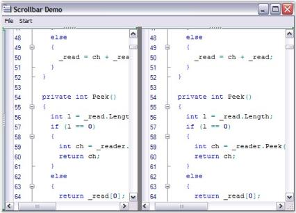
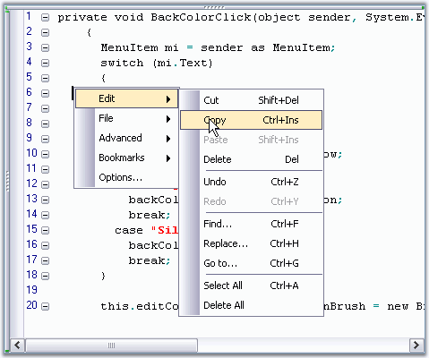
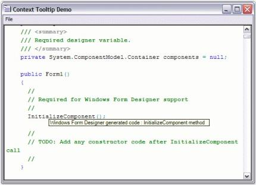

# Runtime Features

The runtime features of the Edit control are as follows:

## Insert Mode

The mode of the INSERT key in the Edit Control can be controlled programmatically by using the InsertMode property. Toggling the value of this property is equivalent to pressing the INSERT key on the keyboard. When InsertMode is set to True, the characters typed get inserted into the Edit Control, without overwriting the existing text. When set to False, the characters typed overwrite the existing  text of the Edit Control. By default, this property is set to True.

The mode of the INSERT key can also be toggled by using the ToggleInsertMode method of the Edit Control.



// Enable the insert key mode in Edit Control.

this.editControl1.InsertMode = true;

// Toggle the insert mode.

this.editControl1.ToggleInsertMode();





' Enable the insert key mode in Edit Control.

Me.editControl1.InsertMode = True

' Toggle the insert mode.

Me.editControl1.ToggleInsertMode()



## Keyboard Shortcuts 

The keyboard shortcuts for the commands in the Edit Control are listed below.

<table>
<tr>
<th>
Command</th><th>
Shortcut</th></tr>
<tr>
<td colspan = "2">
Clipboard</td></tr>
<tr>
<td>
Copy</td><td>
CTRL+C, CTRL+INSERT</td></tr>
<tr>
<td>
Paste</td><td>
CTRL+V, SHIFT+INSERT</td></tr>
<tr>
<td>
Cut</td><td>
CTRL+X, SHIFT+DEL</td></tr>
<tr>
<td>
SelectAll</td><td>
CTRL+A</td></tr>
<tr>
<th colspan = "2">
File Operation</th></tr>
<tr>
<td>
Save</td><td>
CTRL+S</td></tr>
<tr>
<td>
SaveAs</td><td>
CTRL+SHIFT+S</td></tr>
<tr>
<td>
New</td><td>
CTRL+N</td></tr>
<tr>
<td>
Open</td><td>
CTRL+O</td></tr>
<tr>
<th colspan = "2">
Printing</th></tr>
<tr>
<td>
Print</td><td>
CTRL+P</td></tr>
<tr>
<th colspan = "2">
Positioning</th></tr>
<tr>
<td>
Go to line</td><td>
CTRL+G</td></tr>
<tr>
<td>
Go to start</td><td>
CTRL+HOME</td></tr>
<tr>
<td>
Go to end</td><td>
CTRL+END</td></tr>
<tr>
<th colspan = "2">
Search and Replace</th></tr>
<tr>
<td>
Find</td><td>
CTRL+F</td></tr>
<tr>
<td>
FindNext</td><td>
F3</td></tr>
<tr>
<td>
FindSelected</td><td>
CTRL+F3</td></tr>
<tr>
<td>
Replace</td><td>
CTRL+H</td></tr>
<tr>
<th colspan = "2">
Undo and Redo</th></tr>
<tr>
<td>
Undo </td><td>
CTRL+Z</td></tr>
<tr>
<td>
Redo</td><td>
CTRL+Y</td></tr>
<tr>
<th colspan = "2">
Bookmark</th></tr>
<tr>
<td>
Toggle unnamed bookmark</td><td>
CTRL+F2, CTRL+K->CTRL+K</td></tr>
<tr>
<td>
Go to next bookmark</td><td>
F2, CTRL+K->CTRL+N</td></tr>
<tr>
<td>
Go to previous bookmark</td><td>
F3, CTRL+K->CTRL+P</td></tr>
<tr>
<td>
Toggle named bookmark</td><td>
CTRL+[index of bookmark]</td></tr>
<tr>
<td>
Go to named bookmark</td><td>
CTRL+SHIFT+[index of bookmark]</td></tr>
<tr>
<th colspan = "2">
Tab</th></tr>
<tr>
<td>
Add leading tab</td><td>
TAB with multiple line selection</td></tr>
<tr>
<td>
Remove leading tab</td><td>
SHIFT+TAB</td></tr>
<tr>
<th colspan = "2">
Outlining</th></tr>
<tr>
<td>
Switch on outlining and collapse all</td><td>
CTRL+M->CTRL+O</td></tr>
<tr>
<td>
Switch off outlining</td><td>
CTRL+M->CTRL+P</td></tr>
<tr>
<td>
Toggle outlining</td><td>
CTRL+M->CTRL+M</td></tr>
<tr>
<th colspan = "2">
WhiteSpace</th></tr>
<tr>
<td>
Show white space</td><td>
CTRL+SHIFT+W</td></tr>
<tr>
<th colspan = "2">
Intellisense</th></tr>
<tr>
<td>
Show context prompt</td><td>
CTRL+SHIFT+SPACEBAR</td></tr>
<tr>
<td>
Show context choice</td><td>
CTRL+SPACEBAR</td></tr>
</table>

## Bitmap Generation

The Edit Control has the ability to generate a bitmap image of itself. The bitmap image looks exactly like an actual snapshot of a live instance of Edit Control. This is achieved through the use of the CreateBitmap method.



// Creates bitmap of the Edit Control.

Bitmap bmp = this.editControl1.CreateBitmap();





' Creates bitmap of the Edit Control.

Dim bmp as Bitmap = Me.editControl1.CreateBitmap()



## Find, Replace and Goto

The Edit Control supports text search and replace functionalities through the use of the FindText and ReplaceText methods. There are also other useful methods like FindCurrentText, FindNext and ReplaceAll that assist in this purpose.

<table>
<tr>
<th>
Edit Control Method</th><th>
Description</th></tr>
<tr>
<td>
FindText</td><td>
Finds the first occurrence of the specified text as per the conditions specified like match case, match whole word, search hidden text and search up.</td></tr>
<tr>
<td>
FindRange</td><td>
Searches for given string in the text of control and returns text range of first found occurrence.</td></tr>
<tr>
<td>
FindRegex</td><td>
Looks for specified expression in text.</td></tr>
<tr>
<td>
ReplaceText</td><td>
Replaces the first occurrence of the specified text with the replacement text as per the conditions specified like match case, match whole word, search hidden text and search up.</td></tr>
<tr>
<td>
FindCurrentText</td><td>
Finds the next occurrence of the word on which the cursor is presently on.</td></tr>
<tr>
<td>
FindNext</td><td>
Finds the next occurrence of the current search text.</td></tr>
<tr>
<td>
ReplaceAll</td><td>
Replaces all occurrences of the search text with the replacement text as per the conditions specified like match case, match whole word, search hidden text and search up.</td></tr>
</table>



// Finds the first occurrence of the specified text as per the conditions specified.

this.editControl1.FindText("Essential Edit", true, true, true, true, null);

// Searches for given string in the text of control and returns text range of first found occurrence.

this.editControl1.FindRange(searchString, startLocation, endLocation, matchWholeWord, searchHiddenText, searchUp, useRegex);

// Looks for specified expression in text.

this.editControl1.FindRegex(startLine, startColumn, expression, bSearchInCollapsed, searchUp);

// Replaces the first occurrence of the specified text with the replacement text as per the conditions specified.

this.editControl1.ReplaceText("ShowVerticalScrollbar", "ShowVerticalScroller");

// Finds the next occurrence of the word on which the cursor is presently on.

this.editControl1.FindCurrentText();

// Finds the next occurrence of the current search text.

this.editControl1.FindNext();

// Replaces all occurrences of the search text with the replacement text as per the conditions specified.

this.editControl1.ReplaceAll(" Drag-and-drop", "Drag and drop");





' Finds the first occurrence of the specified text as per the conditions specified.

Me.editControl1.FindText("Essential Edit", True, True, True, True, Nothing)

' Searches for given string in the text of control and returns text range of first found occurrence.

Me.editControl1.FindRange(searchString, startLocation, endLocation, matchWholeWord, searchHiddenText, searchUp, useRegex)

' Looks for specified expression in text.

Me.editControl1.FindRegex(startLine, startColumn, expression, bSearchInCollapsed, searchUp)

' Replaces the first occurrence of the specified text with the replacement text as per the conditions specified.

Me.editControl1.ReplaceText("ShowVerticalScrollbar", "ShowVerticalScroller") 

' Finds the next occurrence of the word on which the cursor is presently on.

Me.editControl1.FindCurrentText()

' Finds the next occurrence of the current search text.

Me.editControl1.FindNext()

' Replaces all occurrences of the search text with the replacement text as per the conditions specified.

Me.editControl1.ReplaceAll(" Drag-and-drop", "Drag and drop")



### Find and Replace Dialog Boxes

Edit Control also supports advanced and customizable Find and Replace dialog boxes. The Find dialog box is invoked by using the ShowFindDialog method. The keyboard shortcut to this dialog box is Ctrl+F.

The Replace dialog box is invoked by using the ShowReplaceDialog method. The keyboard shortcut to this dialog box is Ctrl+H. The Replace dialog box also allows you to find and replace words within the selected text.



// Invoke the Find Dialog.

this.editControl1.ShowFindDialog();

// Invoke the Replace Dialog.

this.editControl1.ShowReplaceDialog();





' Invoke the Find Dialog.

Me.editControl1.ShowFindDialog()

' Invoke the Replace Dialog.

Me.editControl1.ShowReplaceDialog()



#### Positioning Mouse Cursor on a Specified line

The Edit Control supports the "GoTo" functionality both through the use of a run time dialog box and through programmatic APIs. The GoTo method is used to position the mouse pointer on any specified line. The GoTo method not only positions the pointer on the appropriate line, but it also scrolls the concerned line into the view. The linesAbove argument can be used to specify the number of lines to be displayed above the pointer.



// Places the cursor at the beginning of the given line number.

this.editControl1.GoTo(lineNumber);

this.editControl1.GoTo(lineNumber, linesAbove);





' Places the cursor at the beginning of the given line number.

Me.editControl1.GoTo(lineNumber)

Me.editControl1.GoTo(lineNumber, linesAbove);



The CurrentLine property explained in the Positions and Offsets section, also does the same task as the GoTo method. The Goto dialog box is invoked using the ShowGoToDialog method. The keyboard shortcut to this dialog box is Ctrl+G.



// Invoke the GoTo Dialog.

this.editControl1.ShowGoToDialog();





' Invoke the GoTo Dialog.

Me.editControl1.ShowGoToDialog()



Default key bindings to these dialogs can be changed as explained in the Keystroke - Action Combinations Binding topic.

### History Properties

The FindHistory property is used to add/remove items from the find history in the Find dialog box. The ReplaceHistory property is used to add/remove items from the replace history in the Replace dialog box. Similarly, the ReplaceSearchHistory property is used to add / remove items from the find history in the Replace dialog box.

<table>
<tr>
<th>
Edit Control Property</th><th>
Description</th></tr>
<tr>
<td>
FindHistory</td><td>
Gets history of Find dialog.</td></tr>
<tr>
<td>
ReplaceHistory</td><td>
Gets history of Replace dialog.</td></tr>
<tr>
<td>
ReplaceSearchHistory</td><td>
Gets search history of Replace dialog.</td></tr>
</table>

The methods associated with the FindHistory property are used to perform the following operations.

<table>
<tr>
<th>
FindHistory Method</th><th>
Description</th></tr>
<tr>
<td>
Insert</td><td>
Inserts an element into the System.Collections.ArrayList at the specified index.</td></tr>
<tr>
<td>
Remove</td><td>
Removes an element or the first occurrence from the System.Collections.ArrayList of the specified index.</td></tr>
<tr>
<td>
Sort</td><td>
Sorts all the elements in the System.Collections.ArrayList.</td></tr>
<tr>
<td>
Clear</td><td>
Clears all the items in the FindHistory.</td></tr>
</table>



this.editControl1.FindHistory.Insert(0,(object)ATH.addedItem);

this.editControl1.FindHistory.Remove(o);

this.editControl1.FindHistory.Sort();

this.editControl1.FindHistory.Clear();





Me.editControl1.FindHistory.Insert(0,CType(ATH.addedItem, Object))

Me.editControl1.FindHistory.Remove(o)

Me.editControl1.FindHistory.Sort()

Me.editControl1.FindHistory.Clear()



N> The above methods can also be set for the ReplaceHistory and ReplaceSearchHistory properties.

A sample which demonstrates the above features is available in the below sample installation path.

_..\____My Documents\Syncfusion\EssentialStudio\Version Number\Windows\Edit.Windows\Samples\Advanced Editor Functions\ActionGroupingDemo_

## Enhanced Find Dialog

Essential Edit control Find Dialog is now enhanced with an alert message box. This displays the alert message box when find reaches the starting point of the search again.

N> In search option Current Selection, click OK in alert message box, then the search area is selected again automatically as in VS editor.

## Scrolling Support

Edit Control offers extremely smooth scrolling behavior using idle-time processing and dynamic scroll area expansion techniques. The scrolling behavior is smooth even when large files are loaded, though the Edit Control scrolls by several hundred lines for a small movement of the scroller.

The scrollers in the Edit Control can be optionally shown / hidden by using the below given properties.

<table>
<tr>
<th>
Edit Control Property</th><th>
Description</th></tr>
<tr>
<td>
ShowVerticalScroller</td><td>
Gets / sets value indicating whether the vertical scroller can be shown.</td></tr>
<tr>
<td>
ShowHorizontalScroller</td><td>
Gets / sets value indicating whether the horizontal scroller can be shown.</td></tr>
<tr>
<td>
AlwaysShowScrollers</td><td>
Gets / sets value indicating whether scrollers should be always visible.</td></tr>
</table>



// Display the Horizontal Scroller.

this.editControl1.ShowHorizontalScroller = true;

// Display the Vertical Scroller.

this.editControl1.ShowVerticalScroller = true;

this.editControl1.AlwaysShowScrollers = true;





// Display the Horizontal Scroller.

Me.editControl1.ShowHorizontalScroller = True

// Display the Vertical Scroller.

Me.editControl1.ShowVerticalScroller = True

Me.editControl1.AlwaysShowScrollers = True



The Edit Control supports scroller events that are raised when the scroll arrows are clicked. The scroller events are used to synchronize the scrolling of multiple Edit Controls.

### Scroll Bar Buttons

Buttons can be displayed at the top, bottom, left or right of the scroll bars by using the below given properties.

<table>
<tr>
<th>
Edit Control Property</th><th>
Description</th></tr>
<tr>
<td>
ScrollbarBottomButtons</td><td>
Gets buttons at the bottom of vertical scrollbar.</td></tr>
<tr>
<td>
ScrollbarLeftButtons</td><td>
Gets buttons on the left of vertical scrollbar.</td></tr>
<tr>
<td>
ScrollbarRightButtons</td><td>
Gets buttons on the right of vertical scrollbar.</td></tr>
<tr>
<td>
ScrollbarTopButtons</td><td>
Gets buttons at the top of vertical scrollbar.</td></tr>
</table>



this.editControl1.ScrollbarBottomButtons.AddRange(new System.Windows.Forms.Control[] { this.scrollbarButton1 });

this.editControl1.ScrollbarLeftButtons.AddRange(new System.Windows.Forms.Control[] { this.scrollbarButton2 });

this.editControl1.ScrollbarRightButtons.AddRange(new System.Windows.Forms.Control[] { this.scrollbarButton3 });

this.editControl1.ScrollbarTopButtons.AddRange(new System.Windows.Forms.Control[] { this.scrollbarButton4 });





Me.editControl1.ScrollbarBottomButtons.AddRange(New System.Windows.Forms.Control() {Me.scrollbarButton1}) 

Me.editControl1.ScrollbarLeftButtons.AddRange(New System.Windows.Forms.Control() {Me.scrollbarButton2}) 

Me.editControl1.ScrollbarRightButtons.AddRange(New System.Windows.Forms.Control() {Me.scrollbarButton3}) 

Me.editControl1.ScrollbarTopButtons.AddRange(New System.Windows.Forms.Control() {Me.scrollbarButton4}) 



### Scroll Position and Offsets

The scroll position and offsets of the Edit Control are set by using the below given properties.

<table>
<tr>
<th>
Edit Control Property</th><th>
Description</th></tr>
<tr>
<td>
ScrollPosition</td><td>
Gets / sets scroll position of Edit Control.</td></tr>
<tr>
<td>
ScrollOffsetBottom</td><td>
Gets / sets the bottom scroll offset.</td></tr>
<tr>
<td>
ScrollOffsetLeft</td><td>
Gets / sets the left scroll offset.</td></tr>
<tr>
<td>
ScrollOffsetRight</td><td>
Gets / sets the right scroll offset.</td></tr>
<tr>
<td>
ScrollOffsetTop</td><td>
Gets / sets the top scroll offset.</td></tr>
</table>



this.editControl1.ScrollPosition = new Point(1, 5);

this.editControl1.ScrollOffsetBottom = 5;

this.editControl1.ScrollOffsetLeft = 10;

this.editControl1.ScrollOffsetTop = 5;

this.editControl1.ScrollOffsetTop = 10;





Me.editControl1.ScrollPosition = New Point(1, 5) 

Me.editControl1.ScrollOffsetBottom = 5 

Me.editControl1.ScrollOffsetLeft = 10 

Me.editControl1.ScrollOffsetTop = 5 

Me.editControl1.ScrollOffsetTop = 10 



### Office 2007 Visual Style

Edit Control enables to provide Office 2007 appearance to scroll bars by setting the ScrollVisualStyle property to Office2007.

It supports all the three Office 2007 Color Schemes (Black, Blue and Silver), which can be set by using the ScrollColorScheme property. Also, custom colors can be applied to the scroll bars of the Edit Control. This can be done by setting the ScrollColorScheme property to Managed.

<table>
<tr>
<th>
Edit Control Property</th><th>
Description</th></tr>
<tr>
<td>
ScrollVisualStyle</td><td>
Specifies the visual style of the scroll bar.</td></tr>
<tr>
<td>
ScrollColorScheme</td><td>
Specifies the scroll bar color scheme when Office2007 or Office2007Generic Style is set. The options provided are
<ul>
<li> Black</li>
<li> Blue</li>
<li> Silver</li>
<li> Managed</li></ul></td></tr>
</table>



this.editControl1.ScrollVisualStyle = ScrollBarCustomDrawStyles.Office2007;

this.editControl1.ScrollColorScheme = Office2007ColorScheme.Blue;

// Set custom color for the scroll bar.

this.editControl1.ScrollColorScheme = Office2007ColorScheme.Managed;

Syncfusion.Windows.Forms.Office2007Colors.ApplyManagedColors(this, Color.Green);





Me.editControl1.ScrollVisualStyle = ScrollBarCustomDrawStyles.Office2007

Me.editControl1.ScrollColorScheme = Office2007ColorScheme.Blue

' Set custom color for the scroll bar.

Me.editControl1.ScrollColorScheme = Office2007ColorScheme.Managed

Syncfusion.Windows.Forms.Office2007Colors.ApplyManagedColors(Me, Color.Green)



The following illustration shows the Edit Control with custom color (green) set for the scroll bars.

## ToolTip

Essential Edit supports ToolTip feature for various functionalities which are discussed in this section.

* ToolTip for lexems. This is discussed in the Context Tooltip topic.
* Three different tooltips for outlining is discussed in the Outlining Tooltip topic.

### Interactive Features

The interactive features are discussed in the following topics:

#### Customizable Context Menu

Edit Control has a built-in context menu which is enabled, by default. This context menu allows you to edit the contents, and open or create a new file. It includes some advanced features like indent selection, comment selection, adding bookmarks, and much more. This is enabled by using the EditControl1.ContextMenuManager.Enabled property.

The context menu has the standard VS.NET-like appearance, and can optionally be provided with the Office 2003 appearance.

Set the appearance of the context menu by specifying the desired ContextMenuProvider.



// Show Office2003 style context menu.

this.editControl1.ContextMenuManager.ContextMenuProvider = new Syncfusion.Windows.Forms.Tools.XPMenus.XPMenusProvider();

// Show Standard style context menu.

this.editControl1.ContextMenuManager.ContextMenuProvider = new Syncfusion.Windows.Forms.StandardMenusProvider();





' Show Office2003 style context menu

Me.editControl1.ContextMenuManager.ContextMenuProvider = New Syncfusion.Windows.Forms.Tools.XPMenus.XPMenusProvider()

' Show Standard style context menu

Me.editControl1.ContextMenuManager.ContextMenuProvider = New Syncfusion.Windows.Forms.StandardMenusProvider()

Adding Customized Menu Items

You can handle the MenuFill event to add Menu Items to the context menu. This is illustrated in the below code snippet. 





// Handle the MenuFill event which is called each time the context menu is displayed.

this.editControl1.MenuFill += new EventHandler(cm_FillMenu);

private void cm_FillMenu(object sender, EventArgs e)

{

ContextMenuManager cm = (ContextMenuManager) sender;

// To clear default context menu items.

cm.ClearMenu();

// Add a separator.

cm.AddSeparator();

// Add custom context menu items and their Click eventhandlers.

cm.AddMenuItem("&Find", new EventHandler(ShowFindDialog));

cm.AddMenuItem("&Replace", new EventHandler(ShowReplaceDialog));

cm.AddMenuItem("&Goto", new EventHandler(ShowGoToDialog));

// If you need to get access to the underlying menu provider you can access it using the below given code.

Syncfusion.Windows.Forms.IContextMenuProvider contextMenuProvider = this.editControl1.ContextMenuManager.ContextMenuProvider;

}

// Calling the in-built dialogs.

void ShowFindDialog(object sender, EventArgs e)

{

    this.editControl1.ShowFindDialog();

}

void ShowReplaceDialog(object sender, EventArgs e)

{

    this.editControl1.ShowReplaceDialog();

}

void ShowGoToDialog(object sender, EventArgs e)

{

this.editControl1.ShowGoToDialog();

}





' Handle the MenuFill event which is called each time the context menu is displayed.

AddHandler Me.editControl1.MenuFill, AddressOf cm_FillMenu

Private Sub cm_FillMenu(ByVal sender As Object, ByVal e As EventArgs)

Dim cm As ContextMenuManager = CType(sender, ContextMenuManager)

' To clear default context menu items.

cm.ClearMenu();

' Add a separator.

cm.AddSeparator()

' Add custom context menu items and their Click eventhandlers.

cm.AddMenuItem("&Find", New EventHandler(AddressOf ShowFindDialog))

cm.AddMenuItem("&Replace", New EventHandler(AddressOf ShowReplaceDialog))

cm.AddMenuItem("&Goto", New EventHandler(AddressOf ShowGoToDialog))

' If you need to get access to the underlying menu provider you can access it using the below given code.

Dim contextMenuProvider As Syncfusion.Windows.Forms.IContextMenuProvider = Me.editControl1.ContextMenuManager.ContextMenuProvider

End Sub 'cm_FillMenu

' Calling the in-built dialogs.

Sub ShowFindDialog(ByVal sender As Object, ByVal e As EventArgs)

Me.editControl1.FindDialog()

End Sub 

Sub ShowReplaceDialog(ByVal sender As Object, ByVal e As EventArgs)

Me.editControl1.ReplaceDialog()

End Sub

Sub ShowGoToDialog(ByVal sender As Object, ByVal e As EventArgs)

Me.editControl1.GoToDialog()

End Sub



### Assembly Dependency

If the Syncfusion.Tools.Windows assembly is loaded before the instantiation of the context menu, then an XPMenus.PopupMenu is displayed as the context menu. Otherwise, a standard .NET context menu is shown.

N> You must have reference to the Syncfusion.Tools.Windows assembly in your project.

A sample demonstrating the Context Menu feature is available in the following sample installation path.

_My Documents\Syncfusion\EssentialStudio\Version Number\Windows\Edit.Windows\Samples\Advanced Editor Functions\ActionGroupingDemo_

### IntellijPrompt Features

This section covers the following topics:

### Code Snippets

Essential Edit supports an advanced feature of VS 2005 like Code Snippets. It is also used to load / save VS.NET 2005-compatible XML snippets.

Code Snippets are inserted into the Edit Control by following the procedure given below:

1. Type the snippet name. For example "do".
2. Pressing the TAB key, or CTRL + ' combination.
3. Select an item from the list as shown in the image below.

The code snippets allow you to input data to the highlighted fields.

Code Snippets can also be inserted into the Edit Control by using the static Extract method of the CodeSnippetsExtractor class. The Extract method takes the following two parameters:

1. Path of the folder containing the code snippets.
2. Instance of the Edit Control into which the extracted code snippet should be inserted.

This is illustrated in the code given below.



CodeSnippetsExtractor.Extract(csharpsnippetsPath, editControl1);





CodeSnippetsExtractor.Extract(vbsnippetsPath, editControl1)



Code Snippets are added to the current language of the Edit Control by using the below given method.

<table>
<tr>
<th>
Edit Control Method</th><th>
Description</th></tr>
<tr>
<td>
AddCodeSnippet</td><td>
Adds new code snippet to current language.</td></tr>
</table>



this.editControl1.AddCodeSnippet(string title, ArrayList literals, string code);





Me.editControl1.AddCodeSnippet(String title, ArrayList literals, String code)



The code snippets can also be contained in containers and displayed in the pop-up of the snippets. The static Extract method of the CodeSnippetsExtractor class is used to extract and fill the container object. The container object can be added to the SnippetsContainer of the Edit Control by using the AddContainer method. This is illustrated in the code given below.



private CodeSnippetsContainer container = new Syncfusion.Windows.Forms.Edit.Utils.CodeSnippets.CodeSnippetsContainer(); 

container = CodeSnippetsExtractor.Extract(csharpsnippetsPath@"\Loops");

container.Name = "Loops";

this.editControl1.Language.SnippetsContainer.AddContainer(container);





container As CodeSnippetsContainer = New Syncfusion.Windows.Forms.Edit.Utils.CodeSnippets.CodeSnippetsContainer()

container = CodeSnippetsExtractor.Extract(vbsnippetsPath "\Loops")

container.Name = "Loops"

Me.editControl1.Language.SnippetsContainer.AddContainer(container)



Code snippets can also be created by using the configuration file. For example, the code snippet for a structure in C# can be created as shown below.



<CodeSnippetsContainer Name ="Container 2">

<CodeSnippet Format ="1.0.0">

       <Header>

        <Title>struct</Title>

         <Shortcut>struct</Shortcut>

 <Description>Code snippet for struct</Description>

     </Header>

     <Snippet>

          <Declarations>

        <Literal>

         <ID>name</ID>

         <ToolTip>Struct name</ToolTip>

        <Default>MyStruct</Default>

      </Literal>

         </Declarations>

       <Code Language ="csharp"><![CDATA[struct $name$

       {

       }]]>

       </Code>

</Snippet>

</CodeSnippet>

</CodeSnippetsContainer>



The Literal element is used to identify a replacement for a piece of code that is entirely contained within the snippet, but one that will likely be customized after it is inserted into the code. For example, literal strings, numeric values, and some variable names should be declared as literals. The symbol $ is placed at the beginning and end of the literal ID element value. For example, if a literal has an ID element that contains the value MyID, you must reference that literal in the code element as $MyID$. All code snippets must be placed between &lt;![CDATA[ and ]]&gt; brackets.

 ###Showing Code Snippets

You can programmatically show the choice list of code snippets by calling ShowCodeSnippets method given below.



// Shows the code snippets' choice list.
this.editControl1.ShowCodeSnippets();





' Shows the code snippets' choice list.
Me.editControl1.ShowCodeSnippets()



### Border Settings

Border can be set for the active code snippets by using the DrawCodeSnippetBorder property of the Edit Control.



this.editControl1.DrawCodeSnippetBorder = true;





Me.editControl1.DrawCodeSnippetBorder = True



A sample demonstrating the above feature is available in the following sample installation path.

_..\____My Documents\Syncfusion\EssentialStudio\Version Number\Windows\Edit.Windows\Samples\Advanced Editor Functions\ActionGroupingDemo_

### Context Choice

The Context Choice support allows you to create pop-ups for displaying a list of options that are used to complete what the user is typing. This feature is modeled on the List Members intellisense feature of Visual Studio, and is very convenient when editing programming languages. For example, in C# or VB.NET, when the . (period) character is typed after a class instance, a pop-up containing all the members of the class gets displayed. As you type in the editor, the list automatically changes selection to synchronize with the text that has been entered. You can also autocomplete the word by using the UP/DOWN ARROW keys to choose the Context Choice item and pressing theTAB key. The Context Choice pop-up can be dismissed by pressing the ESC key.

The Context Choice displaying characters are specified in the configuration file by using the DropContextChoiceList field in the lexem for the corresponding character. If you wish to display the Context Choice dropdown in response to the period (".") or comma (",") being typed, use the following XML code.



<lexem BeginBlock="." Type="Operator" DropContextChoiceList="true"/>

<lexem BeginBlock="," Type="Operator" DropContextChoiceList="true"/>



The preceding code has to be placed within the <lexems> section of the configuration file.

#### AutoCompleteSingleLexem

The AutoCompleteSingleLexem property indicates whether the Context Choice list gets auto completed when a single lexem remains in the list.



this.editControl1.AutoCompleteSingleLexem = true;





Me.editControl1.AutoCompleteSingleLexem = True



#### Populating the Context Choice List Items

The Context Choice list is populated by handling the ContextChoiceOpen event of the Edit Control, and adding items to the Items collection associated with the IContextChoiceController object.

<table>
<tr>
<th>
Edit Control Event</th><th>
Description</th></tr>
<tr>
<td>
ContextChoiceOpen</td><td>
This event occurs when the Context Choice window has been opened.</td></tr>
</table>



private void editControl1_ContextChoiceOpen(Syncfusion.Windows.Forms.Edit.Interfaces.IContextChoiceController controller)

{

// Add items to the Items collection associated with the IContextChoiceController object.

controller.Items.Add("Method", "Method", this.editControl1.ContextChoiceController.Images["Image0"]);

controller.Items.Add("FindText", "FindText", this.editControl1.ContextChoiceController.Images["Image1"]);    

controller.Items.Add("GetTextAsHTML", "GetTextAsHTML", this.editControl1.ContextChoiceController.Images["Image2"]);

controller.Items.Add("LoadFile", "LoadFile", this.editControl1.ContextChoiceController.Images["Image3"]);

controller.Items.Add("ToString", "ToString", this.editControl1.ContextChoiceController.Images["Image4"]);

controller.Items.Add("Event", "Event", this.editControl1.ContextChoiceController.Images["Image5"]);                      

}





Private Sub editControl1_ContextChoiceOpen(ByVal controller As Syncfusion.Windows.Forms.Edit.Interfaces.IContextChoiceController) Handles EditControl1.ContextChoiceOpen

' Add items to the Items collection associated with the IContextChoiceController object.

controller.Items.Add("Method", "Method", Me.editControl1.ContextChoiceController.Images("Image0"))

controller.Items.Add("FindText", "FindText", Me.editControl1.ContextChoiceController.Images("Image1"))

controller.Items.Add("GetTextAsHTML", "GetTextAsHTML", Me.editControl1.ContextChoiceController.Images("Image2"))

controller.Items.Add("LoadFile", "LoadFile", Me.editControl1.ContextChoiceController.Images("Image3"))

controller.Items.Add("ToString", "ToString", Me.editControl1.ContextChoiceController.Images("Image4"))

controller.Items.Add("Event", "Event", Me.editControl1.ContextChoiceController.Images("Image5"))

End Sub



#### Adding Custom Images to List Items

Custom images can also be added to the Context Choice list items by indexing them into the Images collection of the IContextChoiceController object associated with the Edit Control. The Images collection of the IContextChoiceController can be populated by using the code given below.



int index = 0;

foreach (Image img in this.imageList1.Images)

{

// Populating images using an external ImageList.

this.editControl1.ContextChoiceController.AddImage("Image" + index.ToString(), img);

index++;

}     





Dim index As Integer = 0

Dim img As Image

For Each img In  Me.imageList1.Images

' Populating images using an external ImageList.

Me.editControl1.ContextChoiceController.AddImage("Image" + index.ToString(), img)

index += 1

Next img



#### List Item ToolTip

ToolTip text is specified for each Context Choice list item while adding the items to the IContextChoiceController, as shown in the following code snippet.



// Specify tooltip text for each Context Choice list item.

controller.Items.Add("LoadFile", "Use this method to open a file in EditControl.", this.editControl1.ContextChoiceController.Images["Image3"]);





' Specify tooltip text for each Context Choice list item.

controller.Items.Add("LoadFile", "Use this method to open a file in EditControl.", Me.editControl1.ContextChoiceController.Images["Image3"])



### Customization

#### Border Settings

The border color of the Context Choice form is set by using the ContextChoiceBorderColor property.

<table>
<tr>
<th>
Edit Control Property</th><th>
Description</th></tr>
<tr>
<td>
ContextChoiceBorderColor</td><td>
Specifies the color of the Context Choice form border. Used when UseXPStyle property is set to 'False'. Otherwise 3D border is drawn.</td></tr>
</table>



this.editControl1.ContextChoiceBorderColor = System.Drawing.Color.Red;





Me.editControl1.ContextChoiceBorderColor = System.Drawing.Color.Red



#### Size Settings

The size of the Context Choice form can be set by using the ContextChoiceSize property.



this.editControl1.ContextChoiceSize = new System.Drawing.Size(100, 50);





Me.editControl1.ContextChoiceSize = New System.Drawing.Size(100, 50)



#### Context Choice Operations

The Edit Control provides the following set of events for performing Context Choice operations.

<table>
<tr>
<th>
Edit Control Event</th><th>
Description</th></tr>
<tr>
<td>
ContextChoiceBeforeOpen</td><td>
This event occurs when the Context Choice window is about to open.</td></tr>
</table>



private void editControl1_ContextChoiceBeforeOpen(object sender, System.ComponentModel.CancelEventArgs e)

{                        

// Display Context Choice popup if the lexem used to invoke Context Choice is "this" or "me" only

int ind = GetContextChoiceCharIndex(lexemLine);

ILexem lex = lexemLine.LineLexems[ind-1] as ILexem;

if ((lex.Text == "this") || (lex.Text == "me"))

e.Cancel = false;

else

// Cancels the display of the Context Choice list.

e.Cancel = true;

}





Private Sub editControl1_ContextChoiceBeforeOpen(ByVal sender As Object, ByVal e As System.ComponentModel.CancelEventArgs) Handles EditControl1.ContextChoiceBeforeOpen

' Display Context Choice popup if the lexem used to invoke the Context Choice is "this" or "me" only

Dim ind As Integer = GetContextChoiceCharIndex(lexemLine)

 Dim lex As ILexem = lexemLine.LineLexems(ind - 1)

If lex.Text = "this" OrElse lex.Text = "me" Then

e.Cancel = False

Else

' Cancel the display of the Context Choice list.

e.Cancel = True

End If

End Sub



<table>
<tr>
<th>
Edit Control Event</th><th>
Description</th></tr>
<tr>
<td>
ContextChoiceClose</td><td>
This event occurs when the Context Choice window has been closed.</td></tr>
</table>



private void editControl1_ContextChoiceClose(Syncfusion.Windows.Forms.Edit.Interfaces.IContextChoiceController controller, System.Windows.Forms.DialogResult dialogresult)

{

// Clear the Context Choice items. 

this.editControl1.ContextChoiceController.Items.Clear();

}





Private Sub editControl1_ContextChoiceClose(ByVal controller As Syncfusion.Windows.Forms.Edit.Interfaces.IContextChoiceController, ByVal dialogresult As System.Windows.Forms.DialogResult) Handles EditControl1.ContextChoiceClose

' Clear the Context Choice items.

Me.editControl1.ContextChoiceController.Items.Clear()

End Sub



<table>
<tr>
<th>
Edit Control Event</th><th>
Description</th></tr>
<tr>
<td>
ContextChoiceItemSelected</td><td>
This event is raised when a Context Choice list item is selected.</td></tr>
<tr>
<td>
ContextChoiceSelectedTextInsert</td><td>
This event is raised when the editor is about to insert selected Context Choice item to the text. Action can be canceled.</td></tr>
</table>



private void editControl1_ContextChoiceItemSelected(Syncfusion.Windows.Forms.Edit.Interfaces.IContextChoiceController sender, Syncfusion.Windows.Forms.Edit.ContextChoiceItemSelectedEventArgs e)

{

// Gets the selected item.

IContextChoiceController controller = sender as IContextChoiceController;

string selectedItemText = e.SelectedItem.Text;

}





Private Sub editControl1_ContextChoiceItemSelected(ByVal sender As Syncfusion.Windows.Forms.Edit.Interfaces.IContextChoiceController, ByVal e As Syncfusion.Windows.Forms.Edit.ContextChoiceItemSelectedEventArgs) Handles EditControl1.ContextChoiceItemSelected

' Gets the selected item.

Dim controller As IContextChoiceController = sender

Dim selectedItemText As String = e.SelectedItem.Text

End Sub





private void editControl1_ContextChoiceSelectedTextInsert(Syncfusion.Windows.Forms.Edit.Interfaces.IContextChoiceController sender, Syncfusion.Windows.Forms.Edit.ContextChoiceTextInsertEventArgs e)

{

IContextChoiceController controller = sender as IContextChoiceController;

// Gets the displayed text.

string displayText = e.DisplayText;

// Gets the text to be inserted.

string insertText = e.InsertText;

// Gets the item selected.

string selectedItemText = e.SelectedItem.Text;

}





Private Sub editControl1_ContextChoiceSelectedTextInsert(ByVal sender As Syncfusion.Windows.Forms.Edit.Interfaces.IContextChoiceController, ByVal e As Syncfusion.Windows.Forms.Edit.ContextChoiceTextInsertEventArgs) Handles EditControl1.ContextChoiceSelectedTextInsert

Dim controller As IContextChoiceController = sender

' Gets the displayed text.

Dim displayText As String = e.DisplayText

' Gets the text to be inserted.

Dim insertText As String = e.InsertText

' Gets the item selected.

Dim selectedItemText As String = e.SelectedItem.Text

End Sub 'editControl1_ContextChoiceSelectedTextInsert



#### Filtering AutoComplete Items

Edit Control provides options to filter items in AutoComplete. This can be done by using the FilterAutoCompleteItems property.

<table>
<tr>
<th>
Edit Control Property</th><th>
Description</th></tr>
<tr>
<td>
FilterAutoCompleteItems</td><td>
Gets / sets value indicating whether Context Choice items should be filtered while typing.</td></tr>
</table>

FilterAutoCompleteItems property when set to True, filters the item in the AutoComplete Context Choice, and the filtered item alone will be visible. When set to False, all the items will be visible, and the selection will be navigated to the item.

#### Showing / Hiding Context Choice Pop-up

You can also programmatically show / hide the Context Choice pop-up by calling the ShowContextChoice and

CloseContextChoice methods.



// Shows the Context Choice pop-up window.
this.editControl1.ShowContextChoice();

// Closes the ContextChoice pop-up window.
this.editControl1.CloseContextChoice();





' Shows the Context Choice pop-up window.
Me.editControl1.ShowContextChoice()

' Closes the ContextChoice pop-up window.
Me.editControl1.CloseContextChoice()



A sample demonstrating the Context Choice feature is available in the below sample installation path.

_..\____My Documents\Syncfusion\EssentialStudio\Version Number\Windows\Edit.Windows\Samples\Advanced Editor Functions\ActionGroupingDemo_

### Context Prompt

The Context Prompt feature allows you to create pop-ups for displaying variations of syntax for the text input by using the Context Choice. This feature is modeled on the Parameter Info intellisense feature of Visual Studio. Each of the context prompt items can have a syntax specifier string and text message providing additional information on each item. The user is able to scroll through the syntax variations either by using the UP/DOWN ARROW keys or clicking on the UP/DOWN buttons on the pop-up.

The Context Prompt displaying characters are specified in the configuration file by using the DropContextPrompt field in the lexem for the corresponding character. If you wish to display the ContextPrompt pop-up in response to the opening brace - "(" or opening curly brace -"{" being typed, use the following XML code.



<lexem BeginBlock="(" Type="Operator" IsComplex="true" DropContextPrompt="true" />

<lexem BeginBlock="{" Type="Operator" IsComplex="true" DropContextPrompt="true"/>



The preceding code has to be placed within the <lexems> section of the configuration file. 

#### Populating Context Prompt Popup

The Context Prompt is populated by handling the ContextPromptOpen event of Edit Control, and adding new prompts using the AddPrompt method.

<table>
<tr>
<th>
Edit Control Event</th><th>
Description</th></tr>
<tr>
<td>
ContextPromptOpen</td><td>
This event occurs when the Context Prompt has been opened.</td></tr>
</table>



private void editControl1_ContextPromptOpen(object sender, Syncfusion.Windows.Forms.Edit.ContextPromptUpdateEventArgs e)

{

// Populate the Context Prompt.

e.AddPrompt( "Control.Items.Add(string text, string tooltipText, int imageIndex, int selectedImageIndex)", "Specify the text of the item, its tooltip text, image index and selected image index" );

e.AddPrompt( "Control.Items.Add(string text, string tooltipText, int imageIndex)", "Specify the text of the item, its tooltip text, and image index" );

e.AddPrompt( "Control.Items.Add(string text, string tooltipText)", "Specify the text of the item, and its tooltip text" );

}





Private Sub editControl1_ContextPromptOpen(ByVal sender As Object, ByVal e As Syncfusion.Windows.Forms.Edit.ContextPromptUpdateEventArgs) Handles EditControl1.ContextPromptOpen

' Populate the Context Prompt.

e.AddPrompt("Control.Items.Add(string text, string tooltipText, int imageIndex, int selectedImageIndex)", "Specify the text of the item, its tooltip text, image index and selected image index")

e.AddPrompt("Control.Items.Add(string text, string tooltipText, int imageIndex)", "Specify the text of the item, its tooltip text, and image index")

e.AddPrompt("Control.Items.Add(string text, string tooltipText)", "Specify the text of the item, and its tooltip text")

End Sub



### Customization

#### Background Brush

The brush for the Context Prompt background is set by using the ContextPromptBackgroundBrush property of the Edit Control.



this.editControl1.ContextPromptBackgroundBrush = new Syncfusion.Drawing.BrushInfo(Syncfusion.Drawing.GradientStyle.BackwardDiagonal, System.Drawing.Color.PapayaWhip, System.Drawing.Color.LemonChiffon);





Me.editControl1.ContextPromptBackgroundBrush = New Syncfusion.Drawing.BrushInfo(Syncfusion.Drawing.GradientStyle.BackwardDiagonal, System.Drawing.Color.PapayaWhip, System.Drawing.Color.LemonChiffon)



#### Border Settings

The border color of the Context Prompt form is set by using the ContextPromptBorderColor property.

<table>
<tr>
<th>
Edit Control Property</th><th>
Description</th></tr>
<tr>
<td>
ContextPromptBorderColor</td><td>
Specifies the color of the Context Choice form border. Used when UseXPStyle property is set to False. Otherwise 3D border is drawn.</td></tr>
</table>



this.editControl1.ContextPromptBorderColor = System.Drawing.Color.Pink;





Me.editControl1.ContextPromptBorderColor = System.Drawing.Color.Pink



#### Size Settings

The size of the Context Prompt form can be set by using the below given properties.

<table>
<tr>
<th>
Edit Control Property</th><th>
Description</th></tr>
<tr>
<td>
ContextPromptSize</td><td>
Gets / sets the size of the Context Prompt form.</td></tr>
<tr>
<td>
UseCustomSizeContextPrompt</td><td>
Gets / sets a value indicating whether custom Context Prompt size should be used.</td></tr>
</table>



this.editControl1.ContextPromptSize = new System.Drawing.Size(125, 75);

this.editControl1.UseCustomSizeContextPrompt = true;





Me.editControl1.ContextPromptSize = New System.Drawing.Size(125, 75)

Me.editControl1.UseCustomSizeContextPrompt = True



#### Context Prompt Operations

The Edit Control provides the following set of events for performing Context Prompt operations.

<table>
<tr>
<th>
Edit Control Event</th><th>
Description</th></tr>
<tr>
<td>
ContextPromptBeforeOpen</td><td>
This event occurs when the Context Prompt window is about to open. User can cancel it.</td></tr>
<tr>
<td>
ContextPromptClose</td><td>
This event occurs when the Context Prompt window has been closed.</td></tr>
<tr>
<td>
ContextPromptSelectionChanged</td><td>
This event occurs when a Context Prompt item has been selected.</td></tr>
</table>



// Store the lexem name invoking the ContextPrompt popup.

string contextPromptLexem = "";

private void editControl1_ContextPromptBeforeOpen(object sender, System.ComponentModel.CancelEventArgs e)

{

ILexem lex;

ILexemLine lexemLine = this.editControl1.GetLine(this.editControl1.CurrentLine);

// Gets the index of the current word in that line.

int ind = GetContextPromptCharIndex(lexemLine);

if (ind<=0)

{

e.Cancel = true;

return;

}

lex = lexemLine.LineLexems[ind-1] as ILexem;

// If the count is less than '2', do not show the Context Prompt popup.

if (lexemLine.LineLexems.Count<2)

e.Cancel = true;

else

{

// Display Context Choice popup if the lexem used to invoke them is "this" or "me" only.

if ((lex.Text == "Chat") || (lex.Text == "Database") || (lex.Text == "NewFile") || (lex.Text == "Find") || (lex.Text == "Home") || (lex.Text == "PieChart") || (lex.Text == "Tools"))

{

this.contextPromptLexem = lex.Text;

e.Cancel = false;

}

else

e.Cancel = true;

}

}





' Store the lexem name invoking the Context Prompt popup.

Dim contextPromptLexem As String = ""

Private Sub editControl1_ContextPromptBeforeOpen(ByVal sender As Object, ByVal e As System.ComponentModel.CancelEventArgs) Handles editControl1.ContextPromptBeforeOpen

Dim lex As ILexem

Dim lexemLine As ILexemLine = Me.editControl1.GetLine(Me.editControl1.CurrentLine)

' Gets the index of the current word in that line.

Dim ind As Integer = GetContextPromptCharIndex(lexemLine)

If ind <= 0 Then

e.Cancel = True

Return

End If

lex = lexemLine.LineLexems(ind - 1) 

' If the count is less than '2', do not show the Context Prompt popup.

If lexemLine.LineLexems.Count < 2 Then

e.Cancel = True

Else

' Display Context Choice popup if the lexem used to invoke them is "this" or "me" only.

If lex.Text = "Chat" OrElse lex.Text = "Database" OrElse lex.Text = "NewFile" OrElse lex.Text = "Find" OrElse lex.Text = "Home" OrElse lex.Text = "PieChart" OrElse lex.Text = "Tools" Then

Me.contextPromptLexem = lex.Text

e.Cancel = False

Else

e.Cancel = True

End If

End If

End Sub





// Clear the Context Prompt lexem name on close.

private void editControl1_ContextPromptClose(object sender, Syncfusion.Windows.Forms.Edit.ContextPromptCloseEventArgs e)

{

this.contextPromptLexem = "";

}





' Clear the Context Prompt lexem name on close.

Private Sub editControl1_ContextPromptClose(ByVal sender As Object, ByVal e As Syncfusion.Windows.Forms.Edit.ContextPromptCloseEventArgs)

Me.contextPromptLexem = ""

End Sub





// Display the selected Context Prompt item's index.

private void editControl1_ContextPromptSelectionChanged(Syncfusion.Windows.Forms.Edit.Forms.Popup.ContextPrompt sender, Syncfusion.Windows.Forms.Edit.ContextPromptSelectionChangedEventArgs e)

{

Console.WriteLine("SelectedIndex : " + e.SelectedIndex.ToString());

Console.WriteLine("ContextPromptSelectionChanged");

}





' Display the selected Context Prompt item's index.

Private Sub editControl1_ContextPromptSelectionChanged(ByVal sender As Syncfusion.Windows.Forms.Edit.Forms.Popup.ContextPrompt, ByVal e As Syncfusion.Windows.Forms.Edit.ContextPromptSelectionChangedEventArgs)

Console.WriteLine("SelectedIndex : " + e.SelectedIndex.ToString())

Console.WriteLine("ContextPromptSelectionChanged")

End Sub



#### Advanced Customization

If you wish to do some advanced customization in the Context Prompt feature, like highlighting the current parameter to be input in bold, you can use the ContextPromptOpen and ContextPromptUpdate events.

For example, add the bold items in the ContextPromptOpen event handler. The indices for the exact position of the text that needs to be bold has to be manually calculated and specified along with some text information associated with that particular argument. The following code snippet illustrates this.



// To display some text in bold within the prompt.

private void editControl1_ContextPromptOpen(object sender, Syncfusion.Windows.Forms.Edit.ContextPromptUpdateEventArgs e)

{

Console.WriteLine("ContextPromptOpen");

// Bolded Items should be added in this handler.

ContextPromptItem item = null;      

item = e.AddPrompt( "Control.Items.Add(string text, string tooltipText, int imageIndex, int selectedImageIndex)", "Specify the text of the item, its tooltip text, image index and selected image index" );

// Specify the text to be displayed in bold in the Context Prompt.

item.BoldedItems.Add( 18, 11, "Text to be added" );

item.BoldedItems.Add( 31, 18, "Text of the tooltip" );

item.BoldedItems.Add( 51, 14, "Zero-based index of the image or -1 if no image should be used." );

item.BoldedItems.Add( 67, 14, "Zero-based index of the image for selection or -1 if no image should be used." );

item = e.AddPrompt( "Control.Items.Add(string text, string tooltipText, int imageIndex)", "Specify the text of the item, its tooltip text, and image index" );

item.BoldedItems.Add( 18, 11, "Text to be added" );

item.BoldedItems.Add( 31, 18, "Text of the tooltip" );

item.BoldedItems.Add( 51, 14, "Zero-based index of the image or -1 if no image should be used." );

item = e.AddPrompt( "Control.Items.Add(string text, string tooltipText)", "Specify the text of the item, and its tooltip text" );

item.BoldedItems.Add( 18, 11, "Text to be added" );

item.BoldedItems.Add( 31, 18, "Text of the tooltip" );

}





' To display some text in bold within the prompt.

Private Sub editControl1_ContextPromptOpen(ByVal sender As Object, ByVal e As Syncfusion.Windows.Forms.Edit.ContextPromptUpdateEventArgs) Handles EditControl1.ContextPromptOpen

Console.WriteLine("ContextPromptOpen")

' Bolded Items should be added in this handler.

Dim item As ContextPromptItem

item = e.AddPrompt("Control.Items.Add(string text, string tooltipText, int imageIndex, int selectedImageIndex)", "Specify the text of the item, its tooltip text, image index and selected image index")

' Specify the text to be displayed in bold in the Context Prompt.

item.BoldedItems.Add(18, 11, "Text to be added")

item.BoldedItems.Add(31, 18, "Text of the tooltip")

item.BoldedItems.Add(51, 14, "Zero-based index of the image or -1 if no image should be used.")

item.BoldedItems.Add(67, 14, "Zero-based index of the image for selection or -1 if no image should be used.")

item = e.AddPrompt("Control.Items.Add(string text, string tooltipText, int imageIndex)", "Specify the text of the item, its tooltip text, and image index")

item.BoldedItems.Add(18, 11, "Text to be added")

item.BoldedItems.Add(31, 18, "Text of the tooltip")

item.BoldedItems.Add(51, 14, "Zero-based index of the image or -1 if no image should be used.")

item = e.AddPrompt("Control.Items.Add(string text, string tooltipText)", "Specify the•_



Select the items that should be bold in the ContextPromptUpdate event handler. The following code snippet illustrates this.



private void editControl1_ContextPromptUpdate(object sender, Syncfusion.Windows.Forms.Edit.ContextPromptUpdateEventArgs e)

{

// Select the items that should be bolded.

if( e.List.SelectedItem != null )

{

// Get list of the lexems that are inside the current stack.

IList list = editControl1.GetLexemsInsideCurrentStack( false );

if( list == null ) return;

int iBoldedIndex = 0;

foreach( ILexem lexem in list )

{

if( lexem.Text == "," )

iBoldedIndex++;

}

if( iBoldedIndex >= e.List.SelectedItem.BoldedItems.Count )

e.List.SelectedItem.BoldedItems.SelectedItem = null;

else

// Gets or sets selected item.

e.List.SelectedItem.BoldedItems.SelectedItem = e.List.SelectedItem.BoldedItems[iBoldedIndex];

}

}         





Private Sub editControl1_ContextPromptUpdate(ByVal sender As Object, ByVal e As Syncfusion.Windows.Forms.Edit.ContextPromptUpdateEventArgs) Handles EditControl1.ContextPromptUpdate

' Select the items that should be bolded.

If Not (e.List.SelectedItem Is Nothing) Then

' Get list of the lexems that are inside the current stack.

Dim list As IList = editControl1.GetLexemsInsideCurrentStack(False)

If list Is Nothing Then

Return

End If

Dim iBoldedIndex As Integer = 0

Dim lexem As ILexem

For Each lexem In list

If lexem.Text = "," Then

iBoldedIndex += 1

End If

Next lexem

If iBoldedIndex >= e.List.SelectedItem.BoldedItems.Count Then

e.List.SelectedItem.BoldedItems.SelectedItem = Nothing

Else

' Gets or sets selected item.

e.List.SelectedItem.BoldedItems.SelectedItem = e.List.SelectedItem.BoldedItems(iBoldedIndex)

End If

End If

End Sub



#### Showing / Hiding Context Prompt Pop-up

You can also programmatically show / hide the Context Prompt pop-up using the ShowContextPrompt and CloseContextPrompt methods.



// Shows the Context Prompt pop-up window.
this.editControl1.ShowContextPrompt();

// Closes the Context Prompt pop-up window.
this.editControl1.CloseContextPrompt();





' Shows the Context Prompt pop-up window.
Me.editControl1.ShowContextPrompt()

' Closes the Context Prompt pop-up window.
Me.editControl1.CloseContextPrompt();



A sample demonstrating the Context Prompt feature is available in the below sample installation path.

_..\____My Documents\Syncfusion\EssentialStudio\Version Number\Windows\Edit.Windows\Samples\Advanced Editor Functions\ActionGroupingDemo_

### Context ToolTip

The Context ToolTip displays helpful tooltips when the mouse is hovered over a lexem in the Edit Control. This feature is modeled on the Quick Info intellisense feature of Visual Studio. Whenever the mouse hovers over a token, the UpdateContextTooltip event is fired for quick information on the lexem. If some text information is provided, it is displayed in a tooltip.

The Context ToolTip can be populated with additional information on the corresponding lexem by handling the UpdateContextTooltip event of Edit Control.



private void editControl1_UpdateContextToolTip(object sender, Syncfusion.Windows.Forms.Edit.Dialogs.UpdateTooltipEventArgs e)

{

        if( e.Text == string.Empty )

        {

                Point pointVirtual = editControl1.PointToVirtualPosition( new Point( e.X, e.Y ) );

                if( pointVirtual.Y > 0 )

                {

                        // Get the current line

                        ILexemLine line = editControl1.GetLine( pointVirtual.Y );

                        if( line != null )

                        {

                                // Get tokens from the current line

                                ILexem lexem = line.FindLexemByColumn( pointVirtual.X );

                                if( lexem != null )

                                {

                                        // Set the desired information tooltip

                                        e.Text = "This is additional information on " + lexem.Text;

                                }

                        }

                }

        }

}





Private Sub editControl1_UpdateContextToolTip(ByVal sender As Object, ByVal e As Syncfusion.Windows.Forms.Edit.Dialogs.UpdateTooltipEventArgs) Handles EditControl1.UpdateContextToolTip

        If e.Text = String.Empty Then

            Dim pointVirtual As Point = editControl1.PointToVirtualPosition(New Point(e.X, e.Y))

            If pointVirtual.Y > 0 Then

                ' Get the current line

                Dim line As ILexemLine = editControl1.GetLine(pointVirtual.Y)

                If Not (line Is Nothing) Then

                    ' Get tokens from the current line

                    Dim lexem As ILexem = line.FindLexemByColumn(pointVirtual.X)

                    If Not (lexem Is Nothing) Then

                        ' Set the desired information tooltip

                       e.Text = "This is additional information on " + lexem.Text;

                    End If

                End If

            End If

        End If

End Sub



### Customization

#### Background Brush

The brush for the Context ToolTip background can be set by using the ContextTooltipBackgroundBrush property.



this.editControl1.ContextTooltipBackgroundBrush = new Syncfusion.Drawing.BrushInfo(Syncfusion.Drawing.PatternStyle.Percent05, System.Drawing.Color.LavenderBlush, System.Drawing.Color.Khaki);





Me.editControl1.ContextTooltipBackgroundBrush = New Syncfusion.Drawing.BrushInfo(Syncfusion.Drawing.PatternStyle.Percent05, System.Drawing.Color.LavenderBlush, System.Drawing.Color.Khaki)



#### Border Settings

The border color of the Context ToolTip form is set by using the ContextTooltipBorderColor property.

<table>
<tr>
<th>
Edit Control Property</th><th>
Description</th></tr>
<tr>
<td>
ContextTooltipBorderColor</td><td>
Specifies the color of the Context Tooltip form border. Used when UseXPStyle property is set to False. Otherwise 3D border is drawn.</td></tr>
</table>



this.editControl1.ContextTooltipBorderColor = System.Drawing.Color.Orange;





Me.editControl1.ContextTooltipBorderColor = System.Drawing.Color.Orange



#### Showing the ToolTip

The Context ToolTip window can be shown by setting the ShowContextTooltip property to True.



// Shows the Context ToolTip pop-up window.
this.editControl1.ShowContextTooltip = true;





' Shows the Context ToolTip pop-up window.

Me.editControl1.ShowContextTooltip = True



#### ToolTip Delay

It is also possible to specify the time delay after which the tooltip should be displayed by using the ToolTipDelay property.



// Displays the tooltip pop-up after 1000 milliseconds( 1 sec )

this.editControl1.ToolTipDelay = 1000;





' Displays the tooltip pop-up after 1000 milliseconds( 1 sec )

Me.edtiControl1.ToolTipDelay = 1000



#### Closing the ToolTip

The Context ToolTip window is closed by using the CloseContextTooltip method.



// Closes the Context ToolTip pop-up window.
this.editControl1.CloseContextTooltip();





' Closes the Context ToolTip pop-up window.
Me.editControl1.CloseContextTooltip();



A sample demonstrating the Context Tooltip feature is available in the below sample installation path.

_..\____My Documents\Syncfusion\EssentialStudio\Version Number\Windows\Edit.Windows\Samples\Advanced Editor Functions\ActionGroupingDemo_

#### Custom Cursor

This section discusses the cursor settings of the Edit Control.

Presently, Edit Control supports all the cursors contained in the Windows Forms Cursors enumerator. You can set any desired cursor to the Edit Control by using its Cursor property as shown below.

<table>
<tr>
<th>
Edit Control Property</th><th>
Description</th></tr>
<tr>
<td>
Cursor</td><td>
Sets the cursor that is displayed when the mouse pointer is over the control. The options provided are
<ul>
<li> AppStarting</li>
<li> Arrow</li>
<li> Cross</li>
<li> Default</li>
<li> Hand</li>
<li> Help</li>
<li> HSplit</li>
<li> IBeam</li>
<li> No</li>
<li> NoMove2D</li>
<li> NoMoveHorizon</li>
<li> NoMoveVertical</li>
<li> PanEast</li>
<li> PanNE</li>
<li> PanNorth</li>
<li> PanNW</li>
<li> PanSE</li>
<li> PanSouth</li>
<li> PanSW</li>
<li> PanWest</li>
<li> SizeAll</li>
<li> SizeNESW</li>
<li> SizeNS</li>
<li> SizeNWSE</li>
<li> SizeWE</li>
<li> UpArrow</li>
<li> VSplit</li>
<li> WaitCursor</li></ul></td></tr>
</table>



// Set any desired cursor to the Edit Control.

this.editControl1.Cursor = System.Windows.Forms.Cursors.Hand;





' Set any desired cursor to the Edit Control.

Me.editControl1.Cursor = System.Windows.Forms.Cursors.Hand



#### Showing / Hiding Cursor Caret

The ShowCaret and HideCaret methods are used to either show / hide the cursor caret.



// Shows the cursor caret.

this.editControl1.ShowCaret();

// Hides the cursor caret.

this.editControl1.HideCaret();





' Shows the cursor caret.

Me.editControl1.ShowCaret()

' Hides the cursor caret.

Me.editControl1.HideCaret()



A sample demonstrating the Custom Cursor feature is available in the below sample installation path.

_..\____My Documents\Syncfusion\EssentialStudio\Version Number\Windows\Edit.Windows\Samples\Advanced Editor Functions\ActionGroupingDemo_

#### Intellijmouse Scrolling

Essential Edit provides excellent support for viewport navigation including intellijmouse scrolling. Commonly used keyboard navigation functions like PAGE UP/PAGE DOWN keys, ARROW keys, and CTRL+ARROW keys are fully supported by Essential Edit.



Some of the intellisense features.

[Code Snippets](#code-snippets), [Context Choice](#context-choice), [Context Prompt](#context-prompt), [Context Tooltip](#context-tooltip)



#### Drag-and-drop

The Edit Control fully supports the file drop functionality.Any text file can be dragged onto the Edit Control, which then displays the contents of the file, as if the file had been opened with the Edit Control.

The Edit Control also supports the text drag-and-drop functionality. In other words, you can drag a piece of text from one region in the Edit Control to another. You can also drag text from other editor controls like the RichTextBox onto the Edit Control. These features are supported out of the box, and no explicit handling of drag-and-drop operations are required.

Make sure to set the AllowDrop property of the Edit Control to True for this purpose.



// Enable drag and drop.

this.editControl1.AllowDrop = true;





' Enable drag and drop.

Me.editControl1.AllowDrop = True



