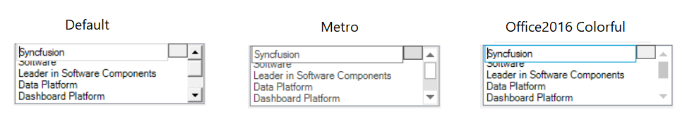

# Style in Windows Forms Editable ListBox (EditableList)

EditableList supports visual styles such as Default, Metro, Office2016. The style can be set using Style property. 

The following code example allows you to set the style for the EditableList.



this.editableList1.Style = Syncfusion.Windows.Forms.Appearance.Office2016;





Me.editableList1.Style = Syncfusion.Windows.Forms.Appearance.Office2016



The Office2016 Style has following Color Schemes

* Colorful
* White
* DarkGray
* Black

The following code example allows you to set the Color Schemes for the Office 2016 Theme.



this.editableList1.Office2016ColorScheme = ScrollBarOffice2016ColorScheme.Colorful;





Me.editableList1.Office2016ColorScheme = ScrollBarOffice2016ColorScheme.Colorful



