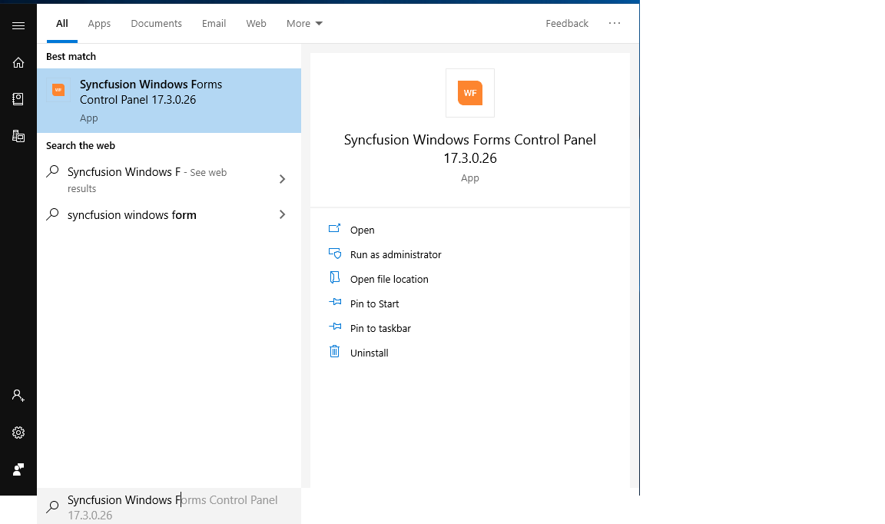

# Featured Samples in Syncfusion Windows Forms Controls

## Syncfusion Windows Forms Controls Panel

To explore the Syncfusion Windows Forms controls and components, open `Syncfusion Windows Forms Controls Panel` by searching it from start and open.

In another way, Open the control panel from the following installed location,

C:\Program Files (x86)\Syncfusion\Essential Studio\{{ site.releaseversion }}\Infrastructure\Launcher\Syncfusion Windows Forms Control Panel.exe

N> In above section, Latest Essential Studio version details has been provided. User can refer installed Essential Studio version instead of mentioned version.

## Windows Forms Sample Browser

To explore the locally installed demos, click `Run Local Demos` which will open `Windows Forms Sample Browser`.

## Offline samples

`Syncfusion Windows Forms Sample Browser` compile and launch the samples installed by Syncfusion installer. The samples are available in the following installed location where you can make changes and further exploration of controls.

C:\Users\Public\Documents\Syncfusion\\Windows\{{ site.releaseversion }}

## GitHub Demos

You can explore Syncfusion Windows Forms controls using [GitHub Windows Forms demos](https://github.com/syncfusion/winforms-demos) where all Windows Forms demos are configured using `NuGet` to run without installing Syncfusion Windows Forms studio.

N> Explore Syncfusion controls in [GitHub](https://github.com/syncfusion/winforms-demos)
