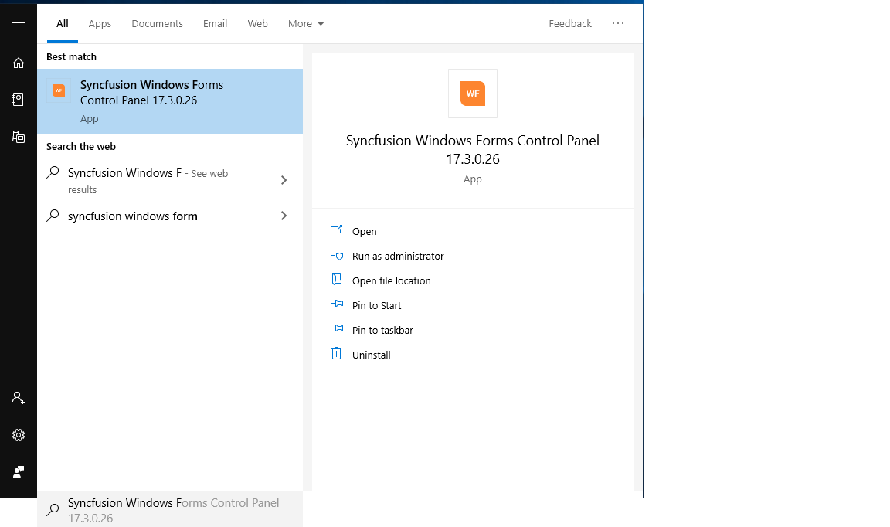
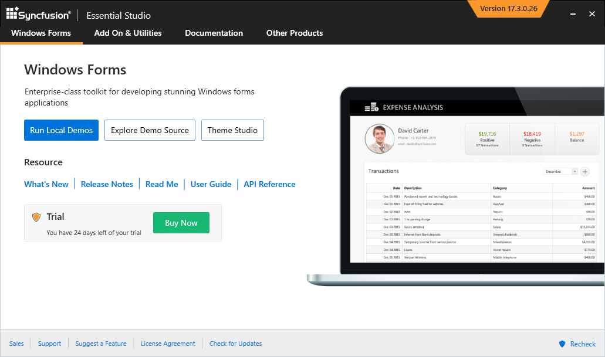
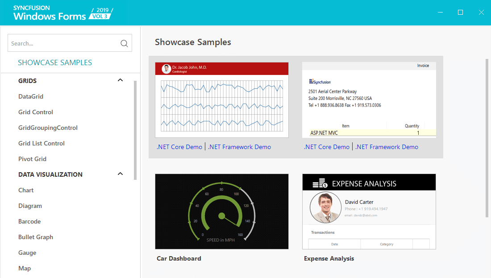

# Featured Samples in Windows Forms Controls

Syncfusion® ships multiple ways to explore the Essential® Windows Forms samples. Use the option that best matches your environment:

* **Windows Forms Controls Panel** – a desktop shortcut for accessing utilities, documentation, and the local Sample Browser.
* **Windows Forms Sample Browser** – browse and run the pre-compiled demos that are installed on your machine.
* **Offline Samples** – open the individual sample projects in Visual Studio to inspect or modify the source.
* **GitHub Demos** – the same set of samples, configured to use NuGet packages so they can be built without installing Syncfusion Windows Forms Studio.

> The installation path and the `{{ site.releaseversion }}` placeholder shown below refer to the latest Essential Studio version. Use the Essential Studio version installed on your machine when browsing local paths.

## Prerequisites

Before exploring the samples, complete the following setup:

* Install [Syncfusion® Essential Studio® Windows Forms](https://help.syncfusion.com/common/essential-studio/download).
* Make sure your environment meets the [System Requirements](https://help.syncfusion.com/windowsforms/system-requirements) for Syncfusion Windows Forms controls.
* Install a supported version of Microsoft Visual Studio. For the exact supported versions, see [System Requirements](https://help.syncfusion.com/windowsforms/system-requirements).
* Internet access is required the first time you build the GitHub demos, because NuGet packages must be restored from the public NuGet feed.

> The exact prerequisites may vary based on the installed Syncfusion version and Visual Studio version. Refer to the Syncfusion Windows Forms documentation for the latest setup instructions.

## Syncfusion Windows Forms Controls Panel

The **Syncfusion Windows Forms Controls Panel** is a desktop launcher that provides quick access to Syncfusion utilities, installed-version details, and the local Sample Browser. To open it, use any of the following options:

* Search for **Syncfusion Windows Forms Controls Panel** in the Start menu and press **Enter**.
* Browse to the installed location of Essential Studio and double-click `"Syncfusion Windows Forms Control Panel.exe"`.

The default installation locations are:

* `C:\Program Files (x86)\Syncfusion\Essential Studio\{{ site.releaseversion }}\Infrastructure\Launcher\Syncfusion Windows Forms Control Panel.exe`
* `C:\Program Files\Syncfusion\Essential Studio\{{ site.releaseversion }}\Infrastructure\Launcher\Syncfusion Windows Forms Control Panel.exe`

> The installation path may vary depending on the installed Syncfusion version and installation scope (per-user or system-wide).

Alternatively, open the Control Panel from the same installed location by double-clicking the executable.

## Windows Forms Sample Browser

The **Windows Forms Sample Browser** lets you browse and run the pre-compiled demos that ship with the Syncfusion installer. It is organized by control category and provides a description, screenshots, and a code-browse view for each sample.

To open the Sample Browser from the Syncfusion Windows Forms Controls Panel, click **Run Local Demos**. The Sample Browser launches the locally installed demos.

> If **Run Local Demos** is missing or greyed out, confirm that the Syncfusion Essential Studio Windows Forms installation completed successfully and that the Samples option was selected during installation. Refer to the [Troubleshooting](#troubleshooting) section for additional guidance.

## Offline samples

The **Syncfusion Windows Forms Sample Browser** launches the pre-compiled samples installed by the Syncfusion installer. The sample projects are also available at the following installed location, where you can make changes and further explore the controls:

`C:\Users\Public\Documents\Syncfusion\Windows\{{ site.releaseversion }}`

> The installation path may vary depending on the installed Syncfusion version and installation scope (per-user or system-wide).

To open an individual sample in Visual Studio:

1. Browse to the sample folder under the offline samples location.
2. Open the sample's `.sln` file in Visual Studio.
3. Restore the required NuGet packages, if applicable.
4. Set the desired sample project as the startup project.
5. Press **F5** to build and run the sample.

> Refer to the [Syncfusion Windows Forms System Requirements](https://help.syncfusion.com/windowsforms/system-requirements) for the supported Visual Studio and .NET versions.

## GitHub Demos

You can explore Syncfusion Windows Forms controls using the [GitHub Windows Forms demos](https://github.com/syncfusion/winforms-demos), where all Windows Forms demos are configured using NuGet to run without installing Syncfusion Windows Forms Studio. Internet access is required for the initial NuGet package restore.

To run the GitHub demos:

1. Clone or download the [winforms-demos](https://github.com/syncfusion/winforms-demos) repository.
2. Open the solution file in Visual Studio.
3. Restore the required NuGet packages from the public NuGet feed.
4. Set the desired sample project as the startup project.
5. Press **F5** to build and run the sample.

> Refer to the GitHub repository README for the latest setup instructions and supported Visual Studio and .NET versions.

## Troubleshooting

If you encounter any of the following issues, try the suggested steps before contacting support:

* **"Run Local Demos" is missing or greyed out in the Controls Panel.**  
  Confirm that the Syncfusion Essential Studio Windows Forms installation completed successfully and that the Samples option was selected during installation. Repair the installation from **Apps & Features** if needed.

* **Sample Browser fails to launch or closes immediately.**  
  Verify the installed Syncfusion version, repair the installation, and confirm that the required .NET runtime is available. Refer to the [System Requirements](https://help.syncfusion.com/windowsforms/system-requirements) for the supported runtimes.

* **A license-related message is displayed at runtime.**  
  Register a valid Syncfusion license key as described in the [Syncfusion Windows Forms licensing overview](https://help.syncfusion.com/windowsforms/licensing/overview).

* **NuGet restore fails when building the GitHub demos.**  
  Confirm that you have internet access and that the configured NuGet feed is reachable. For more information, see [Install Syncfusion Windows Forms NuGet packages](https://help.syncfusion.com/windowsforms/installation/install-nuget-packages).

* **Build errors about missing assemblies or namespaces in an offline sample.**  
  Verify the project references and confirm that the required Syncfusion assemblies are available at the local install path. Refer to the [Installation](https://help.syncfusion.com/windowsforms/installation) guide for details.

## See Also

* [Syncfusion® Windows Forms Installation](https://help.syncfusion.com/windowsforms/installation)
* [Syncfusion® Windows Forms System Requirements](https://help.syncfusion.com/windowsforms/system-requirements)
* [Syncfusion® Windows Forms Overview](https://help.syncfusion.com/windowsforms/overview)
* [Syncfusion® Windows Forms Deployment Guide](https://help.syncfusion.com/windowsforms/deployment)
* [Syncfusion® Windows Forms Licensing](https://help.syncfusion.com/windowsforms/licensing/overview)
* [GitHub Windows Forms Demos](https://github.com/syncfusion/winforms-demos)
