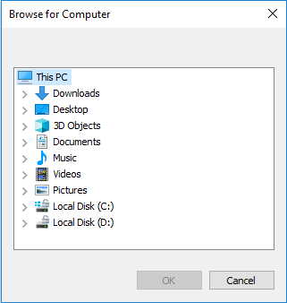

# Getting Started with Windows Forms Folder Browser

## Assembly deployment

Refer to the [control dependencies](https://help.syncfusion.com/windowsforms/control-dependencies#folderbrowser) section to get the list of assemblies or NuGet package that needs to be added as a reference to use the control in any application.

You can find more details about installing the NuGet package in a Windows Forms application in the following link: 

[How to install nuget packages](https://help.syncfusion.com/windowsforms/installation/install-nuget-packages)

## Create a simple application with FolderBrowser

You can create a Windows Forms application with the FolderBrowser control using the following steps:

## Create a project

Create a new Windows Forms project in Visual Studio to select the a folder using the FolderBrowser control.

## Add control through designer

The FolderBrowser control can be added to an application by dragging it from the toolbox to a designer view. The **Syncfusion.Shared.Base** assembly reference will be added automatically to the project.

 

## Add control manually in code

To add the control manually in C#, follow the given steps:

1. Add the **Syncfusion.Shared.Base** assembly reference to the project.

2. Include the FolderBrowser control namespace **Syncfusion.Windows.Forms;**.




using Syncfusion.Windows.Forms.Tools;


Imports Syncfusion.Windows.Forms.Tools

 

{{ codesnippet1 | OrderList_Indent_Level_1 }} 

3. Create a FolderBrowser control instance, and invoke the [FolderBrowser.ShowDialog()](https://help.syncfusion.com/cr/windowsforms/Syncfusion.Windows.Forms.FolderBrowser.html#Syncfusion_Windows_Forms_FolderBrowser_ShowDialog().html) method to display the FolderBrowser dialog.




//FolderBrowser instance
FolderBrowser folderBrowser1;

folderBrowser1 = new FolderBrowser();
// Specify the Start location.
this.folderBrowser1.StartLocation = Syncfusion.Windows.Forms.FolderBrowserFolder.MyComputer;

// Specify the styles for the FolderBrowser Dialog.
this.folderBrowser1.Style = (Syncfusion.Windows.Forms.FolderBrowserStyles.RestrictToFilesystem | Syncfusion.Windows.Forms.FolderBrowserStyles.BrowseForComputer);

//Display the folder browser dialog window
this.folderBrowser1.ShowDialog();


'FolderBrowser instance
Private folderBrowser1 As FolderBrowser

InitializeComponent()
folderBrowser1 = New FolderBrowser()

' Specify the Start location.
Me.folderBrowser1.StartLocation = Syncfusion.Windows.Forms.FolderBrowserFolder.MyComputer

' Specify the styles for the FolderBrowser Dialog.
Me.folderBrowser1.Style = (Syncfusion.Windows.Forms.FolderBrowserStyles.RestrictToFilesystem Or Syncfusion.Windows.Forms.FolderBrowserStyles.BrowseForComputer)

'Display the folder browser dialog window
Me.folderBrowser1.ShowDialog()



{{ codesnippet2 | OrderList_Indent_Level_1 }}  

 

## Auto complete file path

The FolderBrowser control supports editing folder location and auto-complete, which displays available folder paths in a drop-down list to choose by setting the folder browser [Style](https://help.syncfusion.com/cr/windowsforms/Syncfusion.Windows.Forms.FolderBrowser.html#Syncfusion_Windows_Forms_FolderBrowser_Style) to ShowTextBox.



this.folderBrowser1.Style = Syncfusion.Windows.Forms.FolderBrowserStyles.ShowTextBox;


Me.folderBrowser1.Style = Syncfusion.Windows.Forms.FolderBrowserStyles.ShowTextBox

 

 

