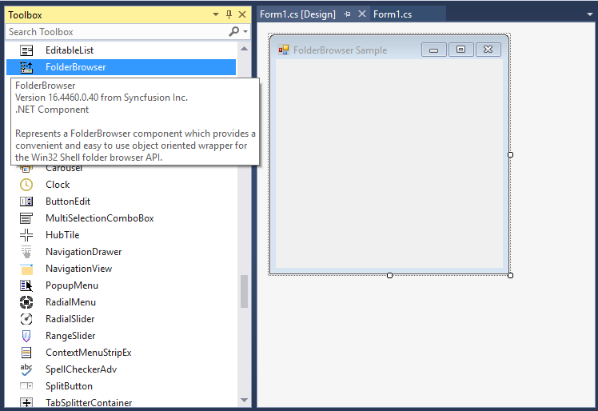
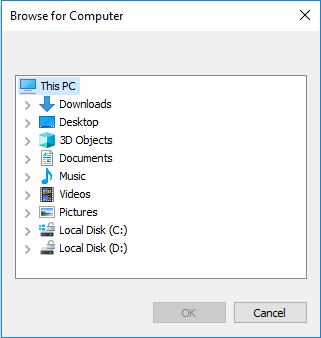
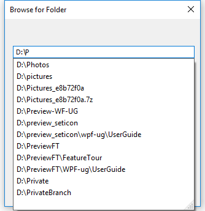

---
layout: post
title: Getting Started with Windows Forms FolderBrowser | Syncfusion®
description: Learn here about getting started with Syncfusion Windows Forms FolderBrowser control, its elements, and more.
platform: windowsforms
control: FolderBrowser
documentation: ug
---

# Getting Started with WinForms Folder Browser

## Assembly deployment

Refer to the [control dependencies](https://help.syncfusion.com/windowsforms/control-dependencies#folderbrowser) section to get the list of assemblies or NuGet packages that need to be added as a reference to use the control in any application.

You can find more details about installing the NuGet package in a Windows Forms application at the following link:

[How to install NuGet packages](https://help.syncfusion.com/windowsforms/installation/install-nuget-packages)

## Create a simple application with WinForms Folder Browser

You can create a Windows Forms application with the WinForms Folder Browser control using the following steps:

## Create a project

Create a new Windows Forms project in Visual Studio to select a folder using the WinForms Folder Browser control.

## Add control through designer

The WinForms Folder Browser control can be added to an application by dragging it from the toolbox onto the designer surface. The **Syncfusion.Shared.Base** assembly reference will be added automatically to the project.

## Add control manually in code

To add the control manually, follow the steps below:

1. Add the **Syncfusion.Shared.Base** assembly reference to the project.

2. Add the **Syncfusion.Windows.Forms.Tools** namespace:




using Syncfusion.Windows.Forms.Tools;


Imports Syncfusion.Windows.Forms.Tools



{{ codesnippet1 | OrderList_Indent_Level_1 }}

3. Create a WinForms Folder Browser control instance and invoke the [FolderBrowser.ShowDialog()](https://help.syncfusion.com/cr/windowsforms/Syncfusion.Windows.Forms.FolderBrowser.html#Syncfusion_Windows_Forms_FolderBrowser_ShowDialog) method to display the dialog.




// FolderBrowser instance (assumes the form declares a field: private FolderBrowser folderBrowser1;).
folderBrowser1 = new FolderBrowser();

// Specify the start location.
this.folderBrowser1.StartLocation = Syncfusion.Windows.Forms.FolderBrowserFolder.MyComputer;

// Specify the styles for the FolderBrowser dialog.
this.folderBrowser1.Style = Syncfusion.Windows.Forms.FolderBrowserStyles.RestrictToFilesystem
                          | Syncfusion.Windows.Forms.FolderBrowserStyles.BrowseForComputer;

// Display the folder browser dialog.
this.folderBrowser1.ShowDialog();


' FolderBrowser instance (assumes the form declares a field: Private folderBrowser1 As FolderBrowser).
folderBrowser1 = New FolderBrowser()

' Specify the start location.
Me.folderBrowser1.StartLocation = Syncfusion.Windows.Forms.FolderBrowserFolder.MyComputer

' Specify the styles for the FolderBrowser dialog.
Me.folderBrowser1.Style = Syncfusion.Windows.Forms.FolderBrowserStyles.RestrictToFilesystem _
                          Or Syncfusion.Windows.Forms.FolderBrowserStyles.BrowseForComputer

' Display the folder browser dialog.
Me.folderBrowser1.ShowDialog()



{{ codesnippet2 | OrderList_Indent_Level_1 }}

## Auto complete file path

The WinForms Folder Browser control supports editing a folder location and auto-complete, which displays available folder paths in a drop-down list to choose from. To enable this, set the [Style](https://help.syncfusion.com/cr/windowsforms/Syncfusion.Windows.Forms.FolderBrowser.html#Syncfusion_Windows_Forms_FolderBrowser_Style) property to `ShowTextBox`.



this.folderBrowser1.Style = Syncfusion.Windows.Forms.FolderBrowserStyles.ShowTextBox;


Me.folderBrowser1.Style = Syncfusion.Windows.Forms.FolderBrowserStyles.ShowTextBox



 

