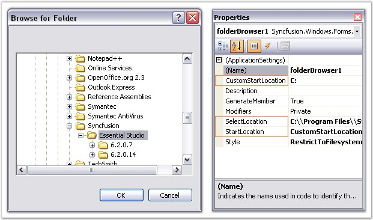

# Location Settings in WinForms Folder Browser

This section deals with the location settings of the WinForms Folder Browser control.

The WinForms Folder Browser allows the user to specify the location from which browsing should start. It also provides various options from which the root folder for browsing can be selected. The following properties illustrate this:

* [StartLocation](https://help.syncfusion.com/cr/windowsforms/Syncfusion.Windows.Forms.FolderBrowser.html#Syncfusion_Windows_Forms_FolderBrowser_StartLocation) - Sets the well-known root folder from which browsing should start (for example, `MyComputer`, `Desktop`, `CustomStartLocation`).
* [CustomStartLocation](https://help.syncfusion.com/cr/windowsforms/Syncfusion.Windows.Forms.FolderBrowser.html#Syncfusion_Windows_Forms_FolderBrowser_CustomStartLocation) - Sets the path used when `StartLocation` is set to `CustomStartLocation`.
* [SelectLocation](https://help.syncfusion.com/cr/windowsforms/Syncfusion/Syncfusion.Windows.Forms.FolderBrowser.html#Syncfusion_Windows_Forms_FolderBrowser_SelectLocation) - Automatically scrolls to and highlights the specified path when the dialog opens.
* [DirectoryPath](https://help.syncfusion.com/cr/windowsforms/Syncfusion.Windows.Forms.FolderBrowser.html#Syncfusion_Windows_Forms_FolderBrowser_DirectoryPath) - Gets the final path selected by the user.

>**Note**: For the [SelectLocation](https://help.syncfusion.com/cr/windowsforms/Syncfusion.Windows.Forms.FolderBrowser.html#Syncfusion_Windows_Forms_FolderBrowser_SelectLocation) property to take effect, the [StartLocation](https://help.syncfusion.com/cr/windowsforms/Syncfusion.Windows.Forms.FolderBrowser.html#Syncfusion_Windows_Forms_FolderBrowser_StartLocation) property must be set to `CustomStartLocation`.



// Set the enumeration value FolderBrowserFolder.CustomStartLocation for the StartLocation property.
this.folderBrowser1.StartLocation = Syncfusion.Windows.Forms.FolderBrowserFolder.CustomStartLocation;
this.folderBrowser1.CustomStartLocation = "C:";

// SelectLocation property for automatic scroll and highlight of the desired path.
this.folderBrowser1.SelectLocation = "C:\\Program Files\\Syncfusion\\Essential Studio";


' Set the enumeration value FolderBrowserFolder.CustomStartLocation for the StartLocation property.
Me.folderBrowser1.StartLocation = Syncfusion.Windows.Forms.FolderBrowserFolder.CustomStartLocation
Me.folderBrowser1.CustomStartLocation = "C:"

' SelectLocation property for automatic scroll and highlight of the desired path.
Me.folderBrowser1.SelectLocation = "C:\Program Files\Syncfusion\Essential Studio"



A sample that demonstrates the Location Settings of the WinForms Folder Browser is available at the following sample installation path:

`%USERPROFILE%\Documents\Syncfusion\EssentialStudio\<Version Number>\Windows\Tools.Windows\Samples\2.0\Editors Package\FolderBrowserDemo`
