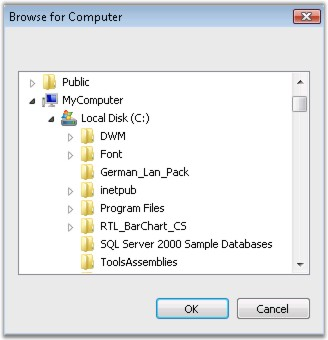

# About Syncfusion® Windows Forms Folder Browser Control.

The Essential® Tools FolderBrowser component provides a convenient and easy to use object oriented wrapper for the Win32 Shell Folder Browser API. This class completely abstracts the intricacies involved in using the various complex Shell API functions, structures and callback routines required for working with the Windows Folder Selection Dialog and allows Windows Forms developers to work with.NET-centric properties, events and methods.

