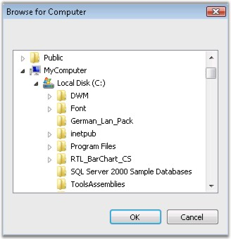

# About Syncfusion® WinForms Folder Browser Control

The Essential® Tools WinForms Folder Browser component provides a convenient, easy-to-use, object-oriented wrapper for the Win32 Shell Folder Browser API. This class completely abstracts the intricacies involved in using the various complex Shell API functions, structures, and callback routines required for working with the Windows Folder Selection Dialog, and allows Windows Forms developers to work with .NET-centric properties, events, and methods.

