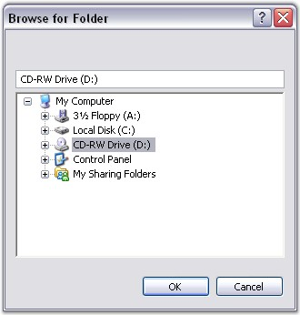

# Style Settings in WinForms Folder Browser

The various options of the [Style](https://help.syncfusion.com/cr/windowsforms/Syncfusion.Windows.Forms.FolderBrowser.html#Syncfusion_Windows_Forms_FolderBrowser_Style) property are described below.

* **RestrictToFilesystem** - Restricts selection to file system directories.
* **RestrictToSubfolders** - Returns only file system ancestors.
* **RestrictToDomain** - Excludes network folders below the domain level.
* **BrowseForComputer** - Displays only computers.
* **BrowseForEverything** - Displays files as well as folders.
* **BrowseForPrinter** - Displays only printers.
* **NewDialogStyle** - Uses the new resizable folder selection dialog.
* **AllowUrls** - Displays URLs. `NewDialogStyle` and `BrowseForEverything` must be set along with this flag.
* **ShowAdministrativeShares** - Displays administrative shares that exist on the remote system.
* **ShowShares** - Displays shareable resources that exist on the remote system.
* **ShowTextBox** - Displays a text box in the WinForms Folder Browser dialog.
* **StatusText** - Includes a status area in the dialog box. The status text can be specified in the `FolderBrowserCallBack` event handler. This style does not apply to `NewDialogStyle`.
* **UAHint** - Adds a usage hint to the folder dialog. It can be applied only with `NewDialogStyle`.
* **Validate** - Typing an invalid name in the text box triggers the `FolderBrowserCallBack` event.



this.folderBrowser1.Style = Syncfusion.Windows.Forms.FolderBrowserStyles.ShowTextBox;


Me.folderBrowser1.Style = Syncfusion.Windows.Forms.FolderBrowserStyles.ShowTextBox



A sample that demonstrates the Style Settings of the WinForms Folder Browser is available at the following sample installation path:

`%USERPROFILE%\Documents\Syncfusion\EssentialStudio\<Version Number>\Windows\Tools.Windows\Samples\Advanced Editor Functions\ActionGroupingDemo`
