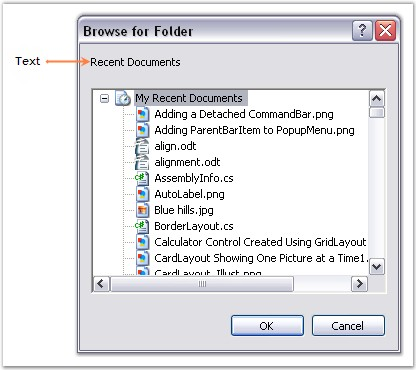

# Text Settings in WinForms Folder Browser

The text settings of the WinForms Folder Browser control are described below.

The text for the WinForms Folder Browser can be set using the [Description](https://help.syncfusion.com/cr/windowsforms/Syncfusion.Windows.Forms.FolderBrowser.html#Syncfusion_Windows_Forms_FolderBrowser_Description) property.





this.folderBrowser1.Description = "Recent Documents";





Me.folderBrowser1.Description = "Recent Documents"





