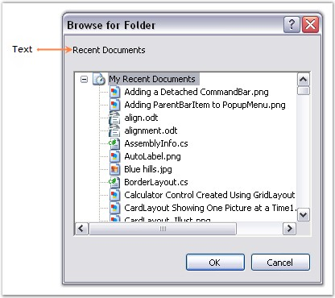

# Text Settings in WinForms Folder Browser

The text settings of the WinForms Folder Browser control are described below.

The description text shown at the top of the WinForms Folder Browser dialog can be set using the [Description](https://help.syncfusion.com/cr/windowsforms/Syncfusion.Windows.Forms.FolderBrowser.html#Syncfusion_Windows_Forms_FolderBrowser_Description) property.



this.folderBrowser1.Description = "Recent Documents";


Me.folderBrowser1.Description = "Recent Documents"



