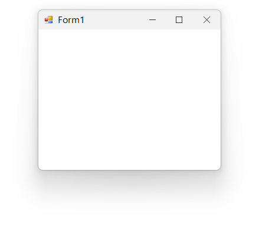

# Form Customization in Windows Forms Form (SfForm)

## Form icon

A form icon designates the picture that represents the form in the taskbar as well as the icon displayed on the title bar of the form.

### Changing form icon

The form icon displayed on the title bar and task bar can be changed by using the [Icon](https://docs.microsoft.com/en-us/dotnet/api/system.windows.forms.form.icon?view=net-5.0) property.



this.Icon = new Icon("sfIcon.ico");


Me.Icon = New Icon("sfIcon.ico")



### Form icon alignment

The form icon can be aligned vertically and horizontally by using the [Style.TitleBar.IconVerticalAlignment](https://help.syncfusion.com/cr/windowsforms/Syncfusion.WinForms.Controls.Styles.TitleBarStyleInfo.html#Syncfusion_WinForms_Controls_Styles_TitleBarStyleInfo_IconVerticalAlignment) and [Style.TitleBar.IconHorizontalAlignment](https://help.syncfusion.com/cr/windowsforms/Syncfusion.WinForms.Controls.Styles.TitleBarStyleInfo.html#Syncfusion_WinForms_Controls_Styles_TitleBarStyleInfo_IconHorizontalAlignment) properties.



this.Style.TitleBar.IconVerticalAlignment = VerticalAlignment.Top;
this.Style.TitleBar.IconHorizontalAlignment = HorizontalAlignment.Right;


Me.Style.TitleBar.IconVerticalAlignment = VerticalAlignment.Top
Me.Style.TitleBar.IconHorizontalAlignment = HorizontalAlignment.Right



## Form border

Appearance of the border can be customized by using the [Style.Border](https://help.syncfusion.com/cr/windowsforms/Syncfusion.WinForms.Controls.Styles.FormVisualStyle.html#Syncfusion_WinForms_Controls_Styles_FormVisualStyle_Border) and [Style.InactiveBorder](https://help.syncfusion.com/cr/windowsforms/Syncfusion.WinForms.Controls.Styles.FormVisualStyle.html#Syncfusion_WinForms_Controls_Styles_FormVisualStyle_InactiveBorder) properties.



//Customize active state border appearance
this.Style.Border = new Pen(Color.SkyBlue, 2);

//Customize inactive state border appearance
this.Style.InactiveBorder = new Pen(Color.LightGray, 2);


'Customize active state border appearance
Me.Style.Border = New Pen(Color.SkyBlue, 2)

'Customize inactive state border appearance
Me.Style.InactiveBorder = New Pen(Color.LightGray, 2)



## Shadow effect

Shadow effect of the form can be customized by using the [Style.ShadowOpacity](https://help.syncfusion.com/cr/windowsforms/Syncfusion.WinForms.Controls.Styles.FormVisualStyle.html#Syncfusion_WinForms_Controls_Styles_FormVisualStyle_ShadowOpacity) and [Style.InactiveShadowOpacity](https://help.syncfusion.com/cr/windowsforms/Syncfusion.WinForms.Controls.Styles.FormVisualStyle.html#Syncfusion_WinForms_Controls_Styles_FormVisualStyle_InactiveShadowOpacity) properties.



//Customize the shadow for active state
this.Style.ShadowOpacity = 255;

//Customize the shadow for inactive state
this.Style.InactiveShadowOpacity = 100;


'Customize the shadow for active state
Me.Style.ShadowOpacity = 255

'Customize the shadow for inactive state
Me.Style.InactiveShadowOpacity = 100



N> Shadow can be disabled by setting the `ShadowOpacity` property as zero.

## Rounded corner

Rounded corners for `SfForm` can be enabled by using [AllowRoundedCorners](https://help.syncfusion.com/cr/windowsforms/Syncfusion.WinForms.Controls.SfForm.html#Syncfusion_WinForms_Controls_SfForm_AllowRoundedCorners) property. Rounded corners are not supported in OS versions lower than Windows 11. Enabling `AllowRoundedCorners` property will have no effect in those operating systems. 
When the rounded corners are enabled, the border and shadow of the Form are drawn by the operating system.





this.AllowRoundedCorners = true;





Me.AllowRoundedCorners = true
 




