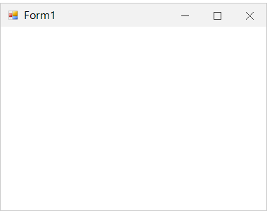
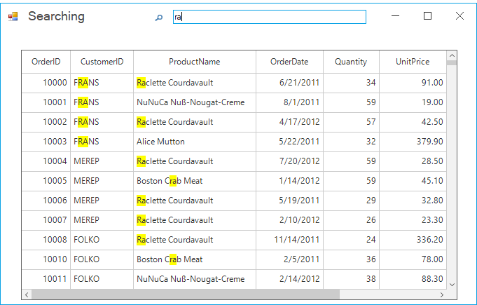

# Getting Started with Windows Forms Form (SfForm)

## Assembly Deployment

Refer [control dependencies](https://help.syncfusion.com/windowsforms/control-dependencies#sfform) section to get the list of assemblies or NuGet package needs to be added as reference to use the control in any application. 

## Converting Standard Form into SfForm

The default form can be changed into SfForm by the following steps:

1. Create a new Windows Forms Application in Visual Studio and refer to the `Syncfusion.Core.WinForms` assembly.

2. Include the following namespace to the directives list.




using Syncfusion.WinForms.Controls;



{{ codesnippet1 | OrderList_Indent_Level_1 }}

3. Change the base class of your form from `System.Windows.Forms.Form` to `SfForm`.




public partial class Form1 : SfForm
{
    public Form1()
    {
        InitializeComponent();
    }
}



{{ codesnippet2 | OrderList_Indent_Level_1 }}

## Title Bar Customization

By default, the SfForm loads with the default appearance, that  can be customized by using the [TitleBarStyleInfo](https://help.syncfusion.com/cr/windowsforms/Syncfusion.WinForms.Controls.Styles.TitleBarStyleInfo.html) property. It contains all the settings for the appearance of the form.



//Sets the back color and fore color of the title bar.
this.Style.TitleBar.BackColor = Color.Black;
this.Style.TitleBar.ForeColor = Color.White;

//Sets the fore color of the title bar buttons
this.Style.TitleBar.CloseButtonForeColor = Color.White;
this.Style.TitleBar.MinimizeButtonForeColor = Color.White;
this.Style.TitleBar.MaximizeButtonForeColor = Color.White;

//Sets the hover state back color of the title bar buttons
this.Style.TitleBar.CloseButtonHoverBackColor = Color.DarkGray;
this.Style.TitleBar.MinimizeButtonHoverBackColor = Color.DarkGray;
this.Style.TitleBar.MaximizeButtonHoverBackColor = Color.DarkGray;

//Sets the pressed state back color of the title bar buttons
this.Style.TitleBar.CloseButtonPressedBackColor = Color.Gray;
this.Style.TitleBar.MaximizeButtonPressedBackColor = Color.Gray;
this.Style.TitleBar.MinimizeButtonPressedBackColor = Color.Gray;



## Border Customization

The borders of the form can be customized by using the [Style.Border](https://help.syncfusion.com/cr/windowsforms/Syncfusion.WinForms.Controls.Styles.FormVisualStyle.html#Syncfusion_WinForms_Controls_Styles_FormVisualStyle_Border) and [Style.InactiveBorder](https://help.syncfusion.com/cr/windowsforms/Syncfusion.WinForms.Controls.Styles.FormVisualStyle.html#Syncfusion_WinForms_Controls_Styles_FormVisualStyle_InactiveBorder) properties.



this.Style.Border = new Pen(Color.Black, 5);
this.Style.InactiveBorder = new Pen(Color.Gray, 5);



## Loading User Control to the Title Bar

You can load any user control to the title bar of the SfForm instead of the title bar text by using the [TitleBarTextControl](https://help.syncfusion.com/cr/windowsforms/Syncfusion.WinForms.Controls.SfForm.html#Syncfusion_WinForms_Controls_SfForm_TitleBarTextControl) property.



FlowLayoutPanel searchPanel = new FlowLayoutPanel();
Label searchingLabel = new Label();
searchingLabel.Text = "Searching";
TextBox searchBox = new TextBox();
searchPanel.Controls.Add(searchingLabel);
searchPanel.Controls.Add(searchBox);

//Loads the searchPanel to the title bar.
this.TitleBarTextControl = searchPanel;



