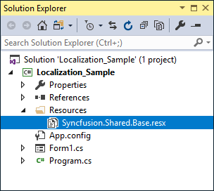
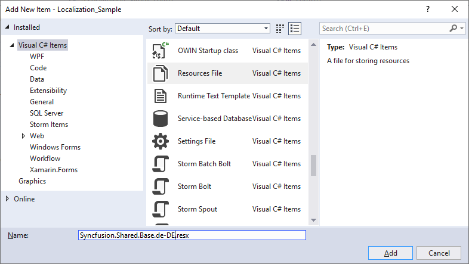
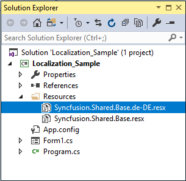
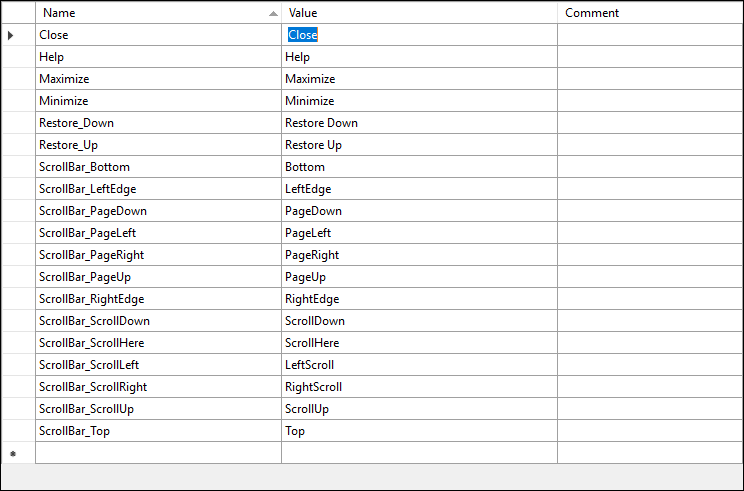
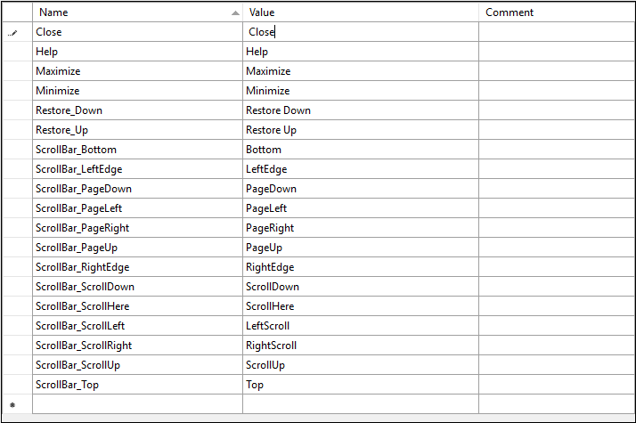

# Localization in Windows Forms Form (SfForm)
Localization is the process of translating the application resources into different language for the specific cultures. The SfForm can be localized by adding [resource](https://learn.microsoft.com/en-us/previous-versions/visualstudio/visual-studio-2010/aa992030(v=vs.100)) file. Application culture can be changed by setting [CurrentUICulture ](https://learn.microsoft.com/en-us/dotnet/api/system.globalization.cultureinfo.currentuiculture?view=net-5.0)before `InitializeComponent` method.

## Localize at Sample Level
To localize the SfForm based on `CurrentUICulture` using resource files, follow the below steps.

1. Create new folder and named as Resources in your application.

2. Add the default resource file of SfForm into Resources folder. You can download the `Syncfusion.Shared.Base.resx` [here](https://github.com/syncfusion/winforms-controls-localization-resx-files/blob/master/Syncfusion.Shared.Base/Syncfusion.Shared.Base.resx).

 

3. Right-click on the Resources folder, select **Add** and then **NewItem**.

4. In Add New Item wizard, select the **Resource File** option and name the filename as Syncfusion.Shared.Base.&lt;culture name&gt;.resx. For example, have to give name as Syncfusion.Shared.Base.de-DE.resx for German culture.

5. The culture name that indicates the name of language and country.
6. Now, select `Add` option to add the resource file in **Resources** folder.

 

7. Add the Name/Value pair in Resource Designer of Syncfusion.Shared.Base.de-DE.resx file and change its corresponding value to corresponding culture.

 

8. Now, set the `CurrentCulture` of the Application before the `InitializeComponent` method and Run the sample.




public Form1()
{
    System.Threading.Thread.CurrentThread.CurrentCulture = new System.Globalization.CultureInfo("de-DE");
    System.Threading.Thread.CurrentThread.CurrentUICulture = new System.Globalization.CultureInfo("de-DE");
    InitializeComponent();
}        


Public Sub New()
	System.Threading.Thread.CurrentThread.CurrentCulture = New System.Globalization.CultureInfo("de-DE")
	System.Threading.Thread.CurrentThread.CurrentUICulture = New System.Globalization.CultureInfo("de-DE")
	InitializeComponent()
End Sub  



{{ codesnippet1 | OrderList_Indent_Level_1 }}

## Editing Default Resource File
The default resource file can be edited by adding it to Resources folder of the application where SfForm reads the static texts from here. The default resource file can be download from [here](https://github.com/syncfusion/winforms-controls-localization-resx-files/blob/master/Syncfusion.Shared.Base/Syncfusion.Shared.Base.resx).

Now, change the Name/Value pair in Resource Designer of `Syncfusion.Shared.Base.resx` file.

## Localize Resource File with Different Assembly or Namespace
If resource (.resx) files are added into different assembly other than start up application, call the `SetResources` method of `LocalizationResource` follows.



public Form1()
{
   System.Threading.Thread.CurrentThread.CurrentUICulture = new System.Globalization.CultureInfo("de-DE");
   LocalizationResourceBase.SetResources(typeof(ClassName).Assembly, "NameSpace");
   InitializeComponent();
}        


public Form1()
{
    System.Threading.Thread.CurrentThread.CurrentUICulture = New System.Globalization.CultureInfo("de-DE")
    LocalizationResourceBase.SetResources(GetType(ClassName).Assembly, "NameSpace")
    InitializeComponent()
}        


