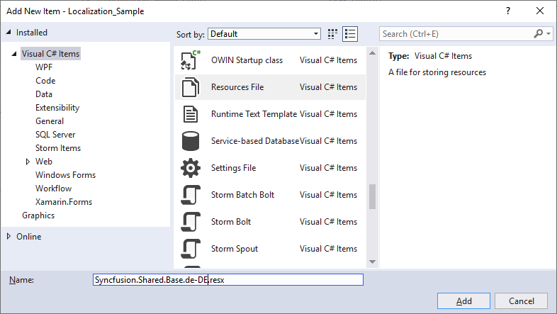
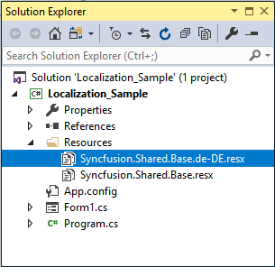
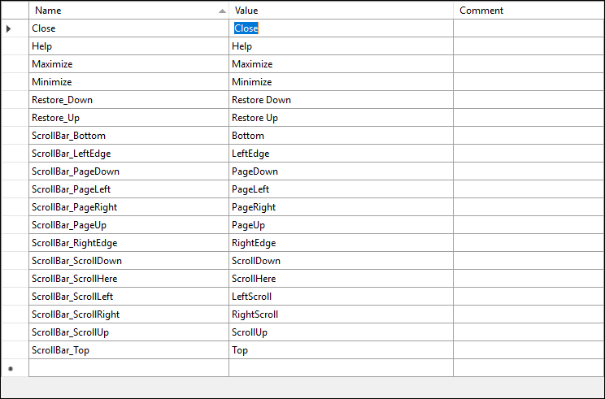
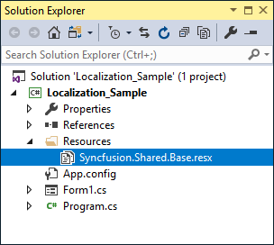
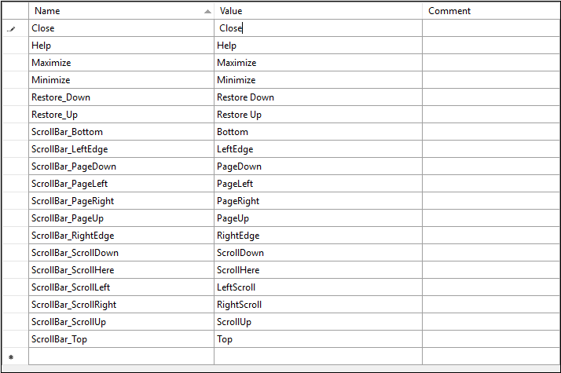

# Localization in Windows Forms Form (SfForm)
Localization is the process of translating the application resources into different languages for specific cultures. The SfForm can be localized by adding a [resource](https://learn.microsoft.com/en-us/previous-versions/visualstudio/visual-studio-2010/aa992030(v=vs.100)) file. The application culture can be changed by setting the [CurrentUICulture](https://learn.microsoft.com/en-us/dotnet/api/system.globalization.cultureinfo.currentuiculture?view=net-5.0) before the `InitializeComponent` method.

## Localize at Sample Level
To localize the SfForm based on `CurrentUICulture` using resource files, follow the steps below.

1. Create a new folder and name it **Resources** in your application.

2. Add the default resource file of SfForm into the **Resources** folder. You can download the `Syncfusion.Shared.Base.resx` from the [Syncfusion localization repository](https://github.com/syncfusion/winforms-controls-localization-resx-files/blob/master/Syncfusion.Shared.Base/Syncfusion.Shared.Base.resx).

 

3. Right-click on the **Resources** folder, select **Add**, and then **New Item**.

4. In the **Add New Item** wizard, select the **Resource File** option and name the file as `Syncfusion.Shared.Base.<culture name>.resx`. For example, use the name `Syncfusion.Shared.Base.de-DE.resx` for the German culture.

5. The culture name indicates the language and country.
6. Now, select **Add** to add the resource file to the **Resources** folder.

 

7. Add the Name/Value pair in the **Resource Designer** of the `Syncfusion.Shared.Base.de-DE.resx` file and change its corresponding value to the localized string.

 

8. Now, set the `CurrentCulture` of the application before the `InitializeComponent` method and run the sample.




public Form1()
{
    System.Threading.Thread.CurrentThread.CurrentCulture = new System.Globalization.CultureInfo("de-DE");
    System.Threading.Thread.CurrentThread.CurrentUICulture = new System.Globalization.CultureInfo("de-DE");
    InitializeComponent();
}        


Public Sub New()
	System.Threading.Thread.CurrentThread.CurrentCulture = New System.Globalization.CultureInfo("de-DE")
	System.Threading.Thread.CurrentThread.CurrentUICulture = New System.Globalization.CultureInfo("de-DE")
	InitializeComponent()
End Sub  



{{ codesnippet1 | OrderList_Indent_Level_1 }}

## Editing Default Resource File
The default resource file can be edited by adding it to the **Resources** folder of the application, which is where SfForm reads the static texts from. The default resource file can be downloaded from the [Syncfusion localization repository](https://github.com/syncfusion/winforms-controls-localization-resx-files/blob/master/Syncfusion.Shared.Base/Syncfusion.Shared.Base.resx).

Now, change the Name/Value pair in the **Resource Designer** of the `Syncfusion.Shared.Base.resx` file.

## Localize Resource File with Different Assembly or Namespace
If resource (.resx) files are added to a different assembly other than the start-up application, call the `SetResources` method of `LocalizationResourceBase` as follows.



public Form1()
{
   System.Threading.Thread.CurrentThread.CurrentUICulture = new System.Globalization.CultureInfo("de-DE");
   LocalizationResourceBase.SetResources(typeof(ClassName).Assembly, "NameSpace");
   InitializeComponent();
}        


public Form1()
{
    System.Threading.Thread.CurrentThread.CurrentUICulture = New System.Globalization.CultureInfo("de-DE")
    LocalizationResourceBase.SetResources(GetType(ClassName).Assembly, "NameSpace")
    InitializeComponent()
}        


