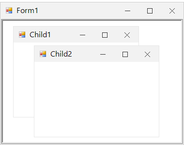

# MDI Customization in Windows Forms Form (SfForm)

Multiple Document Interface applications allows displaying multiple documents (or forms) in an application at the same time. MDI parent is a form that contains MDI child windows which are the sub-windows. A form can be changed as MDI parent by enabling the [IsMDIContainer](https://learn.microsoft.com/en-us/dotnet/api/system.windows.forms.form.ismdicontainer?view=windowsdesktop-7.0&viewFallbackFrom=net-5.0) property.

## Adding MDI child form

MDI child forms can be added to the MDI parent by making it as parent for the child by using the [MDIParent](https://learn.microsoft.com/en-us/dotnet/api/system.windows.forms.form.mdiparent?view=windowsdesktop-7.0&viewFallbackFrom=net-5.0) property.



this.IsMdiContainer = true;

SfForm child1 = new SfForm();
child1.Text = "Child1;
child1.MdiParent = this;
child1.Show();

SfForm child2 = new SfForm();
child2.Text = "Child2";
child2.MdiParent = this;
child2.Show();


Me.IsMdiContainer = True

Dim child1 As New SfForm()
child1.Text = "Child1"
child1.MdiParent = Me
child1.Show()

Dim child2 As New SfForm()
child2.Text = "Child2"
child2.MdiParent = Me
child2.Show()



## Appearance

Appearance of the MDI child forms can be customized by using the [Style](https://help.syncfusion.com/cr/windowsforms/Syncfusion.WinForms.Controls.SfForm.html#Syncfusion_WinForms_Controls_SfForm_Style) property of the child form. It contains all the settings for customizing the child form appearance.



this.IsMdiContainer = true;

//Creating MDI child
SfForm child2 = new SfForm();
Child2.Text = "Child2;
Child2.MdiParent = this;
Child2.Show();

//Customize title bar appearance.
Child2.Style.TitleBar.BackColor = Color.MidnightBlue;
child2.Style.TitleBar.ForeColor = Color.White;

//Customize title bar button appearance.
child2.Style.TitleBar.CloseButtonForeColor = Color.White;
child2.Style.TitleBar.MinimizeButtonForeColor = Color.White;
child2.Style.TitleBar.MaximizeButtonForeColor = Color.White;

//Customize back color of the child form.
child2.BackColor = ColorTranslator.FromHtml("#EDF3F3");


Me.IsMdiContainer = True

'Creating MDI child
Dim child2 As New SfForm()
child2.Text = "Child2"
child2.MdiParent = Me
child2.Show()

'Customize title bar appearance.
child2.Style.TitleBar.BackColor = Color.MidnightBlue
child2.Style.TitleBar.ForeColor = Color.White

'Customize title bar button appearance.
child2.Style.TitleBar.CloseButtonForeColor = Color.White
child2.Style.TitleBar.MinimizeButtonForeColor = Color.White
child2.Style.TitleBar.MaximizeButtonForeColor = Color.White

'Customize back color of the child form.
child2.BackColor = ColorTranslator.FromHtml("#EDF3F3")



## Getting active MDI child

The currently active MDI child form can be retrieved by using the [ActiveMDIChild](https://learn.microsoft.com/en-us/dotnet/api/system.windows.forms.form.activemdichild?view=windowsdesktop-7.0&viewFallbackFrom=net-5.0) property.



SfForm activeChild = this.ActiveMdiChild as SfForm;


Dim activeChild As SfForm = TryCast(Me.ActiveMdiChild, SfForm)



## Notifying the key events for MDI child

By default, the MDI child form will not receive its key events when any control inside the form has focus. This can be changed by enabling the [KeyPreview](https://learn.microsoft.com/en-us/dotnet/api/system.windows.forms.form.keypreview?view=windowsdesktop-7.0&viewFallbackFrom=net-5.0) property of the child form.

When this property is set to `true`, the form will receive `KeyPress`, `KeyDown` and `KeyUp` events. Once the form event handlers have completed the keystroke processing, the keystroke is then assigned to the control with focus.



this.IsMdiContainer = true;

//Creating MDI child
SfForm child1 = new SfForm();
Child1.Text = "Child1;
Child1.MdiParent = this;

//Enabling KeyPreview for the child.
child1.KeyPreview = true;

Child1.Show();


Me.IsMdiContainer = True

'Creating MDI child
Dim child1 As New SfForm()
child1.Text = "Child1"
child1.MdiParent = Me

'Enabling KeyPreview for the child.
child1.KeyPreview = True

child1.Show()


