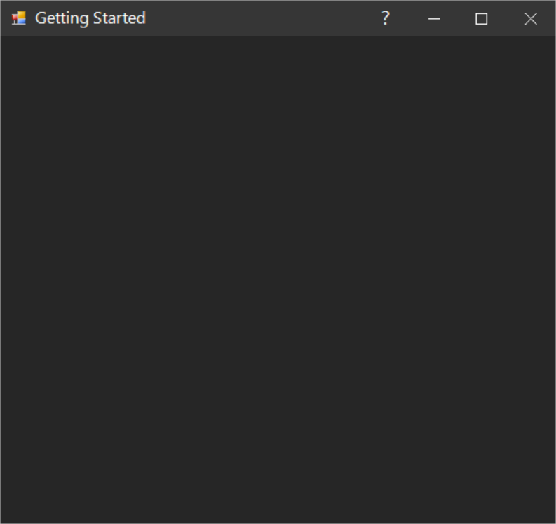

# Themes in Windows Forms Form (SfForm)

[Windows Forms Form](https://www.syncfusion.com/winforms-ui-controls/form) (SfForm) offers the following six built-in themes for professional representation:

* Office2016Colorful
* Office2016White
* Office2016DarkGray
* Office2016Black
* Office2019Colorful
* HighContrastBlack

Themes can be applied to `SfForm` by following these steps:

* `Load theme assembly`
* `Apply theme`

## Load theme assembly

To set theme to `SfForm`, the following assemblies should be added as reference in any application.

<table>
<tr>
<td>
{{'**Assemblies**'| markdownify }}
</td>
<td>
{{'        **Themes**'| markdownify }}
</td>
</tr>
<tr>
<td>
Syncfusion.Office2016Theme.WinForms       
</td>
<td>
Office2016Colorful 
Office2016White 
Office2016DarkGray 
Office2016Black
</td>
</tr>
<tr>
<td>
Syncfusion.Office2019Theme.WinForms
</td>
<td>
Office2019Colorful
</td>
</tr>
<tr>
<td>
Syncfusion.HighContrastTheme.WinForms
</td>
<td>
HighContrastBlack
</td>
</tr>
</table>

Before applying theme to `SfForm`, required theme assembly should be loaded.



using Syncfusion.WinForms.Controls;

static class Program
{
    /// 

    /// The main entry point for an application.
    /// 

    [STAThread]
    static void Main()
    {
        Syncfusion.Licensing.SyncfusionLicenseProvider.RegisterLicense(DemoCommon.FindLicenseKey());
        SfSkinManager.LoadAssembly(typeof(Syncfusion.WinForms.Themes.Office2016Theme).Assembly);
        SfSkinManager.LoadAssembly(typeof(Syncfusion.WinForms.Themes.Office2019Theme).Assembly);
        SfSkinManager.LoadAssembly(typeof(Syncfusion.HighContrastTheme.WinForms.HighContrastTheme).Assembly);
        Application.EnableVisualStyles();
        Application.SetCompatibleTextRenderingDefault(false);
        Application.Run(new Form1());
    }
}


Imports Syncfusion.WinForms.Controls

Friend NotInheritable Class Program
	''' 

	''' The main entry point for the application.
	''' 

	Private Sub New()
	End Sub
	<STAThread>
	Shared Sub Main()
		Syncfusion.Licensing.SyncfusionLicenseProvider.RegisterLicense(DemoCommon.FindLicenseKey())
		SfSkinManager.LoadAssembly(GetType(Syncfusion.WinForms.Themes.Office2016Theme).Assembly)
		SfSkinManager.LoadAssembly(GetType(Syncfusion.WinForms.Themes.Office2019Theme).Assembly)
		SfSkinManager.LoadAssembly(GetType(Syncfusion.HighContrastTheme.WinForms.HighContrastTheme).Assembly)
		Application.EnableVisualStyles()
		Application.SetCompatibleTextRenderingDefault(False)
		Application.Run(New Form1())
	End Sub
End Class



## Apply theme

The appearance of `SfForm` can be changed using [ThemeName](https://help.syncfusion.com/cr/windowsforms/Syncfusion.WinForms.Controls.SfForm.html#Syncfusion_WinForms_Controls_SfForm_ThemeName) of `SfForm`.

### Office2016Colorful

This option helps to set the Office2016Colorful theme.



 sfForm.ThemeName = "Office2016Colorful";


 sfForm.ThemeName = "Office2016Colorful"



### Office2016White

This option helps to set the Office2016White theme.



 sfForm.ThemeName = "Office2016White";


 sfForm.ThemeName = "Office2016White"



### Office2016DarkGray

This option helps to set the Office2016DarkGray theme.



 sfForm.ThemeName = "Office2016DarkGray";


 sfForm.ThemeName = "Office2016DarkGray"



### Office2016Black

This option helps to set the Office2016Black theme.



 sfForm.ThemeName = "Office2016Black";


 sfForm.ThemeName = "Office2016Black"



### Office2019Colorful

This option helps to set the Office2019Colorful theme.



 sfForm.ThemeName = "Office2019Colorful";


 sfForm.ThemeName = "Office2019Colorful"



### HighContrastBlack

This option helps to set the HighContrastBlack theme.



 sfForm.ThemeName = "HighContrastBlack";


 sfForm.ThemeName = "HighContrastBlack"



