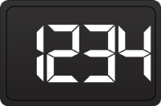

## Digital Gauge

Digital gauges are perfect for displaying alphanumeric values. All the elements in a digital gauge, including the CharacterCount, CharacterType, RoundCornerRadius, and ShowInvisibleSegments, can be fully customized with data-binding support.

The digital gauge control includes the following elements: SegmentSpacing, ShowInvisibleSegments, Value, and VisualStyle. All the elements are optional for displaying the value. 

Feature Summary

Here is a brief overview of various features of the DigitalGauge control:

* SegmentSpacing - Specifies thespace between the gauge segments. 
* VisualStyle - Allows you to specify the visual style for the digital gauge.
* CharacterType - Provides different segment styles for the digital gauge.
* CharacterCount - Provides the number of characters that can be displayed.
###  Concepts and Features

This section illustrates the features of the digital gauge with different visual styles and sample code. It contains the following topics:

* Digital Gauge Visual Style
* Character Type
* Character Count
* Segment Spacing
* Show Invisible Segments
* Round Corner Radius
#### Digital Gauge Visual Style

Different visual styles can be applied using the VisualStyle property. The Digital Gauge control features five visual styles:

* Black
* Silver
* Blue
* Metro
* Default

_Table_ _14__: Digital Gauge Visual Style_

<table>
<tr>
<td>
Property</td><td>
Type</td><td>
Description</td></tr>
<tr>
<td>
VisualStyle</td><td>
Enum</td><td>
Gets or sets the frame type.</td></tr>
</table>

Code Sample

[C#]

this.digitalGauge1.VisualStyle = Syncfusion.Windows.Forms.Gauge.ThemeStyle.Black;

[VB]

Me.digitalGauge1.VisualStyle = Syncfusion.Windows.Forms.Gauge.ThemeStyle.Black

{{ '' | markdownify }}
{:.image }

Code Sample

[C#]

this.digitalGauge1.VisualStyle = Syncfusion.Windows.Forms.Gauge.ThemeStyle.Blue;

[VB]

Me.digitalGauge1.VisualStyle = Syncfusion.Windows.Forms.Gauge.ThemeStyle.Blue

{{ '' | markdownify }}
{:.image }

Code Sample

[C#]

this.digitalGauge1.VisualStyle = Syncfusion.Windows.Forms.Gauge.ThemeStyle.Silver;

[VB]

Me.digitalGauge1.VisualStyle = Syncfusion.Windows.Forms.Gauge.ThemeStyle.Silver

{{ '' | markdownify }}
{:.image }

Code Sample

[C#]

this.digitalGauge1.VisualStyle = Syncfusion.Windows.Forms.Gauge.ThemeStyle.Metro;

[VB]

Me.digitalGauge1.VisualStyle = Syncfusion.Windows.Forms.Gauge.ThemeStyle.Metro

{{ '' | markdownify }}
{:.image }

##### Character Type

Character types are used to customize the digital segments. 

Customizing Scales

You can customize the segments in the digital gauge using the following property:

_Table_ _15__: Customizing Scales_

<table>
<tr>
<td>
Property</td><td>
Type</td><td>
Description</td></tr>
<tr>
<td>
CharacterType</td><td>
enum</td><td>
Gets or sets the character type.</td></tr>
</table>

Different segments can be applied using the CharacterType property. The digital gauge control contains four segment types:

* Dot matrix
* Seven segments
* Fourteen segments
* Sixteen segments
##### Dot Matrix

In a digital gauge, the value can be displayed in dot matrix format by setting the character type as DotMatrixSegment.

Code Sample

[C#]

this.digitalGauge1.CharacterType = Syncfusion.Windows.Forms.Gauge.CharacterType.DotMatrixSegment;

[VB]

Me.digitalGauge1.CharacterType = Syncfusion.Windows.Forms.Gauge.CharacterType.DotMatrixSegment

{{ '' | markdownify }}
{:.image }

##### Seven Segments

In a digital gauge, the value can be displayed in a seven-segment format by setting the character type as SevenSegment.

Code Sample

[C#]

this.digitalGauge1.CharacterType = Syncfusion.Windows.Forms.Gauge.CharacterType.SevenSegment;

[VB]

Me.digitalGauge1.CharacterType = Syncfusion.Windows.Forms.Gauge.CharacterType.SevenSegment

{{ '' | markdownify }}
{:.image }

##### Fourteen Segments

In a digital gauge, the value can be displayed in a fourteen-segment format by setting the character type as FourteenSegment.

Code Sample

[C#]

this.digitalGauge1.CharacterType = Syncfusion.Windows.Forms.Gauge.CharacterType.FourteenSegment;

[VB]

Me.digitalGauge1.CharacterType = Syncfusion.Windows.Forms.Gauge.CharacterType.FourteenSegment

{{ '' | markdownify }}
{:.image }

##### Sixteen Segments

In a digital gauge, the value can be displayed in a sixteen-segment format by setting the character type as SixteenSegment.

Code Sample

[C#]

this.digitalGauge1.CharacterType = Syncfusion.Windows.Forms.Gauge.CharacterType.SixteenSegment;

[VB]

Me.digitalGauge1.CharacterType = Syncfusion.Windows.Forms.Gauge.CharacterType.SixteenSegment

{{ '' | markdownify }}
{:.image }

### Character Count

The CharacterCount property can be used to restrict the number of characters that can be displayed in a digital gauge.

Code Sample

[C#]

this.digitalGauge1.CharacterCount = 4;

this.digitalGauge1.Value = “123456”;

[VB]

Me.digitalGauge1.CharacterCount = 4
Me.digitalGauge1.Value = 123456

{{ '' | markdownify }}
{:.image }

### Segment Spacing

The SegmentSpacing property is used to determine the spacing between the characters displayed in the digital gauge.

Code Sample

[C#]

  this.digitalGauge1.CharacterCount = 2;

  this.digitalGauge1.OverrideFontSize = false;

  this.digitalGauge1.Value = “123456”;

[VB]

Me.digitalGauge1.CharacterCount = 2

Me.digitalGauge1.OverrideFontSize = false
Me.digitalGauge1.Value = 123456

{{ '' | markdownify }}
{:.image }

### Show Visible Segements 

The ShowInvisibleSegments property can be enabled to make the segments that are not drawn visible. This property can be disabled by setting it to false.

Code Sample

[C#]

this.digitalGauge1.ShowInvisibleSegments = true;

[VB]

 Me.digitalGauge1.ShowInvisibleSegments = true

{{ '' | markdownify }}
{:.image }

### RoundCornerRadius

The RoundCornerRadius property of the digital gauge is used to draw digital gauge with rounded edges.

Code Sample

[C#]

this.digitalGauge1.RoundCornerRadius = 50;

[VB]

Me.digitalGauge1.RoundCornerRadius = 50

{{ '' | markdownify }}
{:.image }

### Data Binding

You can bind any data source to the digital gauge and map an index of a record to represent the actual value in the gauge. The DisplayMember and DisplayRecordIndex properties map the DataColumn and DataRow of the bound data source, respectively, to the Gauge control. Data-bound gauges support high frequency data updates.

Example

this.digitalGauge1.DataSource = dataTable;

            this.digitalGauge1.DisplayRecordIndex = [Row Index];

            this.digitalGauge1.DisplayMember = [column name];

