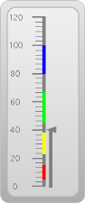
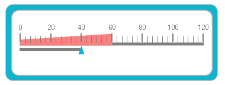

# Linear Gauge

Linear gauges are perfect for displaying values graphically along a linear scale. All the elements in a linear gauge, including scales, labels, ticks, and pointers, can be fully customized with data-binding support.

The LinearGauge control includes the following elements: scale label, needle, gauge value, and background frame. All the elements can be optionally displayed in the Gauge control. 

## Feature Summary

Here is a brief overview of various features of the LinearGauge control.

* Scales - The scale value can be customized to be displayed within defined limits. 
* Frame Types - Allow you to specify the built-in frame style, such as full circle or half circle.
* Pointers - Provide complete support for pointers to point to the value.
* Range - Full-fledged range support. 

### Concepts and Features

This section illustrates the features of the linear gauge with images and sample code. It contains the following topics:

* Linear Gauge Frames
* Scales
* Ticks
* Needles
* Ranges
* Scaling Divisions

### Linear Gauge Frame

The frame defines the frame types of linear gauges. Frames can be applied using the FrameType property. The LinearGauge control contains two frame types:

* Horizontal
* Vertical

_Table_ _9: Linear Gauge Frame Properties

<table>
<tr>
<th>
Property</th><th>
Type</th><th>
Description</th></tr>
<tr>
<td>
LinearFrameType</td><td>
Enum</td><td>
Gets or sets the frame type.</td></tr>
<tr>
<td>
BackgroundGradientStartColor </td><td>
Color</td><td>
Gets or sets the gradient start color for the gauge background.</td></tr>
<tr>
<td>
BackgroundGradientEndColor</td><td>
Color</td><td>
Gets or sets the gradient end color for the gauge background.</td></tr>
<tr>
<td>
FrameBorderStartColor </td><td>
Color</td><td>
Gets or sets the gradient start color for the frame border.</td></tr>
<tr>
<td>
FrameBorderEndColor</td><td>
Color</td><td>
Gets or sets the gradient end color for the frame border.</td></tr>
<tr>
<td>
OuterFrameStartColor</td><td>
Color</td><td>
Gets or sets the gradient end color for the outer frame.</td></tr>
<tr>
<td>
OuterFrameEndColor</td><td>
Color</td><td>
Gets or sets the gradient end color for the outer frame.</td></tr>
<tr>
<td>
GaugeBaseColor</td><td>
Color</td><td>
Gets or sets the base line color of the gauge.</td></tr>
<tr>
<td>
ValueIndicatorColor</td><td>
Color</td><td>
Gets or sets the value indicator color of the gauge.</td></tr>
</table>

### Code Sample



this.linearGauge1.LinearFrameType = LinearFrameType.Horizontal;





Me.linearGauge1.LinearFrameType = LinearFrameType.Horizontal



#### Scales

Scales are used to control element placement and value ranges. 

#### Customizing Scales

You can customize scales added to the Linear Gauge by using the properties listed in the following table:

_Table_ _10: Scales

<table>
<tr>
<th>
Property</th><th>
Type</th><th>
Description</th></tr>
<tr>
<td>
ShowScaleLabel</td><td>
Boolean</td><td>
Gets or sets the scale label visibility.</td></tr>
<tr>
<td>
ScaleLabelColor</td><td>
Color</td><td>
Gets or sets the scale label color of the gauge.</td></tr>
</table>

#### Ticks

Two types of ticks can be added to the LinearGauge control scale. Major tick marks are the primary scale indicators. Minor tick marks and inter-tick marks are the secondary scale indicators that fall between the major ticks.

The following table lists the properties that can be used to customize the linear tick marks. This is done to represent the scale with meaningful markers and labels.

_Table_ _11: Ticks

<table>
<tr>
<th>
Property</th><th>
Type</th><th>
Description</th></tr>
<tr>
<td>
MajorTickMarkColor</td><td>
Color</td><td>
Gets or sets the color of the major tickmarks.</td></tr>
<tr>
<td>
MajorTickMarkHeight</td><td>
Integer</td><td>
Gets or sets the height of the major tickmarks.</td></tr>
<tr>
<td>
MinorTickMarkColor</td><td>
Color</td><td>
Gets or sets the color of the minor tickmarks.</td></tr>
<tr>
<td>
MinorTickMarkHeight</td><td>
Integer</td><td>
Gets or sets the height of the minor tickmarks.</td></tr>
<tr>
<td>
Pointer Placement</td><td>
Enum</td><td>
Gets or sets the pointer position
<ul>
<li> Near</li>
<li> Far</li>
<li> Center</li></ul></td></tr>
</table>

The following code sample demonstrates how to add major and minor ticks to the linear scale.

 

this.linearGauge1.MajorTickMarkColor = System.Drawing.Color.White;

this.linearGauge1.MinorTickMarkColor = System.Drawing.Color.White;

this.linearGauge1.MinorTickHeight = 6;

this.linearGauge1.MajorTicksHeight = 12;





Me.linearGauge1.MajorTickMarkColor = System.Drawing.Color.White

Me.linearGauge1.MinorTickMarkColor = System.Drawing.Color.White

Me.linearGauge1.MinorTickHeight = 6

Me.linearGauge1.MajorTicksHeight = 12





this.linearGauge1.ShowNeedle = true;

this.linearGauge1.NeedleColor = System.Drawing.Color.Black;





Me.linearGauge1.ShowNeedle = True

Me.linearGauge1.NeedleColor = System.Drawing.Color.Black



#### Pointer Placement



this.linearGauge1.PointerPlacement = Placement.Center;





      Me.linearGauge1.PointerPlacement = Placement.Center



#### Ranges

Ranges are objects that highlight a range of values and can display different ranges in different colors. Ranges can be customized using various attributes such as range placement, height, color of the range, and more. All the available attributes are listed in the following table: 

_Table_ _12: Ranges

<table>
<tr>
<th>
Property</th><th>
Type</th><th>
Description</th></tr>
<tr>
<td>
StartSalue</td><td>
Integer</td><td>
Specify the start value of the range. Default value is set to 0.</td></tr>
<tr>
<td>
EndValue</td><td>
Integer</td><td>
Specify the end value of the range. Default value is set to 0.</td></tr>
<tr>
<td>
RangePlacement</td><td>
Enum</td><td>
Using this attribute, the range can be positioned in two areas along the linear scale. It includes the following options:
<ul><li> Inside</li>
<li> Outside</li></ul>  The default value is Inside.</td></tr>
<tr>
<td>
Height</td><td>
Integer</td><td>
Specify the height of the range. Default value is set to 5.</td></tr>
<tr>
<td>
Color</td><td>
Color</td><td>
Gets or sets the color of the range.</td></tr>
</table>

The following code sample demonstrates how to add ranges to the linear gauge:



Syncfusion.Windows.Forms.Gauge.LinearRange range1 = new Syncfusion.Windows.Forms.Gauge.LinearRange();

range1.Color = System.Drawing.Color.FromArgb(((int)(((byte)(225)))), ((int)(((byte)(128)))), ((int)(((byte)(128)))));

            range1.EndValue = 0F;

            range1.Height = 5;

            range1.InRange = false;

            range1.Name = "GaugeRange1";

            range1.StartValue = 0F;

            this.linearGauge1.Ranges.Add(range1);





Dim range1 As New Syncfusion.Windows.Forms.Gauge.LinearRange range()

range1.Color = System.Drawing.Color.FromArgb(CInt(CByte(225)), CInt(CByte(128)), CInt(CByte(128)))

range1.EndValue = 0F

range1.Height = 5

range1.InRange = False

range1.Name = "GaugeRange1"

range1.StartValue = 0F

Me.linearGauge1.Ranges.Add(range1)



#### Scaling Divisions

The Gauge control for Windows Forms includes support for customizing the number of major tick lines and minor tick lines using the Major Difference and MinorTickCount properties. It also provides support to customize the number of tick lines using the MaximumValue and MinimunValue properties.

_Table_ _13_: Scaling Divisions

<table>
<tr>
<th>
Property</th><th>
Type</th><th>
Description</th></tr>
<tr>
<td>
MinimumValue </td><td>
Float</td><td>
Gets or sets the minimum value for the linear scale. Default value is set to 0.</td></tr>
<tr>
<td>
MaximumValue </td><td>
Float</td><td>
Gets or sets the maximum value for the linear scale. </td></tr>
<tr>
<td>
MajorDifference</td><td>
Float</td><td>
Gets or sets the major difference value.</td></tr>
<tr>
<td>
MinorTickCount</td><td>
Integer</td><td>
Gets or sets the minor difference value.</td></tr>
</table>



           this.linearGauge1.MajorDifference = 20F;

           this.linearGauge1.MaximumValue = 120F;

           this.linearGauge1.MinimumValue = 0F;

           this.linearGauge1.MinorTickCount = 1;





Me.linearGauge1.MajorDifference = 20F

Me.linearGauge1.MaximumValue = 120F

Me.linearGauge1.MinimumValue = 0F

Me.linearGauge1.MinorTickCount = 1



## Visual Styles for All Gauges

The Gauge control for Windows Forms includes four stunning skins for professional representation of gauges. You can easily modify the look and feel of the gauge component using the built-in visual styles and color schemes.

The styles are built-in for all of the gauges. Using SkinManager, these four styles can be assigned to the gauge:

* Blue
* Black
* Silver
* Metro



this.linearGauge1.VisualStyle = Syncfusion.Windows.Forms.Gauge.ThemeStyle.Black;





Me.linearGauge1.VisualStyle = 

Syncfusion.Windows.Forms.Gauge.ThemeStyle.Black



## Data Binding

You can bind any data source to the LinearGauge control and map an index of a record to represent the actual value in the linear gauge. The DisplayMember and DisplayRecordIndex properties will map the DataColumn and DataRow of the binding source respectively to the LinearGauge control, which will then support high frequency data updates.



this.linearGauge1.DataSource = dataTable;

            this.linearGauge1.DisplayRecordIndex = [Row Index];

            this.linearGauge1.DisplayMember = [column name];


