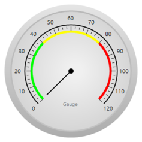

## Radial Gauge

The RadialGauge control can be used for representing a range of values in circular form. It can be used to create sophisticated dashboards, clocks, industrial equipment, medical equipment, more.

### Real World Scenarios

A radial gauge evaluates the values of scales and presents them in a radial manner. Radial Gauge enables you to quickly build high quality dashboard, process control, gadget and clocks. Radial gauges consist of important internal domains to present data in a more sophisticated way.

The best example of a radial gauge is a speedometer. The speedometer can be designed to be placed in a racing game application, denoting the speed of a vehicle.

{{ '' | markdownify }}
{:.image }

### Getting Started

This section provides information about radial gauges for developers who are new to the Gauge control.

The Gauge control is built on Windows Forms programming, which is extended to support a broad set of dashboard development features including resources, controls, graphics, layout, and data binding. 

#### Creating a Radial  Gauge

Radial gauges can be enhanced with a circle frame or semi-circle frame. This section covers how to include a radial gauge in an application.

Through Designer:

Drag the RadialGauge control from the toolbox onto the form. 

{{ '' | markdownify }}
{:.image }

{{ '' | markdownify }}
{:.image }

As soon as the control is dropped, it will be loaded with its default style. 

Through Code:

[C#]

 private Syncfusion.Windows.Forms.Gauge.RadialGauge radialGauge1;

 this.radialGauge1 = new Syncfusion.Windows.Forms.Gauge.RadialGauge();

 this.radialGauge1.Name = "radialGauge1";

 this.radialGauge1.Size = new System.Drawing.Size(230, 230);                 this.Controls.Add(this.radialGauge1);

[VB]

Private radialGauge1 As Syncfusion.Windows.Forms.Gauge.RadialGauge

Me.radialGauge1 = New Syncfusion.Windows.Forms.Gauge.RadialGauge()

Me.radialGauge1.Name = "radialGauge1"

Me.radialGauge1.Size = New System.Drawing.Size(230, 230)

Me.Controls.Add(Me.radialGauge1)

#### Elaborate Structure of the Control

The RadialGauge control includes the following elements: Scale Label, Needle, Gauge Value, and Background Frame. All the elements are optional for displaying the Gauge control. 

Feature Summary:

Here is a brief overview of various features of the RadialGauge control.

* Scales - The scale value can be customized to be displayed within defined limits. 
* Frame types - Allows you to specify the radial built-in frame style, such as full circle or half circle.
* Pointers - Provide complete support for pointers to point the value.
* Range - Full-fledged range support.
* Image and Labels - Used to customize the appearance of gauge pointer values with user-specified colors and alignment.
### Concepts and Features

This section illustrates the features of Radial Gauge with images and sample code. It contains the following topics:

* Radial Gauge Frames
* Scales
* Ticks
* Needles
* Ranges
* Scaling Divisions
#### Radial Gauge Frame

The frame defines the frame types of radial gauges. Frames can be applied using the FrameType property. The RadialGauge control contains two frame types:

* Full Circle
* Half Circle

_Table_ _3__: 	Radial Gauge Frame Properties_

<table>
<tr>
<td>
Property</td><td>
Type</td><td>
Description</td></tr>
<tr>
<td>
FrameType</td><td>
Enum</td><td>
Gets or sets the frame type.</td></tr>
<tr>
<td>
ShowBackgroundFrame</td><td>
Boolean</td><td>
Gets or sets the visibility of the background frame.</td></tr>
<tr>
<td>
BackgroundGradientStartColor </td><td>
Color</td><td>
Gets or sets the gradient start color for the gauge background.</td></tr>
<tr>
<td>
BackgroundGradientEndColor</td><td>
Color</td><td>
Gets or sets the gradient end color for the gauge background.</td></tr>
<tr>
<td>
InnerFrameGradientStartColor </td><td>
Color</td><td>
Gets or sets the gradient start color for the inner frame.</td></tr>
<tr>
<td>
InnerFrameGradientEndColor</td><td>
Color</td><td>
Gets or sets the gradient end color for the inner frame.</td></tr>
<tr>
<td>
OuterFrameGradientStartColor</td><td>
Color</td><td>
Gets or sets the gradient end color for the outer frame.</td></tr>
<tr>
<td>
OuterFrameGradientEndColor</td><td>
Color</td><td>
Gets or sets the gradient end color for the outer frame.</td></tr>
<tr>
<td>
GaugeArcColor</td><td>
Color</td><td>
Gets or sets the arc color of the gauge.</td></tr>
<tr>
<td>
GaugeLableColor</td><td>
Color</td><td>
Gets or sets the gauge label color.</td></tr>
<tr>
<td>
GaugeValueColor</td><td>
Color</td><td>
Gets or sets the gauge value color.</td></tr>
<tr>
<td>
ShowGaugeValue</td><td>
Boolean</td><td>
Gets or sets the gauge value visibility.</td></tr>
</table>

{{ '' | markdownify }}
{:.image }

{{ '' | markdownify }}
{:.image }

Code Sample:

[C#]

this.radialGauge1.FrameType = Syncfusion.Windows.Forms.Gauge.FrameType.HalfCircle;

[VB]

Me.radialGauge1.FrameType = Syncfusion.Windows.Forms.Gauge.FrameType.HalfCircle

{{ '' | markdownify }}
{:.image }

[C#]

 this.radialGauge1.ShowBackgroundFrame = false;

[VB]

Me.radialGauge1.ShowBackgroundFrame = false;

#### Scales

Scales are used to control element placement and value ranges. 

Customizing Scales

You can customize scales added to the Radial Gauge using the properties listed in the following table:

_Table_ _4__: Property Table_

<table>
<tr>
<td>
Property</td><td>
Type</td><td>
Description</td></tr>
<tr>
<td>
ShowScaleLabel</td><td>
Boolean</td><td>
Gets or sets the scale label visibility.</td></tr>
<tr>
<td>
ScaleLabelColor</td><td>
Color</td><td>
Gets or sets the scale label color of the gauge.</td></tr>
<tr>
<td>
LabelPlacement</td><td>
Enum</td><td>
Gets or sets whether to place the ticks inside or outside the arc.</td></tr>
<tr>
<td>
TextOrientation</td><td>
Enum</td><td>
Gets or sets the text orientation layout. </td></tr>
</table>

{{ '' | markdownify }}
{:.image }

{{ '' | markdownify }}
{:.image }

_Figure_ _11__:  Scale inside the arc_

The following code sample illustrates how to place labels in the RadialGauge control.

[C#]

this.radialGauge1.LabelPlacement = Syncfusion.Windows.Forms.Gauge.LabelPlacement.Outside;

this.radialGauge1.TextOrientation = Syncfusion.Windows.Forms.Gauge.TextOrientation.SlideOver;

[VB]

Me.radialGauge1.LabelPlacement = Syncfusion.Windows.Forms.Gauge.LabelPlacement.Outside

Me.radialGauge1.TextOrientation = Syncfusion.Windows.Forms.Gauge.TextOrientation.SlideOver

#### Ticks

Two types of ticks can be added to the RadialGauge control scale. Major tick marks are the primary scale indicators. Minor tick marks and Inter tick marks are the secondary scale indicators that fall between the major ticks. The ticks can be placed by setting the TickPlacement property. Ticks can be placed inside or outside the arc.

The following table lists the important properties that can be used to customize the radial tick marks. This is done to represent the scale with meaningful markers and labels.

 _Table_ _5__: Property Table_

<table>
<tr>
<td>
Property</td><td>
Type</td><td>
Description</td></tr>
<tr>
<td>
TickPlacement</td><td>
Enum</td><td>
Gets or sets whether to place the tickmarks inside or outside the arc.</td></tr>
<tr>
<td>
MajorTickMarkColor</td><td>
Color</td><td>
Gets or sets the color of the major tickmarks.</td></tr>
<tr>
<td>
MajorTickMarkHeight</td><td>
Integer</td><td>
Gets or sets the height of the major tickmarks.</td></tr>
<tr>
<td>
MinorTickMarkColor</td><td>
Color</td><td>
Gets or sets the color of the minor tickmarks.</td></tr>
<tr>
<td>
MinorTickMarkHeight</td><td>
Integer</td><td>
Gets or sets the height of the minor tickmarks.</td></tr>
<tr>
<td>
InterLinesColor</td><td>
Color</td><td>
Gets or sets the color of the InterLines of the gauge.</td></tr>
<tr>
<td>
MinorInnerLinesHeight</td><td>
Integer</td><td>
Gets or sets the line height of the minor inner lines.</td></tr>
</table>

The following code example illustrates how to add major and minor ticks to the radial scale.

[C#] 

this.radialGauge1.TickPlacement = Syncfusion.Windows.Forms.Gauge.TickPlacement.OutSide;

this.radialGauge1.MajorTickMarkColor = System.Drawing.Color.White;

this.radialGauge1.MinorTickMarkColor = System.Drawing.Color.White;

this.radialGauge1.InterLinesColor = System.Drawing.Color.White;

this.radialGauge1.MinorTickMarkHeight = 6;

this.radialGauge1.MajorTickMarkHeight = 12;

this.radialGauge1.MinorInnerLinesHeight = 6;

[VB]

Me.radialGauge1.TickPlacement = Syncfusion.Windows.Forms.Gauge.TickPlacement.OutSide

Me.radialGauge1.MajorTickMarkColor = System.Drawing.Color.White

Me.radialGauge1.MinorTickMarkColor = System.Drawing.Color.White

Me.radialGauge1.InterLinesColor = System.Drawing.Color.White

Me.radialGauge1.MinorTickMarkHeight = 6

Me.radialGauge1.MajorTickMarkHeight = 12

Me.radialGauge1.MinorInnerLinesHeight = 6

{{ '' | markdownify }}
{:.image }

{{ '' | markdownify }}
{:.image }

#### Needles

You can easily customize the style of the needle and the positions of the sub elements within the RadialGauge through the following enumerations.

_Table_ _6__: Default and Advanced pointer styles_

<table>
<tr>
<td>
Property</td><td>
Type</td><td>
Description</td></tr>
<tr>
<td>
NeedleColor</td><td>
Color</td><td>
Gets or sets the gauge needle color.</td></tr>
<tr>
<td>
NeedleStyle</td><td>
Enum</td><td>
Gets or sets the needle style.</td></tr>
<tr>
<td>
ShowNeedle</td><td>
Boolean</td><td>
Gets or sets the needle visibility.</td></tr>
</table>

[C#]

this.radialGauge1.ShowNeedle = true;

this.radialGauge1.NeedleColor = System.Drawing.Color.Black;

this.radialGauge1.NeedleStyle = Syncfusion.Windows.Forms.Gauge.NeedleStyle.Advanced;

[VB]

Me.radialGauge1.ShowNeedle = True

Me.radialGauge1.NeedleColor = System.Drawing.Color.Black

Me.radialGauge1.NeedleStyle = Syncfusion.Windows.Forms.Gauge.NeedleStyle.Advanced

#### Ranges

Ranges are objects that highlight a range of values and can display different ranges in different colors. Ranges can be customized using various attributes such as range placement, height, color of the range, and so on. All the available attributes are listed in the following table: 

_Table_ _7__: Ranges_

<table>
<tr>
<td>
Property</td><td>
Type</td><td>
Description</td></tr>
<tr>
<td>
Startvalue</td><td>
Integer</td><td>
Specify the start value of the range. Default value is set to 0.</td></tr>
<tr>
<td>
Endvalue</td><td>
Integer</td><td>
Specify the end value of the range. Default value is set to 0.</td></tr>
<tr>
<td>
RangePlacement</td><td>
Enum</td><td>
Using this attribute, the range can be positioned in two areas along the radial scale. It includes the following options:* Inside* Outside  The default value is Inside.</td></tr>
<tr>
<td>
Height</td><td>
Integer</td><td>
Specify the height of the range. Default value is set to 5.</td></tr>
<tr>
<td>
Color</td><td>
Color</td><td>
Gets or sets the color of the range.</td></tr>
</table>

The following code sample illustrates how to add ranges to the radial gauge:

[C#]

Syncfusion.Windows.Forms.Gauge.Range range1 = new Syncfusion.Windows.Forms.Gauge.Range();

range1.Color = System.Drawing.Color.FromArgb(((int)(((byte)(225)))), ((int)(((byte)(128)))), ((int)(((byte)(128)))));

            range1.EndValue = 0F;

            range1.Height = 5;

            range1.InRange = false;

            range1.Name = "GaugeRange1";

            range1.RangePlacement = Syncfusion.Windows.Forms.Gauge.TickPlacement.Inside;

            range1.StartValue = 0F;

            this.radialGauge1.Ranges.Add(range1);

[VB]

Dim range1 As New Syncfusion.Windows.Forms.Gauge.Range()

range1.Color = System.Drawing.Color.FromArgb(CInt(CByte(225)), CInt(CByte(128)), CInt(CByte(128)))

range1.EndValue = 0F

range1.Height = 5

range1.InRange = False

range1.Name = "GaugeRange1"

range1.RangePlacement = Syncfusion.Windows.Forms.Gauge.TickPlacement.Inside

range1.StartValue = 0F

Me.radialGauge1.Ranges.Add(range1)

{{ '' | markdownify }}
{:.image }

{{ '' | markdownify }}
{:.image }

#### Scaling Divisions

The Gauge control for Windows Forms includes support for customizing the number of major tick lines and number of minor tick lines using the Major Difference and Minor Difference. It also provides support to customize the number of tick lines using MaximumValue and MinimunValue.

_Table_ _8__: Properties_

<table>
<tr>
<td>
Property</td><td>
Type</td><td>
Description</td></tr>
<tr>
<td>
Minimum </td><td>
Float</td><td>
Gets or sets the minimum value for the radial scale. Default value is set to 0.</td></tr>
<tr>
<td>
Maximum </td><td>
Float</td><td>
Gets or sets the maximum value for the radial scale. Default value is set to 120.</td></tr>
<tr>
<td>
MajorDifference</td><td>
Float</td><td>
Gets or sets the major difference value.</td></tr>
<tr>
<td>
MinorDifference</td><td>
Integer</td><td>
Gets or sets the minor difference value.</td></tr>
</table>

[C#]

           this.radialGauge1.MajorDifference = 20F;

           this.radialGauge1.MaximumValue = 120F;

           this.radialGauge1.MinimumValue = 0F;

           this.radialGauge1.MinorDifference = 1;

[VB]

Me.radialGauge1.MajorDifference = 20F

Me.radialGauge1.MaximumValue = 120F

Me.radialGauge1.MinimumValue = 0F

Me.radialGauge1.MinorDifference = 1

### Visual Styles for All Gauges

The Gauge control for Windows Forms includes four stunning skins for professional representation of gauges. You can easily modify the look and feel of the gauge component using the built-in visual styles and color schemes.

The styles are built in for all of the gauges. Using SkinManager, these four styles can be assigned to the gauge. The following skins are available:

* Blue
* Black
* Silver
* Metro

[C#]

this.radialGauge1.VisualStyle = Syncfusion.Windows.Forms.Gauge.ThemeStyle.Black;

[VB]

Me.radialGauge1.VisualStyle = 

Syncfusion.Windows.Forms.Gauge.ThemeStyle.Black

{{ '' | markdownify }}
{:.image }

{{ '' | markdownify }}
{:.image }

{{ '' | markdownify }}
{:.image }

{{ '' | markdownify }}
{:.image }

### Data Binding

You can bind any data source to the RadialGauge and map an index of a record to represent the actual value in RadialGauge. The DisplayMember and DisplayRecordIndex properties will map the DataColumn and DataRow of the binding source respectively to the Gauge control, which will then support high frequency data updates.

Example:

this.radialGauge1.DataSource = dataTable;

this.radialGauge1.DisplayRecordIndex = [Row Index];

this.radialGauge1.DisplayMember = [column name];

[ASPX]

  <input type="text" value="" id="SetDropDowntext" />

   <input type="button" value="Set Text" id="setText" />

### Frequently Asked Questions

#### How to enable Multiple Needles to Radial Gauge

##### Adding Multiple Needles to Radial Gauge

The Radial Gauge control can be used for representing a range of values in circular form. In Radial Gauge, you can represent the range of values using multiple needles.

{{ '' | markdownify }}
{:.image }

The following code example illustrates you on how to add multiple needles in Radial Gauge.

[C#]

this.RadialGauge1.EnableCustomNeedles = true;

Syncfusion.Windows.Forms.Gauge.Needle needle1 = new Syncfusion.Windows.Forms.Gauge.Needle();

Syncfusion.Windows.Forms.Gauge.Needle needle2 = new Syncfusion.Windows.Forms.Gauge.Needle();

this.RadialGauge1.NeedleCollection.Add(needle1);

this.RadialGauge1.NeedleCollection.Add(needle2);

[VB#]

Me.RadialGauge1.EnableCustomNeedles = True

Dim needle1 As New Syncfusion.Windows.Forms.Gauge.Needle()

Dim needle2 As New Syncfusion.Windows.Forms.Gauge.Needle()

Me.RadialGauge1.NeedleCollection.Add(needle1)

Me.RadialGauge1.NeedleCollection.Add(needle2)

##### Customization of Needles in Radial Gauge

You can customize the Radial gauge needles using the Needles property. 

Needle Style

RadialGauge supports three needle style. They are

* Default
* Advanced
* Pointer

Needle Color 

You can customize the needle color by using the NeedleColor property.

Needle Values

The Needle values can be assigned using Values property in Needle.

You can customize the needles in Radial Gauge by using the following code example.

[C#]

needle1.NeedleColor = System.Drawing.Color.Gray;

needle1.NeedleStyle = Syncfusion.Windows.Forms.Gauge.NeedleStyle.Advanced;

this.RadialGauge1.NeedleCollection[1].Value = 5;

[VB#]

needle1.NeedleColor = Color.Gray

needle1.NeedleStyle = Syncfusion.Windows.Forms.Gauge.NeedleStyle.Advanced

Me.RadialGauge1.NeedleCollection(0).Value = 5

