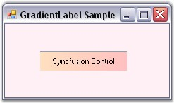

# Border Settings in Windows Forms Gradient Label

This section discusses the border settings of the Gradient Label control.

The border style and sides of the Gradient Label can be customized using the properties given below.

<table>
<tr>
<th>
Gradient Label Properties</th><th>
Description</th></tr>
<tr>
<td>
BorderSides</td><td>
Specifies the sides of the Gradient Label that will have a border.  The options included are as follows.{{ 'Left,' | markdownify }}{{ 'Top,' | markdownify }}{{ 'Right,' | markdownify }}{{ 'Bottom,' | markdownify }}{{ 'Middle and' | markdownify }}{{ 'All.' | markdownify }}The default value is set to 'All'.</td></tr>
<tr>
<td>
BorderStyle</td><td>
Specifies the 3D border style for the Gradient Label.The options included are as follows.{{ 'Raised,' | markdownify }}{{ 'RaisedOuter,' | markdownify }}{{ 'RaisedInner,' | markdownify }}{{ 'Sunken,' | markdownify }}{{ 'SunkenOuter,' | markdownify }}{{ 'SunkenInner,' | markdownify }}{{ 'Etched,' | markdownify }}{{ 'Bump,' | markdownify }}{{ 'Adjust and' | markdownify }}{{ 'Flat.' | markdownify }}The default value is set to 'Sunken'.</td></tr>
<tr>
<td>
BorderColor</td><td>
Sets the color for the 2D border. The BorderColor will be effective only when the BorderStyle property is set to FixedSingle.</td></tr>
</table>

We can set the border sides for the Gradient Label using the BorderSides property.If BorderSides is set to 'Left', only the left border of Gradient Label will be shown.

The Gradient Label replaces the default border style provided for Label classes with the Border3DStyle type in this property. This property uses the Border3DStyle enumeration.

In 3D mode, the border styles can be Raised, Sunken, Flat and so on. Setting the value to 'Adjust' shows no border.




this.gradientLabel1.BorderSides = System.Windows.Forms.Border3DSide.Top;
this.gradientLabel1.BorderStyle = System.Windows.Forms.Border3DStyle.Flat;
this.gradientLabel1.BorderColor = Color.Red;





Me.gradientLabel1.BorderSides = System.Windows.Forms.Border3DSide.Top
Me.gradientLabel1.BorderStyle = System.Windows.Forms.Border3DStyle.Flat
Me.gradientLabel1.BorderColor = Color.Red




 
