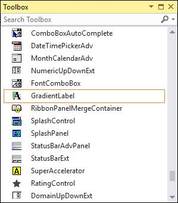
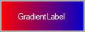

# Getting Started with Windows Forms GradientLabel

This section briefly describes how to create a new Windows Forms project in Visual Studio and add the **GradientLabel** control with its basic features.

## Assembly deployment

Refer to the [control dependencies](https://help.syncfusion.com/windowsforms/control-dependencies#gradientlabel) section to get the list of assemblies or the details of the NuGet package that needs to be added as a reference to use the control in any application.

Refer to this [documentation](https://help.syncfusion.com/windowsforms/installation/install-nuget-packages) to find more details about installing NuGet packages in a Windows Forms application.

You can also add the required assemblies as references from the Package Manager Console using the following PowerShell command:

```powershell
Install-Package Syncfusion.Tools.Windows
```

## Adding the GradientLabel control via designer

The following steps describe how to create a **GradientLabel** control via the designer:

1. Create a new Windows Forms application in Visual Studio.

2. Add the [GradientLabel](https://help.syncfusion.com/cr/windowsforms/Syncfusion.Windows.Forms.Tools.GradientLabel.html) control to an application by dragging it from the toolbox to the design view. The following dependent assemblies are added automatically:

    * Syncfusion.Grid.Base
    * Syncfusion.Grid.Windows
    * Syncfusion.Shared.Base
    * Syncfusion.Shared.Windows
    * Syncfusion.Tools.Base
    * Syncfusion.Tools.Windows



## Adding the GradientLabel control via code

The following steps describe how to create the **GradientLabel** control programmatically:

1. Create a C# or VB application via Visual Studio.

2. Add the following assembly references to the project:

    * Syncfusion.Grid.Base
    * Syncfusion.Grid.Windows
    * Syncfusion.Shared.Base
    * Syncfusion.Shared.Windows
    * Syncfusion.Tools.Base
    * Syncfusion.Tools.Windows

3. Include the **Syncfusion.Windows.Forms.Tools** namespace and create an instance of the [GradientLabel](https://help.syncfusion.com/cr/windowsforms/Syncfusion.Windows.Forms.Tools.GradientLabel.html) control inside the form's constructor, then add it to the form. By default, the control is positioned at the top-left corner of the form with the default size; you can set its `Location` and `Size` to position it explicitly.





using Syncfusion.Windows.Forms.Tools;
using System.Drawing;

public partial class Form1 : Form
{
    private Syncfusion.Windows.Forms.Tools.GradientLabel gradientLabel1;

    public Form1()
    {
        InitializeComponent();

        this.gradientLabel1 = new Syncfusion.Windows.Forms.Tools.GradientLabel();
        this.gradientLabel1.Location = new System.Drawing.Point(20, 20);
        this.gradientLabel1.Size = new System.Drawing.Size(120, 46);
        this.Controls.Add(this.gradientLabel1);
    }
}





Imports Syncfusion.Windows.Forms.Tools
Imports System.Drawing

Public Partial Class Form1
    Inherits Form

    Private gradientLabel1 As Syncfusion.Windows.Forms.Tools.GradientLabel

    Public Sub New()
        InitializeComponent()

        Me.gradientLabel1 = New Syncfusion.Windows.Forms.Tools.GradientLabel()
        Me.gradientLabel1.Location = New System.Drawing.Point(20, 20)
        Me.gradientLabel1.Size = New System.Drawing.Size(120, 46)
        Me.Controls.Add(Me.gradientLabel1)
    End Sub
End Class




{{ codesnippet1 | OrderList_Indent_Level_1 }}

## Gradient settings

The background of the [GradientLabel](https://help.syncfusion.com/cr/windowsforms/Syncfusion.Windows.Forms.Tools.GradientLabel.html) control can be customized using the various options provided by the following properties: GradientStyle, BackgroundColor, and ForeColor.





this.gradientLabel1.Size = new System.Drawing.Size(120, 46);
this.gradientLabel1.BackgroundColor = new Syncfusion.Drawing.BrushInfo(Syncfusion.Drawing.GradientStyle.Horizontal, System.Drawing.Color.Red, System.Drawing.Color.MediumBlue);
this.gradientLabel1.Text = "GradientLabel";
this.gradientLabel1.ForeColor = System.Drawing.Color.SeaShell;





Me.gradientLabel1.Size = New System.Drawing.Size(120, 46)
Me.gradientLabel1.BackgroundColor = New Syncfusion.Drawing.BrushInfo(Syncfusion.Drawing.GradientStyle.Horizontal, System.Drawing.Color.Red, System.Drawing.Color.MediumBlue)
Me.gradientLabel1.Text = "GradientLabel"
Me.gradientLabel1.ForeColor = System.Drawing.Color.SeaShell






