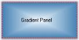

# Border Settings in Windows Forms Gradient Panel

[Windows Forms Gradient Panel](https://www.syncfusion.com/winforms-ui-controls/gradient-panel) can have 2D and 3D borders. The properties which sets the border style are as follows.

<table>
<tr>
<th>
Gradient Panel Property</th><th>
Description</th></tr>
<tr>
<td>
BorderStyle</td><td>
Sets the 2D or 3D border for the Gradient Panel. The options are,FixedSingle and Fixed3D.</td></tr>
<tr>
<td>
Border3DStyle</td><td>
Sets the style of the 3D border. The options are,RaisedOuter,RaisedInner,SunkenOuter,SunkenInner, Raised,Etched,Bump, Sunken, Adjust and Flat.</td></tr>
<tr>
<td>
BorderSingle</td><td>
Indicates the 2D border style. The options are,Solid, Dotted,Dashed,Inset, Outset andNone.</td></tr>
<tr>
<td>
BorderColor</td><td>
Sets the color for the 2D border. The BorderColor will be effective only when the BorderStyle property is set to FixedSingle.</td></tr>
<tr>
<td>
BorderSides</td><td>
Specifies the sides of the control which should have a border.</td></tr>
</table>




//Sets the 3D border style 
this.gradientPanel1.BorderStyle = System.Windows.Forms.BorderStyle.FixedSingle;
this.gradientPanel1.Border3DStyle = System.Windows.Forms.Border3DStyle.Etched;

//Sets the 2D Border style
this.gradientPanel1.BorderColor = System.Drawing.Color.Blue;
this.gradientPanel1.BorderSingle = System.Windows.Forms.ButtonBorderStyle.Dashed;
this.gradientPanel1.BorderSides = System.Windows.Forms.Border3DSide.All;





'Sets the 3D border style
Me.gradientPanel1.BorderStyle = System.Windows.Forms.BorderStyle.FixedSingle
Me.gradientPanel1.Border3DStyle = System.Windows.Forms.Border3DStyle.Etched
Me.gradientPanel1.BorderColor = System.Drawing.Color.Blue

'Sets the 2D Border style
Me.gradientPanel1.BorderSingle = System.Windows.Forms.ButtonBorderStyle.Dashed
Me.gradientPanel1.BorderSides = System.Windows.Forms.Border3DSide.All




  

  

 
 
 [Gradient Panel Appearance](/windowsforms/GradientPanel/GradientPanel-Appearance)
 
 
 
