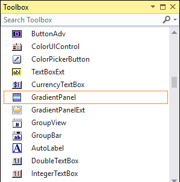
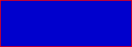

# Getting Started with Windows Forms Gradient Panel

This section will guide you to create a Gradient Panel via designer and also programming approach.

## Assembly deployment

Refer to the [Control Dependencies](https://help.syncfusion.com/windowsforms/control-dependencies#gradientpanel) section to get the list of assemblies or details of NuGet package that needs to be added as a reference to use the control in any application.

Click [NuGet Packages](https://help.syncfusion.com/windowsforms/installation/install-nuget-packages) to learn how to install nuget packages in a Windows Forms application.

## Adding GradientPanel control  via designer

1. Create a new Windows Forms application in Visual Studio. 

2. The [GradientPanel](https://help.syncfusion.com/cr/windowsforms/Syncfusion.Windows.Forms.Tools.GradientPanel.html) control can be added to an application by dragging it from the toolbox to a designer view. The following dependent assembly will be added automatically:

    * Syncfusion.Shared.Base

3. Set background color to GradientPanel through property grid.

 

## Adding GradientPanel control via code

The following steps guide you how to create a gradient panel programmatically.

1. Create a C# or VB application via Visual Studio.

2. Add the following assembly reference to the project:

    * Syncfusion.Shared.Base

3. Include the required namespace.




  
using Syncfusion.Windows.Forms.Tools;




Imports Syncfusion.Windows.Forms.Tools




{{ codesnippet1 | OrderList_Indent_Level_1 }} 

4. Create an instance of [GradientPanel](https://help.syncfusion.com/cr/windowsforms/Syncfusion.Windows.Forms.Tools.GradientPanel.html) control, and add it to the form.





private Syncfusion.Windows.Forms.Tools.GradientPanel gradientPanel1;
this.gradientPanel1 = new Syncfusion.Windows.Forms.Tools.GradientPanel();
this.Controls.Add(this.gradientPanel1);





Friend WithEvents GradientPanel1 As Syncfusion.Windows.Forms.Tools.GradientPanel
Me.gradientPanel1 = New Syncfusion.Windows.Forms.Tools.GradientPanel()
Me.Controls.Add(Me.gradientPanel1)




{{ codesnippet2 | OrderList_Indent_Level_1 }} 

## Styles

The GradientPanel control provides different set of background styles. The styles are Solid, Pattern, and Gradient.

### Solid




this.gradientPanel1.BackgroundColor = new Syncfusion.Drawing.BrushInfo(System.Drawing.Color.MediumBlue);
this.gradientPanel1.BorderColor = System.Drawing.Color.Red;
this.gradientPanel1.BorderStyle = System.Windows.Forms.BorderStyle.FixedSingle;




Me.gradientPanel1.BackgroundColor = New Syncfusion.Drawing.BrushInfo(System.Drawing.Color.MediumBlue)
Me.gradientPanel1.BorderColor = System.Drawing.Color.Red
Me.gradientPanel1.BorderStyle = System.Windows.Forms.BorderStyle.FixedSingle




### Pattern




this.gradientPanel1.BackgroundColor = new Syncfusion.Drawing.BrushInfo(Syncfusion.Drawing.PatternStyle.LargeCheckerBoard, System.Drawing.Color.Turquoise, System.Drawing.Color.MediumBlue);
this.gradientPanel1.BorderColor = System.Drawing.Color.PaleTurquoise;
this.gradientPanel1.BorderStyle = System.Windows.Forms.BorderStyle.FixedSingle;




Me.gradientPanel1.BackgroundColor = New Syncfusion.Drawing.BrushInfo(Syncfusion.Drawing.PatternStyle.LargeCheckerBoard, System.Drawing.Color.Turquoise, System.Drawing.Color.MediumBlue)
Me.gradientPanel1.BorderColor = System.Drawing.Color.PaleTurquoise
Me.gradientPanel1.BorderStyle = System.Windows.Forms.BorderStyle.FixedSingle




### Gradient




this.gradientPanel1.BackgroundColor = new Syncfusion.Drawing.BrushInfo(Syncfusion.Drawing.GradientStyle.ForwardDiagonal, System.Drawing.Color.Red, System.Drawing.Color.MediumBlue);
this.gradientPanel1.BorderColor = System.Drawing.Color.Transparent;
this.gradientPanel1.BorderStyle = System.Windows.Forms.BorderStyle.FixedSingle;




Me.gradientPanel1.BackgroundColor = New Syncfusion.Drawing.BrushInfo(Syncfusion.Drawing.GradientStyle.ForwardDiagonal, System.Drawing.Color.Red, System.Drawing.Color.MediumBlue)
Me.gradientPanel1.BorderColor = System.Drawing.Color.Transparent
Me.gradientPanel1.BorderStyle = System.Windows.Forms.BorderStyle.FixedSingle




