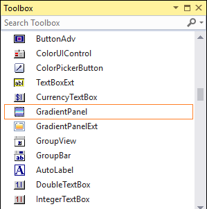
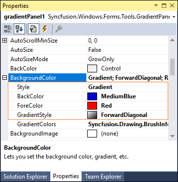
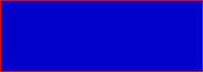
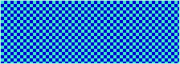

# Getting Started with Windows Forms GradientPanel

This section explains how to create a GradientPanel via the Visual Studio designer and programmatically.

## Assembly deployment

Refer to the [Control Dependencies](https://help.syncfusion.com/windowsforms/control-dependencies#gradientpanel) section to get the list of assemblies or the NuGet package details that must be referenced to use the control in any application.

Refer to [NuGet Packages](https://help.syncfusion.com/windowsforms/installation/install-nuget-packages) to learn how to install NuGet packages in a Windows Forms application.

## Adding GradientPanel control via designer

1. Create a new Windows Forms project in Visual Studio.

2. Install the Syncfusion WinForms NuGet package so the control is registered in the toolbox, then drag the [GradientPanel](https://help.syncfusion.com/cr/windowsforms/Syncfusion.Windows.Forms.Tools.GradientPanel.html) from the toolbox to the designer surface. The following dependent assemblies are added automatically:

    * Syncfusion.Shared.Base

3. Configure the GradientPanel through the property grid. For example, set the `BackgroundColor` to a `Syncfusion.Drawing.BrushInfo` value and adjust the `BorderColor` and `BorderStyle` as needed.

## Adding GradientPanel control via code

The following steps show how to create a GradientPanel programmatically.

1. Create a C# or VB.NET application in Visual Studio.

2. Add the following assembly references to the project:

    * Syncfusion.Shared.Base

3. Include the required namespaces at the top of the file.





using Syncfusion.Windows.Forms.Tools;
using System.Drawing;
using System.Windows.Forms;




Imports Syncfusion.Windows.Forms.Tools
Imports System.Drawing
Imports System.Windows.Forms




{{ codesnippet1 | OrderList_Indent_Level_1 }}

4. Create an instance of the [GradientPanel](https://help.syncfusion.com/cr/windowsforms/Syncfusion.Windows.Forms.Tools.GradientPanel.html) control, set its layout properties, and add it to the form.





public partial class Form1 : Form
{
    private Syncfusion.Windows.Forms.Tools.GradientPanel gradientPanel1;

    public Form1()
    {
        this.gradientPanel1 = new Syncfusion.Windows.Forms.Tools.GradientPanel()
        {
            Name = "gradientPanel1",
            Size = new System.Drawing.Size(400, 200),
            Location = new System.Drawing.Point(20, 20),
            Dock = System.Windows.Forms.DockStyle.Fill,
            BorderStyle = System.Windows.Forms.BorderStyle.FixedSingle
        };
        this.Controls.Add(this.gradientPanel1);
    }
}




Public Partial Class Form1
    Inherits Form

    Private WithEvents GradientPanel1 As Syncfusion.Windows.Forms.Tools.GradientPanel
    Public Sub New()
        Me.gradientPanel1 = New Syncfusion.Windows.Forms.Tools.GradientPanel() With {
            .Name = "gradientPanel1",
            .Size = New System.Drawing.Size(400, 200),
            .Location = New System.Drawing.Point(20, 20),
            .Dock = System.Windows.Forms.DockStyle.Fill,
            .BorderStyle = System.Windows.Forms.BorderStyle.FixedSingle
        }
        Me.Controls.Add(Me.gradientPanel1)
    End Sub
End Class




{{ codesnippet2 | OrderList_Indent_Level_1 }}

## Styles

The GradientPanel provides a variety of background styles. The available styles are Solid, Pattern, and Gradient. Choose a style based on the visual effect you need: Solid for a flat color, Pattern for a tiled brush, and Gradient for a color blend.

### Solid




this.gradientPanel1.BackgroundColor = new Syncfusion.Drawing.BrushInfo(System.Drawing.Color.MediumBlue);
this.gradientPanel1.BorderColor = System.Drawing.Color.Red;
this.gradientPanel1.BorderStyle = System.Windows.Forms.BorderStyle.FixedSingle;




Me.gradientPanel1.BackgroundColor = New Syncfusion.Drawing.BrushInfo(System.Drawing.Color.MediumBlue)
Me.gradientPanel1.BorderColor = System.Drawing.Color.Red
Me.gradientPanel1.BorderStyle = System.Windows.Forms.BorderStyle.FixedSingle




### Pattern




this.gradientPanel1.BackgroundColor = new Syncfusion.Drawing.BrushInfo(Syncfusion.Drawing.PatternStyle.LargeCheckerBoard, System.Drawing.Color.Turquoise, System.Drawing.Color.MediumBlue);
this.gradientPanel1.BorderColor = System.Drawing.Color.PaleTurquoise;
this.gradientPanel1.BorderStyle = System.Windows.Forms.BorderStyle.FixedSingle;




Me.gradientPanel1.BackgroundColor = New Syncfusion.Drawing.BrushInfo(Syncfusion.Drawing.PatternStyle.LargeCheckerBoard, System.Drawing.Color.Turquoise, System.Drawing.Color.MediumBlue)
Me.gradientPanel1.BorderColor = System.Drawing.Color.PaleTurquoise
Me.gradientPanel1.BorderStyle = System.Windows.Forms.BorderStyle.FixedSingle




### Gradient




this.gradientPanel1.BackgroundColor = new Syncfusion.Drawing.BrushInfo(Syncfusion.Drawing.GradientStyle.ForwardDiagonal, System.Drawing.Color.Red, System.Drawing.Color.MediumBlue);
this.gradientPanel1.BorderColor = System.Drawing.Color.Transparent;
this.gradientPanel1.BorderStyle = System.Windows.Forms.BorderStyle.FixedSingle;




Me.gradientPanel1.BackgroundColor = New Syncfusion.Drawing.BrushInfo(Syncfusion.Drawing.GradientStyle.ForwardDiagonal, System.Drawing.Color.Red, System.Drawing.Color.MediumBlue)
Me.gradientPanel1.BorderColor = System.Drawing.Color.Transparent
Me.gradientPanel1.BorderStyle = System.Windows.Forms.BorderStyle.FixedSingle




