# Appearance and Formatting in Windows Forms Grid Control
GridControl provides lot of properties and events for customizing the appearance of the grid. This section explains the appearance and formatting available in GridControl. GridControl provides different kinds visual styles, which changes the appearance of the whole grid. To know more about the Visual Styles check the link over [here](http://help.syncfusion.com/windowsforms/grid/visual-styles).

## Grid control designer
GridControl has an excellent user friendly design-time support. A GridControl’s edit designer is added to the grid to ease the process of designing GridControl on a cell level. Using the editor, Grid can be modified, saved, and loaded to XML formatted files or to SOAP formatted templates. 

Following is the step-by-step procedure to save the GridControl into an XML format

1. Right click the Grid control. A context menu is displayed.
2. Select `Edit` from the context menu drop-down. 

   

3. GridControl Designer window will be opened. In that select the File -> Save to XML option.
   
   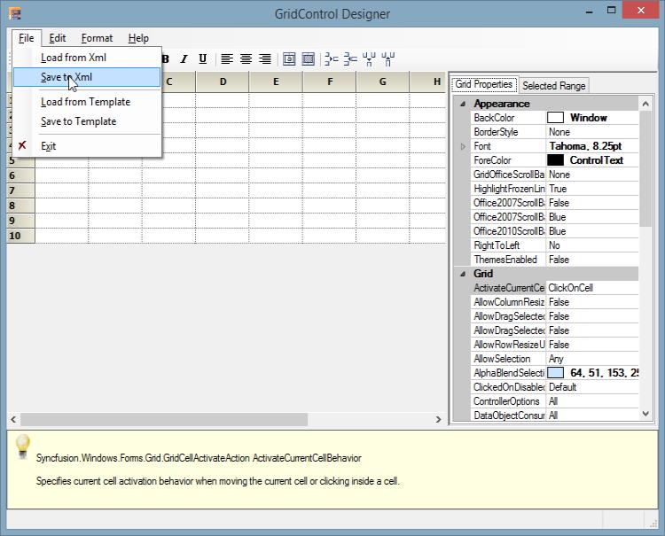

   N> Editor opens up on the right hand side of the page and Grid Properties tab is highlighted by default. The cell content, styles and general grid properties can be modified under Grid Properties tab. 

4. A dialog box will be opened. Save the XML file in the desired location.

The cell styles of the Grid can be changed by using the Grid Properties tab and Selected Range tab in the designer which is located at the right side of the GridControl designer. For more information on how to customize the cells using the GridControl designer, check the link over [here](http://help.syncfusion.com/windowsforms/grid/populating-data#modifying-cell-styles-through-designer).

N>  The system prompts you to save the changes to the Grid control in the designer if exited without saving.

## Grid properties
This section would explain the list of properties that changes the Appearance, Print Styles, and Scroll Bar settings of GridControl.

### Appearance properties
The properties that mainly affect the appearance of cells in GridControl are listed below.

#### Hiding verticalLines
To display the grid without the vertical lines, set the [DisplayVerticalLines](https://help.syncfusion.com/cr/windowsforms/Syncfusion.Windows.Forms.Grid.GridControl.html#Syncfusion_Windows_Forms_Grid_GridControl_DisplayVerticalLines) property to `false`.



//Remove the Vertical Lines
this.gridControl.DisplayVerticalLines = false;


'Remove the Vertical Lines
Me.gridControl.DisplayVerticalLines = False


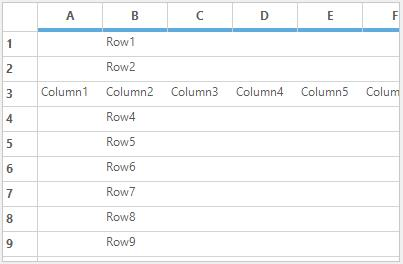

#### Hiding horizontalLines
To display the grid without the horizontal lines, set the [DisplayHorizontalLines](https://help.syncfusion.com/cr/windowsforms/Syncfusion.Windows.Forms.Grid.GridControl.html#Syncfusion_Windows_Forms_Grid_GridControl_DisplayVerticalLines) property to `false`.



//Remove the Horizontal Lines
this.gridControl. DisplayHorizontalLines = false;


'Remove the Horizontal Lines
Me.gridControl.DisplayHorizontalLines = False



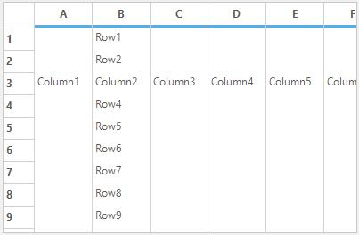

#### Border line color
The color of vertical and horizontal lines can be set for GridControl by using the [GridLineColor](https://help.syncfusion.com/cr/windowsforms/Syncfusion.Windows.Forms.Grid.GridControl.html#Syncfusion_Windows_Forms_Grid_GridControl_GridLineColor) property.



//Set the orange color for Horizontal and Vertical lines
this.gridControl.GridLineColor = Color.Orange;


'Set the orange color for Horizontal and Vertical lines
Me.gridControl.GridLineColor = Color.Orange



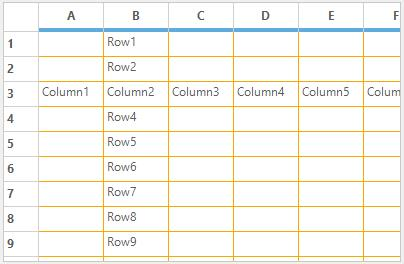

#### Border styles
The `BorderStyle` for the GridControl can be set by using [DefaultGridBorderStyle](https://help.syncfusion.com/cr/windowsforms/Syncfusion.Windows.Forms.Grid.GridControl.html#Syncfusion_Windows_Forms_Grid_GridControl_DefaultGridBorderStyle) property.[GridBorderStyle](http://help.syncfusion.com/cr/windowsforms/Syncfusion.Windows.Forms.Grid.GridBorderStyle.html) enumeration has provide the following options to set the border style,

* DashDot
* DashDotDot
* Dashed
* Dotted
* None
* NotSet
* Solid
* Standard



//To set the border style.
this.gridControl.DefaultGridBorderStyle = GridBorderStyle.DashDotDot;


' To set the border style.
Me.gridControl.DefaultGridBorderStyle = GridBorderStyle.DashDotDot



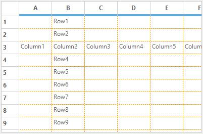

#### Setting background image
The background of the GridControl can be filled with an image by using [BackgroundImage](https://docs.microsoft.com/en-us/dotnet/api/system.windows.forms.control.backgroundimage?view=net-5.0) property.



//To change the background image of grid control.
this.gridControl.BackgroundImage = Image.FromFile(@"sync.jpg");


' To change the background image of grid control.
Me.gridControl.BackgroundImage = Image.FromFile("sync.jpg")


[TransparentBackground](https://help.syncfusion.com/cr/windowsforms/Syncfusion.Windows.Forms.Grid.GridControl.html#Syncfusion_Windows_Forms_Grid_GridControl_TransparentBackground) specifies whether to display grid with background image. When this property is set to false, the background image will not be displayed even if it is set by using `BackgroundImage` property


//Background image or color was displayed.
this.gridControl.TransparentBackground = true;


'Background image or color was displayed.
Me.gridControl.TransparentBackground = True



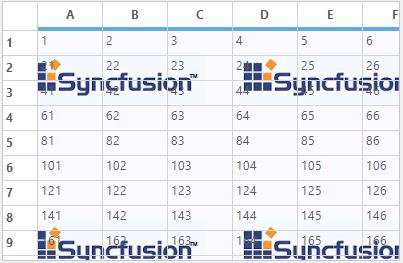

While changing the Background image of GridControl, the [BackgroundImageChanged](https://docs.microsoft.com/en-us/dotnet/api/system.windows.forms.control.backgroundimagechanged?view=net-5.0) event will be fired.



this.gridControl.BackgroundImageChanged += gridControl_BackgroundImageChanged;

void gridControl_BackgroundImageChanged(object sender, EventArgs e)
{
// Add the required code over here.
}


Private Me.gridControl.BackgroundImageChanged += AddressOf gridControl_BackgroundImageChanged

Private Sub gridControl_BackgroundImageChanged(ByVal sender As Object, ByVal e As EventArgs)
'Add the required code over here.
End Sub



#### Changing background color
To set the color of the area below the last row and right of the last column (client area) inside the grid, use the [BackgroundColor](https://help.syncfusion.com/cr/windowsforms/Syncfusion.Windows.Forms.Grid.GridProperties.html#Syncfusion_Windows_Forms_Grid_GridProperties_BackgroundColor) property.



//Set the background color for area below the grid.
this.gridControl.Properties.BackgroundColor = Color.PaleGreen;


'Set the background color for area below the grid.
Me.gridControl.Properties.BackgroundColor = Color.PaleGreen



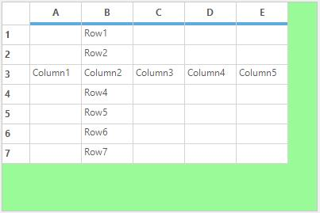

To recover the background color to its default value, use the [ResetBackgroundColor](https://help.syncfusion.com/cr/windowsforms/Syncfusion.Windows.Forms.Grid.GridProperties.html#Syncfusion_Windows_Forms_Grid_GridProperties_ResetBackgroundColor) method.



//To recover the background color.
this.gridControl.Properties.ResetBackgroundColor();


'To recover the background color.
Me.gridControl.Properties.ResetBackgroundColor()



#### Hiding column headers
The [ColHeaders](https://help.syncfusion.com/cr/windowsforms/Syncfusion.Windows.Forms.Grid.GridProperties.html#Syncfusion_Windows_Forms_Grid_GridProperties_ColHeaders) property used to indicate whether the GridControl should display column headers or not. 



// To remove Column header.
this.gridControl.Properties.ColHeaders = false;


'To remove column header.
Me.gridControl.Properties.ColHeaders = False


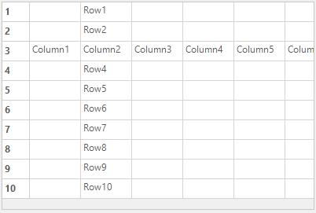

#### Hiding row headers
The visibility of the row headers in the grid can be set by using the [RowHeaders](https://help.syncfusion.com/cr/windowsforms/Syncfusion.Windows.Forms.Grid.GridProperties.html#Syncfusion_Windows_Forms_Grid_GridProperties_RowHeaders) property.



//To remove Row header.
this.gridControl.Properties.RowHeaders = false;


'To remove Row header.
Me.gridControl.Properties.RowHeaders = False


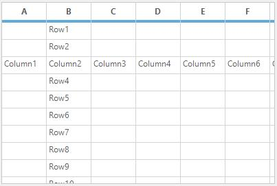

#### Hiding numbered column headers
The [NumberedColHeaders](https://help.syncfusion.com/cr/windowsforms/Syncfusion.Windows.Forms.Grid.GridModelOptions.html#Syncfusion_Windows_Forms_Grid_GridModelOptions_NumberedColHeaders) property is used to indicate whether to display the default column names (A, B, C) in column headers. 



//Remove the Column header name.
this.gridControl.Model.Options.NumberedColHeaders = false;


'Remove the Column header name.
Me.gridControl.Model.Options.NumberedColHeaders = False



#### Hiding numbered row headers
The [NumberedRowHeaders](https://help.syncfusion.com/cr/windowsforms/Syncfusion.Windows.Forms.Grid.GridModelOptions.html#Syncfusion_Windows_Forms_Grid_GridModelOptions_NumberedRowHeaders)  property is used to indicate whether to display the row numbers of row headers. 



//Remove the Row header numbers.
this.gridControl.Model.Options.NumberedRowHeaders = false;


'Remove the Row header numbers.
Me.gridControl.Model.Options.NumberedRowHeaders = False


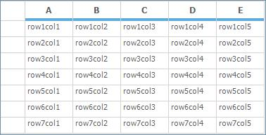

#### Changing frozen line color
The color of the frozen grid lines can be set by using [FixedLinesColor](https://help.syncfusion.com/cr/windowsforms/Syncfusion.Windows.Forms.Grid.GridProperties.html#Syncfusion_Windows_Forms_Grid_GridProperties_FixedLinesColor) property. This property is applicable for both frozen column and frozen rows grid lines.



//Apply color for frozen gridlines.
this.gridControl.Properties.FixedLinesColor = Color.Red;


'Apply color for frozen gridlines.
Me.gridControl.Properties.FixedLinesColor = Color.Red



To recover the `FixedLinesColor` to its default value, you can use [ResetFixedLinesColor](https://help.syncfusion.com/cr/windowsforms/Syncfusion.Windows.Forms.Grid.GridProperties.html#Syncfusion_Windows_Forms_Grid_GridProperties_ResetFixedLinesColor) method.



//To recover the FixedLinesColor.
this.gridControl.Properties.ResetFixedLinesColor();


'To recover the FixedLinesColor.
Me.gridControl.Properties.ResetFixedLinesColor()



#### Highlighting column headers
The column header for the current cell can be highlighted by using [MarkColHeader](https://help.syncfusion.com/cr/windowsforms/Syncfusion.Windows.Forms.Grid.GridProperties.html#Syncfusion_Windows_Forms_Grid_GridProperties_MarkColHeader) property. Set this to true for highlight the column header, otherwise false.



//To highlight the Column header for the current cell.
this.gridControl.Properties.MarkColHeader = true;


'To highlight the Column header for the current cell.
Me.gridControl.Properties.MarkColHeader = True



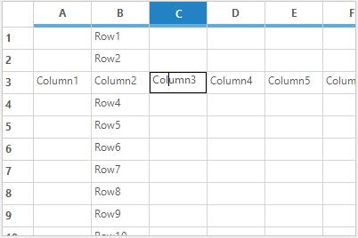

#### Highlighting row headers
The row header of the current cell can be highlighted by using [MarkRowHeader](https://help.syncfusion.com/cr/windowsforms/Syncfusion.Windows.Forms.Grid.GridProperties.html#Syncfusion_Windows_Forms_Grid_GridProperties_MarkRowHeader) property.



//To highlight the Column header for the current cell.
this.gridControl.Properties.MarkRowHeader = true;


'To highlight the Column header for the current cell.
Me.gridControl.Properties.MarkRowHeader = True


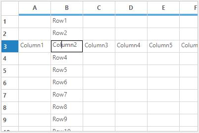

#### Changing resize line color
While resizing the columns or rows in grid at run time, a virtual marker will be visible on resizing. This virtual line marker color can be changed by using the [ResizingCellsLinesColor](https://help.syncfusion.com/cr/windowsforms/Syncfusion.Windows.Forms.Grid.GridProperties.html#Syncfusion_Windows_Forms_Grid_GridProperties_ResizingCellsLinesColor) property. By default the color is red.



//To set color for grid line marker.
this.gridControl.Properties.ResizingCellsLinesColor = Color.Red;


'To set color for grid line marker.
Me.gridControl.Properties.ResizingCellsLinesColor = Color.Red



### Print properties
GridControl provides lot properties which specifically relates to printing functionality. For enabling the GridControl to the printing mode make use of the Printing property. 



// Switches to printing mode of the GridControl.
this.gridControl1.Properties.Printing = true;


'Switches to printing mode of the GridControl.
Me.gridControl1.Properties.Printing = True



The list of print properties available in GridControl can be viewed in the separate topic named Printing. Refer that topic for more detailed explanation on Printing functionality.

### Scroll bar properties
GridControl provides support to control functionalities and appearance of grid scroll bars. To enable or disable the scrolling make use of the [HScrollBehavior](https://help.syncfusion.com/cr/windowsforms/Syncfusion.Windows.Forms.Grid.GridControlBase.html#Syncfusion_Windows_Forms_Grid_GridControlBase_HScrollBehavior) and [VScrollBehavior](https://help.syncfusion.com/cr/windowsforms/Syncfusion.Windows.Forms.Grid.Grouping.GridGroupDropArea.html#Syncfusion_Windows_Forms_Grid_Grouping_GridGroupDropArea_VScrollBehavior) properties. It specifies the behavior of the horizontal and vertical scroll bar respectively.[GridScrollbarMode](http://help.syncfusion.com/cr/windowsforms/Syncfusion.Windows.Forms.Grid.GridScrollbarMode.html) enumeration provides list of options to control the scroll bar behavior.




//Sets the behavior of the horizontal scroll bar.
this.gridControl1.HScrollBehavior = GridScrollbarMode.Disabled;

//Sets the behavior of the vertical scroll bar.
this.gridControl1.VScrollBehavior = GridScrollbarMode.Disabled;



'Sets the behavior of the horizontal scroll bar.
Me.gridControl1.HScrollBehavior = GridScrollbarMode.Disabled

'Sets the behavior of the vertical scroll bar.
Me.gridControl1.VScrollBehavior = GridScrollbarMode.Disabled



The list of properties related to scroll bar in GridControl can be viewed in the separate topic which comes under Scrolling. 

## GridFormatCellDialog
[GridFormatCellDialog](http://help.syncfusion.com/cr/windowsforms/Syncfusion.GridHelperClasses.GridFormatCellDialog.html) simulates **Format Cells dialog** feature of Microsoft Excel. It provides numerous formatting options such as Font, Alignment, Background, and Number format, which aid in formatting grid cells dynamically. It is now available as an add-on feature for GridControl. `GridFormatCellDialog` class accepts an instance of the GridControl to be formatted, and exposes the above mentioned formatting options to operate on grid cells that are selected. The `GridFormatCellDialog` class comes under the [Syncfusion.GridHelperClasses](http://help.syncfusion.com/cr/windowsforms/Syncfusion.GridHelperClasses.html) library.
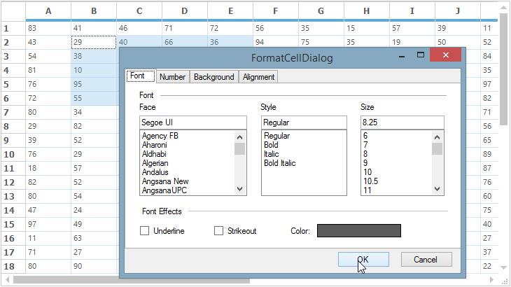

This `GridFormatCellDialog` can be enabled by instantiating `GridFormatCellDialog` class and invoking its **ShowDialog** method.



GridFormatCellDialog formatDialog = new GridFormatCellDialog(this.gridControl1);
formatDialog.ShowDialog();


Dim formatDialog As GridFormatCellDialog = New GridFormatCellDialog(Me.gridControl1)
formatDialog.ShowDialog()



N> The grid cells which needs to be formatted needs to be selected before activating this dialog.

## Formatting options
`GridFormatCellDialog` contains four kinds of formatting option in it.

1. [Font Tab](#font-tab)
2. [Number Tab](#number-tab)
3. [Background Tab](#background-tab)
4. [Alignment Tab](#alignment-tab)

### Font tab
This provides options to set the font, font style, font size, font effects, and font color for the desired grid cells.

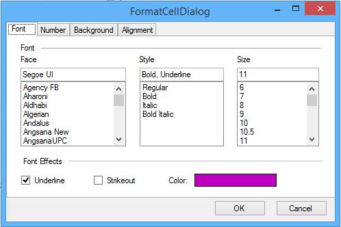

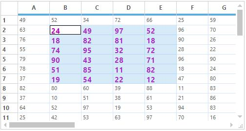

### Number tab
This allows you to specify text format for grid cells. The possible options are Number, Currency, Percentage, Date, Time, Scientific and Text.

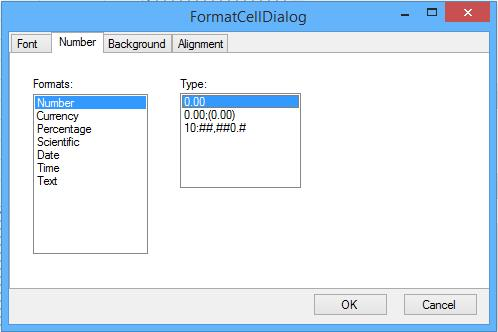

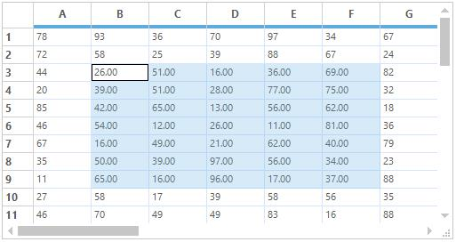

### Background tab
This allows you to set background color for grid cells. You can set gradient shades and pattern styles as well.

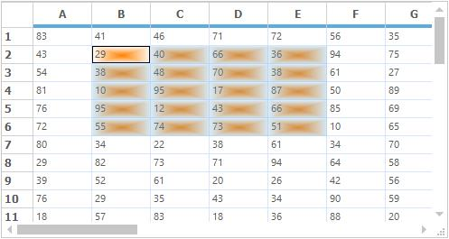

### Alignment tab
This provides various cell alignment options such as Horizontal Alignment, Vertical Alignment, Merge Cells, Wrap Text, and so on.

N> A sample demonstrating the `GridFormatCellDialog` is available under the following sample installation path. 

**&lt;Install Location&gt;\Syncfusion\EssentialStudio\[Version Number]\Windows\Grid.Windows\Samples\Dynamic Formatting\Format Cells Demo**

## Custom drawing
Custom Drawing denotes adding text and drawings such as lines, polygon etc., to the cell. It has the custom drawn event such as [CellDrawn](https://help.syncfusion.com/cr/windowsforms/Syncfusion.Windows.Forms.Grid.GridControlBase.html)  and [DrawCell](https://help.syncfusion.com/cr/windowsforms/Syncfusion.Windows.Forms.Grid.GridControlBase.html)  events.

### DrawCell
[DrawCell](https://help.syncfusion.com/cr/windowsforms/Syncfusion.Windows.Forms.Grid.GridControlBase.html) event was handled for every cell before the grid draws a specified cell. It is used to add custom drawing to a cell.




//DrawCell event is used to apply styles to the grid.
this.gridControl1.CellDrawn += new GridDrawCellEventHandler(gridControl1_CellDrawn);

private void gridControl1_DrawCell(object sender, GridDrawCellEventArgs e)
{

    if (e.RowIndex == 0)
    {
        e.Style.Interior = new BrushInfo(GradientStyle.Vertical, Color.FromArgb(255, 229, 201), Color.FromArgb(255, 153, 52));
    }

    else if (e.ColIndex == 0)
    {
        e.Style.Interior = new BrushInfo(GradientStyle.Horizontal, Color.White, Color.FromArgb(102, 110, 152));
    }

    else if (e.RowIndex % 2 == 0)
    {
        e.Style.Interior = new BrushInfo(GradientStyle.BackwardDiagonal, Color.FromArgb(51, 51, 101), Color.White);
    }
}


'DrawCell event is used to apply styles to the grid.
AddHandler gridControl1.DrawCell, AddressOf gridControl1_DrawCell

Private Sub gridControl1_DrawCell(ByVal sender As Object, ByVal e As GridDrawCellEventArgs)

    If e.RowIndex = 0 Then
        e.Style.Interior = New BrushInfo(GradientStyle.Vertical, Color.FromArgb(255, 229, 201), Color.FromArgb(255, 153, 52))

    ElseIf e.ColIndex = 0 Then
        e.Style.Interior = New BrushInfo(GradientStyle.Horizontal, Color.White, Color.FromArgb(102, 110, 152))

    ElseIf e.RowIndex Mod 2 = 0 Then
        e.Style.Interior = New BrushInfo(GradientStyle.BackwardDiagonal, Color.FromArgb(51, 51, 101), Color.White)
    End If
End Sub



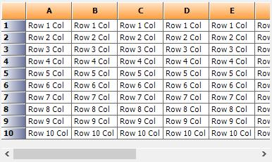

### CellDrawn
[CellDrawn](https://help.syncfusion.com/cr/windowsforms/Syncfusion.Windows.Forms.Grid.GridControlBase.html) event will be handled for every cell when the grid draws the specified cell. User can do custom drawing after the grid completes the drawing of cell by using [e.Graphics](https://help.syncfusion.com/cr/windowsforms/Syncfusion.Windows.Forms.Grid.GridDrawCellEventArgs.html#Syncfusion_Windows_Forms_Grid_GridDrawCellEventArgs__ctor_System_Drawing_Graphics_Syncfusion_Windows_Forms_Grid_GridCellRendererBase_System_Drawing_Rectangle_System_Int32_System_Int32_Syncfusion_Windows_Forms_Grid_GridStyleInfo_System_Boolean_) property.



//Handles CellDrawn Event to customize the appearance of grid cells.
this.gridControl1.CellDrawn += new GridDrawCellEventHandler(gridControl1_CellDrawn);

void gridControl1_CellDrawn(object sender, GridDrawCellEventArgs e)
{

    if (e.ColIndex == 6 && e.RowIndex > 0)
    {
        Rectangle rec = e.Bounds, rect = e.Bounds;
        rec.X = (e.Bounds.Left + e.Bounds.Right) / 2;

        if (e.Style.CellValue.ToString() == "1")
        {
            e.Graphics.FillEllipse(Brushes.Gray, rect);
        }

        else
        {
            e.Graphics.FillEllipse(Brushes.LightGray, rect);
        }
    }
}


'Handles CellDrawn Event to customize the appearance of grid cells.
AddHandler gridControl1.CellDrawn, AddressOf gridControl1_CellDrawn

Private Sub gridControl1_CellDrawn(ByVal sender As Object, ByVal e As GridDrawCellEventArgs)

    If e.ColIndex = 6 AndAlso e.RowIndex > 0 Then
        Dim rec As Rectangle = e.Bounds, rect As Rectangle = e.Bounds
        rec.X = (e.Bounds.Left + e.Bounds.Right) / 2

        If e.Style.CellValue.ToString() = "1" Then
            e.Graphics.FillEllipse(Brushes.Gray, rect)

        Else
            e.Graphics.FillEllipse(Brushes.LightGray, rect)
        End If
    End If
End Sub




The below screenshot shows the grid with ellipse. We can also insert images in cell by using this event.

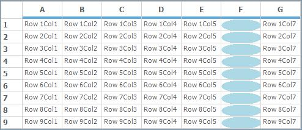

## Custom borders
The custom borders around cells can be drawn by using [DrawCellFrameAppearance](https://help.syncfusion.com/cr/windowsforms/Syncfusion.Windows.Forms.Grid.GridControlBase.html) event of the Grid. `DrawCellFrameAppearance` event is triggered for every cell before the grid draws the frame of a specified cell and also after the cell's background is drawn. This event can be used with any cell type such as Textbox, Checkbox, and so on. You can draw texture-brush border and gradient borders.



//Draw Custom Borders.
this.gridControl1.DrawCellFrameAppearance += gridControl1_DrawCellFrameAppearance;

void gridControl1_DrawCellFrameAppearance(object sender, Syncfusion.Windows.Forms.Grid.GridDrawCellBackgroundEventArgs e)
{
    int rowIndex = e.Style.CellIdentity.RowIndex;
    int colIndex = e.Style.CellIdentity.ColIndex;

    if (rowIndex > 0 && colIndex > 0)
    {
        Brush brush;
        Graphics g = e.Graphics;

        //Otherwise uses a gradient brush.
        brush = new System.Drawing.Drawing2D.LinearGradientBrush(e.TargetBounds, Color.Red, Color.Orange, 45f);

        //Draws custom border for the cell.

        //Space has been reserved for this area with the TableStyle.BorderMargins property.
        Rectangle rect = e.TargetBounds;
        rect.Inflate(-2, -2);
        Rectangle[] rectangles = new Rectangle[] 
        {
            new Rectangle(rect.X, rect.Y, rect.Width, 4),
            new Rectangle(rect.X, rect.Y, 4, rect.Height),
            new Rectangle(rect.Right-4, rect.Y, 4, rect.Height),
            new Rectangle(rect.X, rect.Bottom-4, rect.Width, 4),
        };
        g.FillRectangles(brush, rectangles);

        //Disallows grid's default drawing of cell frame for this cell.
        e.Cancel = true;
    }

}


Private Custom As Draw

Private Sub gridControl1_DrawCellFrameAppearance(ByVal sender As Object, ByVal e As Syncfusion.Windows.Forms.Grid.GridDrawCellBackgroundEventArgs)
    Dim rowIndex As Integer = e.Style.CellIdentity.RowIndex
    Dim colIndex As Integer = e.Style.CellIdentity.ColIndex

    If rowIndex > 0 AndAlso colIndex > 0 Then
        Dim brush As Brush
        Dim g As Graphics = e.Graphics

        'Otherwise uses a gradient brush.
        brush = New System.Drawing.Drawing2D.LinearGradientBrush(e.TargetBounds, Color.Red, Color.Orange, 45f)

        'Draws custom border for the cell.

        'Space has been reserved for this area with the TableStyle.BorderMargins property.
        Dim rect As Rectangle = e.TargetBounds
        rect.Inflate(-2, -2)
        Dim rectangles() As Rectangle = { New Rectangle(rect.X, rect.Y, rect.Width, 4), New Rectangle(rect.X, rect.Y, 4, rect.Height), New Rectangle(rect.Right-4, rect.Y, 4, rect.Height), New Rectangle(rect.X, rect.Bottom-4, rect.Width, 4) }
        g.FillRectangles(brush, rectangles)

        'Disallows grid's default drawing of cell frame for this cell.
        e.Cancel = True
    End If

End Sub




## Banner cells
Banner cells are multiple cells spanning a single background image. An image to be displayed in the cell can be loaded on disk, by changing the [BackgroundImage](https://help.syncfusion.com/cr/windowsforms/Syncfusion.Windows.Forms.Grid.GridStyleInfo.html#Syncfusion_Windows_Forms_Grid_GridStyleInfo_BackgroundImage) property for a cell. Now apply the Banner cells for the required range of cells around the image by using [BanneredRanges](https://help.syncfusion.com/cr/windowsforms/Syncfusion.Windows.Forms.Grid.GridControl.html#Syncfusion_Windows_Forms_Grid_GridControl_BanneredRanges) property.



//Create Banner cells.
GridStyleInfo style;
style = this.gridControl1[1, 7];
gridControl1.BanneredRanges.Add(GridRangeInfo.FromTlhw(1, 7, 8, 3));
style.BackgroundImage = Image.FromFile(@"F:\OTHERSS\Others\plan.jpg");
style.Text = "Plan.jpg";
style.TextColor = Color.Red;


'Create Banner cells.
Dim style As GridStyleInfo
style = Me.gridControl1(1, 7)
gridControl1.BanneredRanges.Add(GridRangeInfo.FromTlhw(1, 7, 8, 3))
style.BackgroundImage = Image.FromFile("F:\OTHERSS\Others\plan.jpg")
style.Text = "Plan.jpg"
style.TextColor = Color.Red



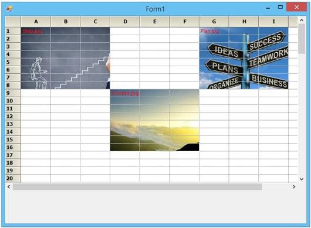

## PrepareViewStyleInfo event
[PrepareViewStyleInfo](https://help.syncfusion.com/cr/windowsforms/Syncfusion.Windows.Forms.Grid.GridControlBase.html) event is raised to allow custom formatting of a cell by changing its style object just before it is drawn. This allows formatting based on the current view state, e.g. current cell context, focused control, and so on. For example, it is possible to draw the current row with a bold text by using this event. Likewise it is also possible to change the style properties for the required range of cells. This event will be fired for each cells and hence the styles for each cells can be changed individually. 




this.gridControl1.PrepareViewStyleInfo += new GridPrepareViewStyleInfoEventHandler(gridControl1_PrepareViewStyleInfo);

void gridControl1_PrepareViewStyleInfo(object sender, GridPrepareViewStyleInfoEventArgs e)
{

    if ((e.RowIndex > 1 && e.RowIndex < 7) && (e.ColIndex > 1 && e.ColIndex < 5))
    {
        e.Style.Font.Bold = true;
        e.Style.Font.Italic = true;
    }

}




AddHandler gridControl1.PrepareViewStyleInfo, AddressOf gridControl1_PrepareViewStyleInfo

Private Sub gridControl1_PrepareViewStyleInfo(ByVal sender As Object, ByVal e As GridPrepareViewStyleInfoEventArgs)

    If (e.RowIndex > 1 AndAlso e.RowIndex < 7) AndAlso (e.ColIndex > 1 AndAlso e.ColIndex < 5) Then
        e.Style.Font.Bold = True
        e.Style.Font.Italic = True
    End If
End Sub




## QueryCellInfo event
[QueryCellInfo](https://help.syncfusion.com/cr/windowsforms/Syncfusion.Windows.Forms.Grid.GridModel.html) event also will be called whenever cells are in need of the style properties. This event will be fired before the cell is been drawn. This event also is same as that of the `PrepareViewStyleInfo` event. All the style properties will be stored in the [GridStyleInfo](http://help.syncfusion.com/cr/windowsforms/Syncfusion.Windows.Forms.Grid.GridStyleInfo.html) class. This event will be fired for each cells and hence the styles for each cells can be changed individually. It is possible to change the color or any style properties for the required range of cells.



this.gridControl1.QueryCellInfo += new GridQueryCellInfoEventHandler(gridControl1_QueryCellInfo);

void gridControl1_QueryCellInfo(object sender, GridQueryCellInfoEventArgs e)
{

    if ((e.RowIndex > 1 && e.RowIndex < 7) && (e.ColIndex > 1 && e.ColIndex < 5))
    {
        e.Style.BackColor = Color.Aquamarine;
        e.Style.TextColor = Color.HotPink;
        e.Style.Font.Bold = true;
    }
}




AddHandler gridControl1.QueryCellInfo, AddressOf gridControl1_QueryCellInfo

Private Sub gridControl1_QueryCellInfo(ByVal sender As Object, ByVal e As GridQueryCellInfoEventArgs)

    If (e.RowIndex > 1 AndAlso e.RowIndex < 7) AndAlso (e.ColIndex > 1 AndAlso e.ColIndex < 5) Then
        e.Style.BackColor = Color.Aquamarine
        e.Style.TextColor = Color.HotPink
        e.Style.Font.Bold = True
    End If
End Sub



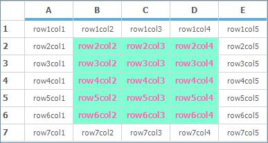

