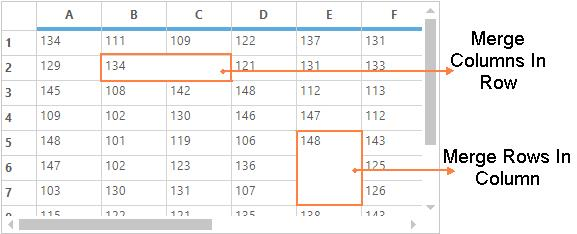
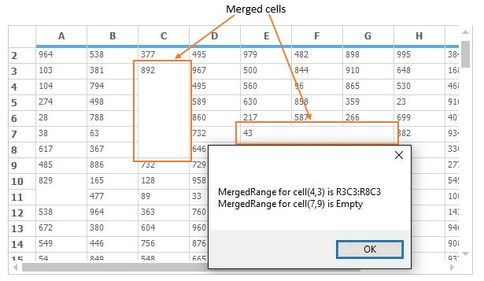

# Cell Merging in Windows Forms Grid Control
The cell merging is also one of the technique to merge the range of cells in the GridControl. The range of cells will be merged based on the data. The cells which has same data will be merged in row wise in same column or column wise in same row. To enable the merging support in grid, the [MergeCell](https://help.syncfusion.com/cr/windowsforms/Syncfusion.Windows.Forms.Grid.GridMergeCellsLayout.html), [MergeCellsMode](https://help.syncfusion.com/cr/windowsforms/Syncfusion.Windows.Forms.Grid.GridModelOptions.html#Syncfusion_Windows_Forms_Grid_GridModelOptions_MergeCellsMode) and [MergeCellsLayout](https://help.syncfusion.com/cr/windowsforms/Syncfusion.Windows.Forms.Grid.GridMergeCellsLayout.html) properties can be used.

The following code snippet is used to enable the merging in GridControl,




// Set MergeCells direction for the GridControl.
this.gridControl1.TableStyle.MergeCell = GridMergeCellDirection.Both;

// Set merge cells behavior for the Grid.
this.gridControl1.Model.Options.MergeCellsMode = GridMergeCellsMode.OnDemandCalculation
    | GridMergeCellsMode.MergeColumnsInRow | GridMergeCellsMode.MergeRowsInColumn;
this.gridControl1.Model.Options.MergeCellsLayout = GridMergeCellsLayout.Grid;



'Set MergeCells direction for the GridControl.
Me.gridControl1.TableStyle.MergeCell = GridMergeCellDirection.Both

'Set merge cells behavior for the Grid.
Me.gridControl1.Model.Options.MergeCellsMode = GridMergeCellsMode.OnDemandCalculation Or GridMergeCellsMode.MergeColumnsInRow Or GridMergeCellsMode.MergeRowsInColumn
Me.gridControl1.Model.Options.MergeCellsLayout = GridMergeCellsLayout.Grid



N> Any range of cells cannot be merged like the covered ranges. Because merging has different functionality than the covered ranges, which allows only to merge the adjacent cells with the same data. 

The [MergeCell](https://help.syncfusion.com/cr/windowsforms/Syncfusion.Windows.Forms.Grid.GridStyleInfo.html#Syncfusion_Windows_Forms_Grid_GridStyleInfo_MergeCell) is the option which is used to set the direction for allowing the merging for particular cell. The [GridMergeCellDirection](https://help.syncfusion.com/cr/windowsforms/Syncfusion.Windows.Forms.Grid.GridMergeCellDirection.html) have the following list of enumerations to set the merge direction,

* **ColumnsInRow** – Merge adjacent cells in same row 
* **RowsInColumn** – Merge adjacent cells in same column 
* **Both** – Merge in both directions 
* **None** – Merge cell is disabled  




// Set MergeCells direction for the GridControl.
this.gridControl1.TableStyle.MergeCell = GridMergeCellDirection.ColumnsInRow | GridMergeCellDirection.RowsInColumn;



'Set MergeCells direction for the GridControl.
Me.gridControl1.TableStyle.MergeCell = GridMergeCellDirection.ColumnsInRow Or GridMergeCellDirection.RowsInColumn


The [MergeCellsMode](https://help.syncfusion.com/cr/windowsforms/Syncfusion.Windows.Forms.Grid.GridModelOptions.html#Syncfusion_Windows_Forms_Grid_GridModelOptions_MergeCellsMode) is used to specify how to calculate/compare the cells for merging. The [GridMergeCellsMode](https://help.syncfusion.com/cr/windowsforms/Syncfusion.Windows.Forms.Grid.GridMergeCellsMode.html) has the following list of enumerations to set the different merge cells mode.

* **BeforeDisplayCalculation** – Used to calculate the merge cells while loading the grid 
* **OnDemandCalculation** – It will calculate the merge cells count on demand (while entering the values in the grid cells) 
* **MergeRowsInColumn** – Used to merge the rows in column. 
* **MergeColumnsInRow** –  To merge the same column values into the single row 
* **None** – MergeCells behavior is disabled. 
* **SkipHiddenCells** - Skip the hidden rows/columns and allow merging across them. 



this.gridControl1.Model.Options.MergeCellsMode = GridMergeCellsMode.OnDemandCalculation | GridMergeCellsMode.MergeColumnsInRow | GridMergeCellsMode.MergeRowsInColumn;


Me.gridControl1.Model.Options.MergeCellsMode = GridMergeCellsMode.OnDemandCalculation Or GridMergeCellsMode.MergeColumnsInRow Or GridMergeCellsMode.MergeRowsInColumn



This property is used to set the calculation area for the merge cells in GridControl. The [GridMergeCellsLayout](https://help.syncfusion.com/cr/windowsforms/Syncfusion.Windows.Forms.Grid.GridMergeCellsLayout.html) provides the following options to set the calculation area for the merging,

* **Grid** – Merge cells for entire grid, may affect the performance for the large grid. 
* **VisibleRange** – Merge cells only in visible range. 



this.gridControl1.Model.Options.MergeCellsLayout = GridMergeCellsLayout.Grid;


Me.gridControl1.Model.Options.MergeCellsLayout = GridMergeCellsLayout.Grid



## Finding a Merged Range of a Cell
The [MergeCells](https://help.syncfusion.com/cr/windowsforms/Syncfusion.Windows.Forms.Grid.GridModelMergeCells.html) collection maintains the all the merged ranges of a GridControl. To find a merged range of a cell, [FindRange](https://help.syncfusion.com/cr/windowsforms/Syncfusion.Windows.Forms.Grid.GridModelMergeCells.html#Syncfusion_Windows_Forms_Grid_GridModelMergeCells_FindRange_System_Int32_System_Int32_) method can be used. If the specified cell with row index and column index is inside a ` MergedRange `, a range will be returned. Otherwise it will return the empty range.




// Finding a MergedRange for cell(4,3)
GridRangeInfo mergedRange = this.gridControl1.Model.MergeCells.FindRange(4, 3);

// Finding a MergedRange for cell(7,9)
GridRangeInfo mergedRange2 = this.gridControl1.Model.MergeCells.FindRange(7, 9);
MessageBox.Show("MergedRange for cell(4,3) is " + mergedRange.Info.ToString()
+ "\n" + "MergedRange for cell(7,9) is " + mergedRange2.RangeType.ToString());




' Finding a MergedRange for cell(4,3)
Dim mergedRange As GridRangeInfo = Me.gridControl1.Model.MergeCells.FindRange(4, 3)

' Finding a MergedRange for cell(7,9)
Dim mergedRange2 As GridRangeInfo = Me.gridControl1.Model.MergeCells.FindRange(7, 9)
MessageBox.Show("MergedRange for cell(4,3) is " & mergedRange.Info.ToString() & Constants.vbLf & "MergedRange for cell(7,9) is " & mergedRange2.RangeType.ToString())



N> The merged range of a cell can also be determined by using [GetSpannedRangeInfo](/windowsforms/grid/managing-the-rows-and-columns#finding-covered-range-floating-range-or-merged-range-of-a-cell) method instead of using `FindRange` method. 

## Delaying and Evaluating Merge Cells
The cells which are all having same content will be merged. The merging can be delayed for specified range of cells to be re-evaluate later using [DelayMergeCells](https://help.syncfusion.com/cr/windowsforms/Syncfusion.Windows.Forms.Grid.GridModelMergeCells.html#Syncfusion_Windows_Forms_Grid_GridModelMergeCells_DelayMergeCells_Syncfusion_Windows_Forms_Grid_GridRangeInfo_) and those delayed merged cells can be re-evaluated later by using [EvaluateMergeCells](https://help.syncfusion.com/cr/windowsforms/Syncfusion.Windows.Forms.Grid.GridModelMergeCells.html#Syncfusion_Windows_Forms_Grid_GridModelMergeCells_EvaluateMergeCells_Syncfusion_Windows_Forms_Grid_GridRangeInfo_) methods. So merged cells which are delayed will not be re-evaluated until `EvaluateMergeCells` method is called for that specified range.



// Delaying the merging of cells for specified range.
this.gridControl1.Model.MergeCells.DelayMergeCells(GridRangeInfo.Rows(1, 3));

// Re-evaluating of merged cells.
this.gridControl1.Model.MergeCells.EvaluateMergeCells(GridRangeInfo.Rows(1, 3));



'Delaying the merging of cells for specified range.
Me.gridControl1.Model.MergeCells.DelayMergeCells(GridRangeInfo.Rows(1, 3))

'Re-evaluating of merged cells.
Me.gridControl1.Model.MergeCells.EvaluateMergeCells(GridRangeInfo.Rows(1, 3))



## Custom cell merging 
The GridControl lets you define the merged cells using [QueryCanMergeCells](https://help.syncfusion.com/cr/windowsforms/Syncfusion.Windows.Forms.Grid.GridControl.html) event. This event will be raised when grid compares the content of the two cells to determine if they should be merged.

Any of the cells can be merged using this event. The [Handled](https://help.syncfusion.com/cr/windowsforms/Syncfusion.ComponentModel.SyncfusionHandledEventArgs.html#Syncfusion_ComponentModel_SyncfusionHandledEventArgs_Handled) and [Result](https://help.syncfusion.com/cr/windowsforms/Syncfusion.Windows.Forms.Grid.GridQueryCanMergeCellsEventArgs.html#Syncfusion_Windows_Forms_Grid_GridQueryCanMergeCellsEventArgs_Result) properties have to be enabled to perform the customization in this event. 

The following example shows the two cells with different content are merged,




//Triggering the QueryCanMergeCells event.
this.gridControl1.QueryCanMergeCells += new GridQueryCanMergeCellsEventHandler(gridControl1_QueryCanMergeCells);

void gridControl1_QueryCanMergeCells(object sender, GridQueryCanMergeCellsEventArgs e)
 {

      // Checking whether it is already merged cells.
      if (!e.Result)
      {

            // Sets merging for two cells with different data.
            if (e.Style1.CellValue.ToString() == "381" && e.Style2.CellValue.ToString() == "794")
                {
                  e.Result = true;
                  e.Handled = true;
                }
       }
}




'Triggering the QueryCanMergeCells event.
Private Me.gridControl1.QueryCanMergeCells += New GridQueryCanMergeCellsEventHandler(AddressOf gridControl1_QueryCanMergeCells)

Private Sub gridControl1_QueryCanMergeCells(ByVal sender As Object, ByVal e As GridQueryCanMergeCellsEventArgs)

      ' Checking whether it is already merged cells.
      If Not e.Result Then

            ' Sets merging for two cells with different data.
            If e.Style1.CellValue.ToString() = "381" AndAlso e.Style2.CellValue.ToString() = "794" Then
                  e.Result = True
                  e.Handled = True
            End If
      End If
End Sub



