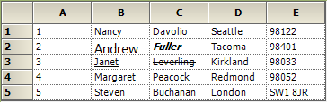
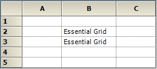
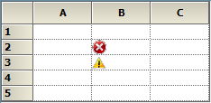
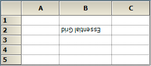
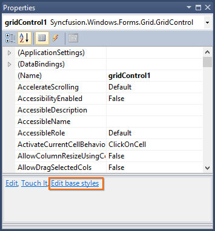
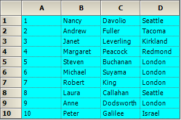
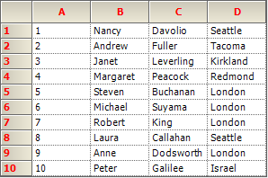
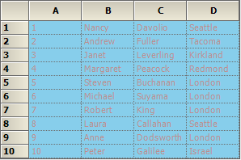

# Cell Style Architecture in Windows Forms Grid Control

GridControl can be thought of as a rectangular table of grid cells. Each cell contains distinct information and can be displayed independently of other cells. 
GridControl uses [GridStyleInfo](https://help.syncfusion.com/cr/windowsforms/Syncfusion.Windows.Forms.Grid.GridStyleInfo.html) objects to store state information about the appearance of a grid cell. So attributes like Font, BackColor, CellValue and CellType are all reflected in a single GridStyleInfo object. This section explains how to access and use the GridStyleInfo objects.

## GridStyleInfo Properties

`GridStyleInfo` provides a lot of properties to control the appearance and behavior of grid cells. This topic explains some of the styling properties.

### BackColor

[BackColor](https://help.syncfusion.com/cr/windowsforms/Syncfusion.Windows.Forms.Grid.GridStyleInfo.html#Syncfusion_Windows_Forms_Grid_GridStyleInfo_BackColor) property specifies the background color for the cell.


this.gridControl1[2, 2].BackColor = Color.LightSkyBlue;
this.gridControl1[3, 3].BackColor = Color.LightCoral;
this.gridControl1[4, 4].BackColor = Color.LightPink;



Me.gridControl1(2, 2).BackColor = Color.LightSkyBlue
Me.gridControl1(3, 3).BackColor = Color.LightCoral
Me.gridControl1(4, 4).BackColor = Color.LightPink


 

### Font

[Font](https://help.syncfusion.com/cr/windowsforms/Syncfusion.Windows.Forms.Grid.GridStyleInfo.html#Syncfusion_Windows_Forms_Grid_GridStyleInfo_Font) property of the `GridStyleInfo` class specifies the font for the text displayed in the cell. In GridControl [GridFontInfo](https://help.syncfusion.com/cr/windowsforms/Syncfusion.Windows.Forms.Grid.GridFontInfo.html) class acts as a wrapper class for the standard [System.Drawing.Font](https://learn.microsoft.com/en-us/dotnet/api/system.drawing.font?view=dotnet-plat-ext-7.0&viewFallbackFrom=net-5.0) class. The `GridFontInfo` class has special static members that easily modify font property members.


GridFontInfo fontSize = new GridFontInfo();
fontSize.Size = 11f;
this.gridControl1[2, 2].Font = fontSize;
this.gridControl1[2, 3].Font.Bold = true;
this.gridControl1[2, 3].Font.Italic = true;
this.gridControl1[3, 2].Font.Underline = true;
this.gridControl1[3, 3].Font.Strikeout = true;



Dim fontSize As New GridFontInfo()
fontSize.Size = 11f
Me.gridControl1(2, 2).Font = fontSize
Me.gridControl1(2, 3).Font.Bold = True
Me.gridControl1(2, 3).Font.Italic = True
Me.gridControl1(3, 2).Font.Underline = True
Me.gridControl1(3, 3).Font.Strikeout = True




### Text and CellValue

Value for the cells can be changed by using either [Text](https://help.syncfusion.com/cr/windowsforms/Syncfusion.Windows.Forms.Grid.GridStyleInfo.html#Syncfusion_Windows_Forms_Grid_GridStyleInfo_Text) or [CellValue](https://help.syncfusion.com/cr/windowsforms/Syncfusion.Windows.Forms.Grid.GridStyleInfo.html#Syncfusion_Windows_Forms_Grid_GridStyleInfo_CellValue) property. Both the properties are closely related. The major difference is that, `Text` property is a string and `CellValue` property is an object.



this.gridControl1[2, 2].Text = "Essential Grid";
object obj = new object();
obj = "Essential Grid";
this.gridControl1[3,2].CellValue = obj;



Me.gridControl1(2, 2).Text = "Essential Grid"
Dim obj As New Object()
obj = "Essential Grid"
Me.gridControl1(3,2).CellValue = obj


 

### ImageList

[ImageList](https://help.syncfusion.com/cr/windowsforms/Syncfusion.Windows.Forms.Grid.GridStyleInfo.html#Syncfusion_Windows_Forms_Grid_GridStyleInfo_ImageList) property holds [Systems.Windows.Forms.ImageList](https://learn.microsoft.com/en-us/dotnet/api/system.windows.forms.imagelist?view=windowsdesktop-7.0&viewFallbackFrom=net-5.0). Generally the whole grid will store the ImageList in the parent `GridStyleInfo`. The images can be retrieved by using [ImageIndex](https://help.syncfusion.com/cr/windowsforms/Syncfusion.Windows.Forms.Grid.GridStyleInfo.html#Syncfusion_Windows_Forms_Grid_GridStyleInfo_ImageIndex) property and can set on cell-by-cell basis.



ImageList imageList = new ImageList();
imageList.Images.Add(new Bitmap(SystemIcons.Error.ToBitmap()));
imageList.Images.Add(new Bitmap(SystemIcons.Exclamation.ToBitmap()));

// Assigning images to the whole Grid.
this.gridControl1.TableStyle.ImageList = imageList;

// Assigning images using the ImageIndex property.
this.gridControl1[2, 2].ImageIndex = 0;
this.gridControl1[3, 2].ImageIndex = 1;



Dim imageList As New ImageList()
imageList.Images.Add(New Bitmap(SystemIcons.Error.ToBitmap()))
imageList.Images.Add(New Bitmap(SystemIcons.Exclamation.ToBitmap()))

'Assigning images to the whole Grid.
Me.gridControl1.TableStyle.ImageList = imageList

'Assigning images using the ImageIndex property.
Me.gridControl1(2, 2).ImageIndex = 0
Me.gridControl1(3, 2).ImageIndex = 1




### Interior

[Interior](https://help.syncfusion.com/cr/windowsforms/Syncfusion.Windows.Forms.Grid.GridStyleInfo.html#Syncfusion_Windows_Forms_Grid_GridStyleInfo_Interior) property specifies solid, gradient, or pattern style for cell’s background. Grid cells can be painted by using Interior property under Syncfusion.Drawing.BrushInfo class. [BrushInfo](https://help.syncfusion.com/cr/windowsforms/Syncfusion.Drawing.BrushInfo.html) holds information on filling the background of a grid cell. [PatternStyle](https://help.syncfusion.com/cr/windowsforms/Syncfusion.Drawing.PatternStyle.html) specifies which the pattern style to be used and [GradientStyle](https://help.syncfusion.com/cr/windowsforms/Syncfusion.Drawing.GradientStyle.html) specifies the gradient style that has to be used.



gridControl1[2, 2].Interior = new BrushInfo(GradientStyle.Horizontal, Color.Yellow, Color.Blue);
gridControl1[3, 2].Interior = new BrushInfo(PatternStyle.DashedHorizontal, Color.Black, Color.White);



gridControl1(2, 2).Interior = New BrushInfo(GradientStyle.Horizontal, Color.Yellow, Color.Blue)
gridControl1(3, 2).Interior = New BrushInfo(PatternStyle.DashedHorizontal, Color.Black, Color.White)




### TextColor

[TextColor](https://help.syncfusion.com/cr/windowsforms/Syncfusion.Windows.Forms.Grid.GridStyleInfo.html#Syncfusion_Windows_Forms_Grid_GridStyleInfo_TextColor) property is used to change the color of the cell text in GridControl.



gridControl1[2, 2].Text = "Essential Grid";
gridControl1[2, 2].TextColor = Color.Red;



gridControl1(2, 2).Text = "Essential Grid"
gridControl1(2, 2).TextColor = Color.Red




### Borders

Borders can be set on all sides of a cell by setting [Borders](https://help.syncfusion.com/cr/windowsforms/Syncfusion.Windows.Forms.Grid.GridStyleInfo.html#Syncfusion_Windows_Forms_Grid_GridStyleInfo_Borders) property to an instance of [GridBorder](https://help.syncfusion.com/cr/windowsforms/Syncfusion.Windows.Forms.Grid.GridBorder.html). GridBorder class holds the formatting information for the borders of the cell.



gridControl1[2, 2].Text = "Essential Grid";
gridControl1[2, 2].Borders.All = new GridBorder(GridBorderStyle.Solid, Color.Red);



gridControl1(2, 2).Text = "Essential Grid"
gridControl1(2, 2).Borders.All = New GridBorder(GridBorderStyle.Solid, Color.Red)



### Orientation

[Orientation](https://help.syncfusion.com/cr/windowsforms/Syncfusion.Windows.Forms.Grid.GridFontInfo.html#Syncfusion_Windows_Forms_Grid_GridFontInfo_Orientation) property specifies the orientation of the grid cell text. The orientation will change accordingly to the angle specified.


gridControl1[2, 2].Text = "Essential Grid";
gridControl1[2, 2].Font.Orientation = 180;



gridControl1(2, 2).Text = "Essential Grid"
gridControl1(2, 2).Font.Orientation = 180




### Format

The formats of a cell value can be changed by using [Format](https://help.syncfusion.com/cr/windowsforms/Syncfusion.Windows.Forms.Grid.GridStyleInfo.html#Syncfusion_Windows_Forms_Grid_GridStyleInfo_Format) property. For more details on the different types of formatting types, please check the MSDN link over [here.](https://learn.microsoft.com/en-us/dotnet/standard/base-types/formatting-types)


gridControl1[2, 2].CellValue = 31456;
this.gridControl1[2, 2].Format = "C";



gridControl1(2, 2).CellValue = 31456
Me.gridControl1(2, 2).Format = "C"




### CellTipText

[CellTipText](https://help.syncfusion.com/cr/windowsforms/Syncfusion.Windows.Forms.Grid.GridStyleInfo.html#Syncfusion_Windows_Forms_Grid_GridStyleInfo_CellTipText) object specifies the ToolTip Text that needs to be displayed when the mouse pointer is moved over a cell. Cell tip text can be set for rows, columns, tables and individual cells. 



gridControl1[2, 2].CellValue = 31456;

//Tip Text for cell (2,2).
this.gridControl1[2, 2].CellTipText = "TipText for cell 2,2";



gridControl1(2, 2).CellValue = 31456

'Tip Text for cell (2,2).
Me.gridControl1(2, 2).CellTipText = "TipText for cell 2,2"




## BaseStyles

[BaseStyles](https://help.syncfusion.com/cr/windowsforms/Syncfusion.Windows.Forms.Grid.GridStyleInfo.html#Syncfusion_Windows_Forms_Grid_GridStyleInfo_BaseStyle) is one of the parent-type style which is used to customize the cell’s appearance. BaseStyles are `GridStyleInfo` objects which can be associated with an arbitrary collection of cells. 
Base styles that used in GridControl are,

1. [Standard](#standard)

2. [Header](#header)

3. [Row Header](#row-header)

4. [Column Header](#column-header)

### BaseStyles editor

To work with `BaseStyles` from within the Visual Studio designer, make use of the Edit base styles verb that appears at the bottom of the GridControl’s property grid.

When `Edit base styles` verb is clicked, then `GridBaseStyleCollectionEditor` dialog box will be displayed. This editor dialog box can be used to edit existing `BaseStyles` or add new ones.

N> It is also possible to add a new BaseStyle or remove an existing BaseStyle using the `GridBaseStyleCollectionEditor` dialog box. 

### Standard

The Standard base style can be used to make changes to all the cells in GridControl, except for the header cells.



gridControl1.BaseStylesMap["Standard"].StyleInfo.BackColor = Color.Aqua;



gridControl1.BaseStylesMap("Standard").StyleInfo.BackColor = Color.Aqua




### Header

The Header base style can be used to make changes only for the header cells that are present in the GridControl.



gridControl1.BaseStylesMap["Header"].StyleInfo.TextColor = Color.Red;



gridControl1.BaseStylesMap("Header").StyleInfo.TextColor = Color.Red




### Column Header

The Column Header base style can be used to make changes only in the column header cells that are present in the GridControl.
 

gridControl1.BaseStylesMap["Column Header"].StyleInfo.TextColor = Color.Red;



gridControl1.BaseStylesMap("Column Header").StyleInfo.TextColor = Color.DarkGreen




### Row Header

The Row Header base style can be used to make changes only in the row header cells that are available in the GridControl.


gridControl1.BaseStylesMap["Row Header"].StyleInfo.TextColor = Color.Red;



gridControl1.BaseStylesMap("Row Header").StyleInfo.TextColor = Color.Orange




### Custom BaseStyles

Custom BaseStyles can be defined in GridControl by using the [GridBaseStyle](https://help.syncfusion.com/cr/windowsforms/Syncfusion.Windows.Forms.Grid.GridBaseStyle.html). After defining a BaseStyle, it has to be added to the [BaseStylesMap](https://help.syncfusion.com/cr/windowsforms/Syncfusion.Windows.Forms.Grid.GridBaseStylesMap.html) so that it can be accessed in `GridStyleInfo` objects. Assign the defined base style to the desired cells by using the [BaseStyle](https://help.syncfusion.com/cr/windowsforms/Syncfusion.Windows.Forms.Grid.GridStyleInfo.html#Syncfusion_Windows_Forms_Grid_GridStyleInfo_BaseStyle) property in the `GridStyleInfo`.

 
//Adds a new base style.
GridBaseStyle gridBaseStyle1 = new GridBaseStyle("BaseStyleTest", false);
gridBaseStyle1.StyleInfo.BackColor = Color.SkyBlue;
gridBaseStyle1.StyleInfo.TextColor = Color.RosyBrown;
gridControl1.BaseStylesMap.Add(gridBaseStyle1);

//Applies this base style to couple of cells.
gridControl1[2, 2].BaseStyle = "BaseStyleTest";
gridControl1[3, 2].BaseStyle = "BaseStyleTest";



'Adds a new base style.
Dim gridBaseStyle1 As New GridBaseStyle("BaseStyleTest", False)
gridBaseStyle1.StyleInfo.BackColor = Color.SkyBlue
gridBaseStyle1.StyleInfo.TextColor = Color.RosyBrown
gridControl1.BaseStylesMap.Add(gridBaseStyle1)

'Applies this base style to couple of cells.
gridControl1(2, 2).BaseStyle = "BaseStyleTest"
gridControl1(3, 2).BaseStyle = "BaseStyleTest"


 

## Assigning Styles in Cells

In this section let’s discuss on some of the ways that can be used to assign the `GridStyleInfo` object.

### ChangeCells method

For assigning the `GridStyleInfo` objects for a range of cells, make use of the [ChangeCells](https://help.syncfusion.com/cr/windowsforms/Syncfusion.Windows.Forms.Grid.GridModel.html#Syncfusion_Windows_Forms_Grid_GridModel_ChangeCells_Syncfusion_Windows_Forms_Grid_GridRangeInfo_Syncfusion_Windows_Forms_Grid_GridStyleInfo_)()method. This overloaded method accepts `GridRangeInfo` and `GridStyleInfo` objects. [GridRangeInfo](https://help.syncfusion.com/cr/windowsforms/Syncfusion.Windows.Forms.Grid.GridRangeInfo.html) class specifies a range of cells in GridControl.
The ChangeCells method depends on the [StyleModifyType](https://help.syncfusion.com/cr/windowsforms/Syncfusion.Styles.StyleModifyType.html) parameter. This modify type defines the style operations. Default modify type is `StyleModifyType.Override`.



// Creates a GridStyleInfo object.
GridStyleInfo style = new GridStyleInfo();

// Set values and properties.
style.BackColor = Color.LightPink;
style.CellValue = "Grid";
style.Font.Facename = "Verdana";
style.TextColor = Color.SaddleBrown;
style.Borders.All = new GridBorder(GridBorderStyle.Dashed, Color.Gray);
style.CellTipText = "Comments for Grid";
style.Font.Size = 8.2f;
style.Font.Bold = true;
style.Font.Italic = true;

// Applies styles to a range of cells.
this.gridControl1.ChangeCells(GridRangeInfo.Cells(3, 2, 4, 3), style, StyleModifyType.Override);



'Creates a GridStyleInfo object.
Dim style As New GridStyleInfo()

'Set values and properties.
style.BackColor = Color.LightPink
style.CellValue = "Grid"
style.Font.Facename = "Verdana"
style.TextColor = Color.SaddleBrown
style.Borders.All = New GridBorder(GridBorderStyle.Dashed, Color.Gray)
style.CellTipText = "Comments for Grid"
style.Font.Size = 8.2f
style.Font.Bold = True
style.Font.Italic = True

'Applies styles to a range of cells.
Me.gridControl1.ChangeCells(GridRangeInfo.Cells(3, 2, 4, 3), style, StyleModifyType.Override)




### Table Styles

Changes can be done for the whole grid by using the [TableStyle](https://help.syncfusion.com/cr/windowsforms/Syncfusion.Windows.Forms.Grid.GridModel.html#Syncfusion_Windows_Forms_Grid_GridModel_TableStyle) property. TableStyle is a single `GridStyleInfo` object that is associated with the entire grid. 


//Creates a GridStyleInfo object
GridStyleInfo style = new GridStyleInfo();

// Set values and properties.
style.BackColor = Color.LightPink;
style.CellValue = "Grid";
style.Font.Facename = "Verdana";
style.TextColor = Color.SaddleBrown;
style.Borders.All = new GridBorder(GridBorderStyle.Dashed, Color.Gray);
style.CellTipText = "Comments for Grid";
style.Font.Size = 8.2f;
style.Font.Bold = true;
style.Font.Italic = true;

// Applies the styles for the whole Grid.
this.gridControl1.TableStyle = style;



'Creates a GridStyleInfo object.
Dim style As New GridStyleInfo()

'Set values and properties.
style.BackColor = Color.LightPink
style.CellValue = "Grid"
style.Font.Facename = "Verdana"
style.TextColor = Color.SaddleBrown
style.Borders.All = New GridBorder(GridBorderStyle.Dashed, Color.Gray)
style.CellTipText = "Comments for Grid"
style.Font.Size = 8.2f
style.Font.Bold = True
style.Font.Italic = True

'Applies the styles for the whole Grid.
Me.gridControl1.TableStyle = style




### Row Styles

Changes can be done for a particular or range of rows by using the [RowStyles](https://help.syncfusion.com/cr/windowsforms/Syncfusion.Windows.Forms.Grid.GridModel.html#Syncfusion_Windows_Forms_Grid_GridModel_RowStyles) property. This property is a `GridStyleInfo` object which is associated with each row.



//Creates a GridStyleInfo object.
GridStyleInfo style = new GridStyleInfo();

// Set values and properties.
style.BackColor = Color.LightPink;
style.CellValue = "Grid";
style.Font.Facename = "Verdana";
style.TextColor = Color.SaddleBrown;
style.Borders.All = new GridBorder(GridBorderStyle.Dashed, Color.Gray);
style.CellTipText = "Comments for Grid";
style.Font.Size = 8.2f;
style.Font.Bold = true;
style.Font.Italic = true;

// Applies the styles for the mentioned Rows in Grid.
this.gridControl1.RowStyles[3] = style;
this.gridControl1.RowStyles[4] = style;



'Creates a GridStyleInfo object.
Dim style As New GridStyleInfo()

'Set values and properties.
style.BackColor = Color.LightPink
style.CellValue = "Grid"
style.Font.Facename = "Verdana"
style.TextColor = Color.SaddleBrown
style.Borders.All = New GridBorder(GridBorderStyle.Dashed, Color.Gray)
style.CellTipText = "Comments for Grid"
style.Font.Size = 8.2f
style.Font.Bold = True
style.Font.Italic = True

'Applies the styles for the mentioned Rows in Grid.
Me.gridControl1.RowStyles(3) = style
Me.gridControl1.RowStyles(4) = style




### Column Styles

Changes can be done for a particular or range of columns by using the [ColStyles](https://help.syncfusion.com/cr/windowsforms/Syncfusion.Windows.Forms.Grid.GridModel.html#Syncfusion_Windows_Forms_Grid_GridModel_ColStyles) property. This property is a `GridStyleInfo` object which is associated with each column.

 
//Creates a GridStyleInfo object.
GridStyleInfo style = new GridStyleInfo();

// Set values and properties.
style.BackColor = Color.LightPink;
style.CellValue = "Grid";
style.Font.Facename = "Verdana";
style.TextColor = Color.SaddleBrown;
style.Borders.All = new GridBorder(GridBorderStyle.Dashed, Color.Gray);
style.CellTipText = "Comments for Grid";
style.Font.Size = 8.2f;
style.Font.Bold = true;
style.Font.Italic = true;

// Applies the styles of the columns 3 and 4.
this.gridControl1.ColStyles[3] = style;
this.gridControl1.ColStyles[4] = style;



'Creates a GridStyleInfo object.
Dim style As New GridStyleInfo()

'Set values and properties.
style.BackColor = Color.LightPink
style.CellValue = "Grid"
style.Font.Facename = "Verdana"
style.TextColor = Color.SaddleBrown
style.Borders.All = New GridBorder(GridBorderStyle.Dashed, Color.Gray)
style.CellTipText = "Comments for Grid"
style.Font.Size = 8.2f
style.Font.Bold = True
style.Font.Italic = True

'Applies the styles of the columns 3 and 4.
Me.gridControl1.ColStyles(3) = style
Me.gridControl1.ColStyles(4) = style




## Removing styles

For removing the `GridStyleInfo` object from the grid cells, make use of the [ModifyStyle](https://help.syncfusion.com/cr/windowsforms/Syncfusion.Windows.Forms.Grid.GridStyleInfo.html#Syncfusion_Windows_Forms_Grid_GridStyleInfo_ModifyStyle_Syncfusion_Styles_IStyleInfo_Syncfusion_Styles_StyleModifyType_) method. This method can remove the styles for whole grid or a particular range of cells.



// Removes cell styles for all the cells in the grid.
this.gridControl1.TableStyle.ModifyStyle(null, StyleModifyType.Remove);

// Removes cell styles for the particular cell (2, 2).
this.gridControl1[2, 2].ModifyStyle(null, StyleModifyType.Remove);

// Removes styles for the column 3.
this.gridControl1.ColStyles[3].ModifyStyle(null, StyleModifyType.Remove);

// Remove styles for the row 3.
this.gridControl1.RowStyles[3].ModifyStyle(null, StyleModifyType.Remove);



'Removes cell styles for all the cells in the grid.
Me.gridControl1.TableStyle.ModifyStyle(Nothing, StyleModifyType.Remove)

'Removes cell styles for the particular cell (2, 2).
Me.gridControl1(2, 2).ModifyStyle(Nothing, StyleModifyType.Remove)
'Removes styles for the column 3.
Me.gridControl1.ColStyles(3).ModifyStyle(Nothing, StyleModifyType.Remove)

'Remove styles for the row 3.
Me.gridControl1.RowStyles(3).ModifyStyle(Nothing, StyleModifyType.Remove)



N> Null denotes to add an empty style after removing the existing styles.

### Clearing Styles Along with Data

It is possible to clear styles along with data in a cell by using the [Model.ClearCells](https://help.syncfusion.com/cr/windowsforms/Syncfusion.Windows.Forms.Grid.GridModel.html#Syncfusion_Windows_Forms_Grid_GridModel_ClearCells_Syncfusion_Windows_Forms_Grid_GridRangeInfo_System_Boolean_) method. In this method mention the range of cells to be cleared and also a boolean value whether to clear the style along with it. If `true`, the styles will be cleared, otherwise only the data will be cleared.

 

// Will clear styles along with data of the range (2, 2, 5, 5).
this.gridControl1.Model.ClearCells(GridRangeInfo.Cells(2, 2, 5, 5), true);

// Will clear styles along with data of 3rd row.
this.gridControl1.Model.ClearCells(GridRangeInfo.Row(2), true);

// Will clear styles along with data of 3rd column.
this.gridControl1.Model.ClearCells(GridRangeInfo.Col(2), true);



'Will clear styles along with data of the range (2, 2, 5, 5).
Me.gridControl1.Model.ClearCells(GridRangeInfo.Cells(2, 2, 5, 5), True)

'Will clear styles along with data of 3rd row.
Me.gridControl1.Model.ClearCells(GridRangeInfo.Row(2), True)

'Will clear styles along with data of 3rd column.
Me.gridControl1.Model.ClearCells(GridRangeInfo.Col(2), True)



N> <kbd>Ctrl</kbd>+<kbd>Delete</kbd> key combination can be used to clear the selected cells' data along with the styles.

### Clearing Only the Data

For clearing only the selected range of cells, make use of the [Model.Clear](https://help.syncfusion.com/cr/windowsforms/Syncfusion.Windows.Forms.Grid.GridModel.html#Syncfusion_Windows_Forms_Grid_GridModel_Clear_System_Boolean_) method. This method clears only the cells that are selected. 


// Will clear the selected contents.
this.gridControl1.Model.Clear(true);



'Will clear the selected contents.
Me.gridControl1.Model.Clear(True)




N> <kbd>Delete</kbd> key can be used for clearing the selected cells' data alone.
