# Cell Types in Windows Forms Grid Control

GridControl allows the inclusion of some special controls in the grid cells. This attribute of a grid cell is referred to as its Cell Type. GridControl supports more than 20 built-in cell types

In GridControl each cell has been created by [GridCellModelBase](http://help.syncfusion.com/cr/windowsforms/Syncfusion.Windows.Forms.Grid.GridCellModelBase.html) and [GridCellRendererBase](http://help.syncfusion.com/cr/windowsforms/Syncfusion.Windows.Forms.Grid.GridCellRendererBase.html). `GridCellModelBase` defines the data or model part of a cell type. It holds all the data information of a cell.**Rendering** generally refers to the process of creating a visual representation on a user's screen. `GridCellRendererBase` acts a base class for all the renderer part of the cell type.  

## Setting Cell Type for a Cell
This section will explain on how to add a basic cell type into a grid cell. To add the desired cell type in a cell, the [CellType](https://help.syncfusion.com/cr/windowsforms/Syncfusion.Windows.Forms.Grid.GridStyleInfo.html#Syncfusion_Windows_Forms_Grid_GridStyleInfo_CellType) property can be used. There are two ways to assign cell types, by string format or by using the [GridCellTypeName](http://help.syncfusion.com/cr/windowsforms/Syncfusion.Windows.Forms.Grid.GridCellTypeName.html) static class which contains all the built-in cell type names in it. 



this.gridControl1[2, 2].CellType = GridCellTypeName.CheckBox;

//Set the text to be displayed in the checkbox cell.
this.gridControl1[2, 2].Description = "Enable";


Me.gridControl1(2, 2).CellType = GridCellTypeName.CheckBox

'Set the text to be displayed in the checkbox cell.
Me.gridControl1(2, 2).Description = "Enable"



## TextBox cell type
TextBox cells are the default cell type of GridControl. TextBox cells displays text and images which can be edited when clicked.



gridControl1[2, 2].Text = "TextBox";
gridControl1[2, 2].CellType = "TextBox";
gridControl1[2, 3].Text = "TextBox/Image";
gridControl1[2, 2].CellType = "TextBox";
gridControl1[2, 3].ImageIndex = 0;


gridControl1(2, 2).Text = "TextBox"
gridControl1(2, 2).CellType = "TextBox"

'Text box with image assumes ImageList set the same Static sample code.
gridControl1(2, 3).Text = "TextBox/Image"
gridControl1(2, 2).CellType = "TextBox"
gridControl1(2, 3).ImageIndex = 0



## Static cell type
Static cell type will display text that cannot be edited. It is possible to make the static cells as current cell but static cells cannot be activated for editing. Static cells can also include images in addition to the text.




gridControl1[2, 2].Text = "Static";
gridControl1[2, 2].CellType = "Static";

gridControl1[2, 3].Text = "Static/Image";
gridControl1[2, 2].CellType = "Static";
gridControl1[2, 3].ImageIndex = 2;
 



gridControl1(2, 2).Text = "Static"
gridControl1(2, 2).CellType = "Static"

gridControl1(2, 3).Text = "Static/Image"
gridControl1(2, 2).CellType = "Static"
gridControl1(2, 3).ImageIndex = 2




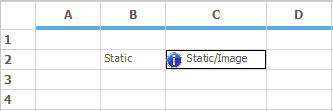

N> Though static cells cannot be edited, it can be deleted by using the&lt;kbd&gt DELETE&lt;/kbd&gt; key.

## Header cell type
Header cells are as same as that of static cells, in addition, this cell type has a button-like border that can have a depressed state. Header cell type is mainly used as header for rows and columns. If a particular cell needs to be of type header, then make use of this cell type.



gridControl1[2, 2].Text = "HeaderText";

//Sets Cell Type as "Header".
gridControl1[2, 2].CellType = "Header";


gridControl1(2, 2).Text = "HeaderText"

'Sets Cell Type as "Header".
gridControl1(2, 2).CellType = "Header"



## Image cell type
To show an Image in a cell, make use of the **Image** cell type. It can be achieved by setting the `CellType` property as `GridCellTypeName.Image`. Images can be added in GridControl by using the [ImageList](https://help.syncfusion.com/cr/windowsforms/Syncfusion.Windows.Forms.Grid.GridListControl.html#Syncfusion_Windows_Forms_Grid_GridListControl_ImageList) property. Multiple number of images can be added by using this property. For picking a particular image from the list, make use of the [ImageIndex](https://help.syncfusion.com/cr/windowsforms/Syncfusion.Windows.Forms.Grid.GridStyleInfo.html#Syncfusion_Windows_Forms_Grid_GridStyleInfo_ImageIndex) property.



// Add required number of images using ImageList.
ImageList imageList1 = new ImageList();
imageList1.Images.Add(SystemIcons.Warning.ToBitmap());
imageList1.Images.Add(SystemIcons.Application.ToBitmap());

//Sets the image list into the TableStyle.
gridControl1.TableStyle.ImageList = imageList1;
gridControl1[2, 2].CellType = GridCellTypeName.Image;

// Adds the image located in the index 1.
gridControl1[2, 2].ImageIndex = 1;



'Add required number of images using ImageList.
Dim imageList1 As New ImageList()
imageList1.Images.Add(SystemIcons.Warning.ToBitmap())
imageList1.Images.Add(SystemIcons.Application.ToBitmap())

'Sets the image list into the TableStyle.
gridControl1.TableStyle.ImageList = imageList1
gridControl1(2, 2).CellType = GridCellTypeName.Image

'Adds the image located in the index 1.
gridControl1(2, 2).ImageIndex = 1




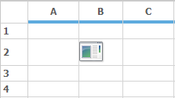

### Multiple images in a Grid cell
It is possible to add multiple images in a grid cell with the help of `CellDrawn` event. In this event draw the multiple images by using [DrawImage](https://help.syncfusion.com/cr/windowsforms/Syncfusion.Windows.Forms.Grid.GridImageUtil.html#Syncfusion_Windows_Forms_Grid_GridImageUtil_DrawImage_System_Drawing_Image_System_Drawing_Rectangle_System_Drawing_Graphics_System_Drawing_Rectangle_Syncfusion_Windows_Forms_Grid_GridStyleInfo_System_Boolean_) method and with precise bounds for the images.




//Sets the CellType to Image Type.
this.gridControl1[3,3].CellType = GridCellTypeName.Image;
gridControl1.CellDrawn+=new GridDrawCellEventHandler(gridControl1_CellDrawn);

private void gridControl1_CellDrawn(object sender, Syncfusion.Windows.Forms.Grid.GridDrawCellEventArgs e)
{
    if( e.RowIndex == 3 && e.ColIndex == 3)
    {

        //Draws the image to the Cell.
        e.Graphics.DrawImage(SystemIcons.Warning.ToBitmap(), e.Bounds.X, e.Bounds.Y);
        e.Graphics.DrawImage(SystemIcons.Information.ToBitmap(), e.Bounds.X +     SystemIcons.Warning.ToBitmap().Width + 10, e.Bounds.Y);
    }
}



'Sets the CellType to Image Type.
Me.gridControl1(3,3).CellType = GridCellTypeName.Image
AddHandler gridControl1.CellDrawn, AddressOf gridControl1_CellDrawn

Private Sub gridControl1_CellDrawn(ByVal sender As Object, ByVal e As Syncfusion.Windows.Forms.Grid.GridDrawCellEventArgs)
    If e.RowIndex = 3 AndAlso e.ColIndex = 3 Then
      'Draws the image to the Cell.
        e.Graphics.DrawImage(SystemIcons.Warning.ToBitmap(), e.Bounds.X, e.Bounds.Y)
        e.Graphics.DrawImage(SystemIcons.Information.ToBitmap(), e.Bounds.X + SystemIcons.Warning.ToBitmap().Width + 10, e.Bounds.Y)
    End If
End Sub 



## CheckBox cell type
`CheckBox` cell type displays a check box in a grid cell. The check box has three states:**Checked, Unchecked and Indeterminate**. It is possible to decide whether the check box should behave as a two-state check box or a three-state check box by using the [CheckBoxOptions](https://help.syncfusion.com/cr/windowsforms/Syncfusion.Windows.Forms.Grid.GridStyleInfo.html#Syncfusion_Windows_Forms_Grid_GridStyleInfo_CheckBoxOptions) property. Use the `Description` property of the cell style to display the text in a checkbox cell.




gridControl1[2, 2].Description = "CheckBox";
this.gridControl1[2, 2].CellType = GridCellTypeName.CheckBox;

// Sets a flat look and values that represent checked, unchecked and indeterminate state.
this.gridControl1[2, 2].CheckBoxOptions = new GridCheckBoxCellInfo("True", "False", "", true);




gridControl1(2, 2).Description = "CheckBox"
Me.gridControl1(2, 2).CellType = GridCellTypeName.CheckBox

'Sets a flat look and values that represent checked, unchecked and indeterminate state.
Me.gridControl1(2, 2).CheckBoxOptions = New GridCheckBoxCellInfo("True", "False", "", True)




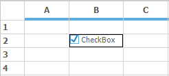

## ComboBox cell Type
Adding a combo box to a grid cell, will enable to show a pop up displaying an associated list of choices. The combo box can be populated in several ways by setting the appropriate `GridStyleInfo` properties. 



this.gridControl1[2, 2].CellType = GridCellTypeName.ComboBox;


Me.gridControl1(2, 2).CellType = GridCellTypeName.ComboBox



There are two ways to assign data source to a Combobox

* Using Choice List
* Using DataSource

The Combobox created using [ChoiceList](https://help.syncfusion.com/cr/windowsforms/Syncfusion.Windows.Forms.Grid.GridStyleInfo.html#Syncfusion_Windows_Forms_Grid_GridStyleInfo_ChoiceList) shows that the items are been created by [StringCollection](https://docs.microsoft.com/en-us/dotnet/api/system.collections.specialized.stringcollection?view=net-5.0). The values can be customized in `StringCollection` and can be assigned to the Combobox.




StringCollection stringCollection = new StringCollection();

stringCollection.AddRange(new String[]{ "One", "Two", "Three", "Four", "Five" });
GridStyleInfo style = gridControl1.Model[2, 2];
style.CellType = GridCellTypeName.ComboBox;
style.ChoiceList = stringCollection;




Dim stringCollection As New StringCollection()

stringCollection.AddRange(New String(){ "One", "Two", "Three", "Four", "Five" })
Dim style As GridStyleInfo = gridControl1.Model(2, 2)
style.CellType = GridCellTypeName.ComboBox
style.ChoiceList = stringCollection




Whereas the combobox using the [DataSource](https://help.syncfusion.com/cr/windowsforms/Syncfusion.Windows.Forms.Grid.GridStyleInfo.html#Syncfusion_Windows_Forms_Grid_GridStyleInfo_DataSource) shows that the items are been added by populating the data from the data source. 

The [DisplayMember](https://help.syncfusion.com/cr/windowsforms/Syncfusion.Windows.Forms.Grid.GridStyleInfo.html#Syncfusion_Windows_Forms_Grid_GridStyleInfo_DisplayMember) property denotes the string that needs to be displayed in the cell. But the [ValueMember](https://help.syncfusion.com/cr/windowsforms/Syncfusion.Windows.Forms.Grid.GridStyleInfo.html#Syncfusion_Windows_Forms_Grid_GridStyleInfo_ValueMember) property denotes the string from the object data source which acts as a value for that cell.



// DataSource.
DataTable dataTable = new DataTable();
dataTable.Columns.Add("Name");

dataTable.Rows.Add(new object[] { "Nancy" });
dataTable.Rows.Add(new object[] { "Andrew" });
dataTable.Rows.Add(new object[] { "Janet" });
dataTable.Rows.Add(new object[] { "Margaret" });

//Assigning Datasource to combobox.
GridStyleInfo style = gridControl1.Model[2, 2];
style.CellType = GridCellTypeName.ComboBox;
style.DataSource = dataTable;
style.DisplayMember = "Name";
style.ValueMember = "Name";



' DataSource.
Dim dataTable As New DataTable()
dataTable.Columns.Add("Name")

dataTable.Rows.Add(New Object() { "Nancy" })
dataTable.Rows.Add(New Object() { "Andrew" })
dataTable.Rows.Add(New Object() { "Janet" })
dataTable.Rows.Add(New Object() { "Margaret" })

'Assigning Datasource to combobox.
Dim style As GridStyleInfo = gridControl1.Model(2, 2)
style.CellType = GridCellTypeName.ComboBox
style.DataSource = dataTable
style.DisplayMember = "Name"
style.ValueMember = "Name"




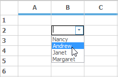

The drop-down cell behavior of a ComboBox can be changed by using the [DropDownStyle](http://help.syncfusion.com/cr/windowsforms/Syncfusion.Windows.Forms.Grid.GridDropDownStyle.html) property. It has three options `AutoComplete`, `Editable` and `Exclusive`.

* `AutoComplete` mode is used to complete selection with the available choices while start typing.
* `Editable` is the default drop down style which is used to edit the selected content on the combobox cell.
* `Exclusive` style is used to just select the option from the combobox drop down, it will not allow to edit the contents of the cell.

### Enabling AutoComplete in EditMode
For enabling the AutoComplete in edit mode, make use of the [AutoCompleteInEditMode](https://help.syncfusion.com/cr/windowsforms/Syncfusion.Windows.Forms.Grid.GridStyleInfo.html#Syncfusion_Windows_Forms_Grid_GridStyleInfo_AutoCompleteInEditMode) property. Choose any of the [GridComboSelectionOption](http://help.syncfusion.com/cr/windowsforms/Syncfusion.Windows.Forms.Grid.GridComboSelectionOptions.html) using `AutoCompleteInEditMode` property. Make sure that the `DropDownStyle` is in `Editable` state so that `AutoCompleteInEditMode` can be used. 



this.gridControl1[5, 5].CellType = GridCellTypeName.ComboBox;
this.gridControl1[5, 5].DropDownStyle = GridDropDownStyle.Editable;
this.gridControl1[5, 5].AutoCompleteInEditMode = GridComboSelectionOptions.AutoSuggest;


Me.gridControl1(5, 5).CellType = GridCellTypeName.ComboBox
Me.gridControl1(5, 5).DropDownStyle = GridDropDownStyle.Editable
Me.gridControl1(5, 5).AutoCompleteInEditMode = GridComboSelectionOptions.AutoSuggest



### Changing ButtonBar size
The size of the ComboBox button can be changed by setting the size of the ButtonBar in the ComboBoxCellModel.



//Creates Combobox Cell model object.
GridComboBoxCellModel model = this.gridControl1.Model.CellModels["ComboBox"] as GridComboBoxCellModel;

//Assigns a new value to its ButtonBarSize property.
model.ButtonBarSize = new Size(8, 8);


'Creates Combobox Cell model object.
Dim model As GridComboBoxCellModel = TryCast(Me.gridControl1.Model.CellModels("ComboBox"), GridComboBoxCellModel)

'Assigns a new value to its ButtonBarSize property. 
model.ButtonBarSize = New Size(8, 8)




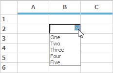

### Controlling visible items in ComboBox cells
In order to control the items showing in dropdown of combo box, [GridComboBoxListBoxPart.DropDownRows](https://help.syncfusion.com/cr/windowsforms/Syncfusion.Windows.Forms.Grid.GridComboBoxListBoxPart.html#Syncfusion_Windows_Forms_Grid_GridComboBoxListBoxPart_DropDownRows) property can be used. This property has to be used in the [Grid.CurrentCellShowingDropDown](https://help.syncfusion.com/cr/windowsforms/Syncfusion.Windows.Forms.Grid.GridControlBase.html) event so that items visibility can be handled for each separate combobox available in different cells. 



gridControl1.CurrentCellShowingDropDown += gridControl1_CurrentCellShowingDropDown;

void gridControl1_CurrentCellShowingDropDown(object sender, GridCurrentCellShowingDropDownEventArgs e)
{
   GridControlBase grid = sender as GridControlBase;

   if (grid != null)
   {
      GridCurrentCell cc = grid.CurrentCell;
      GridComboBoxCellRenderer cellRenderer = cc.Renderer as GridComboBoxCellRenderer;
  
//Sets number of visible items for combobox in Row 6 as 4, Row 4 as 7, Row 2 as 10 , and so on. 

      if (cc != null)
      {

         if (cc.RowIndex == 6)
            ((GridComboBoxListBoxPart)cellRenderer.ListBoxPart).DropDownRows = 4;

         else if (cc.RowIndex == 4)
            ((GridComboBoxListBoxPart)cellRenderer.ListBoxPart).DropDownRows = 7;

         else if (cc.RowIndex == 2)
            ((GridComboBoxListBoxPart)cellRenderer.ListBoxPart).DropDownRows = 10;

         else ((GridComboBoxListBoxPart)cellRenderer.ListBoxPart).DropDownRows = 6;
      }
   }
}


gridControl1.CurrentCellShowingDropDown += gridControl1_CurrentCellShowingDropDown

Private Sub gridControl1_CurrentCellShowingDropDown(ByVal sender As Object, ByVal e As GridCurrentCellShowingDropDownEventArgs)
   Dim grid As GridControlBase = TryCast(sender, GridControlBase)

   If grid IsNot Nothing Then
      Dim cc As GridCurrentCell = grid.CurrentCell
      Dim cellRenderer As GridComboBoxCellRenderer = TryCast(cc.Renderer, GridComboBoxCellRenderer)

'Sets number of visible items for combobox in Row 6 as 4, Row 4 as 7, Row 2 as 10 , and so on. 

      If cc IsNot Nothing Then

         If cc.RowIndex = 6 Then
            CType(cellRenderer.ListBoxPart, GridComboBoxListBoxPart).DropDownRows = 4

         ElseIf cc.RowIndex = 4 Then
            CType(cellRenderer.ListBoxPart, GridComboBoxListBoxPart).DropDownRows = 7

         ElseIf cc.RowIndex = 2 Then
            CType(cellRenderer.ListBoxPart, GridComboBoxListBoxPart).DropDownRows = 10

         Else
             CType(cellRenderer.ListBoxPart, GridComboBoxListBoxPart).DropDownRows = 6
         End If
      End If
   End If
End Sub



N> For more reference regarding this, refer the KB link over [here](https://support.syncfusion.com/kb/article/5629/how-to-control-the-number-of-visible-items-in-a-combobox-cell-in-winforms-gridcontrol).

### Setting ComboBox in header cells
It is also possible to place a ComboBox cell in header cells by just setting the `CellType` of the header to ComboBox and assign a valid data source. 



// Create a data source.
StringCollection items = new StringCollection();
items.AddRange(new String[]{    "One",
                "Two",
                "Three",
                "Four",
                "Five"
                });

//Set the cell type into combobox.
this.gridControl1[0, 4].CellType = "ComboBox";
this.gridControl1[0, 4].CellValue = "combo";

//Set the GridShowButtons as Show option for showing the combobox in the normal view.

//The combobox is modified like current cell editing by assigning the GridShowButtons as CurrentCellEditing.
this.gridControl1[0, 4].ShowButtons = GridShowButtons.Show;
this.gridControl1[0, 4].CellAppearance = GridCellAppearance.Raised;
this.gridControl1[0, 4].ChoiceList = items;



' Create a data source.
Dim items As New StringCollection()
items.AddRange(New String(){ "One", "Two", "Three", "Four", "Five" })

'set the cell type into combobox.
Me.gridControl1(0, 4).CellType = "ComboBox"
Me.gridControl1(0, 4).CellValue = "combo"

'Set the GridShowButtons as Show option for showing the combobox in the normal view.

'The combobox is modified like current cell editing by assigning the GridShowButtons as CurrentCellEditing.
Me.gridControl1(0, 4).ShowButtons = GridShowButtons.Show
Me.gridControl1(0, 4).CellAppearance = GridCellAppearance.Raised
Me.gridControl1(0, 4).ChoiceList = items



N> To know more details and sample, refer the KB link over [here](https://support.syncfusion.com/kb/article/1738/how-to-insert-a-combobox-in-a-header-cell-of-a-grid-in-winforms-gridcontrol).

### RadioButton cell type
`RadioButton` cell type displays a radio button in a grid cell. The choices of radio button are mutually exclusive. Like combobox, radio button values can be populated by using the `ChoiceList` or `DataSource` property.



StringCollection stringCollection = new StringCollection();
stringCollection.AddRange(new String[]{   "Button 0", 
                            "Disabled/disabled", 
                            "Button 2", 
                            "Button 3"});
this.gridControl1[3, 1].ChoiceList = stringCollection;
this.gridControl1[3, 1].CellType = "RadioButton";



Dim stringCollection As New StringCollection()
stringCollection.AddRange(New String(){ "Button 0", "Disabled/disabled", "Button 2", "Button 3"})
Me.gridControl1(3, 1).ChoiceList = stringCollection
Me.gridControl1(3, 1).CellType = "RadioButton"




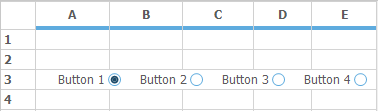

### Alignment in RadioButton
GridControl includes support for displaying radio button in both vertical and horizontal order. By default the `RadioButton` cell aligns the buttons in horizontal order. The display of order can be changed by using the RadioButtonAlignment property. 



// Displays radio buttons vertically.
this.gridControl1[1, 1].RadioButtonAlignment = Syncfusion.Windows.Forms.Grid.ButtonAlignment.Vertical;

// Displays radio buttons horizontally.
this.gridControl1[2, 2].RadioButtonAlignment = Syncfusion.Windows.Forms.Grid.ButtonAlignment.Horizontal;




'Displays radio buttons vertically.
Me.gridControl1(1, 1).RadioButtonAlignment = Syncfusion.Windows.Forms.Grid.ButtonAlignment.Vertical

'Displays radio buttons horizontally.
Me.gridControl1(2, 2).RadioButtonAlignment = Syncfusion.Windows.Forms.Grid.ButtonAlignment.Horizontal




## ColorEdit Cell Type
Color Edit cell type will allow to pick up colors and set a color object as the `CellValue`. To do this, set the CellType property as **ColorEdit.**On clicking the ColorEdit cell, a popup will be opened for choosing the desired color.



this.gridControl1[2, 2].CellType = GridCellTypeName.ColorEdit;            
this.gridControl1[2, 2].CellValue = "Aqua";


Me.gridControl1(2, 2).CellType = GridCellTypeName.ColorEdit
Me.gridControl1(2, 2).CellValue = "Aqua"



### Customizing the Tab Name of the ColorUIControl
As mentioned in the beginning of this topic, each cell type has been created by its own cell model and cell renderer. To customize the tab name custom classes has to be created which derived from the [GridDropDownCellModel](http://help.syncfusion.com/cr/windowsforms/Syncfusion.Windows.Forms.Grid.GridDropDownCellModel.html) and [GridDropDownCellRenderer](http://help.syncfusion.com/cr/windowsforms/Syncfusion.Windows.Forms.Grid.GridDropDownCellRenderer.html) built-in classes. In this derived class override the InitializeDropDownContainer method and customize the tab name.



protected /*internal*/ override void InitializeDropDownContainer()
{
    base.InitializeDropDownContainer();
  
    colorUI = new ColorUIControl();
    colorUI.Dock = DockStyle.Fill;
    colorUI.Visible = true;
    colorUI.ColorSelected += new EventHandler(ColorUIColorSelected);
    this.colorUI.ColorGroups = ((Syncfusion.Windows.Forms.ColorUIGroups)((Syncfusion.Windows.Forms.ColorUIGroups.StandardColors)));
    //Color tab name has changed
    colorUI.StandardTabName = "TEST";
    this.DropDownContainer.Controls.Add(colorUI);
}



Protected Overrides Sub InitializeDropDownContainer() 'internal
    MyBase.InitializeDropDownContainer()

    colorUI = New ColorUIControl()
    colorUI.Dock = DockStyle.Fill
    colorUI.Visible = True
    AddHandler colorUI.ColorSelected, AddressOf ColorUIColorSelected
    Me.colorUI.ColorGroups = (CType((Syncfusion.Windows.Forms.ColorUIGroups.StandardColors), Syncfusion.Windows.Forms.ColorUIGroups))
'Color tab name has changed
    colorUI.StandardTabName = "TEST"
    Me.DropDownContainer.Controls.Add(colorUI)
End Sub



N> For sample and more information check the KB link over [here](https://support.syncfusion.com/kb/article/5348/how-to-customize-the-tab-name-of-the-coloruicontrol-cell-dropdown-in-winforms-gridcontrol).

## Control cell type
It is possible to add an arbitrary control in a grid cell through `Control` cell type. Each cells using this cell type requires to instantiate a control object and that object has to be assigned to the [style.Control](https://help.syncfusion.com/cr/windowsforms/Syncfusion.Windows.Forms.Grid.GridStyleInfo.html#Syncfusion_Windows_Forms_Grid_GridStyleInfo_Control) property. The following code illustrates how to set a cell type as `Control`.



Panel panel1 = new Panel();
panel.Controls.Add(new Button());
panel.Controls.Add(new RadioButton());

//Sets the control object.
this.gridControl1[2, 2].Control = panel1;
this.gridControl1[2, 2].CellType = "Control";



Dim panel1 As New Panel()
panel.Controls.Add(New Button())
panel.Controls.Add(New RadioButton())

'Sets the control object.
Me.gridControl1(2, 2).Control = panel1
Me.gridControl1(2, 2).CellType = "Control"




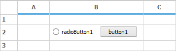

### Inserting an animated image in cell
It is possible to animate an image in grid cell by setting the cell type as `Control` and assigning it to a picture box control. To display the image as an animated one it is necessary to refresh the picture cell for a given time interval. For more details and sample please check the KB link over [here](https://support.syncfusion.com/kb/article/4336/how-to-insert-animated-image-to-a-grid-cell-in-winforms-gridcontrol).

## Currency cell type
This cell type can be used to represent monetary values to achieve accuracy in the calculations. It will add the currency sign in the cell and attempt to parse only the number from the input. To customize the currency cells make use of the [GridStyleInfo](http://help.syncfusion.com/cr/windowsforms/Syncfusion.Windows.Forms.Grid.GridStyleInfo.html) properties.

For setting a current cell as a Currency cell type, make use of the `CellType` property as `GridCellTypeName.Currency`.



this.gridControl1[2, 2].CellType = GridCellTypeName.Currency;
this.gridControl1[3, 2].CellType = GridCellTypeName.Currency;
this.gridControl1[4, 2].CellType = GridCellTypeName.Currency;


Me.gridControl1(2, 2).CellType = GridCellTypeName.ColorEdit
Me.gridControl1[3, 2].CellType = GridCellTypeName.Currency
Me.gridControl1[4, 2].CellType = GridCellTypeName.Currency



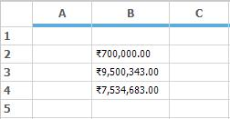

It is possible to display a special character if the currency cell is null by using the `NullString` property. Use this property and assign the desired text that needs to be displayed. All the currency cell type related properties will come under the [CurrencyEdit](https://help.syncfusion.com/cr/windowsforms/Syncfusion.Windows.Forms.Grid.GridStyleInfo.html#Syncfusion_Windows_Forms_Grid_GridStyleInfo_CurrencyEdit) property.



GridStyleInfo currencyStyle = new GridStyleInfo();
currencyStyle.CellType = GridCellTypeName.Currency;
currencyStyle.Text = "";
currencyStyle.CurrencyEdit.NullString = "*";
this.gridControl1[2, 2] = currencyStyle;


Dim currencyStyle As New GridStyleInfo()
currencyStyle.CellType = GridCellTypeName.Currency
currencyStyle.Text = ""
currencyStyle.CurrencyEdit.NullString = "*"
Me.gridControl1(2, 2) = currencyStyle



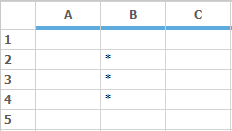

N> The value in the cell (2, 2) is empty hence it is showing the string that is assigned in the `NullString` property.

For setting the number of digits for the decimal portion of the currency, make use of the [CurrencyDecimalDigits](https://help.syncfusion.com/cr/windowsforms/Syncfusion.Windows.Forms.Grid.GridCurrencyEditInfo.html#Syncfusion_Windows_Forms_Grid_GridCurrencyEditInfo_CurrencyDecimalDigits) property which is in the `GridStyleInfo` class. The values assigned has to be in integer. The default value is 2.



GridStyleInfo currencyStyle = new GridStyleInfo();
currencyStyle.CellType = GridCellTypeName.Currency;
currencyStyle.Text = "2";
currencyStyle.CurrencyEdit.CurrencyDecimalDigits = 2;
this.gridControl1[2, 2] = currencyStyle;


Dim currencyStyle As New GridStyleInfo()
currencyStyle.CellType = GridCellTypeName.Currency
currencyStyle.Text = "2"
currencyStyle.CurrencyEdit.CurrencyDecimalDigits = 2
Me.gridControl1(2, 2) = currencyStyle


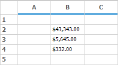

[CurrencyDecimalSeparator](https://help.syncfusion.com/cr/windowsforms/Syncfusion.Windows.Forms.Grid.GridCurrencyEditInfo.html#Syncfusion_Windows_Forms_Grid_GridCurrencyEditInfo_CurrencyDecimalSeparator) is a string property that is used to display the decimal separator character. The default value is `.`.



GridStyleInfo currencyStyle = new GridStyleInfo();
currencyStyle.CellType = GridCellTypeName.Currency;
currencyStyle.Text = "700";
currencyStyle.CurrencyEdit.CurrencyDecimalDigits = 2;
currencyStyle.CurrencyEdit.CurrencyDecimalSeparator = "/";
this.gridControl1[2, 2] = currencyStyle;


Dim currencyStyle As New GridStyleInfo()
currencyStyle.CellType = GridCellTypeName.Currency
currencyStyle.Text = "700"
currencyStyle.CurrencyEdit.CurrencyDecimalDigits = 2
currencyStyle.CurrencyEdit.CurrencyDecimalSeparator = "/"
Me.gridControl1(2, 2) = currencyStyle


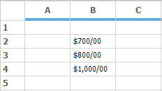

[CurrencyGroupSeparator](https://help.syncfusion.com/cr/windowsforms/Syncfusion.Windows.Forms.Grid.GridCurrencyEditInfo.html#Syncfusion_Windows_Forms_Grid_GridCurrencyEditInfo_CurrencyGroupSeparator) is a string property in `GridStyleInfo` class which specifies the separator to be used for grouping digits. The default string is comma.


GridStyleInfo currencyStyle = new GridStyleInfo();
currencyStyle.CellType = GridCellTypeName.Currency;
currencyStyle.Text = "7000";
currencyStyle.CurrencyEdit.CurrencyGroupSeparator = "/";
this.gridControl1[2, 2] = currencyStyle;


Dim currencyStyle As New GridStyleInfo()
currencyStyle.CellType = GridCellTypeName.Currency
currencyStyle.Text = "7000"
currencyStyle.CurrencyEdit.CurrencyDecimalDigits = 2
currencyStyle.CurrencyEdit.CurrencyDecimalSeparator = "/"
Me.gridControl1(2, 2) = currencyStyle



[CurrencyGroupSizes](https://help.syncfusion.com/cr/windowsforms/Syncfusion.Windows.Forms.Grid.GridCurrencyEditInfo.html#Syncfusion_Windows_Forms_Grid_GridCurrencyEditInfo_CurrencyGroupSizes) property specifies the grouping of currency digit in the currency textbox. The value assigned has to be in the integer array because the values assigned will be from right to left.


GridStyleInfo currencyStyle = new GridStyleInfo();
currencyStyle.CellType = GridCellTypeName.Currency;
currencyStyle.Text = "700000";
currencyStyle.CurrencyEdit.CurrencyDecimalDigits = 0;
currencyStyle.CurrencyEdit.CurrencyGroupSizes = new int[] { 3, 2 };
this.gridControl1[2, 2] = currencyStyle;


Dim currencyStyle As New GridStyleInfo()
currencyStyle.CellType = GridCellTypeName.Currency
currencyStyle.Text = "700000"
currencyStyle.CurrencyEdit.CurrencyDecimalDigits = 0
currencyStyle.CurrencyEdit.CurrencyGroupSizes = New Integer() { 3, 2 }
Me.gridControl1(2, 2) = currencyStyle



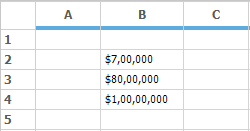

[CurrencyPositivePattern](https://help.syncfusion.com/cr/windowsforms/Syncfusion.Windows.Forms.Grid.GridCurrencyEditInfo.html#Syncfusion_Windows_Forms_Grid_GridCurrencyEditInfo_CurrencyPositivePattern) and [CurrencyNegativePattern](https://help.syncfusion.com/cr/windowsforms/Syncfusion.Windows.Forms.Grid.GridCurrencyEditInfo.html#Syncfusion_Windows_Forms_Grid_GridCurrencyEditInfo_CurrencyNegativePattern) are used to specify the format value for positive and negative currency values respectively. It is of integer type.



GridStyleInfo positiveValue = new GridStyleInfo();
positiveValue.CellType = GridCellTypeName.Currency;
positiveValue.Text = "700000";
positiveValue.Format = "###,###";
positiveValue.CurrencyEdit.CurrencyPositivePattern = 1;

this.gridControl1[2, 2] = positiveValue;

GridStyleInfo negativeValue = new GridStyleInfo();
negativeValue.CellType = GridCellTypeName.Currency;
negativeValue.Text = "-700000";
negativeValue.Format = "###,###";
negativeValue.CurrencyEdit.CurrencyNegativePattern = 2;

this.gridControl1[3, 2] = negativeValue;


Dim positiveValue As New GridStyleInfo()
positiveValue.CellType = GridCellTypeName.Currency
positiveValue.Text = "700000"
positiveValue.Format = "###,###"
positiveValue.CurrencyEdit.CurrencyPositivePattern = 1

Me.gridControl1(2, 2) = positiveValue

Dim negativeValue As New GridStyleInfo()
negativeValue.CellType = GridCellTypeName.Currency
negativeValue.Text = "-700000"
negativeValue.Format = "###,###"
negativeValue.CurrencyEdit.CurrencyNegativePattern = 2

Me.gridControl1(3, 2) = negativeValue



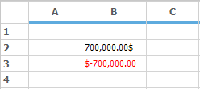

Currency cell type also has the support to the change the color of the currency value. For this [PositiveColor](https://help.syncfusion.com/cr/windowsforms/Syncfusion.Windows.Forms.Grid.GridCurrencyEditInfo.html#Syncfusion_Windows_Forms_Grid_GridCurrencyEditInfo_PositiveColor) and [NegativeColor](https://help.syncfusion.com/cr/windowsforms/Syncfusion.Windows.Forms.Grid.GridCurrencyEditInfo.html#Syncfusion_Windows_Forms_Grid_GridCurrencyEditInfo_NegativeColor) property is used. These properties is used to change the color of the positive value and negative value respectively. By default the color assigned for positive color is black and for negative color is Red.



GridStyleInfo positiveValue = new GridStyleInfo();
positiveValue.CellType = GridCellTypeName.Currency;
positiveValue.Text = "700000";
positiveValue.CurrencyEdit.CurrencyPositivePattern = 0;
positiveValue.CurrencyEdit.PositiveColor = Color.Blue;

this.gridControl1[2, 2] = positiveValue;

GridStyleInfo negativeValue = new GridStyleInfo();
negativeValue.CellType = GridCellTypeName.Currency;
negativeValue.Text = "-700000";
negativeValue.CurrencyEdit.CurrencyNegativePattern = 1;
negativeValue.CurrencyEdit.NegativeColor = Color.SaddleBrown;

this.gridControl1[3, 2] = negativeValue;


Dim positiveValue As New GridStyleInfo()
positiveValue.CellType = GridCellTypeName.Currency
positiveValue.Text = "700000"
positiveValue.CurrencyEdit.CurrencyPositivePattern = 0
positiveValue.CurrencyEdit.PositiveColor = Color.Blue

Me.gridControl1(2, 2) = positiveValue

Dim negativeValue As New GridStyleInfo()
negativeValue.CellType = GridCellTypeName.Currency
negativeValue.Text = "-700000"
negativeValue.CurrencyEdit.CurrencyNegativePattern = 1
negativeValue.CurrencyEdit.NegativeColor = Color.SaddleBrown

Me.gridControl1(3, 2) = negativeValue



[NegativeSign](https://help.syncfusion.com/cr/windowsforms/Syncfusion.Windows.Forms.Grid.GridCurrencyEditInfo.html#Syncfusion_Windows_Forms_Grid_GridCurrencyEditInfo_NegativeSign) property can be used to denote which type of character has to be used in the place of the negative sign. By default the value is `-`.




GridStyleInfo negativeValue = new GridStyleInfo();
negativeValue.CellType = GridCellTypeName.Currency;
negativeValue.Text = "-700000";
negativeValue.CurrencyEdit.CurrencyNegativePattern = 1;
negativeValue.CurrencyEdit.NegativeSign = "^";

this.gridControl1[2, 2] = negativeValue;


Dim negativeValue As New GridStyleInfo()
negativeValue.CellType = GridCellTypeName.Currency
negativeValue.Text = "-700000"
negativeValue.CurrencyEdit.CurrencyNegativePattern = 1
negativeValue.CurrencyEdit.NegativeSign = "^"

Me.gridControl1(2, 2) = negativeValue



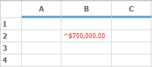

The symbol of the currency can be changed by using the [CurrencySymbol](https://help.syncfusion.com/cr/windowsforms/Syncfusion.Windows.Forms.Grid.GridCurrencyEditInfo.html#Syncfusion_Windows_Forms_Grid_GridCurrencyEditInfo_CurrencySymbol) property. By default the value is `$`.



GridStyleInfo currencyStyle = new GridStyleInfo();
currencyStyle.CellType = GridCellTypeName.Currency;
currencyStyle.Text = "700000";
currencyStyle.CurrencyEdit.CurrencySymbol = "₹";
this.gridControl1[2, 2] = currencyStyle;


Dim currencyStyle As New GridStyleInfo()
currencyStyle.CellType = GridCellTypeName.Currency
currencyStyle.Text = "700000"
currencyStyle.CurrencyEdit.CurrencySymbol = "₹"
Me.gridControl1(2, 2) = currencyStyle



## Formula cell type
`FormulaCell` cell type adds algebraic formulas to a cell that depends on other cells. The cell value should be a well-formed formula starting with an `=` and the `CellType` property set to `FormulaCell`. If a formula cell does not begin with an `=`, the cell is treated as a text box cell. For details, refer the topic [Formula Support](http://help.syncfusion.com/windowsforms/grid/formula-support).



//Sets Cell Type as Formula Cell.
gridControl1[rowIndex, colIndex].CellType = "FormulaCell";

//Assigns a Formula.
gridControl1[rowIndex, colIndex].CellValue = "= (A1+A2) / 2";



'Sets Cell Type as Formula Cell.
gridControl1(rowIndex, colIndex).CellType = "FormulaCell"

'Assigns a Formula.
gridControl1(rowIndex, colIndex).CellValue = "= (A1+A2) / 2"



## MaskEdit cell type
[MaskEdit](https://help.syncfusion.com/cr/windowsforms/Syncfusion.Windows.Forms.Grid.GridStyleInfo.html#Syncfusion_Windows_Forms_Grid_GridStyleInfo_MaskEdit) cell type allows to create specially formatted text cells, which confirms an edit mask that has been specified. For setting a current cell as a `MaskEdit` cell type, then set the `CellType` property as `GridCellTypeName.MaskEdit`. There is a class named [GridMaskEditInfo](http://help.syncfusion.com/cr/windowsforms/Syncfusion.Windows.Forms.Grid.GridMaskEditInfo.html) which contains all the style properties related to the Mask Edit cells.



GridStyleInfo maskStyleInfo = this.gridControl1.Model[2, 2];
maskStyleInfo.CellType = GridCellTypeName.MaskEdit;
maskStyleInfo.MaskEdit = GridMaskEditInfo.Default;
maskStyleInfo.MaskEdit.Mask = "999-99-9999";
maskStyleInfo.CellValue = "04492413";

GridStyleInfo maskStyleInfo1 = this.gridControl1.Model[4, 2];
maskStyleInfo1.CellType = GridCellTypeName.MaskEdit;
maskStyleInfo1.MaskEdit = GridMaskEditInfo.Default;
maskStyleInfo1.MaskEdit.Mask = "99:99:99";
maskStyleInfo1.CellValue = "120000";

GridStyleInfo maskStyleInfo2 = this.gridControl1.Model[6, 2];
maskStyleInfo2.CellType = GridCellTypeName.MaskEdit;
maskStyleInfo2.MaskEdit = GridMaskEditInfo.Default;
maskStyleInfo2.MaskEdit.Mask = "99/99/9999";
maskStyleInfo2.CellValue = "10232015";


Dim maskStyleInfo As GridStyleInfo = Me.gridControl1.Model(2, 2)
maskStyleInfo.CellType = GridCellTypeName.MaskEdit
maskStyleInfo.MaskEdit = GridMaskEditInfo.Default
maskStyleInfo.MaskEdit.Mask = "999-99-9999"
maskStyleInfo.CellValue = "04492413"

Dim maskStyleInfo1 As GridStyleInfo = Me.gridControl1.Model(4, 2)
maskStyleInfo1.CellType = GridCellTypeName.MaskEdit
maskStyleInfo1.MaskEdit = GridMaskEditInfo.Default
maskStyleInfo1.MaskEdit.Mask = "99:99:99"
maskStyleInfo1.CellValue = "120000"

Dim maskStyleInfo2 As GridStyleInfo = Me.gridControl1.Model(6, 2)
maskStyleInfo2.CellType = GridCellTypeName.MaskEdit
maskStyleInfo2.MaskEdit = GridMaskEditInfo.Default
maskStyleInfo2.MaskEdit.Mask = "99/99/9999"
maskStyleInfo2.CellValue = "10232015"



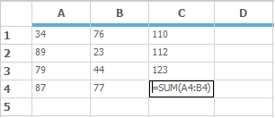

## MonthCalendar cell type
To display the calendar in a Grid cell make use of the `MonthCalendar` cell type. It will automatically display the Month calendar in the drop down grid while clicking on it. The cell value given for this cell has to be in [DateTime](https://docs.microsoft.com/en-us/dotnet/api/system.datetime?view=net-5.0) format.



GridStyleInfo monthCalendar = new GridStyleInfo();
monthCalendar.CellType = GridCellTypeName.MonthCalendar;
monthCalendar.CellValue = DateTime.Now;

this.gridControl1[2, 2] = monthCalendar;


Dim monthCalendar As New GridStyleInfo()
monthCalendar.CellType = GridCellTypeName.MonthCalendar
monthCalendar.CellValue = DateTime.Now

Me.gridControl1(2, 2) = monthCalendar



## NumericUpDown cell type
`NumericUpDown` cell type makes the grid cell to increase or decrease a value by using a pair of arrow buttons. There is also a property `NumericUpDown` under the GridStyleInfo class which gets the value as of type [GridNumericUpDownCellInfo](http://help.syncfusion.com/cr/windowsforms/Syncfusion.Windows.Forms.Grid.GridNumericUpDownCellInfo.html)**.** This `GridNumericUpDownCellInfo` class contains all the style properties related to the `NumericUpDown` cell type. 



GridStyleInfo numericCellType = new GridStyleInfo();
numericCellType.CellType = GridCellTypeName.NumericUpDown;

GridNumericUpDownCellInfo numeric = new GridNumericUpDownCellInfo();

// Represents the first value of the NumericUpDown cell type.
numeric.StartValue = 5;

// Represents the maximum value.
numeric.Maximum = 10;

// Represents the minimum value.
numeric.Minimum = 0;

// Represents the step to increase or
// decrease while clicking up or down arrow.
numeric.Step = 2;

// Indicates whether to start over when the value.

// reaches the maximum or minimum.
numeric.WrapValue = true;

numericCellType.NumericUpDown = numeric;

this.gridControl1[2, 2] = numericCellType;




Dim numericCellType As New GridStyleInfo()
numericCellType.CellType = GridCellTypeName.NumericUpDown

Dim numeric As New GridNumericUpDownCellInfo()

'Represents the first value of the NumericUpDown cell type.
numeric.StartValue = 5

'Represents the maximum value.
numeric.Maximum = 10

'Represents the minimum value.
numeric.Minimum = 0

'Represents the step to increase.

'Decrease while clicking up or down arrow.
numeric.Step = 2

'Indicates whether to start over when the value.

'Reaches the maximum or minimum.
numeric.WrapValue = True

numericCellType.NumericUpDown = numeric

Me.gridControl1(2, 2) = numericCellType



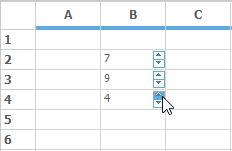

`NumericUpDown` cell can be customized to allow only numeric characters by setting the [AcceptAlphaKeys](https://help.syncfusion.com/cr/windowsforms/Syncfusion.Windows.Forms.Grid.GridNumericUpDownCellModel.html#Syncfusion_Windows_Forms_Grid_GridNumericUpDownCellModel_AcceptAlphaKeys) property to false. This property can be derived from [GridNumericUpDownCellModel](http://help.syncfusion.com/cr/windowsforms/Syncfusion.Windows.Forms.Grid.GridNumericUpDownCellModel.html).



// To allow only numeric characters.
GridNumericUpDownCellModel model = this.gridControl1.CellModels[GridCellTypeName.NumericUpDown] as GridNumericUpDownCellModel;
model.AcceptAlphaKeys = false;


' To allow only numeric characters.
Dim model As GridNumericUpDownCellModel = TryCast(Me.gridControl1.CellModels(GridCellTypeName.NumericUpDown), GridNumericUpDownCellModel)
model.AcceptAlphaKeys = False



## ProgressBar cell type
Progress bars are used in applications to provide a visual cue during lengthy operations such as installation, copying, and printing etc. In GridControl progress bar cells can be used in a cell by setting the `CellType` name as `ProgressBar`.

The `ProgressBar` property in `GridStyleInfo` class will set all the style properties related to the progress bar. This property will get the value of type [GridProgressBarInfo](http://help.syncfusion.com/cr/windowsforms/Syncfusion.Windows.Forms.Grid.GridProgressBarInfo.html) class.



GridStyleInfo progressBarCellType = new GridStyleInfo();
progressBarCellType.CellType = GridCellTypeName.ProgressBar;

GridProgressBarInfo progressBar = new GridProgressBarInfo();

//It denotes the Background style for the Progress Bar.
progressBar.BackgroundStyle = Syncfusion.Windows.Forms.Tools.ProgressBarBackgroundStyles.VerticalGradient;

// It checks whether background segment has to be shown.
progressBar.BackSegments = false;

// Sets the Font color of the progress bar text.
progressBar.FontColor = System.Drawing.Color.White;

// It denotes the foreground style of the Progress Bar.
progressBar.ProgressStyle = Syncfusion.Windows.Forms.Tools.ProgressBarStyles.Tube;

// Checks whether the text has to visible or not.
progressBar.TextVisible = true;

// Sets the start color and end color of the foreground.

// If ProgressStyle is in Tube.
progressBar.TubeEndColor = System.Drawing.Color.Honeydew;
progressBar.TubeStartColor = System.Drawing.Color.Green;
progressBar.ProgressValue = 50;

progressBarCellType.ProgressBar = progressBar;
this.gridControl1[2, 2] = progressBarCellType;


Dim progressBarCellType As New GridStyleInfo()
progressBarCellType.CellType = GridCellTypeName.ProgressBar

Dim progressBar As New GridProgressBarInfo()

'It denotes the Background style for the Progress Bar.
progressBar.BackgroundStyle = Syncfusion.Windows.Forms.Tools.ProgressBarBackgroundStyles.VerticalGradient

'It checks whether background segment has to be shown.
progressBar.BackSegments = False

'Sets the Font color of the progress bar text.
progressBar.FontColor = System.Drawing.Color.White

'It denotes the foreground style of the Progress Bar.
progressBar.ProgressStyle = Syncfusion.Windows.Forms.Tools.ProgressBarStyles.Tube

'Checks whether the text has to visible or not.
progressBar.TextVisible = True

'Sets the start color and end color of the foreground.
'If ProgressStyle is in Tube.
progressBar.TubeEndColor = System.Drawing.Color.Honeydew
progressBar.TubeStartColor = System.Drawing.Color.Green
progressBar.ProgressValue = 50

progressBarCellType.ProgressBar = progressBar
Me.gridControl1(2, 2) = progressBarCellType



## PushButton cell type
To display a Push Button in a grid cell, use the **PushButton** cell type. The appearance of the button can be changed by using the [CellAppearance](https://help.syncfusion.com/cr/windowsforms/Syncfusion.Windows.Forms.Grid.GridStyleInfo.html#Syncfusion_Windows_Forms_Grid_GridStyleInfo_CellAppearance) property.Use the `Description` property of the cell style to specify the text that is to be displayed on the button.



this.gridControl1[2, 2].CellType = GridCellTypeName.PushButton;
this.gridControl1[2, 2].CellAppearance = GridCellAppearance.Flat;
this.gridControl1[2, 2].Description = "Flat Appearance";

this.gridControl1[4, 2].CellType = GridCellTypeName.PushButton;
this.gridControl1[4, 2].CellAppearance = GridCellAppearance.Sunken;
this.gridControl1[4, 2].Description = "Sunken Appearance";

this.gridControl1[6, 2].CellType = GridCellTypeName.PushButton;
this.gridControl1[6, 2].CellAppearance = GridCellAppearance.Raised;
this.gridControl1[6, 2].Description = "Raised Appearance";


Me.gridControl1(2, 2).CellType = GridCellTypeName.PushButton
Me.gridControl1(2, 2).CellAppearance = GridCellAppearance.Flat
Me.gridControl1(2, 2).Description = "Flat Appearance"

Me.gridControl1(4, 2).CellType = GridCellTypeName.PushButton
Me.gridControl1(4, 2).CellAppearance = GridCellAppearance.Sunken
Me.gridControl1(4, 2).Description = "Sunken Appearance"

Me.gridControl1(6, 2).CellType = GridCellTypeName.PushButton
Me.gridControl1(6, 2).CellAppearance = GridCellAppearance.Raised
Me.gridControl1(6, 2).Description = "Raised Appearance"



GridControl provides [CellButtonClicked](https://help.syncfusion.com/cr/windowsforms/Syncfusion.Windows.Forms.Grid.GridControlBase.html) event which gets fired whenever the button is being clicked.



gridControl1.CellButtonClicked += new GridCellButtonClickedEventHandler(gridControl1_CellButtonClicked);

//...
private void gridControl1_CellButtonClicked(object sender, GridCellButtonClickedEventArgs e)
   {
       string s = string.Format("You clicked ({0},{1}).", e.RowIndex, e.ColIndex);
       MessageBox.Show(s);
   }


AddHandler GridControl1.CellButtonClicked, AddressOf gridControl1_CellButtonClicked

  '...
    Private Sub gridControl1_CellButtonClicked(sender As Object, e As GridCellButtonClickedEventArgs)
        Dim s As String = String.Format("You clicked ({0},{1}).", e.RowIndex, e.ColIndex)
        MessageBox.Show(s)
    End Sub



## RichTextBox cell type
The `RichTextBox` control will allow to display and edit rich text in grid cells. To make use of this control set the cell type as `GridCellTypeName.RichTextBox`.


GridStyleInfo style = gridControl1.Model[2, 2];
style.CellType = GridCellTypeName.RichText;


Dim style As GridStyleInfo = gridControl1.Model(2, 2)
style.CellType = GridCellTypeName.RichText


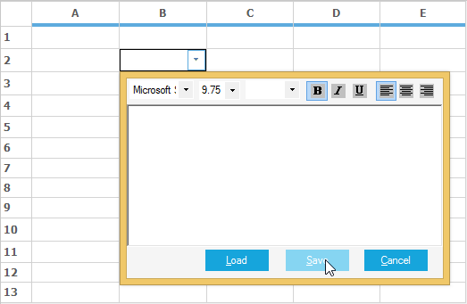

## OriginalTextBox cell type
This cell type is used to show the text in a grid cell, it is derived from the System.Windows.Forms.TextBox control. [CharacterCasing](https://help.syncfusion.com/cr/windowsforms/Syncfusion.Windows.Forms.Grid.GridStyleInfo.html#Syncfusion_Windows_Forms_Grid_GridStyleInfo_CharacterCasing) works only with this cell type. The `RichTextBox` cell type does not have `CharacterCasing` property. 


//Set the OriginalTextBox cell for entire table.
this.gridControl1.TableStyle.CellType = GridCellTypeName.OriginalTextBox;

//Display text in upper case.
this.gridControl1.TableStyle.CharacterCasing = CharacterCasing.Upper;


'Set the OriginalTextBox cell for entire table.
Me.gridControl1.TableStyle.CellType = GridCellTypeName.OriginalTextBox

'Display text in upper case.
Me.gridControl1.TableStyle.CharacterCasing = CharacterCasing.Upper



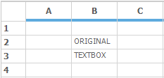

## Creating a Custom Cell Type
Apart from the built in custom cell types given by the GridControl, it is also possible to create an own cell type in GridControl. In GridControl each cell has been created by [GridCellModelBase](http://help.syncfusion.com/cr/windowsforms/Syncfusion.Windows.Forms.Grid.GridCellModelBase.html) and [GridCellRendererBase](http://help.syncfusion.com/cr/windowsforms/Syncfusion.Windows.Forms.Grid.GridCellRendererBase.html)

So every custom cell type also requires a model base class and a renderer base class. The Model class handles the serialization of the control and creates the renderer for the custom control. The renderer class handles the UI requirements of the cell.

To use a custom cell type in a GridControl, it is necessary to register this cell type with the GridControl. In the end of this session you will be able to create a simple custom cell type for the GridControl.

For creating a custom cell type, the below methods has to be followed.

* [Creating Cell Model](#creating-cell-model)
* [Creating Cell Renderer](#creating-cell-renderer)
* [Registering cell model into a control](#registering-cell-model)
* [Assigning cell types in Grid Cells](#assigning-cell-types) 

### Creating cell model
For creating any Model base class you have to inherit the [GridCellModelBase](http://help.syncfusion.com/cr/windowsforms/Syncfusion.Windows.Forms.Grid.GridCellModelBase.html) class. The main function of `GridCellModelBase` derived class is to serialize your control. It can hold any persistent state independent data that your control uses.

Another major function of this class is to create cell renderer object for the custom cell type. In fact, the only required override in `GridCellModelBase` derived class is the `CreateRenderer` method. In that override, it is possible to create and return `GridCellRendererBase` derived object that would handle the user interactions in new custom cell type.

In general, it is unlikely to derive directly from the base class. Instead of that, override an existing GridControl derived class such as [GridStaticCellModel](http://help.syncfusion.com/cr/windowsforms/Syncfusion.Windows.Forms.Grid.GridStaticCellModel.html). The following code example illustrates this.



//Defines custom Cell Model by inheriting GridStaticCellModel.
public class LinkLabelCellModel : GridStaticCellModel
{
    protected LinkLabelCellModel(SerializationInfo info, StreamingContext context)
        : base(info, context)
    {
    }
    public LinkLabelCellModel(GridModel grid)
        : base(grid)
    {
    }
    
    //Overrides CreateRenderer Method to create CellRenderer object.   
    
    public override GridCellRendererBase CreateRenderer(GridControlBase control)
    {
        return new LinkLabelCellRenderer(control, this);
    }
 }


'Defines custom Cell Model by inheriting GridStaticCellModel.
Public Class LinkLabelCellModel
    Inherits GridStaticCellModel

    Protected Sub New(ByVal info As SerializationInfo, ByVal context As StreamingContext)
        MyBase.New(info, context)
    End Sub

     Public Sub New(ByVal grid As GridModel)
         MyBase.New(grid)
     End Sub

     'Overrides CreateRenderer Method to create CellRenderer object.   
      Public Overrides Function CreateRenderer(ByVal control As GridControlBase) As GridCellRendererBase
        Return New LinkLabelCellRenderer(control, Me)
    End Function
End Class



### Creating cell renderer 
[GridCellRendererBase](http://help.syncfusion.com/cr/windowsforms/Syncfusion.Windows.Forms.Grid.GridCellRendererBase.html) class has to be inherited for creating any renderer base class. This base class handles drawing of the cell and user interaction aspects of the cell architecture.

This renderer class will take care of the handling of mouse and keyboard messages, also the UI related changes. It is necessary to override the required methods and properties and modify them as per your needs.

In general, it is unlikely to derive directly from the `GridCellRendererBase` class. Instead of that, override an existing GridControl derived class such as [GridStaticModel](http://help.syncfusion.com/cr/windowsforms/Syncfusion.Windows.Forms.Grid.GridStaticCellModel.html), [GridGenericControlCellModel](http://help.syncfusion.com/cr/windowsforms/Syncfusion.Windows.Forms.Grid.GridGenericControlCellModel.html) etc.



public class LinkLabelCellRenderer : GridStaticCellRenderer
{
    private bool _isMouseDown;
    private bool _drawHotLink;
    private Color _hotColor;
    private Color _visitedColor;
    private string _EXEName;

    public LinkLabelCellRenderer(GridControlBase grid, GridCellModelBase cellModel)
        : base(grid, cellModel)
    {
        _isMouseDown = false;
        _drawHotLink = false;

        _hotColor = Color.Red;
        _visitedColor = Color.Purple;

        _EXEName = "iexplore.exe";
    }

    public Color VisitedLinkColor
    {
        get { return _visitedColor; }
        set { _visitedColor = value; }
    }

    public Color ActiveLinkColor
    {
        get { return _hotColor; }
        set { _hotColor = value; }
    }

    public string EXEName
    {
        get { return _EXEName; }
        set { _EXEName = value; }
    }

    protected virtual void LaunchBrowser(GridStyleInfo style)
    {
        try
        {
            System.Diagnostics.Process process = new System.Diagnostics.Process();
            process.StartInfo.FileName = EXEName;
            process.StartInfo.Arguments = (string)style.Tag;
            process.Start();
        }
        catch (Exception ex)
        {
            MessageBox.Show("Error: " + ex.ToString());
        }

    }

    private void DrawLink(bool useHotColor, int rowIndex, int colIndex)
    {
 
        if (useHotColor)
            _drawHotLink = true;

        this.Grid.RefreshRange(GridRangeInfo.Cell(rowIndex, colIndex), GridRangeOptions.None);

        _drawHotLink = false;
    }

    protected override void OnMouseDown(int rowIndex, int colIndex, System.Windows.Forms.MouseEventArgs e)
    {
        base.OnMouseDown(rowIndex, colIndex, e);
        DrawLink(true, rowIndex, colIndex);
        _isMouseDown = true;
    }

    protected override void OnMouseUp(int rowIndex, int colIndex, System.Windows.Forms.MouseEventArgs e)
    {
        base.OnMouseUp(rowIndex, colIndex, e);
        int row, col;
        this.Grid.PointToRowCol(new Point(e.X, e.Y), out row, out col);

        if (row == rowIndex && col == colIndex)
        {
            GridStyleInfo style = this.Grid.Model[row, col];
            LaunchBrowser(style);
            style.TextColor = VisitedLinkColor;
        }
        DrawLink(false, rowIndex, colIndex);
        _isMouseDown = false;
    }

    protected override void OnCancelMode(int rowIndex, int colIndex)
    {
        base.OnCancelMode(rowIndex, colIndex);
        _isMouseDown = false;
        _drawHotLink = false;
    }

    protected override System.Windows.Forms.Cursor OnGetCursor(int rowIndex, int colIndex)
    {

        //If over cell, return HandPointerCursor otherwise NoCursor.
        Point pt = this.Grid.PointToClient(Cursor.Position);
        int row, col;
        this.Grid.PointToRowCol(pt, out row, out col);

        return (row == rowIndex && col == colIndex) ? Cursors.Hand : (this._isMouseDown) ? Cursors.No : base.OnGetCursor(rowIndex, colIndex);
    }

    protected override int OnHitTest(int rowIndex, int colIndex, MouseEventArgs e, IMouseController controller)
    {
        //Return a nonzero so the mouse messages will be forwarded to the cell render
        
        //But do not include the cell borders so D&D can be handled

        if (controller != null && controller.Name == "OleDataSource")

            // Other controllers have higher priority than me
            return 0;

        return 1;

    }

    protected override void OnDraw(System.Drawing.Graphics g, System.Drawing.Rectangle clientRectangle, int rowIndex, int colIndex, Syncfusion.Windows.Forms.Grid.GridStyleInfo style)
    {
        style.Font.Underline = true;

        if (_drawHotLink)
        {
            style.TextColor = ActiveLinkColor;
        }
        base.OnDraw(g, clientRectangle, rowIndex, colIndex, style);

    }

    protected override void OnMouseHoverEnter(int rowIndex, int colIndex)
    {
        base.OnMouseHoverEnter(rowIndex, colIndex);
        DrawLink(true, rowIndex, colIndex);
    }

    protected override void OnMouseHoverLeave(int rowIndex, int colIndex, System.EventArgs e)
    {
        base.OnMouseHoverLeave(rowIndex, colIndex, e);
        DrawLink(false, rowIndex, colIndex);
    }

}



Public Class LinkLabelCellRenderer
    Inherits GridStaticCellRenderer
    Private _isMouseDown As Boolean
    Private _drawHotLink As Boolean
    Private _hotColor As Color
    Private _visitedColor As Color
    Private _EXEName As String

    Public Sub New(ByVal grid As GridControlBase, ByVal cellModel As GridCellModelBase)
        MyBase.New(grid, cellModel)
        _isMouseDown = False
        _drawHotLink = False

        _hotColor = Color.Red
        _visitedColor = Color.Purple

        _EXEName = "iexplore.exe"
    End Sub

    Public Property VisitedLinkColor() As Color
        Get
            Return _visitedColor
        End Get
        Set(ByVal value As Color)
            _visitedColor = value
        End Set
    End Property

    Public Property ActiveLinkColor() As Color
        Get
            Return _hotColor
        End Get
        Set(ByVal value As Color)
            _hotColor = value
        End Set
    End Property

    Public Property EXEName() As String
        Get
            Return _EXEName
        End Get
        Set(ByVal value As String)
            _EXEName = value
        End Set
    End Property

    Protected Overridable Sub LaunchBrowser(ByVal style As GridStyleInfo)
        Try
            Dim process As New System.Diagnostics.Process()
            process.StartInfo.FileName = EXEName
            process.StartInfo.Arguments = CStr(style.Tag)
            process.Start()
        Catch ex As Exception
            MessageBox.Show("Error: " & ex.ToString())
        End Try

    End Sub

    Private Sub DrawLink(ByVal useHotColor As Boolean, ByVal rowIndex As Integer, ByVal colIndex As Integer)
        If useHotColor Then
            _drawHotLink = True
        End If

        Me.Grid.RefreshRange(GridRangeInfo.Cell(rowIndex, colIndex), GridRangeOptions.None)

        _drawHotLink = False
    End Sub

    Protected Overrides Sub OnMouseDown(ByVal rowIndex As Integer, ByVal colIndex As Integer, ByVal e As System.Windows.Forms.MouseEventArgs)
        MyBase.OnMouseDown(rowIndex, colIndex, e)
        DrawLink(True, rowIndex, colIndex)
        _isMouseDown = True
    End Sub

    Protected Overrides Sub OnMouseUp(ByVal rowIndex As Integer, ByVal colIndex As Integer, ByVal e As System.Windows.Forms.MouseEventArgs)
        MyBase.OnMouseUp(rowIndex, colIndex, e)
        Dim row, col As Integer
        Me.Grid.PointToRowCol(New Point(e.X, e.Y), row, col)
        If row = rowIndex AndAlso col = colIndex Then
            Dim style As GridStyleInfo = Me.Grid.Model(row, col)
            LaunchBrowser(style)
            style.TextColor = VisitedLinkColor
        End If
        DrawLink(False, rowIndex, colIndex)
        _isMouseDown = False
    End Sub

    Protected Overrides Sub OnCancelMode(ByVal rowIndex As Integer, ByVal colIndex As Integer)
        MyBase.OnCancelMode(rowIndex, colIndex)
        _isMouseDown = False
        _drawHotLink = False
    End Sub

    Protected Overrides Function OnGetCursor(ByVal rowIndex As Integer, ByVal colIndex As Integer) As System.Windows.Forms.Cursor
        'If over cell, return HandPointerCursor otherwise NoCursor...
        Dim pt As Point = Me.Grid.PointToClient(Cursor.Position)
        Dim row, col As Integer
        Me.Grid.PointToRowCol(pt, row, col)

        Return If((row = rowIndex AndAlso col = colIndex), Cursors.Hand, If((Me._isMouseDown), Cursors.No, MyBase.OnGetCursor(rowIndex, colIndex)))
    End Function

    Protected Overrides Function OnHitTest(ByVal rowIndex As Integer, ByVal colIndex As Integer, ByVal e As MouseEventArgs, ByVal controller As IMouseController) As Integer
        'Return a nonzero so the mouse messages will be forwarded to the cell render
        
        'But do not include the cell borders so D&D can be handled
        If controller IsNot Nothing AndAlso controller.Name = "OleDataSource" Then

            ' Other controllers have higher priority than me
            Return 0
        End If

        Return 1

    End Function

    Protected Overrides Sub OnDraw(ByVal g As System.Drawing.Graphics, ByVal clientRectangle As System.Drawing.Rectangle, ByVal rowIndex As Integer, ByVal colIndex As Integer, ByVal style As Syncfusion.Windows.Forms.Grid.GridStyleInfo)
        style.Font.Underline = True

        If _drawHotLink Then
            style.TextColor = ActiveLinkColor
        End If
        MyBase.OnDraw(g, clientRectangle, rowIndex, colIndex, style)

    End Sub

    Protected Overrides Sub OnMouseHoverEnter(ByVal rowIndex As Integer, ByVal colIndex As Integer)
        MyBase.OnMouseHoverEnter(rowIndex, colIndex)
        DrawLink(True, rowIndex, colIndex)
    End Sub

    Protected Overrides Sub OnMouseHoverLeave(ByVal rowIndex As Integer, ByVal colIndex As Integer, ByVal e As System.EventArgs)
        MyBase.OnMouseHoverLeave(rowIndex, colIndex, e)
        DrawLink(False, rowIndex, colIndex)
    End Sub
End Class



N> For a sample implementation of a derived cell control that is based on the existing Static cell control, make use of the dashboard sample: &lt;Installed Location&gt;\Syncfusion\EssentialStudio\&lt;Installed Version&gt;\Windows\Grid.Windows\Samples\Custom Cell Types\Getting Started\

### Registering cell model 
After creating the Cell model and Cell Renderer for the custom cell type it is necessary to register that custom cell type to the GridControl. For registering make use of the [CellModels.Add](https://help.syncfusion.com/cr/windowsforms/Syncfusion.Windows.Forms.Grid.GridCellModelCollection.html#Syncfusion_Windows_Forms_Grid_GridCellModelCollection_Add_System_String_Syncfusion_Windows_Forms_Grid_GridCellModelBase_) method and assign a name for the cell type in this method, like the below code.



// Registering the cell type LinkLabelCell to the GridControl.
gridControl1.CellModels.Add("LinkLabelCell", new LinkLabelCellModel(gridControl1.Model));


' Registering the cell type LinkLabelCell to the GridControl.
gridControl1.CellModels.Add("LinkLabelCell", New LinkLabelCellModel(gridControl1.Model))




### Assigning cell types 
Assign the registered cell type to a GridControl like a normal cell type. The custom cell type `LinkLabelCell` acts as a hyperlink. The link for the LinkLabelCell will be assigned in the [Tag](https://help.syncfusion.com/cr/windowsforms/Syncfusion.Windows.Forms.Grid.GridStyleInfo.html#Syncfusion_Windows_Forms_Grid_GridStyleInfo_Tag) property of that cell. This cell displays the ordinary text, but on clicking it will relocate to the link given in the Tag.


RegisterCellModel.GridCellType(gridControl1, CustomCellTypes.LinkLabelCell);
gridControl1[2, 2].CellType = CustomCellTypes.LinkLabelCell.ToString();
gridControl1[2, 2].Text = "Syncfusion, Inc.";
gridControl1[2, 2].Font.Bold = true;
gridControl1[2, 2].Tag = "http://www.syncfusion.com";


RegisterCellModel.GridCellType(gridControl1, CustomCellTypes.LinkLabelCell)
gridControl1(2, 2).CellType = CustomCellTypes.LinkLabelCell.ToString()
gridControl1(2, 2).Text = "Syncfusion, Inc."
gridControl1(2, 2).Font.Bold = True
gridControl1(2, 2).Tag = "http://www.syncfusion.com"


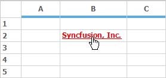

