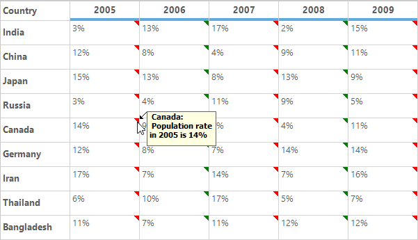
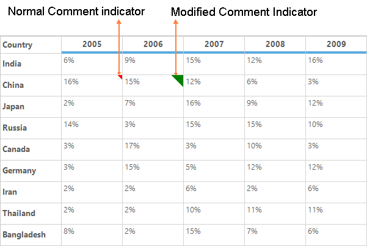
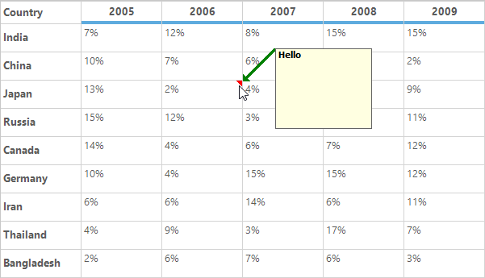
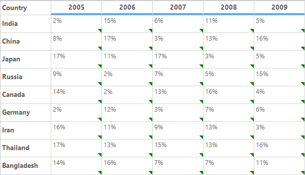
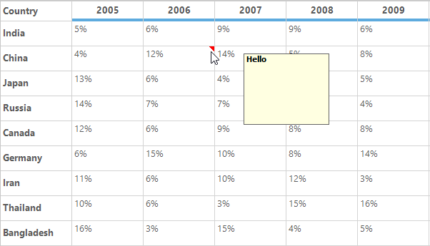
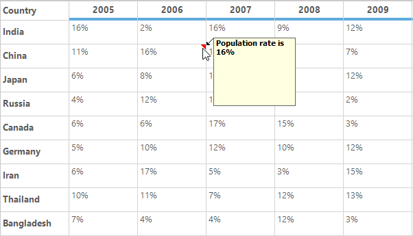

# Comment Tip in Windows Forms Grid Control
GridControl provides the default support for adding the Excel-like comment tip to the individual cells. This allows a user to show more information about the particular cell on mouse hover. 
A user can customize an appearance of the comment tip window and comment indicator of the individual cells. The user can also add the images to the comment tip window.

## Adding Comment Tip
The `CommentTip` property provides the various options to customize the comment tip of the cells. The comment tip can be added to the particular cell by setting the `CommentText` property. The comment text will be displayed in the comment tip window.


//Set the comment text for particular cell.
gridControl1[2, 2].CommentTip.CommentText = "Hello";


'Set the comment text for particular cell.
gridControl1(2, 2).CommentTip.CommentText = "Hello"



### Adding Image to Comment Tip
An image can be added to the comment tip window by setting the `CommentImage` property.


//Adding comment tip by setting the CommentImage.
this.gridControl1[2, 2].CommentTip.CommentImage = Image.FromFile(@"..\..\img1.png");


'Adding comment tip by setting the CommentImage.
Me.gridControl1(2, 2).CommentTip.CommentImage = Image.FromFile("..\..\img1.png")



N> The comment tip can be added to the particular cell by either setting the `CommentText` property or `CommentImage` property.

### Adding Comment Tip to Column
The comment tip can be added to the specific column by setting the `CommentText` property of the `ColStyles` property . 


// Adding comment tip to the specific column.
this.gridControl1.ColStyles[2].CommentTip.CommentText = "Hello";


' Adding comment tip to the specific column.
Me.gridControl1.ColStyles(2).CommentTip.CommentText = "Hello"



### Adding Comment Tip to Row
The comment tip can be added to the specific row by setting the `CommentText` property of the `RowStyles` property. 


// Adding comment tip to particular row.
this.gridControl1.RowStyles[2].CommentTip.CommentText = "Hello";


' Adding comment tip to particular row.
Me.gridControl1.RowStyles(2).CommentTip.CommentText = "Hello"



### Adding Comment Tip using QueryCellInfo Event
The comment tip can be added conditionally to the specific cell or row or column by using the `QueryCellInfo` event.


void gridControl1_QueryCellInfo(object sender, GridQueryCellInfoEventArgs e)
{
    // Enabling comment tip for particular cell.
    if (e.RowIndex == 1 && e.ColIndex == 1)
        e.Style.CommentTip.CommentText = "Cell comment";

    // Enabling comment tip for row.
    if (e.ColIndex > 0 && e.RowIndex == 5)
        e.Style.CommentTip.CommentText = "Row comment";

    // Enabling comment tip for column.
    if (e.RowIndex > 0 && e.ColIndex == 4)
        e.Style.CommentTip.CommentText = "Column comment";
}


Private Sub gridControl1_QueryCellInfo(ByVal sender As Object, ByVal e As GridQueryCellInfoEventArgs)
	
	' Enabling comment tip for particular cell.
	If e.RowIndex = 1 AndAlso e.ColIndex = 1 Then
		e.Style.CommentTip.CommentText = "Cell comment"
	End If

	' Enabling comment tip for row.
	If e.ColIndex > 0 AndAlso e.RowIndex = 5 Then
		e.Style.CommentTip.CommentText = "Row comment"
	End If

	' Enabling comment tip for column.
	If e.RowIndex > 0 AndAlso e.ColIndex = 4 Then
		e.Style.CommentTip.CommentText = "Column comment"
	End If
End Sub



N> To check whether the cell has the comment tip or not, the `HasCommentTip` property can be used. It will return `true` when the default values of the `CommentTip` properties of the cell is modified.
 
## Removing Comment Tip 
The comment tip for the cell can be removed by using the `ResetCommentTip` method.  It will reset the comment tip properties to the default values.


//Removes the comment tip for the particular cell.
this.gridControl1[2, 2].ResetCommentTip();


'Removes the comment tip for the particular cell.
Me.gridControl1(2, 2).ResetCommentTip()



The Comment tip can also be removed for the individual cells by setting the default value for the `CommentText` and `CommentImage` properties.


//Clears the comment tip when its add by using the CommentText property.
this.gridControl1[2, 2].CommentTip.CommentText = string.Empty;

//Clears the comment tip when its add by using the CommentImage property.
this.gridControl1[2, 2].CommentTip.CommentImage = null;


'Clears the comment tip when its add by using the CommentText property.
Me.gridControl1(2, 2).CommentTip.CommentText = String.Empty

'Clears the comment tip when its add by using the CommentImage property.
Me.gridControl1(2, 2).CommentTip.CommentImage = Nothing



The `ResetCommentText` and `ResetCommentImage` methods is also used to clear the comment tip for the cell.


//Resets the comment tip for the cell.
this.gridControl1[2, 2].CommentTip.ResetCommentText();
this.gridControl1[2, 2].CommentTip.ResetCommentImage();


'Resets the comment tip for the cell.
Me.gridControl1(2, 2).CommentTip.ResetCommentText()
Me.gridControl1(2, 2).CommentTip.ResetCommentImage()



## Customizing an Appearance of Comment Tip
The `CommentTip` property provides the list of properties that are used to customize an appearance of the comment tip window.
 
### Comment Indicator
The size and color of the comment indicator can be customized by using the `CommentIndicatorSize` and `CommentIndicatorColor` properties of the `CommentTip`. By default, it will be displayed as the red color triangle at the top-right corner of the cell.


//Setting Comment indicator color.
this.gridControl1[2, 2].CommentTip.CommentIndicatorColor = Color.Green;

//Set the size for the comment indicator.
this.gridControl1[2, 2].CommentTip.CommentIndicatorSize = new Size(20, 20);


'Setting Comment indicator color.
Me.gridControl1(2, 2).CommentTip.CommentIndicatorColor = Color.Green

'Set the size for the comment indicator.
Me.gridControl1(2, 2).CommentTip.CommentIndicatorSize = New Size(20, 20)



### Comment Arrow 
The size and color of the comment arrow can be customized by using the `CommentArrowSize` and `CommentArrowColor` property. 


this.gridControl1[3, 2].CommentTip.CommentText = "Hello";

//Set comment arrow size and arrow color.
this.gridControl1[3, 2].CommentTip.CommentArrowSize = new Size(10, 40);
this.gridControl1[3, 2].CommentTip.CommentArrowColor = Color.Green;


Me.gridControl1(3, 2).CommentTip.CommentText = "Hello"

'Set comment arrow size and arrow color.
Me.gridControl1(3, 2).CommentTip.CommentArrowSize = New Size(10, 40)
Me.gridControl1(3, 2).CommentTip.CommentArrowColor = Color.Green



### Hiding the Comment Arrow
The comment arrow can be hidden by setting the width of the `CommentArrowSize` property to zero. 


this.gridControl1[4, 2].CommentTip.CommentText = "Hello";

//To hide the comment arrow.
this.gridControl1[4, 2].CommentTip.CommentArrowSize = new Size(0, 10);


Me.gridControl1(4, 2).CommentTip.CommentText = "Hello"

'To hide the comment arrow.
Me.gridControl1(4, 2).CommentTip.CommentArrowSize = New Size(0, 10)



N> If the height of the `CommentArrowSize` is set to zero, the comment arrow will be hidden and the comment tip window is shown near to the top-right corner of the cell.

### Comment Tip Window
The size and font of the comment tip window can be customized by using the `CommentWindowSize` and `CommentFont` properties respectively. 
The foreground and background colors of the comment tip window can be changed by using the `ForeColor` and `BackColor` properties of the `CommentTip`.


//Setting window size and Font.
this.gridControl1[2, 2].CommentTip.CommentText = "Hello";
this.gridControl1[2, 2].CommentTip.CommentWindowSize = new Size(100, 30);
this.gridControl1[2, 2].CommentTip.CommentFont = new Font("sans serif", 12, FontStyle.Italic);
this.gridControl1[2, 2].CommentTip.ForeColor = Color.White;
this.gridControl1[2, 2].CommentTip.BackColor = Color.Purple;


'Setting window size and Font.
Me.gridControl1(2, 2).CommentTip.CommentText = "Hello"
Me.gridControl1(2, 2).CommentTip.CommentWindowSize = New Size(100, 30)
Me.gridControl1(2, 2).CommentTip.CommentFont = New Font("sans serif", 12, FontStyle.Italic)
Me.gridControl1(2, 2).CommentTip.ForeColor = Color.White
Me.gridControl1(2, 2).CommentTip.BackColor = Color.Purple



## Events
The following events are used to customize an appearance of the comment tip, 

* DrawCommentIndicator
* CommentTipShowing
* CommentTipShown

### DrawCommentIndicator Event
This event is used to customize an appearance of the comment indicator by changing its shape, color and location through the event arguments.


this.gridControl1.DrawCommentIndicator += new DrawCommentIndicatorEventHandler(gridControl1_DrawCommentIndicator);
void gridControl1_DrawCommentIndicator(object sender, DrawCommentIndicatorEventArgs e)
{
    Console.WriteLine("CommentRow {0} CommentColumn {1}", e.RowIndex, e.ColIndex);
}


Private Me.gridControl1.DrawCommentIndicator += New DrawCommentIndicatorEventHandler(AddressOf gridControl1_DrawCommentIndicator)
Private Sub gridControl1_DrawCommentIndicator(ByVal sender As Object, ByVal e As DrawCommentIndicatorEventArgs)
	Console.WriteLine("CommentRow {0} CommentColumn {1}", e.RowIndex, e.ColIndex)
End Sub



### CommentTipShowing Event
An appearance of the comment tip window can be customized by using the `CommentTipShowing` event. This can be also used to change the text, size, color and location of the comment tip window. This event will be raised before comment tip window is displayed.


this.gridControl1.CommentTipShowing += new CommentTipShowingEventHandler(gridControl1_CommentTipShowing);
void gridControl1_CommentTipShowing(object sender, CommentTipShowingEventArgs e)
{
     Console.WriteLine("CommentRow {0} CommentColumn {1}", e.RowIndex, e.ColIndex);
}


Private Me.gridControl1.CommentTipShowing += New CommentTipShowingEventHandler(AddressOf gridControl1_CommentTipShowing)
Private Sub gridControl1_CommentTipShowing(ByVal sender As Object, ByVal e As CommentTipShowingEventArgs)
	Console.WriteLine("CommentRow {0} CommentColumn {1}", e.RowIndex, e.ColIndex)
End Sub



### CommentTipShown Event
This event will be raised after comment tip window is shown. This is used to get the notification of the showing of comment tip window on specific cell. 


this.gridControl1.CommentTipShown += new CommentTipShownEventHandler(gridControl1_CommentTipShown);

void gridControl1_CommentTipShown(object sender, CommentTipShownEventArgs e)
{
    Console.WriteLine("Comment tip is shown for the cell [" + e.RowIndex + "," + e.ColIndex + "].");
}


AddHandler gridControl1.CommentTipShown, AddressOf gridControl1_CommentTipShown

Private Sub gridControl1_CommentTipShown(ByVal sender As Object, ByVal e As CommentTipShownEventArgs)
	Console.WriteLine("Comment tip is shown for the cell [" & e.RowIndex & "," & e.ColIndex & "].")
End Sub



## Customization using Events
The `CommentTipShowing` and `CommentIndicatorDraw` events are used to customize an appearance of the comment tip window. This section explains about the customization of comment tip using these events.

### Changing the Color and Location of the Comment Indicator 
The color and location of the comment indicator can be customized by using the `DrawCommentIndicator` event. 


this.gridControl1.DrawCommentIndicator +=new DrawCommentIndicatorEventHandler(gridControl1_DrawCommentIndicator);

void gridControl1_DrawCommentIndicator(object sender, DrawCommentIndicatorEventArgs e)
{
    //Set the color for the comment indicator.
    e.Style.CommentTip.CommentIndicatorColor = Color.Green;
   
    // Modify the indicator location.
    e.IndicatorBounds = new Rectangle(e.IndicatorBounds.Left , e.IndicatorBounds.Top + e.CellBounds.Height -8, 8, 8);
}


AddHandler gridControl1.DrawCommentIndicator, AddressOf gridControl1_DrawCommentIndicator

Private Sub gridControl1_DrawCommentIndicator(ByVal sender As Object, ByVal e As DrawCommentIndicatorEventArgs)
	'Set the color for the comment indicator.
	e.Style.CommentTip.CommentIndicatorColor = Color.Green
	
	' Modify the indicator location.
	e.IndicatorBounds = New Rectangle(e.IndicatorBounds.Left, e.IndicatorBounds.Top + e.CellBounds.Height -8, 8, 8)
End Sub



### Changing the Shape of the Comment Indicator
By default, the comment indicator will be drawn in a triangle shape at the top right corner of the cell. the default shape of the comment indicator can be changed by using the `DrawCommentIndicator` event. 
Using the event argument `e.Graphics`, the shape can be filled that you want to display as the comment indicator. The default location of the comment indicator can be get by using the `e.IndicatorBounds` property. 


this.gridControl1.DrawCommentIndicator +=new DrawCommentIndicatorEventHandler(gridControl1_DrawCommentIndicator);

void gridControl1_DrawCommentIndicator(object sender, DrawCommentIndicatorEventArgs e)
{

  if (e.ColIndex == 2)
  {
     // Cancel the default drawing of Comment indicator.
     e.Cancel = true;
    
     // Draw the custom comment indicator.
     e.Graphics.FillRectangle(new SolidBrush(Color.Orange), e.IndicatorBounds);
  }
}


AddHandler gridControl1.DrawCommentIndicator, AddressOf gridControl1_DrawCommentIndicator

Private Sub gridControl1_DrawCommentIndicator(ByVal sender As Object, ByVal e As DrawCommentIndicatorEventArgs)

	If e.ColIndex = 2 Then
		'Cancel the default drawing of Comment indicator.
		e.Cancel = True
		
		'Set the comment indicator color and shape.
		e.Graphics.FillRectangle(New SolidBrush(Color.Orange), e.IndicatorBounds)
	End If
End Sub



### Disabling the Comment Indicator
The `DrawCommentIndicator` event is used to avoid displaying of comment indicator by setting the `e.Cancel` to `true`.


this.gridControl1.DrawCommentIndicator += new DrawCommentIndicatorEventHandler(gridControl1_DrawCommentIndicator);

void gridControl1_DrawCommentIndicator(object sender, DrawCommentIndicatorEventArgs e)
{
     //Cancel the displaying of the comment tip indicator.
     e.Cancel = true;
}


AddHandler gridControl1.DrawCommentIndicator, AddressOf gridControl1_DrawCommentIndicator

Private Sub gridControl1_DrawCommentIndicator(ByVal sender As Object, ByVal e As DrawCommentIndicatorEventArgs)

'Cancel the displaying of the comment tip indicator.
	e.Cancel = True
End Sub



### Disabling the Comment Tip Window 
The displaying of comment tip window for comment tip cell can be canceled by using the `CommentTipShowing` event.  The `e.cancel` can be used to cancel the comment tip window display.


this.gridControl1.CommentTipShowing += new CommentTipShowingEventHandler(gridControl1_CommentTipShowing);

void gridControl1_CommentTipShowing(object sender, CommentTipShowingEventArgs e)
{

 //Cancel the displaying of the comment tip window.
     e.Cancel = true;
}


AddHandler gridControl1.CommentTipShowing, AddressOf gridControl1_CommentTipShowing

Private Sub gridControl1_CommentTipShowing(ByVal sender As Object, ByVal e As CommentTipShowingEventArgs)

'Cancel the displaying of the comment tip window.
	e.Cancel = True
End Sub



### Changing the Location of Comment Tip Window
The location of the comment tip window can be modified dynamically by handling the `CommentTipShowing` event. In this event, the location of the comment tip window can be set through the `CommentTipWindow.Location` property.


this.gridControl1.CommentTipShowing += new CommentTipShowingEventHandler(gridControl1_CommentTipShowing);void gridControl1_CommentTipShowing(object sender, CommentTipShowingEventArgs e)
{
    Point pt = e.CommentTipWindow.Location;

//Display the comment tip window at the given point.
    e.CommentTipWindow.Location = new Point(pt.X + 40, pt.Y + 10);
}


AddHandler gridControl1.CommentTipShowing, AddressOf gridControl1_CommentTipShowing

Private Sub gridControl1_CommentTipShowing(ByVal sender As Object, ByVal e As CommentTipShowingEventArgs)
	Dim pt As Point = e.CommentTipWindow.Location

'Display the comment tip window at the given point.
	e.CommentTipWindow.Location = New Point(pt.X + 40, pt.Y + 10)
End Sub



N> When the custom location is set by an end user, the default comment arrow for indicating the comment window will not be drawn.

### Setting the Custom Comment Text 
The text displayed on the comment tip window can be customized on showing by using the `CommentTipShowing` event.


this.gridControl1.CommentTipShowing += new CommentTipShowingEventHandler(gridControl1_CommentTipShowing);

void gridControl1_CommentTipShowing(object sender, CommentTipShowingEventArgs e)
{
    string comment = "Population rate is " + e.Style.CellValue.ToString();
    e.Style.CommentTip.CommentText = comment;            
}


AddHandler gridControl1.CommentTipShowing, AddressOf gridControl1_CommentTipShowing

Private Sub gridControl1_CommentTipShowing(ByVal sender As Object, ByVal e As CommentTipShowingEventArgs)
	Dim comment As String = "Population rate is " & e.Style.CellValue.ToString()
	e.Style.CommentTip.CommentText = comment
End Sub



## Highlighting the Comment Tip Cell
To highlight the cells or customize the cells if that cell has comment tip, `HasCommentTip` property can used in the `PrepareViewStyleInfo` event. 


this.gridControl1.PrepareViewStyleInfo += new GridPrepareViewStyleInfoEventHandler(gridControl1_PrepareViewStyleInfo);

void gridControl1_PrepareViewStyleInfo(object sender, GridPrepareViewStyleInfoEventArgs e)
{

//Checking whether the cell has comment tip or not.

    if (e.Style.HasCommentTip)
    {

 //Setting the BackColor and ForeColor for the Comment tip cell.
        e.Style.BackColor = Color.Green;
        e.Style.TextColor = Color.White;
    }               
}


AddHandler gridControl1.PrepareViewStyleInfo, AddressOf gridControl1_PrepareViewStyleInfo

Private Sub gridControl1_PrepareViewStyleInfo(ByVal sender As Object, ByVal e As GridPrepareViewStyleInfoEventArgs)

'Checking whether the cell has comment tip or not.
	If e.Style.HasCommentTip Then

'Setting the BackColor and ForeColor for the Comment tip cell.
		e.Style.BackColor = Color.Green
		e.Style.TextColor = Color.White
	End If
End Sub



