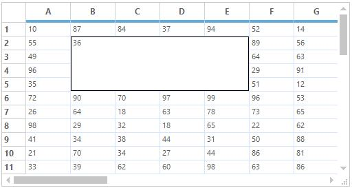

# Covered Ranges in Windows Forms Grid Control
The range of cells can be covered like Excel merging functionality. In this technique, range of cells which has different data or same data can be covered. The range of cells can be covered by adding the [GridRangeInfo](https://help.syncfusion.com/cr/windowsforms/Syncfusion.Windows.Forms.Grid.GridRangeInfo.html) to the [CoveredRanges](https://help.syncfusion.com/cr/windowsforms/Syncfusion.Windows.Forms.Grid.GridControl.html#Syncfusion_Windows_Forms_Grid_GridControl_CoveredRanges) collection. The range can be cell, range of cells, table, row or column.

The CoveredRanges will be maintained in the [GridModelCoveredRanges](https://help.syncfusion.com/cr/windowsforms/Syncfusion.Windows.Forms.Grid.GridModelCoveredRanges.html) collection.


// Add covered range for the range of cells.
this.gridControl1.Model.CoveredRanges.Add(GridRangeInfo.Cells(2, 2, 5, 5));


' Add covered range for the range of cells.
Me.gridControl1.Model.CoveredRanges.Add(GridRangeInfo.Cells(2, 2, 5, 5))




## Adding CoveredRanges using Event
The GridControl lets you define the `CoveredRanges` using [QueryCoveredRange](https://help.syncfusion.com/cr/windowsforms/Syncfusion.Windows.Forms.Grid.GridControl.html) event.  This event will be raised for all the cells and range can be set using[e.Range](https://help.syncfusion.com/cr/windowsforms/Syncfusion.Windows.Forms.Grid.GridQueryCoveredRangeEventArgs.html#Syncfusion_Windows_Forms_Grid_GridQueryCoveredRangeEventArgs_Range) property.



//Triggering the QueryCoveredRange event.
this.gridControl1.QueryCoveredRange += new GridQueryCoveredRangeEventHandler(gridControl1_QueryCoveredRange);

void gridControl1_QueryCoveredRange(object sender, GridQueryCoveredRangeEventArgs e)
{
     
    // Checking the cell to start covered range.
    if (e.RowIndex == 2 && e.ColIndex == 2)
    {
          
        //Setting the range to be covered.
        e.Range = GridRangeInfo.Cells(e.RowIndex, e.ColIndex, e.RowIndex + 3, e.ColIndex + 5);
         
        //Handled property has to be enabled to perform this customization.
        e.Handled = true;
      }
 }



'Triggering the QueryCoveredRange event.
Private Me.gridControl1.QueryCoveredRange += New GridQueryCoveredRangeEventHandler(AddressOf gridControl1_QueryCoveredRange)

Private Sub gridControl1_QueryCoveredRange(ByVal sender As Object, ByVal e As GridQueryCoveredRangeEventArgs)

'Checking the cell to start covered range.
If e.RowIndex = 2 AndAlso e.ColIndex = 2 Then

'Setting the range to be covered.
e.Range = GridRangeInfo.Cells(e.RowIndex, e.ColIndex, e.RowIndex + 3, e.ColIndex + 5)
          
'Handled property has to be enabled to perform this customization.
e.Handled = True
End If
End Sub



## Removing Particular Range from CoveredRanges
To remove the particular covered range from the GridControl, [CoveredRanges.Remove](https://help.syncfusion.com/cr/windowsforms/Syncfusion.Windows.Forms.Grid.GridModelCoveredRanges.html#Syncfusion_Windows_Forms_Grid_GridModelCoveredRanges_Remove_Syncfusion_Windows_Forms_Grid_GridRangeInfo_) method can be used. 



//Removing a CoveredRange from GridControl.
this.gridControl1.CoveredRanges.Remove(GridRangeInfo.Cells(2,2,5,7));


'Removing a CoveredRange from GridControl.
Me.gridControl1.CoveredRanges.Remove(GridRangeInfo.Cells(2,2,5,7))


## Finding a CoveredRange of a Cell 
To find a `CoveredRange` of a cell, [FindRange](https://help.syncfusion.com/cr/windowsforms/Syncfusion.Windows.Forms.Grid.GridModelCoveredRanges.html#Syncfusion_Windows_Forms_Grid_GridModelCoveredRanges_FindRange_System_Int32_System_Int32_) method can be used. If the specified cell with row index and column index is inside a `CoveredRange`, a range will be returned. Otherwise it will return the empty range.


//Adding CoveredRanges to GridControl.
this.gridControl1.CoveredRanges.Add(GridRangeInfo.Cells(2,2,5,7));

// Finding a CoveredRange for cell(2,3).
GridRangeInfo coveredRange = this.gridControl1.CoveredRanges.FindRange(2,3);

// Finding a coveredRange for cell(1,3).
GridRangeInfo coveredRange2 = this.gridControl1.CoveredRanges.FindRange(1,3);
MessageBox.Show("CoveredRange for cell(2,3) is " + coveredRange.Info.ToString()
                + "\n" + "CoveredRange for cell(1,3) is " + coveredRange2.RangeType.ToString());


'Adding CoveredRanges to GridControl
Me.gridControl1.CoveredRanges.Add(GridRangeInfo.Cells(2,2,5,7))

'Finding a CoveredRange for cell(2,3).
Dim coveredRange As GridRangeInfo = Me.gridControl1.CoveredRanges.FindRange(2,3)

'Finding a coveredRange for cell(1,3).
Dim coveredRange2 As GridRangeInfo = Me.gridControl1.CoveredRanges.FindRange(1,3)
MessageBox.Show("CoveredRange for cell(2,3) is " & coveredRange.Info.ToString() & Constants.vbLf & "CoveredRange for cell(1,3) is " & coveredRange2.RangeType.ToString())



N> The `CoveredRange` of a cell can also be determined by using [GetSpannedRangeInfo](/windowsforms/grid/managing-the-rows-and-columns#finding-covered-range-floating-range-or-merged-range-of-a-cell) method instead of using `FindRange` method. 

## Clearing the CoveredRanges
The `CoveredRanges` from the GridControl can be cleared by using the [Clear](https://help.syncfusion.com/cr/windowsforms/Syncfusion.Windows.Forms.Grid.GridModelCoveredRanges.html#Syncfusion_Windows_Forms_Grid_GridModelCoveredRanges_Clear) method can be used. This will remove all the `CoveredRanges` from the GridControl.



//Clearing CoveredRange from GridControl.
this.gridControl1.CoveredRanges.Clear();


'Clearing CoveredRange from GridControl.
this.gridControl1.CoveredRanges.Clear();


