# Enhanced Cell Types in Windows Forms Grid Control
GridControl supports more than 10 built in custom cell types. All the related cell types will be found in the [CustomCellTypes](https://help.syncfusion.com/cr/windowsforms/Syncfusion.GridHelperClasses.CustomCellTypes.html) enum which can be found in [Syncfusion.GridHelperClasses.Windows](https://help.syncfusion.com/cr/windowsforms/Syncfusion.GridHelperClasses.html) library.

## Registering custom cell types
Before adding any custom cell type, initially it is needed to register that particular custom cell type in the GridControl. For achieving this make use of the static method [GridCellType](https://help.syncfusion.com/cr/windowsforms/Syncfusion.GridHelperClasses.RegisterCellModel.html#Syncfusion_GridHelperClasses_RegisterCellModel_GridCellType_Syncfusion_Windows_Forms_Grid_GridControl_Syncfusion_GridHelperClasses_CustomCellTypes_) which is available under the [RegisterCellModel](https://help.syncfusion.com/cr/windowsforms/Syncfusion.GridHelperClasses.RegisterCellModel.html) class.



RegisterCellModel.GridCellType(gridControl1, CustomCellTypes.PercentTextBox);


RegisterCellModel.GridCellType(gridControl1, CustomCellTypes.PercentTextBox)


N> For using any Custom Cell type, register that particular cell type to the GridControl by using the above method. The above code shows how to register a `PercentTextBox` custom cell type to a GridControl.

## ButtonEdit cell type
Initially register the `ButtonEdit` cell type to the GridControl. For setting a cell to `ButtonEdit` cell type assign the `CellType` property as [CustomCellTypes.ButtonEdit](https://help.syncfusion.com/cr/windowsforms/Syncfusion.GridHelperClasses.CustomCellTypes.html). Convert to string while assigning because the `CellType` is of type [String](https://learn.microsoft.com/en-us/dotnet/api/system.string?view=net-5.0).



RegisterCellModel.GridCellType(gridControl1, CustomCellTypes.ButtonEdit);
this.gridControl1[2, 2].CellType = CustomCellTypes.ButtonEdit.ToString();


RegisterCellModel.GridCellType(gridControl1, CustomCellTypes.ButtonEdit)
Me.gridControl1(2, 2).CellType = CustomCellTypes.ButtonEdit.ToString()



### ButtonEdit Style properties 
The style properties related to the `ButtonEdit` are maintained in [ButtonEditStyleProperties](https://help.syncfusion.com/cr/windowsforms/Syncfusion.GridHelperClasses.ButtonEditStyleProperties.html) class. This class consists of two main properties [ButtonEditInfo](https://help.syncfusion.com/cr/windowsforms/Syncfusion.GridHelperClasses.ButtonEditInfo.html) and `StyleInfo`.

`ButtonEditInfo` property consists of style properties that are related to the `ButtonEdit`. `StyleInfo` property consists of all the style properties that belongs to the cell in which the `ButtonEdit` cell type is added.

There are few custom button edit types already given by GridControl. These can be accessed by the [ButtonEditType](https://help.syncfusion.com/cr/windowsforms/Syncfusion.GridHelperClasses.ButtonType.html) property. Following are the list of Button Edit types given by GridControl.

* Browse
* Check
* Down
* Left
* Leftend
* Redo
* Right
* Rightend
* Undo
* Up
* Image
* None

The following code explains how to change the `ButtonEdit` type.



RegisterCellModel.GridCellType(gridControl1, CustomCellTypes.ButtonEdit);
this.gridControl1[2, 2].CellType = CustomCellTypes.ButtonEdit.ToString();
this.gridControl1[2, 2].Text = "Default Button type";

this.gridControl1[3, 2].Text = "Down Button type";
this.gridControl1[3, 2].CellType = CustomCellTypes.ButtonEdit.ToString();
ButtonEditStyleProperties sp = new ButtonEditStyleProperties(this.gridControl1[3, 2]);
sp.ButtonEditInfo.ButtonEditType = ButtonType.Down;

this.gridControl1[4, 2].Text = "Left Button type";
this.gridControl1[4, 2].CellType = CustomCellTypes.ButtonEdit.ToString();
ButtonEditStyleProperties sp1 = new ButtonEditStyleProperties(this.gridControl1[4, 2]);
sp1.ButtonEditInfo.ButtonEditType = ButtonType.Left;



RegisterCellModel.GridCellType(gridControl1, CustomCellTypes.ButtonEdit)
Me.gridControl1(2, 2).CellType = CustomCellTypes.ButtonEdit.ToString()
Me.gridControl1(2, 2).Text = "Default Button type"

Me.gridControl1(3, 2).Text = "Down Button type"
Me.gridControl1(3, 2).CellType = CustomCellTypes.ButtonEdit.ToString()
Dim sp As New ButtonEditStyleProperties(Me.gridControl1(3, 2))
sp.ButtonEditInfo.ButtonEditType = ButtonType.Down

Me.gridControl1(4, 2).Text = "Left Button type"
Me.gridControl1(4, 2).CellType = CustomCellTypes.ButtonEdit.ToString()
Dim sp1 As New ButtonEditStyleProperties(Me.gridControl1(4, 2))
sp1.ButtonEditInfo.ButtonEditType = ButtonType.Left



The following code explains how to make few changes in style related properties.



RegisterCellModel.GridCellType(gridControl1, CustomCellTypes.ButtonEdit);
this.gridControl1[2, 2].CellType = CustomCellTypes.ButtonEdit.ToString();

ButtonEditStyleProperties sp = new ButtonEditStyleProperties(this.gridControl1[2, 2]);;

sp.ButtonEditInfo.ButtonEditType = ButtonType.None;

// Indicates the Button should be positioned in the Left.
sp.ButtonEditInfo.IsLeft = true;

// Sets the color for the Button.
sp.ButtonEditInfo.BackColor = Color.Green;
sp.ButtonEditInfo.ForceBackColor = true;




RegisterCellModel.GridCellType(gridControl1, CustomCellTypes.ButtonEdit)
Me.gridControl1(2, 2).CellType = CustomCellTypes.ButtonEdit.ToString()

Dim sp As New ButtonEditStyleProperties(Me.gridControl1(2, 2))
sp.ButtonEditInfo.ButtonEditType = ButtonType.None

' Indicates the Button should be positioned in the Left.
sp.ButtonEditInfo.IsLeft = True

' Sets the color for the Button.
sp.ButtonEditInfo.BackColor = Color.Green
sp.ButtonEditInfo.ForceBackColor = True



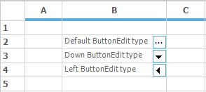

N> For more details on the ButtonEdit cell type property make use of the following dashboard sample &lt;Installed Location&gt;\Syncfusion\EssentialStudio\&lt;Installed Version&gt;\Windows\Grid.Windows\Samples\Custom Cell Types\Interactive Cell Demo\

## OLE Container cell type
OLE objects can be directly embedded to a grid’s cell, which by default displays the icon of the file attached and opens through its default associated application when the cell is activated. This custom cell type will host the cell as an OLE container. The address of the file should be passed through the cell’s [Style.Description](https://help.syncfusion.com/cr/windowsforms/Syncfusion.Windows.Forms.Grid.GridStyleInfo.html#Syncfusion_Windows_Forms_Grid_GridStyleInfo_Description) value.




RegisterCellModel.GridCellType(gridControl1, CustomCellTypes.OleContainerCell);
this.gridControl1[2, 2].CellType = CustomCellTypes.OleContainerCell.ToString();

// The path given has to be valid.
this.gridControl1[2, 2].Description = GetIconFile("common\Data\DocIO\SalesInvoiceDemo.doc")


RegisterCellModel.GridCellType(gridControl1, CustomCellTypes.OleContainerCell)
Me.gridControl1(2, 2).CellType = CustomCellTypes.OleContainerCell.ToString()

'The path given has to be valid.
Me.gridControl1(2, 2).Description = GetIconFile("common\Data\DocIO\SalesInvoiceDemo.doc")




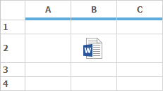

N> For more details on the OLEContainer cell type property make use of the following dashboard sample &lt;Installed Location&gt;\Syncfusion\ Studio\&lt;Installed Version&gt;\Windows\Grid.Windows\Samples\Custom Cell Types\Interactive Cell Demo\

## Calculator TextBox cell type
Calculator Text Box cell type is implemented as a drop-down container, where the drop down container has the calculator. This drop down container is embedded in a cell. On doing the calculations the final value will be displayed in the cell.

Add the control `CalculatorControl` in the cell of type CalculatorTextBox by using the `Control` property for viewing a Calculator. This CalculatorControl comes under the library Syncfusion.Tools.Windows with the namespace Syncfusion.Windows.Forms.Tools.



RegisterCellModel.GridCellType(gridControl1, CustomCellTypes.CalculatorTextBox);
this.gridControl1[2, 2].CellType = CustomCellTypes.CalculatorTextBox.ToString();

CalculatorControl c2 = new CalculatorControl();
this.gridControl1[2, 2].Control = c2;


RegisterCellModel.GridCellType(gridControl1, CustomCellTypes.CalculatorTextBox)
Me.gridControl1(2, 2).CellType = CustomCellTypes.CalculatorTextBox.ToString()

Dim c2 As New CalculatorControl()
Me.gridControl1(2, 2).Control = c2



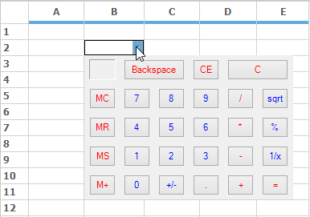

## Calendar cell type
Calendar control can be added to a cell by setting the cell type as `CustomCellTypes.Calendar`. After setting the cell type we need to add the Calendar control to the cell by using the `Control` property. Refer the following code for better explanation.



RegisterCellModel.GridCellType(gridControl1, CustomCellTypes.Calendar);
this.gridControl1[2, 2].CellType = CustomCellTypes.Calendar.ToString();

MonthCalendar calendar = new MonthCalendar();
this.gridControl1[2, 2].Control = calendar;


RegisterCellModel.GridCellType(gridControl1, CustomCellTypes.Calendar)
Me.gridControl1(2, 2).CellType = CustomCellTypes.Calendar.ToString()

Dim calendar As New MonthCalendar()
Me.gridControl1(2, 2).Control = calendar




## DateTimePicker cell type
Date Time Picker cell type can be embedded into a cell as a drop-down container where date and time picker will be added in the drop-down. The [CellValue](https://help.syncfusion.com/cr/windowsforms/Syncfusion.Windows.Forms.Grid.GridStyleInfo.html#Syncfusion_Windows_Forms_Grid_GridStyleInfo_CellValue) of the corresponding cell has to be specified as date value. Various formats of the date and time can be provided in the [Format](https://help.syncfusion.com/cr/windowsforms/Syncfusion.Windows.Forms.Grid.GridStyleInfo.html#Syncfusion_Windows_Forms_Grid_GridStyleInfo_Format) style property. 



RegisterCellModel.GridCellType(gridControl1, CustomCellTypes.DateTimePicker);
this.gridControl1[2, 2].CellType = CustomCellTypes.DateTimePicker.ToString();
this.gridControl1[2, 2].CellValueType = typeof(DateTime);
this.gridControl1[2, 2].CellValue = DateTime.Now;
this.gridControl1[2, 2].Format = "MM/dd/yyyy hh:mm";


RegisterCellModel.GridCellType(gridControl1, CustomCellTypes.DateTimePicker)
Me.gridControl1(2, 2).CellType = CustomCellTypes.DateTimePicker.ToString()
Me.gridControl1(2, 2).CellValueType = GetType(DateTime)
Me.gridControl1(2, 2).CellValue = DateTime.Now
Me.gridControl1(2, 2).Format = "MM/dd/yyyy hh:mm"



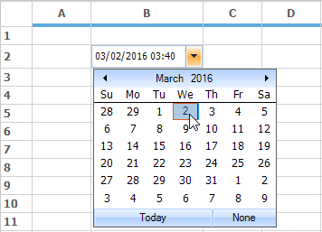

## NumericUpDown cell type

Numeric Up/Down cell type has been enhanced to provide more styles and properties that can be added to the numeric up down control by using [FloatNumericUpDownStyleProperties](https://help.syncfusion.com/cr/windowsforms/Syncfusion.GridHelperClasses.FloatNumericUpDownStyleProperties.html) class. It enables to set the limitations of the numeric values and several other properties.

### FloatNumericUpDown Style properties

<table>
<tr>
<th>
Float NumericUpDown Style Properties
</th>
<th>
Description
</th>
</tr>
<tr>
<td>
BackColor
</td>
<td>
Specifies the back color of the container.
</td>
</tr>
<tr>
<td>
Maximum
</td>
<td>
Indicates the maximum value that the cell can have.
</td>
</tr>
<tr>
<td>
StartValue
</td>
<td>
The starting value of the embedded cell.
</td>
</tr>
<tr>
<td>
Step
</td>
<td>
The value that has to be incremented for each click of the button.
</td>
</tr>
<tr>
<td>
WrapValue
</td>
<td>
The bool value that will allow to wrap the text.
</td>
</tr>
<tr>
<td>
DecimalPlaces
</td>
<td>
The decimal values after the decimal point.
</td>
</tr>
<tr>
<td>
Orientation
</td>
<td>
Orientation of the cell container on NumericUpDown.
</td>
</tr>
<tr>
<td>
Intercept ArrowKeys
</td>
<td>
Allows to change the value by using ARROW keys from keyboard.
</td>
</tr>
<tr>
<td>
ThousandsSeparator
</td>
<td>
The bool value, which allows to separate thousand basis.
</td>
</tr>
</table>
The following code explains some of the style properties available in [FloatNumericUpDownStyleProperties](https://help.syncfusion.com/cr/windowsforms/Syncfusion.GridHelperClasses.FloatNumericUpDownStyleProperties.html) class.



RegisterCellModel.GridCellType(gridControl1, CustomCellTypes.FNumericUpDown);
GridStyleInfo style = this.gridControl1[2, 2];

//Sets up FNumericUpDown Cell.
style.CellType = CustomCellTypes.FNumericUpDown.ToString();
style.Text = "0.5";

//Assigns the Style Properties of Up Down Control.
FloatNumericUpDownStyleProperties sp = new FloatNumericUpDownStyleProperties(style);

// Sets the backcolor of the cell.
sp.StyleInfo.BackColor = SystemColors.Window;

// Sets the Maximum value.
sp.FloatNumericUpDownProperties.Maximum = 15.0;

// Sets the Minimum value.
sp.FloatNumericUpDownProperties.Minimum = 0.0;

// This denotes the first value when you press up or down in an empty cell.
sp.FloatNumericUpDownProperties.StartValue = 0.5;

// Sets the value to step to increase or decrease when clicking up or down buttons.
sp.FloatNumericUpDownProperties.Step = 0.2;

//Sets a value indicating whether the value should start over.
// when value reaches maximum or minimum
sp.FloatNumericUpDownProperties.WrapValue = true;

// Sets the number of digits after the decimal point.
sp.FloatNumericUpDownProperties.DecimalPlaces = 1;


RegisterCellModel.GridCellType(gridControl1, CustomCellTypes.FNumericUpDown)
Dim style As GridStyleInfo = Me.gridControl1(2, 2)

'Sets up FNumericUpDown Cell.
style.CellType = CustomCellTypes.FNumericUpDown.ToString()
style.Text = "0.5"

'Assigns the Style Properties of Up Down Control.
Dim sp As New FloatNumericUpDownStyleProperties(style)

' Sets the backcolor of the cell.
sp.StyleInfo.BackColor = SystemColors.Window

' Sets the Maximum value.
sp.FloatNumericUpDownProperties.Maximum = 15.0

' Sets the Minimum value.
sp.FloatNumericUpDownProperties.Minimum = 0.0

' This denotes the first value when you press up or down in an empty cell.
sp.FloatNumericUpDownProperties.StartValue = 0.5

' Sets the value to step to increase or decrease when clicking up or down buttons.
sp.FloatNumericUpDownProperties.Step = 0.2

'Sets a value indicating whether the value should start over.
' when value reaches maximum or minimum
sp.FloatNumericUpDownProperties.WrapValue = True

' Sets the number of digits after the decimal point.
sp.FloatNumericUpDownProperties.DecimalPlaces = 1



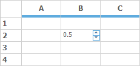

## GridInCell cell type
`GridInCell` cell type provide covered range of cells which embeds a GridControl i.e.., a GridControl within a cell of a GridControl.

Add a GridControl in this cell by using the `Control` property. The size of this GridControl will be calculated by the range of that particular cell. Styles and other properties can be added to this control within this range. While initializing the grid, create an instance with [CellEmbeddedGrid](https://help.syncfusion.com/cr/windowsforms/Syncfusion.GridHelperClasses.CellEmbeddedGrid.html)**.** The following code will explain this.



RegisterCellModel.GridCellType(gridControl1, CustomCellTypes.GridinCell);

GridControl grid;

this.gridControl1[3, 2].CellType = CustomCellTypes.GridinCell.ToString();
this.gridControl1.CoveredRanges.Add(GridRangeInfo.Cells(3, 2, 7, 4));

grid = new CellEmbeddedGrid(this.gridControl1);
grid.BackColor = Color.LightBlue;
grid.RowCount = 4;
grid.ColCount = 4;
grid[1, 1].Text = "This is a 4x4 Grid";
this.gridControl1[3, 2].Control = grid;



RegisterCellModel.GridCellType(gridControl1, CustomCellTypes.GridinCell)

Dim grid As GridControl

Me.gridControl1(3, 2).CellType = CustomCellTypes.GridinCell.ToString()
Me.gridControl1.CoveredRanges.Add(GridRangeInfo.Cells(3, 2, 7, 4))

grid = New CellEmbeddedGrid(Me.gridControl1)
grid.BackColor = Color.LightBlue
grid.RowCount = 4
grid.ColCount = 4
grid(1, 1).Text = "This is a 4x4 Grid"
Me.gridControl1(3, 2).Control = grid


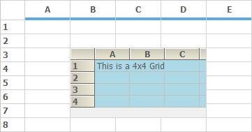

## LinkLabel cell type
For a cell to act as a hyperlink cell, make use of the `LinkLabelCell` cell type. The link for the `LinkLabelCell` will be assigned in the [Tag](https://help.syncfusion.com/cr/windowsforms/Syncfusion.Windows.Forms.Grid.GridStyleInfo.html#Syncfusion_Windows_Forms_Grid_GridStyleInfo_Tag) property of that cell. This cell displays the ordinary text, but on click it will relocate to the link given in the `Tag`.



RegisterCellModel.GridCellType(gridControl1, CustomCellTypes.LinkLabelCell);
gridControl1[2, 2].CellType = CustomCellTypes.LinkLabelCell.ToString();
gridControl1[2, 2].Text = "Syncfusion, Inc.";
gridControl1[2, 2].Font.Bold = true;
gridControl1[2, 2].Tag = "http://www.syncfusion.com";


RegisterCellModel.GridCellType(gridControl1, CustomCellTypes.LinkLabelCell)
gridControl1(2, 2).CellType = CustomCellTypes.LinkLabelCell.ToString()
gridControl1(2, 2).Text = "Syncfusion, Inc."
gridControl1(2, 2).Font.Bold = True
gridControl1(2, 2).Tag = "http://www.syncfusion.com"



### Changing the color of the link while mouse hovering
It is possible to change the color of the link while mouse hover by using of the [ActiveLinkColor](https://help.syncfusion.com/cr/windowsforms/Syncfusion.GridHelperClasses.LinkLabelCellRenderer.html#Syncfusion_GridHelperClasses_LinkLabelCellRenderer_ActiveLinkColor) property. This property can be accessed from the [LinkLabelCellRenderer](https://help.syncfusion.com/cr/windowsforms/Syncfusion.GridHelperClasses.LinkLabelCellRenderer.html) class.



LinkLabelCellRenderer rend = this.gridControl1.CellRenderers["LinkLabelCell"] as LinkLabelCellRenderer;
rend.ActiveLinkColor = Color.Green;


Dim rend As LinkLabelCellRenderer = TryCast(Me.gridControl1.CellRenderers("LinkLabelCell"), LinkLabelCellRenderer)
rend.ActiveLinkColor = Color.Green



N> For more details and sample, check the KB link over [here](https://www.syncfusion.com/kb/4505/how-to-change-the-color-of-the-linklabel-mousehover).

## PictureBox cell type
Picture Box cell type can be embedded into a cell by calculating the size of the picture and extending the width and height of the cell accordingly. [PictureBoxStyleProperties](https://help.syncfusion.com/cr/windowsforms/Syncfusion.GridHelperClasses.PictureBoxStyleProperties.html) class provides the style where it holds the information of the picture that has to be added. The following code examples illustrate how to set the cell type to PictureBox.



RegisterCellModel.GridCellType(gridControl1, CustomCellTypes.PictureBox);
PictureBoxStyleProperties sp;
GridStyleInfo style = gridControl1[2, 2];
style.CellType = CustomCellTypes.PictureBox.ToString();
sp = new PictureBoxStyleProperties(style);
sp.Image = new Bitmap(SystemIcons.Asterisk.ToBitmap());


RegisterCellModel.GridCellType(gridControl1, CustomCellTypes.PictureBox)
Dim sp As PictureBoxStyleProperties
Dim style As GridStyleInfo = gridControl1(2, 2)
style.CellType = CustomCellTypes.PictureBox.ToString()
sp = New PictureBoxStyleProperties(style)
sp.Image = New Bitmap(SystemIcons.Asterisk.ToBitmap())


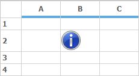

### XHTML cell type
An XHTML page can be displayed in a grid cell by using `XhtmlCell` cell type. Following code will explain how to display XHTML page in a grid cell.



RegisterCellModel.GridCellType(gridControl1, CustomCellTypes.XhtmlCell);
gridControl1[2, 2].CellType = "XhtmlCell";

string xhtml1 = "<body style=\"font-family:Arial; line-height:1em\"> ";
xhtml1 += "<h1 style=\"text-align:center; color:#EE7A03 \">XhtmlCells</h1>";
xhtml1 += "
";
xhtml1 += "
XhtmlCells use the <b> RichTextBoxSupportsXHTML</b> control from GotDotNet user samples to display XHTML formatted text inside a cell.
";
xhtml1 += "</body>";

//Assign the XHTML string to the cell.
gridControl1[2, 2].Text = xhtml1;


RegisterCellModel.GridCellType(gridControl1, CustomCellTypes.XhtmlCell)
gridControl1(2, 2).CellType = "XhtmlCell"

Dim xhtml1 As String = "<body style=\"font-family:Arial; line-height:1em""> "
xhtml1 &= "<h1 style=""text-align:center; color:#EE7A03 "">XhtmlCells</h1>"
xhtml1 &= "
"
xhtml1 &= "
XhtmlCells use the <b> RichTextBoxSupportsXHTML</b> control from GotDotNet user samples to display XHTML formatted text inside a cell.
"
xhtml1 &= "</body>"

'Assign the XHTML string to the cell.
gridControl1(2, 2).Text = xhtml1



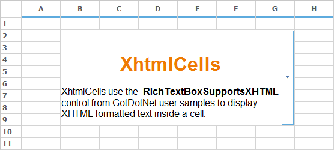

## IntegerTextBox cell type
Integer text box is used to display integer data-type values in the grid cells. It can be done by assigning the cell type as CustomCellTypes.IntegerTextBox**.**



RegisterCellModel.GridCellType(this.gridControl1, CustomCellTypes.IntegerTextBox);
this.gridControl1[4, 2].CellType = CustomCellTypes.IntegerTextBox.ToString();


RegisterCellModel.GridCellType(Me.gridControl1, CustomCellTypes.IntegerTextBox)
Me.gridControl1(4, 2).CellType = CustomCellTypes.IntegerTextBox.ToString()


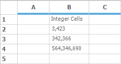

## DoubleTextBox cell type
Double text box is used to display double data-type values in the grid cells. It can be done by assigning the cell type as `CustomCellTypes.DoubleTextBox`.



RegisterCellModel.GridCellType(this.gridControl1, CustomCellTypes.DoubleTextBox);
this.gridControl1[4, 2].CellType = CustomCellTypes.DoubleTextBox.ToString();
this.gridControl1[3, 2].CellType = CustomCellTypes.DoubleTextBox.ToString();
this.gridControl1[2, 2].CellType = CustomCellTypes.DoubleTextBox.ToString();


RegisterCellModel.GridCellType(Me.gridControl1, CustomCellTypes.DoubleTextBox)
Me.gridControl1(4, 2).CellType = CustomCellTypes.DoubleTextBox.ToString()
Me.gridControl1(3, 2).CellType = CustomCellTypes.DoubleTextBox.ToString()
Me.gridControl1(2, 2).CellType = CustomCellTypes.DoubleTextBox.ToString()


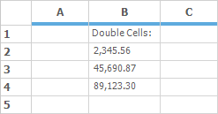

## PercentTextBox cell type
Percent text box is used to display percentage values in the grid cell. It can be done by assigning the cell type as `CustomCellTypes.PercentTextBox`.



RegisterCellModel.GridCellType(this.gridControl1, CustomCellTypes.PercentTextBox);
this.gridControl1[4, 2].CellType = CustomCellTypes.PercentTextBox.ToString();
this.gridControl1[3, 2].CellType = CustomCellTypes.PercentTextBox.ToString();
this.gridControl1[2, 2].CellType = CustomCellTypes.PercentTextBox.ToString();


RegisterCellModel.GridCellType(Me.gridControl1, CustomCellTypes.PercentTextBox)
Me.gridControl1(4, 2).CellType = CustomCellTypes.PercentTextBox.ToString()
Me.gridControl1(3, 2).CellType = CustomCellTypes.PercentTextBox.ToString()
Me.gridControl1(2, 2).CellType = CustomCellTypes.PercentTextBox.ToString()



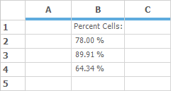
